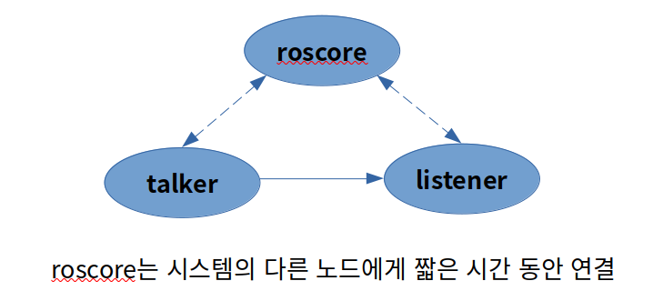
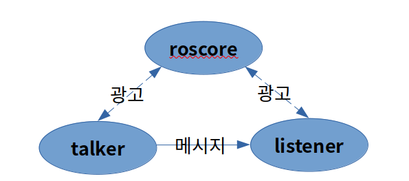
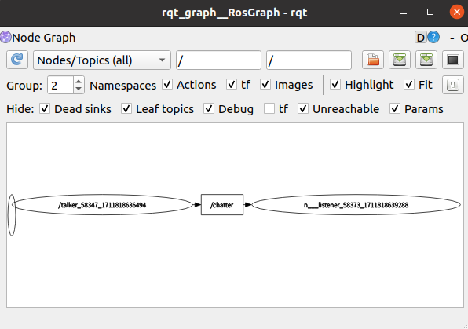
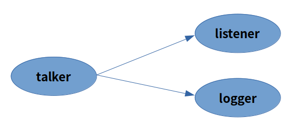
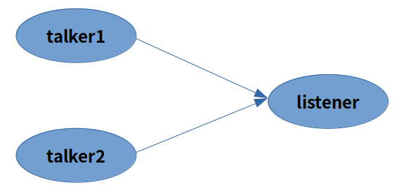
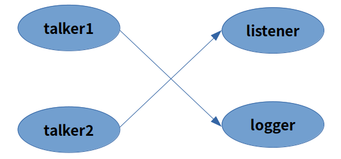
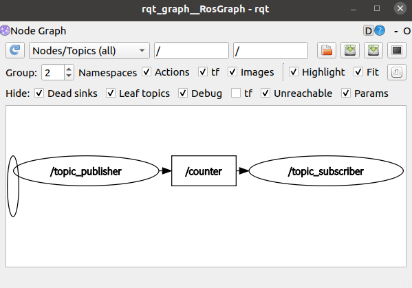

# Chap0. Ubuntu에 ROS Noetic 설치

Ubuntu에 ROS를 설치하려면 서로의 버전이 호환되어야 한다.

ROS와 Ubuntu 간의 버전 호환성은 엄격하다.

해서 Ubuntu 20.04 버전에 ROS Noetic 버전을 맞추어 설치한다.

## Installation

### Ubuntu 레포지토리 설정

"restricted", "unuverse", "multiverse"를 허용하기 위해 레포지토리를 설정한다.

cf) : https://help.ubuntu.com/community/Repositories/Ubuntu

### sources.list 설정

packages.ros.org 로부터 소프트웨어를 받기 위해 sources.list를 설정한다.

```
sudo sh -c 'echo "deb http://packages.ros.org/ros/ubuntu $(lsb_release -sc) main" > /etc/apt/sources.list.d/ros-latest.list'
```

### 키 설정

```
sudo apt install curl # if you haven't already installed curl
curl -s https://raw.githubusercontent.com/ros/rosdistro/master/ros.asc | sudo apt-key add -
```

### 설치

데비안 패키지 색인을 최신으로 맞춰준다.

```
sudo apt update
```

다음 아래 셋 중에 하나를 골라 설치한다.

1. Desktop-Full install : (Recommended) : 데스크톱 버전에 추가하여 2D/3D 시뮬레이션과 2D/3D 인지 패키지를 설치한다.

   ```
   sudo apt install ros-noetic-desktop-full
   ```

2. Desktop install : ROS-Base 버전에 추가하여 rqt와 rviz를 설치한다.

   ```
   sudo apt install ros-noetic-desktop
   ```

3. ROS-Base : (Bare Bones) ROS 패키징, 빌드, 통신 라이브러리를 설치한다. GUI tool은 제외된다.

   ```
   sudo apt install ros-noetic-ros-base
   ```

cf) : 활용 가능한 패키지를 찾으려면 다음을 확인한다. https://index.ros.org/packages/page/1/time/#noetic

```
apt search ros-noetic
```

### 환경 변수 설정

bash 쉘에서 ROS를 사용하기 위해 환경 변수 설정을 한다.

```
source /opt/ros/noetic/setup.bash
```

```
echo "source /opt/ros/noetic/setup.bash" >> ~/.bashrc
source ~/.bashrc
```

### 의존성 빌드 패키지

지금까지 ROS package를 실행하기 위해 필요한 것들을 설치하였다.

ROS workspaces 를 만들고 다루기 위해 배포된 각각의 다양한 도구들과 요구사항들이 있다. 

예를들어 rosinstall은 많은 source-tree 들을 하나의 명령으로 간단히 다운로드 할 수 있도록  command-line tool로 자주 사용된다. 

ROS 패키지 빌딩을 위한 해당 tool과 다른 의존성을 설치하기 위해 다음과 같이 입력한다.

```
sudo apt install python3-rosdep python3-rosinstall python3-rosinstall-generator python3-wstool build-essential
```

#### rosdep 초기화

ROS tool들을 다루기 이전에 rosdep을 초기화 해야 한다.

rosdep은 시스템 의존성을 컴파일할 수 있도록 해준다. 

또한 rosdep은 ROS의 몇가지 core 구성부가 실행될 때 요구된다. 

아래와 같이 rosdep을 설치한다.

```
sudo apt install python3-rosdep
```

설치를 마쳤으면 rosdep을 초기화한다.

```
sudo rosdep init
rosdep update
```

## ROS 환경 관리

ROS의 환경변수를 확인한다.

```
oem@user:~$ printenv | grep ros
PKG_CONFIG_PATH=/opt/ros/noetic/lib/pkgconfig
ROS_PACKAGE_PATH=/opt/ros/noetic/share
ROS_ETC_DIR=/opt/ros/noetic/etc/ros
CMAKE_PREFIX_PATH=/opt/ros/noetic
PYTHONPATH=/opt/ros/noetic/lib/python3/dist-packages
LD_LIBRARY_PATH=/opt/ros/noetic/lib
PATH=/opt/ros/noetic/bin:/home/oem/.local/bin:/usr/local/sbin:/usr/local/bin:/usr/sbin:/usr/bin:/sbin:/bin:/usr/games:/usr/local/games:/snap/bin
ROS_ROOT=/opt/ros/noetic/share/ros
```

# chap1. ROS란?

로봇 운영체제(ROS, Robot Operating System)는 로봇 소프트웨어를 작성하기 위한 프레임워크다. ROS는 로봇 플랫폼을 단순화시키는 목적의 도구, 라이브러리, 규약들을 모은 것이다.

## ROS의 필요성과 시사점

ROS가 필요한 이유는 신뢰성 있는 범용 로봇 소프트웨어를 만드는 것이 어렵기 때문이다. 

ex) 사무보조 로봇

1. 먼저, 로봇은 음성 또는 웹 인터페이스, 이메일, SMS와 같은 방식을 통해서 오는 요청을 이해해야 한다.

2. 그런 다음, 로봇은 물건 탐색을 처리하기 위해 특정 계획자를 시작해야 하고,

   엘리베이터와 여러 문을 포함하여 빌딩 내 여러 방을 이동해야 한다.

3. 방에 도착하면 비슷한 크기 혹은 모양의 물체들로 어지럽혀져 있는 책상을 탐색하고 물건을 찾아야 한다.

4. 이후 로봇은 단계를 역추적하여 물건을 원하는 장소에 가져와야 한다.

이런 각각의 하위 문제는 복잡한 요소를 가진다.

로봇을 복잡한 작업 환경의 실세계에 대처하도록 만드는 것은 어려워서 하나의 개인, 실험실 혹은 기관에서 밑바닥부터 완전한 시스템을 만들기는 힘들다. ROS는 이런 문제를 각각의 작업 환경에 따라 기능들을 간편히 만들고 유기적으로 통합하기 위해 만들어졌다.

이는 위의 예시의 문제를 해결하기 위해 한 조직은 실내 환경 매핑에 관한 기능을 만들고 다른 그룹은 실내 환경을 주행하는 기능을 만들고 또 다른 그룹은 물체를 인식하는 기능을 만들고, 이렇게 만들어진 기능을 유기적으로 통합하는 것을 말한다. ROS는 이런 종류의 대규모 협동을 쉽게 할 수 있도록 설계된 시스템이다.

## ROS의 특징

### P2P(Peer-to-Peer)

ROS 시스템은 서로 연결되어 지속해서 메시지를 교환하는 다수의 작은 프로그램으로 구성된다. 이들 메시지는 한 프로그램에서 다른 프로그램으로 직접 전달되며, 중앙 라우팅 서비스가 없다. 그 결과 데이터의 양이 증가할수록 더 잘 확장되는 시스템이 된다.

### 다중언어성

ROS 소프트웨어 모듈은 클라이언트 라이브러리(client library)가 요구하는 어떤 언어로든 작성될 수 있다. C++, Python, 리스프, JAVA, JS, 매트랩, 루비, R, 줄리아 등을 위한 클라이언트 라이브러리가 ROS에는 존재한다. 

### 가벼움 및 재사용성

ROS는 기능별 독립적인 라이브러리를 만들고, 다른 ROS 모듈로 메시지를 주고받을 수 있게 이들 라이브러리를 감싸고 연결한다. 이런 추가적인 계층의 목적은 다른 애플리케이션이 ROS 바깥에서 소프트웨어를 재사용하게 하는 것이고, 테스트 및 시뮬레이션을 손쉽게 할 수 있도록 한다.

### 무료 및 오픈 소스

ROS는 무료이고 오픈소스이다. ROS는 프로세스 간 통신(IPC, Interprocess Communication)을 사용하여 모듈 간에 데이터를 전달한다. 이는 ROS를 사용하여 구축된 시스템은 다양한 구성 요소의 세밀한 라이센스 정책을 가질 수 있음을 뜻한다. 예를들어, 상업적인 시스템은 비오픈 소스 모듈을 가진다. 또한 학술적이거나 취미로 하는 프로젝트는 오픈된 소스 모듈을 가질 수 있다. 이런 모든 사용 사례는 일반적이고 합법적이다. 

## 요약

* ROS : 로봇 소프트웨어를 개발하기 위한 프레임워크
* ROS는 메시지를 서로 빠르게 전달하는 수 많은 작은 프로그램으로 구성된다.
* 이런 패러다임은 로봇 소프트웨어의 재사용성과 이식성, 일반성을 높이기 위해 선택되었다.
* 이런 느슨한 구조는 다양한 종류의 로봇 하드웨어와 소프트웨어 파이프라인에 적용할 수 있는 일반적인 모듈을 만들 수 있게 한다.

# ROS의 구조 및 핵심 개념

ROS 시스템은 서로 간에 계속 통신하는 수많은 독립적인 프로그램으로 구성된다. 이에대한 구조를 살펴본다.

## ROS 그래프

이전의 사무용 로봇의 예시에서 해당 로봇의 목표와 임무를 살펴본다.

* 응용 작업은 주행, 컴퓨터 비전, 물체 잡기 등의 수많은 독립적인 서브시스템들로 분해할 수 있다.
* 이들 서브시스템은 방범 순찰, 청소, 택배 배달과 같은 다른 작업을 위해 사용될 수 있다.
* 적절한 하드웨어와 기하 추상 계층을 사용하여 대다수의 응용 소프트웨어를 대다수 로봇에서 실행할 수 있다.

이런 목표들을 ROS 시스템의 기본 표현인 그래프로 그릴 수 있다. 각각의 프로그램은 그래프의 노드(node)이며 서로 통신하는 프로그램은 연결선(edge)으로 연결된다. ROS 그래프 노드는 메시지를 전송하고 수신하는 소프트웨어 모듈을 나타내고,  ROS 그래프 연결선은 두 노드 사이의 메시지 흐름을 나타낸다. 일반적으로 노드는 POSIX 프로세스이고, 연결선은 TCP 연결이다. 이는 고장 허용성을 제공한다. 다시말해 충돌이 발생하는 부분을 분석하고 해결하기 용이하다. 소프트웨어 충돌은 보통 자신의 프로세스만 종료시킨다. 그래프의 나머지는 그대로 유지되며, 메시지를 전달하고 정상적으로 동작할 것이다. 노드로 들어오는 메시지를 로깅하고, 디버거 안에서 간단하게 다시 재생시킴으로써 충돌이 발생하는 환경을 대개 재현할 수 있다.

또한 이러한 그래프 기반 구조의 가장 큰 이점은 실험에서 요구되는 소프트웨어 '글루(glue)'가 없거나 거의 없이 복잡한 시스템을 빨리 제작할 수 있게 해주는 것이다. 단일 노드가 교체될 뿐만 아니라 그래프(서브그래프)의 전체 덩어리가 쪼개지고 다른 서브그래프로 실행 시간에 대체될 수 있다. 즉 실시간(Real Time) 작업을 손쉽게 해준다. 실제 로봇 하드웨어 구동부는 시뮬레이터로 대체되고, 주행 서브시스템도 교체되고, 알고리즘은 조정되고 다시 컴파일되는 것 등이 가능하다. ROS는 모든 필요한 네트워크 백엔드를 실행 도중에 만들므로 전체 시스템은 상호 작용적이고 실험적인 개발을 더 쉽게 할 수 있도록 설계되었다. 

### ROSCORE

roscore는 노드들에게 연결 정보를 제공하여 서로 메시지를 전송하게 하며 노드가 다른 노드들을 탐색하도록 하는 서비스다. 모든 노드는 시작할 때 roscore로 연결해서 발행(publish)하거나 구독(subscribe)하길 원하는 메시지 스트림(stream)의 세부 사항을 등록한다. roscore는 새로운 노드가 나타날 때 같은 메시지 토픽을 발행하고 구독하는 노드와 함께 P2P 연결을 형성하는 데 필요한 정보를 제공한다. roscore 없이는 노드가 다른 노드를 찾을 수 없으며, 모든 ROS 시스템에서 실행 중인 roscore가 필요하다.

ROS의 핵심은 노드 간 메시지가 P2P로 전송된다는 점이다. roscore는 오직 노드에게 상대 노드가 있는 곳을 알려 주기 위해서만 사용된다. 이는 클라이언트/서버 시스템과는 다른 점이다. ROS 구조는 전통적인 클라이언트/서버 시스템과 완전 분산 시스템 사이의 절충인데, 이는 P2P 메시지 스트림에 대한 이름 서비스를 제공하기 위해 중앙집중적인 roscore가 존재하기 때문이다.

ROS 노드는 시작할 때 ROS_MASTER_URI라는 환경변수를 찾기 시작한다. 이 변수는 `http://hostname:11311`과 같은 형식의 문자열을 가질 것이다. 이는 네트워크를 통해 접근 가능한 hostname이라는 호스트상에서 11311 포트로 접근할 수 있는 roscore 실행 프로그램이 있다는 것을 뜻한다. 단일 네트워크상에서 여러 개의 ROS 시스템이 공존할 수 있도록 서로 다른 포트들을 roscore 시작 명령과 ROS_MASTER_URI 환경변수에 지정할 수도 있다.

네트워크 상에서 roscore의 위치를 알면 노드는 시작 시에 roscore에 등록한 수 다른 노드와 데이터 스트림을 찾기 위해 이름을 사용하여 질의한다. 각 ROS 노드는 roscore에게 제공하는 메시지가 무엇인지와 구독하고 싶은 것들에 관해 알려 준다. 그러면 roscore는 관련된 메시지의 생산자와 소비자의 주소를 제공한다. 그래프 형식으로 바라보면 그래프의 모든 노드는 주기적으로 상대 노드를 찾기 위해 roscore가 제공하는 서비스를 호출한다. 이것은 아래 그림에서 점선으로 나타내며, 최소한의 2-노드 시스템에서 talker와 listener 노드는 P2P 메시지를 직접 교환하는 동안 roscore에게 주기적으로 연결한다. 



또한, roscore는 매개변수 서버(parameter server)를 제공하는데, 이는 ROS 노드가 환경을 설정하는 데 많이 사용한다. 매개변수 서버는 노드가 로봇의 세부 사항, 알고리즘에 대한 매개변수 등과 같은 임의의 자료 구조를 저장하고 불러올 수 있게 한다. ROS 내 모두가 그렇듯이 매개변수 서보와 연동하는 rosparam이라는 간단한 명령행 도구가 있다.

## 캣킨, 작업 공간 및 ROS 패키지

캣킨은 ROS가 실행 프로그램, 라이브러리, 스크립트 및 다른 코드가 사용할 인터페이스를 생성하는 데 사용하는 도구 집합인 ROS 빌드 시스템이다. ROS 코드를 작성할 때 C++를 사용한다면 캣킨에 대해 많이 알아야 한다. 그러나 지금은 사용하기 편한 python을 사용할 것이므로 자세히 알지 않아도 좋다. 

### 캣킨

캣인은 CMake 매크로들과 일반적인 CMake 작업 흐름(workflow)에 추가적인 기능을 제공하기 위한 전용 파이썬 스크립트로 구성된다. CMake는 널리 사용되는 오픈 소스 빌드 시스템이다. 캣킨의 미세한 부분까지 터득하려면 CMake에 관해 조금 알아 두는 것이 좋다. 하지만 먼저는 CMakeLists.txt와 package.xml 두 파일을 알아본다. 이 두 파일에는 작업이 올바르게 동작하도록 하기 위해 특정한 설정 정보를 추가한다. 이후 로봇용 코드를 작성할 때 필요한 디렉터리와 파일을 생성하기 위해 여러 가지 캣킨 도구를 호출한다. 

### 작업 공간

ROS 코드를 작성하기 전에, 코드를 놓아둘 작업 공간을 설정해야 한다. 작업 공간은 단지 관련된 ROS 코드들이 있는 디렉터리의 집합이다. 

ROS 설치 부분에서 설명한 것처럼 시스템 범위의 ROS 설정(/opt/ros/noetic/setup.bash)을 .bashrc 파일에 실행되도록 추가하였는지 확인하도록 한다. 

```
source /opt/ros/noetic/setup.bash
```

```
echo "source /opt/ros/noetic/setup.bash" >> ~/.bashrc
source ~/.bashrc
```

이후 catkin_workspace(캣킨 작업 공간)를 만들고 초기화한다.

```
oem@user:~$ mkdir -p ~/catkin_ws/src
oem@user:~$ cd ~/catkin_ws/src
oem@user:~/catkin_ws/src$ catkin_init_workspace
```

catkin_init_workspace 명령은 명령을 호출한 src 디렉터리 안에 CMakeLists.txt 파일을 생성한다. 다음은 몇몇 다른 작업 공간 파일을 생성한다.

```
oem@user:~/catkin_ws/src$ cd ~/catkin_ws
oem@user:~/catkin_ws$ catkin_make
```

catkin_make는 ROS 패키지를 작업공간 안에 빌드하는 명령어이다. 빌드하면서 build와 devel 디렉터리가 생성된다. 

* build는 C++를 사용하면 라이브러리와 실행 프로그램과 같은 캣킨 작업 결과 중 일부를 저장하는 곳이다.

  파이썬을 사용할 때는 사용 빈도가 적으므로 build를 대부분 무시한다.

* devel은 수많은 파일과 디렉터리를 가지는데, 가장 중요한 것은 환경설정 파일이다.

  이것을 실항하면 시스템이 현재 작업 공간과 그 안에 포함된 코드를 사용하도록 설정한다.

  ```
  oem@user:~/catkin_ws$ source devel/setup.bash
  ```

이로써 ros_workspace 작업 공간이 만들어졌다.

**cf) : setup.bash 파일, ROS 네트워크 설정, 명령어의 alias문**

새로운 셸을 열면 작업하고 싶은 작업 공간에 대한 setup.bash 파일을 source 명령으로 실행해야 한다. 그래야만 셸은 개발자의 코드가 어디에 있는지 알기 때문이다. 아예 .bashrc 파일에 source ~/catkin_ws/devel/setup.bash 명령을 추가하자.

또한 roscore의 실행 및 ROS의 네트워크 연결을 위해 다음을 .bashrc에 추가한다.

```
# SET ROS Noetic
source /opt/ros/noetic/setup.bash
source ~/catkin_ws/devel/setup.bash

# SET ROS NETWORK
export ROS_HOSTNAME=localhost
export ROS_MASTER_URI=http://${ROS_HOSTNAME}:11311

# SET ROS alias command
alias cw='cd ~/catkin_ws'
alias cs='cd ~/catkin_ws/src'
alias cm='cd ~/catkin_ws && catkin_make'
```

### ROS 패키지

ROS 소프트웨어는 코드, 데이터와 문서가 조합되어 있는 패키지로 구성된다. ROS 생태계에는 공개 저장소에 저장된 공용으로 사용할 수 있는 수많은 패키지가 있다.

패키지들은 작업 공간 내부의 src 디렉터리에 둔다. 각 패키지 디렉터리는 CMakeList.txt 파일과 패키지 내용과 캣킨이 어떻게 연동되어야 하는지를 설명하는 package.xml 파일을 포함해야 한다.

아래의 명령은 catkin_create_pkg를 호출하여 rospy 패키지에 의존하는 my_awesome_code라는 새로운 패키지를 만든다. 새로운 패키지가 다른 기존 패키지에 의존하면 명령행에서 그것들을 나열한다.

```
oem@user:~$ cd ~/catkin_ws/src
oem@user:~/catkin_ws/src$ catkin_create_pkg my_awesome_code rospy
```

catkin_create_pkg 명령은 새로운 패키지(my_awesome_code)와 같은 이름의 디렉터리와 그 안에 CMakeList.txt 파일, package.xml 파일, src 디렉터리를 함께 생성한다. package.xml 파일은 아래와 같이 새로운 패키지에 관한 메타데이터들을 포함한다.

```
<?xml version="1.0"?>
<package format="2">
  <name>my_awesome_code</name>
  <version>0.0.0</version>
  <description>The my_awesome_code package</description>

  <!-- One maintainer tag required, multiple allowed, one person per tag -->
  <!-- Example:  -->
  <!-- <maintainer email="jane.doe@example.com">Jane Doe</maintainer> -->
  <maintainer email="oem@todo.todo">oem</maintainer>


  <!-- One license tag required, multiple allowed, one license per tag -->
  <!-- Commonly used license strings: -->
  <!--   BSD, MIT, Boost Software License, GPLv2, GPLv3, LGPLv2.1, LGPLv3 -->
  <license>TODO</license>


  <!-- Url tags are optional, but multiple are allowed, one per tag -->
  <!-- Optional attribute type can be: website, bugtracker, or repository -->
  <!-- Example: -->
  <!-- <url type="website">http://wiki.ros.org/my_awesome_code</url> -->


  <!-- Author tags are optional, multiple are allowed, one per tag -->
  <!-- Authors do not have to be maintainers, but could be -->
  <!-- Example: -->
  <!-- <author email="jane.doe@example.com">Jane Doe</author> -->


  <!-- The *depend tags are used to specify dependencies -->
  <!-- Dependencies can be catkin packages or system dependencies -->
  <!-- Examples: -->
  <!-- Use depend as a shortcut for packages that are both build and exec dependencies -->
  <!--   <depend>roscpp</depend> -->
  <!--   Note that this is equivalent to the following: -->
  <!--   <build_depend>roscpp</build_depend> -->
  <!--   <exec_depend>roscpp</exec_depend> -->
  <!-- Use build_depend for packages you need at compile time: -->
  <!--   <build_depend>message_generation</build_depend> -->
  <!-- Use build_export_depend for packages you need in order to build against this package: -->
  <!--   <build_export_depend>message_generation</build_export_depend> -->
<!-- Use buildtool_depend for build tool packages: -->
  <!--   <buildtool_depend>catkin</buildtool_depend> -->
  <!-- Use exec_depend for packages you need at runtime: -->
  <!--   <exec_depend>message_runtime</exec_depend> -->
  <!-- Use test_depend for packages you need only for testing: -->
  <!--   <test_depend>gtest</test_depend> -->
  <!-- Use doc_depend for packages you need only for building documentation: -->
  <!--   <doc_depend>doxygen</doc_depend> -->
  <buildtool_depend>catkin</buildtool_depend>
  <build_depend>rospy</build_depend>
  <build_export_depend>rospy</build_export_depend>
  <exec_depend>rospy</exec_depend>


  <!-- The export tag contains other, unspecified, tags -->
  <export>
    <!-- Other tools can request additional information be placed here -->

  </export>
</package>
```

패키지를 만든후 파이썬 노드를 src 디렉터리에 넣을 수 있다. 다른 파일들 역시 패키지 디렉터리 안의 디렉터리에 둔다. 예를들면, launch 파일은 보통 launch 디렉터리에 둔다.

### ROSRUN

cf) : [rospy_tutorials](http://wiki.ros.org/rospy_tutorials/Tutorials/WritingPublisherSubscriber)

패키지는 파일 시스템이고, ROS 노드는 일반적으로 실행 프로그램이다. 때문에 ROS 노드를 런칭하기 위해서 파일 시스템상에서 cd 명령을 사용하여 수동으로 디렉터리를 변경할 수 있다.

이를테면, talker 프로그램은 rospy_tutorials라는 패키지 속에 있고, 실행 프로그램은 /opt/ros/noetic/share/rospy_tutorials 안에서 찾을 수 있다. rospy_tutorials는 ROS 설치 시 ROS에서 제공하는 연습 패키지이다.

이렇게 실행 프로그램이 디렉터리 계층 구조 안에 깊이 묻혀 있으므로 이런 긴 경로를 추적해서 사용하는 것은 번거롭다.

때문에 이런 작업을 자동화하도록 ROS는 요청된 프로그램에 대한 패키지를 검색하고, 명령행에 있는 매개변수를 전달하는 rosrun이라는 명령행 유틸리티를 제공한다.

roscore 실행 후 rospy_tutorials의 talker를 실행한다. talker를 실행하면 터미널에서는 콘솔 화면에 출력되는 일련의 타임스탬프(timestamp) 메시지가 출력된다.

```
roscore
```

```
oem@user:~$ rosrun rospy_tutorials talker
[INFO] [1711816115.093979]: hello world 1711816115.0936668
[INFO] [1711816115.194358]: hello world 1711816115.1940286
[INFO] [1711816115.294667]: hello world 1711816115.2942767
[INFO] [1711816115.394602]: hello world 1711816115.3942173
```

talker는 ROS를 통해 청취하고 있는 모든 노드로 메시지를 보낼 뿐만 아니라 콘솔로도 이들 메시지를 출력한다.

이와같이 ROS에서는 메시지를 보내고 받는 최소 두 개의 노드가 필요하며, 한 노드는 다른 노드로 문자열 메시지 스트림을 전송하고, 다른 한 노드는 메시지 스트림을 수신한다. 여기서 전송하는 노드는 talker이며 수신하는 노드는 listener이다. talker에서 메시지를 보내면 도이에 listener 노드를 실행하여, 콘솔로 출력하는 것이다.

이들 두 프로그램이 같은 roscore로 자신을 (토픽을 사용하여) 광고할 때마다 talker와 listener는 roscore에 의해 연결된다. 



터미널을 하나 더 열어서 listener를 실행해보면 talker 노드에서 listener 노드로 보낸 메시지를 listener 노드가 구독해서 출력하는 것을 볼 수 있다. talker 노드를 실행하지 않으면 listener 노드를 실행해도 메시지가 출력되지 않는 것을 확인 할 수 있다.

```
oem@user:~$ rosrun rospy_tutorials listener
[INFO] [1711818457.838280]: /listener_58133_1711818457593I heard hello world 1711818457.8329625
[INFO] [1711818457.939261]: /listener_58133_1711818457593I heard hello world 1711818457.9332473
[INFO] [1711818458.038027]: /listener_58133_1711818457593I heard hello world 1711818458.032794
[INFO] [1711818458.139035]: /listener_58133_1711818457593I heard hello world 1711818458.13299
```

터미널을 하나 더 열어서 ROS Qt 기반 그래프 시각화 도구인 rqt_graph를 실행해보면 위에서의 그림과 비슷한 모양의 그래프를 볼 수 있는데 roscore를 생략한 그림이 이와 같다. talker 노드에서 발행한 메시지를 /chatter 토픽을 통해 listener 노드로 보내는 모습을 확인할 수 있다.



rqt_graph의 창 상단 오른쪽 구석의 갱신 버튼을 누르면 그래프는 시스템의 현재 상태를 출력한다.

전형적인 ROS 개발은 익명(anonymous) 발행/구독 시스템 패턴을 따른다. 다시말해, 노드는 일반적으로 특별한 경우가 아니면(예를 들면 디버깅) 내부 메시지가 오고가는 상대 노드의 실체나 기능에 관한 세부 사항을 받거나 사용하지 않는다. 소프트웨어 모듈이 다양한 종류의 상대 노드와 동작할 수 있도록 하기 위함이다.

그러므로 모든 수신 메시지를 디스크에 쓰고, talker에 연결하는 일반적인 logger 프로그램을 만들 수 있다.



혹은 rospy_tutorials의 'Hello World!' 프로그램을 두 대의 다른 컴퓨터에서 실행하고, 하나의 다른 노드에서 두 노드의 메시지를 모두 수신하는것이 필요할 수도 있다. 소스 코드를 전혀 수정하지 않고 talker를 두 번 실행하여 talker1과 talker2 노드를 각각 호출하면 ROS는 아래와 같이 연결할 것이다.



또는 두 스트림 모두 출력하는 동시에 로그를 기록하고 싶을 수도 있다. 이 경우에도 다시 소스 코드를 수정하지 않고 아래와 같이 구현할 수 있다.




rosrun은 디버깅 세션 동안 단일 ROS 노드를 실행하는 데 사용된다. 그러나 대부분의 로봇 시스템은 동시에 실행되는 수십 또는 수백 개의 노드로 구성된다. 때문에 ROS는 여러 노드를 실행하기 위해 roslaunch라는 도구를 포함하고 있다.

## 이름, 이름공간과 재사상

이름은 ROS에서 중요한 개념이다. 노드, 메시지 스트림(토픽), 그리고 매개변수는 모두 유일한 이름을 가져야 한다. 이를테면, 로봇의 카메라 노드는 cameara라고 이름 지울 수 있고, image라는 이름의 메시지 토픽을 출력하고 이미지를 얼마나 빠르게 전송하는지를 알기 위해 frame_rate라는 이름의 매개변수를 가질 수 있다.

만약 로봇이 두 개의 카메라를 가질 때는 어떻게 될까? 각 카메라에 별도의 프로그램을 작성하기를 원하지 않고, 두 카메라의 출력이 image 토픽상에서 섞이지 않도록 할 수는 없는가? 

ROS는 이런 상황을 다루기 위한 두 가지 메커니즘, 즉 이름공간(namespace)과 재사상(remapping)을 제공한다.

ROS는 이름 공간을 구분하기 위해 슬래시(/)를 사용한다. readme.txt라는 이름의 두 개의 파일이 /home/user1/readme.txt와 /home/user2/readme.txt와 같이 구분된 경로에 존재하는 것처럼 말이다. 

이전 예시에서, 두 대의 카메라를 가진 로봇은 left와 right처럼 별도의 이름공간에서 두 개의 카메라 구동기를 실행하여 left/image와 right/image라는 이미지 스트림을 만들어 낼 수 있다. 하지만 image 토픽에서 메시지를 수신하려는 또 다른 프로그램으로 이들 데이터 스트림을 어떻게 보낼 수 있을까? 한 가지 해답은 첫 번째와 같은 이름공간에서 다른 프로그램을 시작하는 것이다. 그러나 이 프로그램은 하나 이상의 이름공간에 도달할 수도 있어야 한다.

ROS에서는 프로그램 내에서 이름을 정의하는 문자열을 실행 시 재사상할 수 있다. 한 가지 예로, image 토픽으로 보내지는 영상들의 생중계 비디오 창을 그리는 image_view라는, ROS에서 공통으로 사용하는 프로그램이 있다. 이는 image_view의 프로그램 소스 코드 내에서 쓰인 것이다. 재사상을 사용하면 image_view의 소스 코드를 수정하지 않고, 대신 image_view 프로그램이 right/image 토픽 또는 left/image 토픽을 그리도록 할 수 있다.

ROS 설계 패턴은 소프트웨어의 재사용을 독려하므로 재사상된 이름은 ROS 소프트웨어를 개발하고 배포할 때 매우 일반적으로 쓰인다. 이런 동작을 단순화하기 위해 ROS는 명령행에서 노드를 시작할 때 이름을 재사상하는 표준 문법을 제공한다. 이를테면, 작업 디렉터리에 image_view 프로그램을 포함하고 있으면, image를 right/image로 사상(mapping)하기 위해 다음을 입력하면 된다.

```
./image_view image:=right/image
```

이 명령행 재사상은 아래와 같은 그래프를 만든다.


노드를 이름공간으로 넣으려면 특별한 __ns 이름공간 재사상 문법으로 가능하다. 이를테면, 작업 디렉터리가 camera 프로그램을 포함하고 있으면 다음 셸 명령은 right 이름공간과 함께 camera를 실행할 것이다.

```
./camera __ns:=right
```

파일 시스템, 웹 URL 및 무수히 많은 다른 영역처럼 ROS 이름은 고유해야 한다. 같은 노드가 두 번 실행되면 roscore는 새로 만들어진 노드를 위해 이전 노드가 종료하도록 지시한다.

앞서 두 개의 노드 talker1과 talker를 가지고 listener라는 노드로 데이터를 보내는 그래프가 있었다. 명령행에서 노드 이름을 변경하려면 __name 재사상 문법을 사용할 수 있다. 이를 실행하면 시작 시 프로그램의 이름을 바꾼다. 다음 두 개의 셸 명령은 talker의 두 인스턴스 talker1과 talker2를 실행한다.

```
./talker __name:talker1
./talker __name:talker2
```

앞의 예제들은 ROS 토픽들이 명령행에서 빠르고 쉽게 재사상될 수 있음을 보였다. 이는 다양한 아이디어를 실험할 때 시스템을 디버깅하고 최초에 분석하는 데 유용하다. 하지만 긴 명령행 문자열을 여러 번 타이핑하기에는 번거롭다. roslaunch 도구가 이런 목적으로 만들어졌다.

### roslaunch

roslaunch는 여러 개의 ROS 노드 시작을 자동화하도록 설계된 명령행 도구이다. 표면적으로는 아래와 같이 패키지 이름과 파일 이름을 필요로 해서 rosrun처럼 보인다.

```
roslaunch PACKAGE LAUNCH_FILE
```

하지만 roslaunch는 노드가 아닌 시작 파일(launch file)을 사용하여 동작한다. 시작 파일은 여러 노드에 대한 토픽 재사상과 매개변수를 기술한 XML 파일이다. 관례적으로 이 파일들은 .launch 확장자를 가진다. 아래 예시는 rospy_tutorials 패키지의 talker_listener.launch 파일이다(/opt/ros/noetic/share/rospy_tutorials/001_talker_listener).

```
<launch>
  <node name="listener" pkg="rospy_tutorials" 
  type="listener.py" output="screen"/>
  <node name="talker" pkg="rospy_tutorials" 
  type="talker.py" output="screen"/>
</launch>
```

각 `<node>` 태그는 노드의 ROS 그래프 이름(name), 노드가 존재하는 패키지(package), 실행 프로그램의 파일 이름을 가리키는 노드의 종류(type)를 선언하는 속성들을 포함한다. 이번 예제에서 output="screen" 속성은 talker와 listener 노드가 콘솔 출력을 log 파일 대신에 현재 콘솔로 모두 출력해야 한다는 것을 가리킨다. 이는 디버깅을 위해 보편적으로 사용하는 설정이다. 일단 제대로 동작하기 시작하면 콘솔이 덜 복잡해 보이도록 이 속성을 제거하는 것이 편리하다.

roslaunch는 ssh를 통하여 네트워크상의 다른 컴퓨터에 프로그램을 시작하거나 충돌로 종료된 노드를 자동으로 재실행하는 등의 수많은 다른 중요한 특징이 있다. 

## tf : 좌표 변환

cf) : http://wiki.ros.org/tf?distro=noetic

로봇 공학에서 극히 중요한 문제 중 하나는 좌표 프레임(coordinate frame)의 관리다.

### 자세, 위치 및 방향

이동체상의 레이저를 생각하면, 레이저가 만들어 낸 스캔 범위를 올바르게 해석하려면 레이저가 부착된 이동체가 정확히 어디에 있는지 알 필요가 있다. 이동체에 대해 레이저의 위치와 방향은 무엇인가?

이보다 더 먼저 물을 것이 있다. 이동체의 원점에 대해 레이저 원점의 위치와 방향은 어떻게 되는가? 로봇 구성 요소들 사이의 물리적인 관계를 이야기하기 전에, 좌표의 참조 프레임 혹은 원점의 각 요소를 선택할 필요가 있다.

3D 세계에서 위치(position)는 세개의 수 (x, y, z) 벡터이며, 각 축을 따라 원점을 기준으로 얼마나 이동했는지를 나타낸다. 비슷하게, 방향(orientation)도 역시 세 개의 수 (r, p, y) 벡터이며, 역시 각 축에 대해 원점으로부터 얼마나 회전했는지를 나타낸다. 합쳐서 (위치, 방향) 쌍을 자세(pose)라고 한다. 이런 종류의 자세는 6차원(3차원은 이동, 3차원은 자세)에 따라 변하므로 때로는 6D 자세라고 한다. 서로 상대적인 한 물체의 자세가 주어지면, 보통 행렬 곱셈을 포함하는 과정을 통해 참조 프레임 사이에 데이터를 변환할 수 있다.

베이스의 (원점의) 자세에 대하여 레이저의 (원점의) 자세는 무엇인가? 

결국, 로봇의 다른 요소 각각에 대한 자세를 계산하는것이 필요하다. 

### tf

좌표 프레임들을 관리하고 변환하는 방법은 수없이 많다. ROS에서는, 모든 것들을 작게 만들고 모듈화하려는 철학을 따라 변환 데이터를 공유하기 위해 ROS 토픽을 사용하는 분산된 접근 방식을 취한다. 어떤 노드라도 변환(들)에 대한 현재 정보를 발행하는 권한을 가질 수 있고, 데이터를 변환하기 위해 구독할 수 있다. 이렇게 함으로써 많은 권한을 가진 노드로부터 로봇에 관한 완전한 청사진을 얻을 수 있다. 이런 시스템은 tf(transform) 패키지로 구현하며 ROS 소프트웨어에서 아주 널리 사용된다.

주어진 변환에 관한 정보가 획득되거나 계산되는 곳이 한 군데라고 생각되면 이런 접근 방식은 아주 의미가 있다. 예를 들어, 로봇 팔에게 통신하고 관절 인코더 데이터(joint encoder data)에 직접 접근할 수 있는 장치 구동기는 팔의 시작부터 다른 쪽 끝 손까지의 변환에 관한 정보를 발행하는 최고의 노드일 수 있다. 비슷하게, 지도에 대한 이동체의 위치 추정을 수행하는 노드는 이동체-world 간 변환에 대한 가장 좋은 권한을 가진다.

좌표 프레임은 이름이 필요하다. tf에서는 문자열을 사용한다. 이 역시 고유해야 한다.

또한 변환에 관한 정보를 발행할 때 사용할 메시지 형식이 필요하다. tf에서 tf/tfMessage를 사용하여 /tf 토픽으로 보낸다. 수동으로 이 메시지를 처리하지는 않으므로 메시지의 세부 사항을 알 필요는 없다. 이 변환 목록은 관련된 (부모와 자식으로 언급된) 프레임들의 이름, 상대적인 위치와 방향, 그리보 변환이 측정되거나 계산된 시간을 지정한다.

변환 데이터를 가지고 작업하는 모든 노드가 발행, 구독, 기억, 또는 계산하는 것을 처음부터 다시 만들 필요는 없다. tf는 모든 노드에서 이러한 공통 작업을 수행하도록 사용할 수 있는 라이브러리 집합을 제공한다. 이를테면, 노드에서 tf 청취자(listener, 혹은 구독자)를 생성하면 노드는 내부적으로 /tf 토픽을 구독하고 시스템의 다른 노드가 발행하는 모든 tf/tfMessage 데이터를 위한 버퍼를 유지할 것이다. 

대개 강력한 시스템이 그런 것처럼 tf는 비교적 복잡하고 일이 잘못될 수 있는 경우가 많다. 결과적으로 어떻게 진행되고 있는지를 이해하는 데 도와주는 수많은 tf 전용의 분석 및 디버깅 도구들이 있어서 콘솔에서 단일 변환을 출력하는 것부터 전체 변환 계층 구조를 그래프 형태로 그려 주기도 한다.

## 요약

* ROS 그래프 구조
* ROS와의 상호작용 도구 : catkin, roscore, rosrun, roslaunch
* 이름공간(namespace), 재사상(mapping)
* 좌표 변환의 중요성과 tf 시스템을 통한 좌표 변환

# Chap3. 토픽

앞서 본 것처럼 ROS 시스템은 그래프를 구성하는 여러 개의 독립적인 노드로 이루어진다. 노드 간의 통신을 하는 가장 보편적인 방법은 토픽을 사용하는 것이다. 토픽은 정의된 자료형을 가지는 메시지 스트림을 뜻한다. 예를 들어, 카메라 데이터는 Image 메시지 자료형의 image 토픽으로 전송되는 반면에, 레이저 거리 측정기의 데이터는 LaserScan 메시지 자료형의 scan 토픽으로 전송된다. 

토픽은 분산 시스템에서 데이터를 교환하는 여러 보편적인 방법 중 하나인 발행/구독 통신 기법을 구현한다. 토픽을 통하여 데이터를 전송하기 전에 노드에서는 

1. 토픽 이름과 전송될 메시지 자료형을 먼저 광고(advertise)한다. 

2. 이후 노드는 실제 데이터를 해당 토픽으로 발행할 수 있다. 

   특정 토픽의 메시지를 수신하기 원하는 노드는 roscore에게 요청함으로써 그 토픽을 구독할 수 있다. 

3. 구독 요청 후에 특정 토픽의 메시지는 그 요청을 한 노드로 전달한다. 

ROS를 사용하는 주된 장점 중 하나는 개발자가 걱정할 필요 없도록 노드에서 토픽을 광고하거나 구독할 때의 복잡한 연결 설정 과정을 내부 통신 구조에서 대신 처리해 준다는 점이다.

ROS에서는 동일한 토픽의 모든 메시지는 동일한 자료형을 가진다. ROS에서 강제하지는 않지만, 토픽 이름은 종종 그 토픽을 통해 전송되는 메시지를 나타낸다. 예를 들어, PR2 로봇에서 /wide_stereo/right/image_color 토픽은 광각 스테레오 카메라의 오른쪽 카메라 컬러 영상 전송에 사용된다.

## 토픽 발행

예제 3-1은 특정 토픽을 광고하고, 그 토픽으로 메시지를 발행하는 기본적인 코드다. 이 노드는 2Hz 속도로 counter 토픽 정수를 연속으로 발행한다.

노드 작성에 앞서서 basics 패키지를 만든다.

```shell
cd ~/catkin_ws
catkin_create_pkg
catkin_make
```

***예제 3-1 topic_publisher.py***

```python
#! /usr/bin/python3
# 3-1 topoc_publisher.py
import rospy
from std_msgs.msg import Int32

rospy.init_node('topic_publisher')

pub = rospy.Publisher('counter', Int32)

rate = rospy.Rate(2)

count = 0
while not rospy.is_shutdown():
    pub.publish(count)
    count += 1
    rate.sleep()
```

두 번째 줄은 

```python
#! /usr/bin/python3
```

쉬뱅(shebang)이라고 알려진 인터프리터 지시어다. 이 지시어는 운영체제로 하여금 이 파일이 파이썬 파일이며, 파이썬 인터프리터로 전달되도록 한다. 

프로그램으로 작성한 노드를 실행하게 할 것이므로 리눅스 chmod 명령어를 사용하여 실행 권한을 부여한다.

```shell
chmod +x topic_publisher.py
```

다음 줄은

```python
import rospy
```

모든 ROS 파이썬 노드에 있는 것으로, 필요한 기본 기능을 모두 임포트(import)한다.

다음 줄은 토픽을 통하여 전송할 메시지 정의를 임포트한다.

```python
from std_msgs.msg import Int32
```

이 경우에는 ROS 표준 메시지 패키지인 std_msgs에 정의된 32비트 정수를 사용한다. <패키지 이름>.msg에 패키지 정의가 저장되어 있으므로 임포트가 기대한 것처럼 동작하기 위해서는 이를 임포트해야 한다. 다른 패키지에 있는 메시지를 사용하므로 package.xml 파일에 의존성을 추가해서 ROS 빌드 시스템에 알려 주어야 한다.

```xml
<depend package="std_msgs" />
```

이러한 의존성 없이는 ROS는 메시지 정의를 찾을 수 없고, 따라서 노드는 실행될 수 없게 된다. 

다음은 노드 초기화이다.

```python
rospy.init_node('topic_publisher')
```

rospy.init_node() 함수는 rospy가 정보를 가질 때까지 rospy에게 node의 이름을 알려주는 역할을 한다. 함수의 인자인 'topic_publisher'가 노드의 이름이다. 노드는 init_node가 rospy에게 이름을 알려주지 않으면 ROS Master와 통신할 수 없다.

노드를 초기화 한 후, Publisher를 통하여 토픽을 광고한다.

```python
pub = rospy.Publisher('counter', Int32)
```

이와 같이 함으로써 토픽에 counter라는 이름을 부여하고, 전송될 메시지의 자료형이 Int32임을 알려준다. 

1. 이때 시스템 내부에서는 발행자가 roscore에 연결을 설정하고, 관련 정보를 보낸다. 
2. 다른 노드가 counter 토픽을 구독하려고 할 때 roscore는 발행자와 구독자 목록을 공유한다.
3. 이후 노드는 이 목록을 각 토픽의 모든 발행자와 모든 구독자 노드 사이를 직접 연결하는 데 사용한다.

이 시점에서 토픽은 광고되어 다른 노드에서 구독할 수 있게 된다. 이제 이 토픽을 통하여 메시지를 실제로 발행할 수 있게 된다.

```python
rate = rospy.Rate(2)

count = 0
while not rospy.is_shutdown():
    pub.publish(count)
    count += 1
    rate.sleep()
```

1. 먼저 발행 속도를 Hz 단위로 설정한다. 이 에시에서는 초당 두 번 발행할 것이다.
2. is_shutdown() 함수는 노드가 종료된 상황이면 True를 반환하고, 아니면 False를 반환하여 while 반복문을 빠져 나갈지 여부를 결정할 수 있게 한다.
3. while 반복문 안에서는 counter의 현재 값을 발행하고 하나씩 값을 증가시킨 다음, 일시 정지한다. rate.sleep()을 호출하면 대략 2Hz 주기로 while 반복문 몸체를 실행할 수 있을 정도로 충분한 시간만큼 일시 정지한다.

### 예상 결과 확인

현재 사용 가능한 토픽을 알아보기 위하여 rostopic 명령어를 사용할 수 있다. 터미널을 하나 열어 roscore를 실행한다. roscore가 실행되면 다른 터미널에서 rostopic list 명령을 실행하여 어떤 토픽이 사용할 수 있는지 볼 수 있다.

```
oem@user:~/catkin_ws/src/my_awesome_code$ rostopic list
/rosout
/rosout_agg
```

위의 토픽은 ROS에서 로깅과 디버깅 목적으로 사용된다. rostopic 명령어에서 사용할 수 있는 인자를 보려면 -h 플래그를 사용한다.

이제 다른 터미널을 열어 앞에서 본 노드를 실행한다. basics 패키지가 작업 공간 안에 있어야 하며, 해당 작업 공간에 대한 설정 파일을 미리 실행해야만 한다.

```
oem@user:~/catkin_ws$ rosrun basics topic_publisher.py
```

basics 디렉터리는 캣킨 작업 공간 안에 있어야 하며, 노드를 위한 코드를 직접 입력했다면 chmod 명령을 사용하여 그 파일에 대한 실행 권한을 부여해야 한다. 

이후 노드를 실행되면 rostopic list를 다시 실행하여 counter 토픽이 광고되는 것을 검증할 수 있다.

```
oem@user:~/catkin_ws$ rostopic list
/counter
/rosout
/rosout_agg
```

rostopic echo를 실행하여 토픽으로 발행되는 메시지를 확인할 수 있다.

```
oem@user:~/catkin_ws$ rostopic echo counter -n 5
data: 39775
---
data: 39776
---
data: 39777
---
data: 39778
---
data: 39779
---
```

 또한 지정한 속도대로 메시지를 발행하는지 검증하기 위하여 rostopic을 사용할 수 있다.

```
oem@user:~/catkin_ws$ rostopic hz counter
subscribed to [/counter]
average rate: 1.999
	min: 0.500s max: 0.500s std dev: 0.00000s window: 2
average rate: 2.000
	min: 0.500s max: 0.500s std dev: 0.00014s window: 4
average rate: 2.000
	min: 0.500s max: 0.500s std dev: 0.00018s window: 6
average rate: 2.000
	min: 0.500s max: 0.500s std dev: 0.00017s window: 8
average rate: 2.000
	min: 0.500s max: 0.500s std dev: 0.00015s window: 10
average rate: 2.000
```

rostopic bw는 토픽이 사용하는 대역폭에 관한 정보를 알 수 있다. 또한, rostopic info를 사용하면 광고되는 토픽의 정보를 알 수 있다.

```
oem@user:~/catkin_ws$ rostopic bw counter
subscribed to [/counter]
average: 13.74B/s
	mean: 4.00B min: 4.00B max: 4.00B window: 2
average: 10.11B/s
	mean: 4.00B min: 4.00B max: 4.00B window: 4
average: 9.29B/s
	mean: 4.00B min: 4.00B max: 4.00B window: 6
average: 8.92B/s
	mean: 4.00B min: 4.00B max: 4.00B window: 8
average: 8.72B/s
	mean: 4.00B min: 4.00B max: 4.00B window: 10
```

```
oem@user:~/catkin_ws$ rostopic info counter
Type: std_msgs/Int32

Publishers: 
 * /topic_publisher (http://localhost:46353/)

Subscribers: None
```

이 명령어를 통하여 counter는 topic_publisher에 의해 현재 광고되고 있으며 구독하는 노드는 없는 std_msgs/Int32 자료형의 메시지를 운반한다는 것을 알 수 있다. 한 개 이상의 노드가 토픽을 발행하고 구독할 수 있으므로 이 명령어를 사용하여 예상하는 대로 노드가 연결되어 있음을 확인할 수 있다. 이 예에서 topic_publisher 발행자는 hostname 컴퓨터에서 실행되고 있으며, TCP 포트 46353를 통하여 통신하고 있다. rostopic type 명령은 이와 유사하지만, 특정 토픽 메시지 자료형만을 알려 준다.

마지막으로, rotopic find 명령을 사용하여 특정 메시지 자료형을 발행하는 토픽을 모두 찾을 수 있다.

```
oem@user:~/catkin_ws$ rostopic find std_msgs/Int32
/counter
```

## 토픽 구독

예제 3-2는 counter 토픽을 구독하여 메시지가 도착할 때마다 그 값을 출력하는 최소한의 노드를 보여준다.

```python
#! /usr/bin/python3

import rospy
from std_msgs.msg import Int32

def callback(msg):
    print(msg.data)

rospy.init_node('topic_subscriber')

sub = rospy.Subscriber('counter', Int32, callback())

rospy.spin()
```

메시지가 들어올 때 처리하는 콜백(callback)

```python
def callback(msg):
    print(msg.data)
```

ROS는 이벤트 구동 시스템으로 콜백 함수를 아주 많이 사용한다. 노드가 토픽을 구독하기 시작하면 메시지가 도착할 때마다 그 메시지를 매개변수로 하여 관련 콜백 함수가 호출된다. 

앞에서처럼 노드를 초기화한 후에 counter 토픽을 구독한다.

```python
sub = rospy.Subscriber('counter', Int32, callback())
```

토픽의 이름과 메시지 자료형, 콜백 함수의 이름을 지정한다. 내부적으로 구독자는 이 정보를 roscore로 전달하고, 이 토픽의 발행자와 직접적으로 연결하려고 한다. 토픽이 존재하지 않거나 자료형이 잘못된 것이라도 오류 메시지가 발생하지 않는다. 노드는 해당 토픽이 발행되어 메시지 전송이 시작될 때까지 계속 기다린다.

구독이 시작되면 rospy.spin()을 호출하여 ROS에게 제어를 넘긴다. 이 함수는 노드가 종료될 준비가 될 경우에만 제어를 반환된다. 이는 예제 3-1에서 했던 것처럼 최상위 수준의 while 반복문 정의를 회피할 수 있는 유용한 방법이다. ROS가 반드시 실행되는 주 스레드(main thread)를 넘겨받을 필요는 없다.

### 예상 결과 확인

먼저, 발행자 노드가 동작하고 있으며, 여전히 counter 토픽으로 메시지를 발행하고 있음을 확인한다. 이후 다른 터미널에서 구독 노드를 시작한다.

```
oem@user:~/catkin_ws$ rosrun basics topic_subscriber.py
100
101
102
103
104
105
```

다음과 같이 rqt_graph를 실행하여 이 시스템을 시각화할 수 있다.



다음과 같이 현재 counter 토픽의 발행자와 구독자 정보를 확인할 수 있다.

```
oem@user:~/catkin_ws$ rostopic info counter
Type: std_msgs/Int32

Publishers: 
 * /topic_publisher (http://localhost:32969/)
 * /rostopic_380330_1711902708578 (http://localhost:42315/)

Subscribers: 
 * /topic_subscriber (http://localhost:45747/)
```

## 래치(latch)된 토픽

ROS 메시지는 순식간에 사라진다. 메시지가 토픽으로 발행될 때 이를 바로 구독하지 못하면, 이 메시지를 잃어버리고 다음 메시지를 기다려야 한다. 발행자가 메시지를 자주 보내면 다음 메시지가 올 때까지 얼마 걸리지 않으므로 괜찮을 수도 있지만 메시지를 빈번히 보내는 것이 별로 좋지 않은 경우도 있다.

예를 들어, map_server 노드는 map 토픽으로 지도 정보([nav_msgs/OccupancyGrid 자료형](https://docs.ros.org/en/noetic/api/nav_msgs/html/index-msg.html))를 광고한다. 로봇의 위치를 결정하는 데 사용되는 world 지도를 나타낸다. 보통 이 지도는 변하지 않고 map_server가 저장장치로부터 적재도리 때 한 번만 발행된다. 그러나 또 다른 노드가 지도를 필요로 하는데, map_server가 지도 정보를 발행하고 난 다음에 실행되었다면 지도 정보 메시지를 얻을 수 없을 것이다.

정기적으로 지도를 발행할 수도 있지만, 일반적으로 지도의 크기는 매우 크므로 필요로 하는것보다 더 자주 메시지를 발행할 필요는 없을 것이다. 지도를 재발행하기로 결정한다면 적절한 발행 주기를 선택해야 한다. 하지만 올바른 값을 구하는 것이 쉽지 않을 수 있다.

래치된 토픽(latched topic)은 이러한 문제에 대한 간단한 해결 방안을 제시한다. 토픽이 광고될 때 래치된다고 설정하면 구독자는 토픽을 구독할 때 전송된 제일 마지막 메시지를 자동적으로 얻게 된다. 이는 map_server 예제에서 토픽이 래치된다고 설정하고 메시지를 한 번만 발행하면 된다는 것을 뜻한다. 토픽은 선택적인 latched 인자를 사용하여 래치 여부를 설정할 수 있다.

```python
pub = rospy.Publisher('map', nav_msgs/OccupancyGrid, latched=True)
```

## 사용자 메시지 자료형 정의

ROS는 풍부한 내장 메시지 자료형을 지원한다([ROS wifi msg](http://wiki.ros.org/msg#Field_Type?distro=noetic)). 이러한 자료형의 배열은 고정 길이 또는 가변 길이 관계없이 (하위 계층의 통신 역직렬화 코드에서) 파이썬의 튜플(tuples)로 반환되며, 파이썬에서 튜플이나 리스트로 사용할 수 있다.

| ROS자료형 | 직렬화                        | C++ 자료형  | 파이썬 자료형 | 비고                                                       |
| --------- | ----------------------------- | ----------- | ------------- | ---------------------------------------------------------- |
| bool      | 무부호 8비트 정수             | uint8_t     | bool          |                                                            |
| int8      | 부호 8비트 정수               | int8_t      | int           |                                                            |
| int16     | 부호 16비트 정수              | int16_t     | int           | uint8[ ]은 파이썬에서 문자열로 취급됨                      |
| int16     | 부호 16비트 정수              | int16_t     | int           |                                                            |
| int32     | 부호 32비트 정수              | int32_t     | int           |                                                            |
| uint32    | 무부호 32비트 정수            | uint32_t    | int           |                                                            |
| int64     | 부호 64비트 정수              | int64_t     | long          |                                                            |
| uint64    | 무부호 64비트 정수            | uint64_t    | long          |                                                            |
| float32   | 32비트 IEEE 실수              | float       | float         |                                                            |
| float64   | 64비트 IEEE 실수              | double      | float         |                                                            |
| string    | ASCII 문자열                  | std::string | string        | ROS는 유니코드 문자열을 지원하지 않음; UTF-8 인코딩을 사용 |
| time      | secs/nsecs 무부호 32비트 정수 | ros::Time   | rospy.Time    | duration 자료형 참고                                       |

!!Warning) : C++는 파이썬보다 더 많은 기본 자료형을 가지고 있어서 노드가 C++와 파이썬으로 작성되면 미묘한 문제가 발생할 수 있다. 예를 들어, ROS의 uint8은 C++에서는 8비트 무부호 정수로 표현되어 정상적으로 동작한다. 그러나 피이썬에서는 정수로 표현되어, 음수로 만들거나 255보다 큰 값을 가지게 할 수 있다. 이와 같은 범위를 벗어나는 값이 ROS 메시지로서 연속적으로 발행되면 8비트 무부호 값으로 해석될 수 있다. 이는 수신되었을 때 예측할 수 없는 값으로, 발견하기 어려운 오류를 초래할 수 있다. 파이썬에서 범위가 제한되는 ROS 자료형 사용 시 주의해야 한다.

이들 메시지는 std_msgs 패키지와 commons_msgs 패키지에 포함되어 있다. (대부분의) 레이저 거리 측정 센서는 [sensor_msgs/LaserScan](https://docs.ros.org/en/melodic/api/sensor_msgs/html/msg/LaserScan.html) 메시지를 발행하므로 레이저 거리 측정기 하드웨어의 특정 세부 사항을 알 필요 없이 로봇에 관한 제어 코드를 작성할 수 있다. 게다가 대부분의 로봇은 자신의 추정 위치를 표준적인 방법으로 발행할 수 있다. 레이저 스캔과 위치 추정을 위한 표준화된 메시지 자료형을 사용하면 다양한 로봇에 대한 내비게이션과 사상(mapping)을 제공하는 노드를 개발할 수 있다.

그러나 내장 메시지 자료형만으로 부족할 때는 사용자 메시지를 정의해야 한다. 이러한 메시지는 ROS에서 일등 시민(first-class citizens, 변수 할당이 되며, 함수 호출 시 인자로 사용될 수 있는 것)으로 ROS 코어에서 정의한 메시지 자료형과 개발자가 정의한 메시지 자료형 간에 차이가 없다.

### 새 메시지 정의

1. 패키지의 msg 디렉터리에 있는 특수한 메시지 정의 파일을 사용하여 ROS 메시지를 정의한다. 

2. 그런 다음, 이 파일은 코드에서 사용할 수 있는 언어별 구현으로 컴파일된다.

   이는 파이썬과 같이 인터프리터 언어를 사용하더라도 사용자 메시지를 정의하려면 catkin_make를 실행해야 함을 뜻한다. 그렇지 않으면 언어별 구현은 생성되지 않고, 파이썬에서 새롭게 정의한 사용자 메시지 자료형을 찾을 수 없을 것이다. 게다가 메시지 정의를 변경한 후에 catkin_make를 재실행하지 않으면 파이썬에서는 이전 버전의 메시지 자료형을 여전히 사용할 것이다.

이와 같이 사용하는 것이 복잡해 보이지만 이유가 있다. 메시지를 한 번 정의한 후에, 네트워크를 통해 제공될 때 메시지를 수축하고 팽창하는 코드(

* 수축(deflaction) : 컴파일된 프로그래밍 언어용 메시지 자료형을 ROS 사용자 자료형으로 변환하는 행위,
* 팽창(inflaction) : ROS 사용자 자료형을 컴파일된 프로그래밍 언어용 메시지 자료형으로 변환하는 행위

)를 수작업으로 작성하지 않더라도 ROS가 지원하는 모든 프로그래밍 언어에 자동으로 사용할 수 있게 한다.

메시지 정의 파일의 각 줄은 자료형과 필드 이름을 나타낸다. 자료형은 내장 ROS 기본 자료형, 다른 패키지의 메시지 자료형, 자료형 배열, 또는 특수 Header형을 사용할 수 있다. 즉 사용자 정의 자료형도 사용 가능하다.

구체적인 예로, 정수 대신 임의의 복소수를 발행하도록 topicPublisher.p를 수정하기 원한다고 가정하면, 복소수는 부동 소수점 수인 실수와 허수 두 부분으로 되어 있다. 예제 3-3은 Complex라는 새로운 자료형을 위한 메시지 정의 파일이다.

*~/catkin_ws/src/basics/msg/Complex.msg*

```
float32 real
float32 imaginary
```

메시지를 정의하고 나서 그것을 사용할 수 있도록 언어별 코드를 생성하는 catkin_make를 실행한다. 이 코드는 자료형 정의와, 토픽 전송을 위해 자료형을 마샬링(ROS 메시지 자료형을 네트워크 전송에 적합한 자료형으로 변환하는 과정)하고 언마샬링(마샬링의 반대 개념)하는 코드를 포함한다. 이는 ROS가 지원하는 모든 프로그래밍 언어에서 메시지를 사용할 수 있게 한다. 하나의 언어로 작성된 노드는 다른 언어로 작성된 노드로부터 토픽을 구독할 수 있다. 더욱이 새로운 아키텍처를 가지는 컴퓨터 간에도 매끄럽게 통신할 수 있도록 메시지를 사용할 수 있게 한다.

ROS가 언어별 메시지 코드를 생성할 수 있도록 새로운 메시지 정의를 빌드 시스템에 알려야 한다. 이를 위하여 package.xml 파일에 아래 줄을 추가한다.

*~/catkin_ws/src/basics/package.xml*

```
<build_depend>message_generation</build_depend>
<exec_depend>message_runtime</exec_depend>
```

이후 CMakeLists.txt 파일을 수정한다. 먼저, 캣킨이 message_generation 패키지를 찾는 것을 알 수 있도록 find_package() 호출 끝부분에 message_generation을 추가한다.

*~/catkin_ws/src/basics/CMakeLists.txt*

```
find_package(catkin REQUIRED COMPONENTS
  rospy
  roscpp
  std_msgs
  message_generation
)
```

그런 다음, catkin_pakage() 호출에서 message_runtime을 추가하여, 실행 시에 메시지를 사용한다고 캣킨에 알린다.

```
catkin_package(
  CATKIN_DEPENDS message_runtime
)
```

add_message_files() 호출에 메시지 파일을 추가함으로써 어떤 것을 컴파일할지 캣킨에게 알린다.

```
add_message_files(
  FILES
  Complex.msg
)
```

이 다음, generate_messages() 호출에 대한 주석 처리를 제거하고, 사용자 메시지에 필요한 모든 종속성을 포함한다.

```
generate_messages(
        DEPENDENCIES
        std_msgs  # Or other packages containing msgs
)
```

이후 catkin_make 실행하면 아래와같이 .msg 확장자가 제거된 형태로 메시지 정의 파일과 동일한 이름을 가지는 메시지 자료형을 생성한다. 

*~/catkin_ws/devel/lib/python3/dist-packages/basics/msg/`__init__.py`*

```python
from ._Complex import *
```

*~/catkin_ws/devel/lib/python3/dist-packages/basics/msg/_Complex.py*

```python
# This Python file uses the following encoding: utf-8
"""autogenerated by genpy from basics/Complex.msg. Do not edit."""
import codecs
import sys
python3 = True if sys.hexversion > 0x03000000 else False
import genpy
import struct


class Complex(genpy.Message):
  _md5sum = "54da470dccf15d60bd273ab751e1c0a1"
  _type = "basics/Complex"
  _has_header = False  # flag to mark the presence of a Header object
  _full_text = """float32 real
float32 imaginary
"""
  __slots__ = ['real','imaginary']
  _slot_types = ['float32','float32']

  def __init__(self, *args, **kwds):
    """
    Constructor. Any message fields that are implicitly/explicitly
    set to None will be assigned a default value. The recommend
    use is keyword arguments as this is more robust to future message
    changes.  You cannot mix in-order arguments and keyword arguments.

    The available fields are:
       real,imaginary

    :param args: complete set of field values, in .msg order
    :param kwds: use keyword arguments corresponding to message field names
    to set specific fields.
    """
    if args or kwds:
      super(Complex, self).__init__(*args, **kwds)
      # message fields cannot be None, assign default values for those that are
      if self.real is None:
        self.real = 0.
      if self.imaginary is None:
        self.imaginary = 0.
    else:
      self.real = 0.
      self.imaginary = 0.

  def _get_types(self):
    """
    internal API method
    """
    return self._slot_types

  def serialize(self, buff):
    """
    serialize message into buffer
    :param buff: buffer, ``StringIO``
    """
    try:
      _x = self
      buff.write(_get_struct_2f().pack(_x.real, _x.imaginary))
    except struct.error as se: self._check_types(struct.error("%s: '%s' when writing '%s'" % (type(se), str(se), str(locals().get('_x', self)))))
    except TypeError as te: self._check_types(ValueError("%s: '%s' when writing '%s'" % (type(te), str(te), str(locals().get('_x', self)))))

  def deserialize(self, str):
    """
    unpack serialized message in str into this message instance
    :param str: byte array of serialized message, ``str``
    """
    if python3:
      codecs.lookup_error("rosmsg").msg_type = self._type
    try:
      end = 0
      _x = self
      start = end
      end += 8
      (_x.real, _x.imaginary,) = _get_struct_2f().unpack(str[start:end])
      return self
    except struct.error as e:
      raise genpy.DeserializationError(e)  # most likely buffer underfill


  def serialize_numpy(self, buff, numpy):
    """
    serialize message with numpy array types into buffer
    :param buff: buffer, ``StringIO``
    :param numpy: numpy python module
    """
    try:
      _x = self
      buff.write(_get_struct_2f().pack(_x.real, _x.imaginary))
    except struct.error as se: self._check_types(struct.error("%s: '%s' when writing '%s'" % (type(se), str(se), str(locals().get('_x', self)))))
    except TypeError as te: self._check_types(ValueError("%s: '%s' when writing '%s'" % (type(te), str(te), str(locals().get('_x', self)))))

  def deserialize_numpy(self, str, numpy):
    """
    unpack serialized message in str into this message instance using numpy for array types
    :param str: byte array of serialized message, ``str``
    :param numpy: numpy python module
    """
    if python3:
      codecs.lookup_error("rosmsg").msg_type = self._type
    try:
      end = 0
      _x = self
      start = end
      end += 8
      (_x.real, _x.imaginary,) = _get_struct_2f().unpack(str[start:end])
      return self
    except struct.error as e:
      raise genpy.DeserializationError(e)  # most likely buffer underfill

_struct_I = genpy.struct_I
def _get_struct_I():
    global _struct_I
    return _struct_I
_struct_2f = None
def _get_struct_2f():
    global _struct_2f
    if _struct_2f is None:
        _struct_2f = struct.Struct("<2f")
    return _struct_2f

```

여기서 주목할 것은 클래스에서 값을 초기화하기 위하여 생성자로 매개변수를 제공할 수 있다는 점이다. 두 가지 방법으로 초기화할 수 있다.

1. 메시지 정의 파일에 있는 순서대로 클래스의 변수 각각(이 경우에는 real과 imaginery)에 대한 값을 줄 수 있다.

   이 경우에는 모든 필드에 대한 값을 주어야 한다.

2. 또 다른 방법은 다음과 같이 일부 필드에 대한 값을 초기화하기 위하여 키워드 인자를 사용하는 것이다.

   ```python
   c = Complex(real=2.3)
   ```

   그리고 나머지 필드에 대해서는 디폴트 값을 할당하게 된다.

### 새로운 메시지 사용 방법

사용자 메시지가 정의되고 컴파일된 후에는 아래와 같이 ROS의 다른 메시지와 같이 사용할 수 있다.

*~/catkin_ws/src/basics/src$ python3 message_publisher.py*

```python
#! /usr/bin/python3
import rospy
from basics.msg import Complex
from random import random

rospy.init_node('message_publisher')
pub = rospy.Publisher('complex', Complex)
rate = rospy.Rate(2)
while not rospy.is_shutdown():
    msg = Complex()
    msg.real = random()
    msg.imaginary = random()
    pub.publish(msg)
    rate.sleep()
```

message_publisher 노드를 작성 후 실행하면 아래와 같이 메시지를 /complex 토픽에서 publishing하는 것을 확인할 수 있다.

```
oem@user:~/catkin_ws/src/basics$ roscore
```

```
oem@user:~/catkin_ws/src/basics/src$ python3 message_publisher.py 
```

```
oem@user:~/catkin_ws/src/basics$ rostopic echo /complex
real: 0.9986154437065125
imaginary: 0.880016565322876
---
real: 0.8134242296218872
imaginary: 0.12338731437921524
---
```

```
oem@user:~/catkin_ws/src/basics$ rosmsg show Complex
[basics/Complex]:
float32 real
float32 imaginary
```

새 사용자 메시지를 임포트하면 표준 ROS 메시지 자료형을 포함하는 것과 동일하게 동작하며, 다른 파이썬 클래스처럼 메시지 인스턴스를 생성할 수 있다. 인스턴스를 생성한 후에 각 필드의 값을 설정할 수 있다. 명시적으로 값이 할당되지 않은 필드는 정의되지 않은 값을 가지고 있는 것처럼 간주된다.

새 사용자 메시지를 구독하고 사용하는 것 역시 아래와 같이 간단하다. 

*~/catkin_ws/src/basics/src$ python3 message_subscriber.py*

```python
#! /usr/bin/python3
import rospy
from basics.msg import Complex

def callback(msg):
    print('Real:', msg.real)
    print('Imaginary: ', msg.imaginary)

rospy.init_node('message_subscriber')
sub = rospy.Subscriber('complex', Complex, callback)
rospy.spin()
```

```
oem@user:~/catkin_ws/src/basics/src$ python3 message_subscriber.py 
Real: 0.8212853074073792
Imaginary:  0.027443107217550278
Real: 0.17885909974575043
Imaginary:  0.16711191833019257
Real: 0.3157821297645569
```

### 새로운 사용자 메시지 자료형은 언제 만들어야 하나?

간단히 말하자면, '반드시 만들어야 할 때만' 만들어야 한다. ROS는 이미 풍부한 메시지 자료형을 가지고 있어 가능하면 이 중에서 선택하여 사용해야 한다. ROS의 강력한 힘 중 하나는 복잡한 시스템을 만들기 위하여 노드를 합칠 수 있는 능력이며, 노드가 동일한 자료형의 메시지를 발행하고 수신할 때만 이와 같이 할 수 있다. 따라서 새로운 메시지 자료형을 생성하기 전에, rosmsg를 사용하여 새 메시지 자료형 대신 사용할 수 있는 것이 이미 있는지 살펴봐야 한다. ROS 메시지는 노드 간 공용 인터페이스를 정의한다. 동일한 메시지를 사용하는 노드는 하나의 실행 시스템으로 쉽게 묶을 수 있다.

그러나 모든 노드가 유사한 데이터에 대하여 서로 다른 메시지를 사용한다면, 시스템이 동작할 수 있도록 이들 메시지 간에 번역하는 무의미한 작업을 많이 해야만 할 것이다. 가능하다면 기존의 메시지 자료형을 우선적으로 사용해야 한다. 그러면 개발 중인 코드를 기존의 ROS 코드 기반에 맞추기 더욱 쉬울 것이다. 마찬가지로 대부분의 ROS에서처럼 가능하면 SI 단위(m, kg, 초 등)를 사용해야 한다.

### 발행자와 구독자 결합

이전 예제에서는 노드가 하나의 발행자와 구독자를 가지는 경우만 다루었다. 그러나 노드는 동시에 발행자와 구독자가 되거나 여러 개의 토픽을 발행하고 구독하는 것이 가능하다. 사실, ROS에서 노드가 가장 많이 하는 일 중 하나가 계산을 수행하여 데이터를 변환하는 것이다. 예를 들어, 노드는 카메라 이미지가 있는 토픽을 구독하고, 이미지에 있는 얼굴을 식별하고, 다른 토픽으로 그 얼굴 위치를 발행할 수도 있다. 예제 3-7은 이와 같은 노드의 예다.

*예제 3-7) ~/catkin_ws/src/basics/src/double.py*

```python
#! /usr/bin/python3

import rospy
from std_msgs.msg import Int32

rospy.init_node('doubler')

def callback(msg):
    doubled = Int32()
    doubled.data = msg.data * 2

    pub.publish(doubled)

sub = rospy.Subscriber('number', Int32, callback)
pub = rospy.Publisher('doubled', Int32)

rospy.spin()
```

구독자와 발행자는 앞에서와 같이 구성하지만, 이번에는 주기적이 아니라 콜백 함수에서 데이터를 발행하도록 한다. 이와 같이 한 이유는 이 노드의 목적이 데이터를 변환(이 경우에는 구독한 토픽으로 받은 수의 두 배를 계산)하는 것이므로 새 데이터가 수신되었을 때만 발행하길 원하기 때문이다.

## 요약

이 장에서는 기본적인 ROS 통신 기법인 토픽을 다루었다. 이제 토픽 광고와 메시지 발행 방법, 토픽 구독 및 메시지 수신 방법, 사용자 메시지 정의하는 방법과 토픽을 사용하여 상호작용하는 간단한 노드 작성 방법을 알게 되었다. 또한, 하나의 토픽으로 수신한 데이터를 변환하여 다른 토픽으로 다시 발행하는 노드를 작성할 수 있게 되었다. 이런 종류의 노드는 많은 ROS 시스템의 근간을 이루는 것으로서 한 종류의 데이터를 다른 것으로 변환하는 계산을 수행하는데, 다음에 이러한 예를 살평볼 것이다.

토픽은 ROS에서 가장 많이 사용하는 통신 기법일 것이다. 다른 노드가 사용하는 데이터를 생성하는 노드가 있으면 그 데이터를 발행하는 토픽 사용을 고려해야 한다. 데이터를 하나의 형태에서 다른 형태로 변환하고자 할 때에는 예제 3-7의 노드와 같은 형태가 종종 좋은 선택이 될 것이다.

참고) : http://wiki.ros.org/Topics?distro=noetic

# Chap4. 서비스

서비스는 ROS에서 노드 간 데이터를 전송하는 또 다른 방법이다. 서비스는 동기적인 원격 프로시저 호출을 뜻한다. 이는 한 노드가 다른 노드에서 실행되는 함수 호출을 가능하게 한다. 새 메시지 자료형을 정의하는 방법과 비슷하게 이 함수의 입력과 출력을 정의한다. 서비스를 제공하는 서버는 서비스 요청을 다루는 콜백을 정의하고, 서비스를 광고한다. 그런 다음 서비스를 호출하는 클라이언트는 지역 프록시를 통하여 이 서비스를 사용한다.

서비스 호출은 가끔 해야 할 필요가 있고 수행하는 데 제한된 시간이 필요한 일에 매우 적합하다. 다른 컴퓨터로 배포하기 원하는 공통적인 계산이 좋은 예다. 센서를 동작시키거나 카메라로 고해상도 사진을 촬영하는 것처럼 로봇이 해야 하는 이산적인(discrete) 액션 역시 서비스 호출 구현을 위한 좋은 후보다.

ROS 패키지에서 이미 정의된 여러 가지 서비스가 있지만, 사용자 서비스를 정의하고 구현하는 방법을 살펴봄으로써 시작할 것이다. 이는 서비스 호출에 내재된 메커니즘에 대한 통찰력을 주기 때문이다. 

## 서비스 정의

새로운 서비스를 생성하는 첫 번째 단계는 서비스 호출의 입력과 출력을 정의하는 것이다. 이는 이전 장에서 본 메시지 정의 파일 구조와 유사한, 서비스 정의 파일(service-definition file)에서 할 수 있다. 그러나 서비스 호출은 입력과 출력이 모두 있으므로 토픽보다 좀 더 복잡하다.

예제 서비스는 문자열에 있는 단어 수를 센다. 이는 서비스 호출에 대한 입력이 문자열이고 출력은 정수여야만 함을 뜻한다. 여기서는 std_msgs 패키지에 있는 메시지를 사용하지만, 모든 ROS 메시지, 심지어 사용자 메시지도 사용할 수 있다. 예제 4-1은 이에 대한 서비스 정의다.

*예제 4-1) ~/catkin_ws/src/basics/srv/WordCount.srv*

```
string words
---
uint32 count
```

메시지 정의 파일처럼 서비스 정의 파일 역시 메시지 자료형 목록이다. std_msgs 패키지에 정의된 내장 메시지 자료형 또는 사용자 메시지 자료형을 서비스 정의에 사용할 수 있다.

서비스 호출에 대한 입력이 먼저 위치한다. 여기서는 ROS 내장 string 자료형을 사용한다. 세 개의 대시 기호(---)가 입력의 끝과 출력 정의의 시작을 나타낸다. 출력에는 32비트 무부호 정수(uint32)를 사용한다. 이 정의가 있는 파일은 WordCount.srv로 명명하고, (엄격하게 지켜야만 하는 것은 아니지만) 전통적으로 주 패키지 디렉터리 아래 srv 디렉터리에 위치한다.

서비스 정의 파일을 올바른 장소에 가지고 있으면 서비스로 상호 작용할 때 실제로 사용할 코드와 클래스 정의를 생성하기 위하여 새로운 메시지에서 했던 것처럼 catkin_make를 실행해야 한다. catkin_make가 이러한 코드를 생성하려면 새로운 메시지에 대하여 했던 것처럼 CMakeList.txt에 있는 find_package() 호출이 message_generation을 포함하고 있어야 한다.

*~/catkin_ws/src/basics/CMakeList.txt*

```
find_package(catkin REQUIRED COMPONENTS
  rospy
  roscpp
  std_msgs
  message_generation
)
```

```
oem@user:~/catkin_ws$ catkin_make
```

rospy와 메시지 시스템에서의 종속성을 반영하기 위하여 package.xml 파일에도 추가해야만 한다. message_generation에 대한 빌드 종속성과 message_runtime에 대한 런타임(runtime) 종속성이 필요함을 뜻한다.

```
<buildtool_depend>catkin</buildtool_depend>
  
<build_depend>rospy</build_depend>
<build_depend>message_generation</build_depend>

<build_export_depend>rospy</build_export_depend>
  
<exec_depend>rospy</exec_depend>
<exec_depend>message_runtime</exec_depend>
```

그런 다음, CMakeLists.txt에 있는 add_service_files()를 사용하여 어떤 서비스 정의 파일을 컴파일하기 원하는지 캣킨에게 알려 줘야 한다.

```
## Generate services in the 'srv' folder
add_service_files(
   FILES
   WordCount.srv
)
```

마지막으로, generate_messages() 호출을 사용하여 서비스 정의 파일에 대한 종속성이 (CMakeLists.txt에서) 선언되었는지 확인해야 한다.

```
generate_messages(
        DEPENDENCIES
        std_msgs
)
```

이 모든 것이 제대로 되면 catkin_make 실행 시 WordCount, WordCountRequest와 WordCountResponse 같은 세 개의 클래스가 생성된다. 이 클래스들은 서비스를 사용하여 상호 작용할 때마다 사용된다. 

```
catkin_make
```

```
oem@user:~/catkin_ws$ ls -alRF | grep Word
drwxrwxr-x  2 oem oem 4096  4월  7 23:00 _basics_generate_messages_check_deps_WordCount.dir/
./build/basics/CMakeFiles/_basics_generate_messages_check_deps_WordCount.dir:
-rw-rw-r-- 1 oem oem 2498  4월  7 23:00 WordCount.h
-rw-rw-r-- 1 oem oem 4961  4월  7 23:00 WordCountRequest.h
-rw-rw-r-- 1 oem oem 4760  4월  7 23:00 WordCountResponse.h
-rw-rw-r-- 1 oem oem 7908  4월  7 23:00 _WordCount.py
-rw-rw-r-- 1 oem oem 7435  4월  7 23:00 WordCount.lisp
-rw-rw-r-- 1 oem oem  104  4월  7 23:00 _package_WordCount.lisp
-rw-rw-r-- 1 oem oem 4126  4월  7 23:00 WordCount.js
-rw-rw-r-- 1 oem oem 3133  4월  7 23:00 WordCount.l
-rw-rw-r-- 1 oem oem   30  4월  7 22:36 WordCount.srv
```

*~/catkin_ws/devel/lib/python3/dist-packages/basics/srv/_WordCount.py*

```python
# This Python file uses the following encoding: utf-8
"""autogenerated by genpy from basics/WordCountRequest.msg. Do not edit."""
import codecs
import sys
python3 = True if sys.hexversion > 0x03000000 else False
import genpy
import struct


class WordCountRequest(genpy.Message):
  _md5sum = "6f897d3845272d18053a750c1cfb862a"
  _type = "basics/WordCountRequest"
  _has_header = False  # flag to mark the presence of a Header object
  _full_text = """string words
"""
  __slots__ = ['words']
  _slot_types = ['string']

  def __init__(self, *args, **kwds):
    """
    Constructor. Any message fields that are implicitly/explicitly
    set to None will be assigned a default value. The recommend
    use is keyword arguments as this is more robust to future message
    changes.  You cannot mix in-order arguments and keyword arguments.

    The available fields are:
       words

    :param args: complete set of field values, in .msg order
    :param kwds: use keyword arguments corresponding to message field names
    to set specific fields.
    """
    if args or kwds:
      super(WordCountRequest, self).__init__(*args, **kwds)
      # message fields cannot be None, assign default values for those that are
      if self.words is None:
        self.words = ''
    else:
      self.words = ''

  def _get_types(self):
    """
    internal API method
    """
    return self._slot_types

  def serialize(self, buff):
    """
    serialize message into buffer
    :param buff: buffer, ``StringIO``
    """
    try:
      _x = self.words
      length = len(_x)
      if python3 or type(_x) == unicode:
        _x = _x.encode('utf-8')
        length = len(_x)
      buff.write(struct.Struct('<I%ss'%length).pack(length, _x))
    except struct.error as se: self._check_types(struct.error("%s: '%s' when writing '%s'" % (type(se), str(se), str(locals().get('_x', self)))))
    except TypeError as te: self._check_types(ValueError("%s: '%s' when writing '%s'" % (type(te), str(te), str(locals().get('_x', self)))))

  def deserialize(self, str):
    """
    unpack serialized message in str into this message instance
    :param str: byte array of serialized message, ``str``
    """
    if python3:
      codecs.lookup_error("rosmsg").msg_type = self._type
    try:
      end = 0
      start = end
      end += 4
      (length,) = _struct_I.unpack(str[start:end])
      start = end
      end += length
      if python3:
        self.words = str[start:end].decode('utf-8', 'rosmsg')
      else:
        self.words = str[start:end]
      return self
    except struct.error as e:
      raise genpy.DeserializationError(e)  # most likely buffer underfill


  def serialize_numpy(self, buff, numpy):
    """
    serialize message with numpy array types into buffer
    :param buff: buffer, ``StringIO``
    :param numpy: numpy python module
    """
    try:
      _x = self.words
      length = len(_x)
      if python3 or type(_x) == unicode:
        _x = _x.encode('utf-8')
        length = len(_x)
      buff.write(struct.Struct('<I%ss'%length).pack(length, _x))
    except struct.error as se: self._check_types(struct.error("%s: '%s' when writing '%s'" % (type(se), str(se), str(locals().get('_x', self)))))
    except TypeError as te: self._check_types(ValueError("%s: '%s' when writing '%s'" % (type(te), str(te), str(locals().get('_x', self)))))

  def deserialize_numpy(self, str, numpy):
    """
    unpack serialized message in str into this message instance using numpy for array types
    :param str: byte array of serialized message, ``str``
    :param numpy: numpy python module
    """
    if python3:
      codecs.lookup_error("rosmsg").msg_type = self._type
    try:
      end = 0
      start = end
      end += 4
      (length,) = _struct_I.unpack(str[start:end])
      start = end
      end += length
      if python3:
        self.words = str[start:end].decode('utf-8', 'rosmsg')
      else:
        self.words = str[start:end]
      return self
    except struct.error as e:
      raise genpy.DeserializationError(e)  # most likely buffer underfill

_struct_I = genpy.struct_I
def _get_struct_I():
    global _struct_I
    return _struct_I
# This Python file uses the following encoding: utf-8
"""autogenerated by genpy from basics/WordCountResponse.msg. Do not edit."""
import codecs
import sys
python3 = True if sys.hexversion > 0x03000000 else False
import genpy
import struct


class WordCountResponse(genpy.Message):
  _md5sum = "ac8b22eb02c1f433e0a55ee9aac59a18"
  _type = "basics/WordCountResponse"
  _has_header = False  # flag to mark the presence of a Header object
  _full_text = """uint32 count

"""
  __slots__ = ['count']
  _slot_types = ['uint32']

  def __init__(self, *args, **kwds):
    """
    Constructor. Any message fields that are implicitly/explicitly
    set to None will be assigned a default value. The recommend
    use is keyword arguments as this is more robust to future message
    changes.  You cannot mix in-order arguments and keyword arguments.

    The available fields are:
       count

    :param args: complete set of field values, in .msg order
    :param kwds: use keyword arguments corresponding to message field names
    to set specific fields.
    """
    if args or kwds:
      super(WordCountResponse, self).__init__(*args, **kwds)
      # message fields cannot be None, assign default values for those that are
      if self.count is None:
        self.count = 0
    else:
      self.count = 0

  def _get_types(self):
    """
    internal API method
    """
    return self._slot_types

  def serialize(self, buff):
    """
    serialize message into buffer
    :param buff: buffer, ``StringIO``
    """
    try:
      _x = self.count
      buff.write(_get_struct_I().pack(_x))
    except struct.error as se: self._check_types(struct.error("%s: '%s' when writing '%s'" % (type(se), str(se), str(locals().get('_x', self)))))
    except TypeError as te: self._check_types(ValueError("%s: '%s' when writing '%s'" % (type(te), str(te), str(locals().get('_x', self)))))

  def deserialize(self, str):
    """
    unpack serialized message in str into this message instance
    :param str: byte array of serialized message, ``str``
    """
    if python3:
      codecs.lookup_error("rosmsg").msg_type = self._type
    try:
      end = 0
      start = end
      end += 4
      (self.count,) = _get_struct_I().unpack(str[start:end])
      return self
    except struct.error as e:
      raise genpy.DeserializationError(e)  # most likely buffer underfill


  def serialize_numpy(self, buff, numpy):
    """
    serialize message with numpy array types into buffer
    :param buff: buffer, ``StringIO``
    :param numpy: numpy python module
    """
    try:
      _x = self.count
      buff.write(_get_struct_I().pack(_x))
    except struct.error as se: self._check_types(struct.error("%s: '%s' when writing '%s'" % (type(se), str(se), str(locals().get('_x', self)))))
    except TypeError as te: self._check_types(ValueError("%s: '%s' when writing '%s'" % (type(te), str(te), str(locals().get('_x', self)))))

  def deserialize_numpy(self, str, numpy):
    """
    unpack serialized message in str into this message instance using numpy for array types
    :param str: byte array of serialized message, ``str``
    :param numpy: numpy python module
    """
    if python3:
      codecs.lookup_error("rosmsg").msg_type = self._type
    try:
      end = 0
      start = end
      end += 4
      (self.count,) = _get_struct_I().unpack(str[start:end])
      return self
    except struct.error as e:
      raise genpy.DeserializationError(e)  # most likely buffer underfill

_struct_I = genpy.struct_I
def _get_struct_I():
    global _struct_I
    return _struct_I
class WordCount(object):
  _type          = 'basics/WordCount'
  _md5sum = '58903d21a3264f3408d79ba79e9f7c7e'
  _request_class  = WordCountRequest
  _response_class = WordCountResponse
```

rossrv 명령을 사용하여 서비스 호출 정의가 예상한 대로인지 검증할 수 있다.

```
oem@user:~$ rossrv show WordCount
[basics/WordCount]:
string words
---
uint32 count
```

## 서비스 구현

토픽과 마찬가지로 서비스 역시 콜백 기반 메커니즘을 사용한다. 서비스 제공자는 서비스가 호출될 때 실행되는 콜백을 정의하고, 요청이 오기를 기다린다. 예제 4-3은 단어 계수 서비스 호출을 구현한는 간단한 서버다.

*예제 4-3) ~/catkin_ws/src/basics/src/service_server.py*

```python
#! /usr/bin/python3

import rospy
#1
from basics.srv import WordCount, WordCountResponse

#2
def count_words(request):
    return WordCountResponse(len(request.words.split()))

rospy.init_node('service_server')

#3
service = rospy.Service('word_count', WordCount, count_words)

rospy.spin()
```

먼저, 캣킨에서 생성된 코드를 임포트할 필요가 있다.

```python
#1
from basics.srv import WordCount, WordCountResponse
```

WordCount와 WordCountResponse 모두를 임포트한다. 이 둘은 .srv 확장자를 가지는 패키지로서 동일한 이름을 가지는 파이썬 모듈(여기서는 basics.srv)에 생성된 것이다.

콜백 함수는 WordCountRequest 자료형을 가지는 하나의 인자를 받아서 WordCountResponse 자료형을 반환한다.

```python
#2
def count_words(request):
    return WordCountResponse(len(request.words.split()))
```

WordCountResponse에 대한 생성자는 서비스 정의 파일에 있는 출력 자료형과 동일한 매개변수를 가진다. 여기서는 무부호 정수를 의미한다. 관습상 어떤 이유이든지 실패한 서비스는 None을 반환한다.

노드를 초기화한 후에 이름(word_count)과 자료형(WordCount)을 주고, 서비스를 구현하는 콜백(count_words)을 지정하여 서비스를 광고한다.

```python
#3
service = rospy.Service('word_count', WordCount, count_words)
```

마지막으로, rospy.spin()을 호출한다. 이는 노드의 제어를 ROS로 넘겨주며, 노드가 종료될 준비가 되었을 때 빠져나온다. 콜백이 자신의 스레드에서 동작하므로 (C++ API와 달리) rospy.spin()을 호출하여 실제로 제어를 넘겨줄 필요는 없다. 다른 일을 할 필요가 있으면 노드 종료를 확인하면서 자신만의 반복문을 설정할 수 있다. 그러나 rospy.spin()을 사용하는 것이 종료될 준비가 되기 전까지 노드가 살아 있도록 유지하는 편리한 방법이다.

### 예상 결과 확인

이제 정의되고 구현된 서비스를 가지고 있으므로 rosservice 명령을 사용하여 모든 것이 예상한 대로 동작하는지 확인할 수 있다. roscore를 시작하고 서비스 노드를 실행한다.

```
roscore
```

```
rosrun basics service_server.py
```

```
oem@user:~$ rosservice list
/rosout/get_loggers
/rosout/set_logger_level
/service_server/get_loggers
/service_server/set_logger_level
/word_count
```

이는 서비스를 제공하는 노드가 실행 중이며, 사용하는 자료형과 서비스 호출에 대한 인자 이름이 무엇인지를 알려 준다. 이러한 정보 일부는 rosservice type word_count와 rosservice args word_count를 사용하여 알 수도 있다.

### 서비스로부터 값을 반환하는 다른 방법

이전 예에서 WordCountResponse 객체를 명시적으로 생성하여 서비스 콜백에서 반환하였다. 서비스 콜백으로부터 값을 반환하는 방법에는 여러 가지 다른 방법이 있다. 서비스에 대한 한 개의 반환 값이 있을 때는 간단하게 그 값을 반환하면 된다.

```python
def count_words(request):
    return len(request.words.split())
```

다수의 반환 값이 있으면 튜플이나 리스트를 반환하면 된다. 리스트에 있는 값은 서비스 정의에서 순서대로 값을 할당할 수 있다. 이는 단지 한 개의 반환 값이 있을 때에도 적용할 수 있다.

```python
def count_words(request):
    return [len(request.words.split())]
```

또한, (문자열로 주어진) 키가 인자 이름인 딕셔너리(dictionary)를 반환할 수도 있다.

```python
def count_words(request):
    return {'count': len(request.words.split())}
```

이 두 경우에 ROS에 내재된 서비스 호출 코드는 이러한 반환 값을 WordCountResponse 객체로 변환해서 처음 예제 코드에서처럼 호출되는 노드로 반환할 것이다.

## 서비스 사용

서비스를 사용하는 가장 간단한 방법은 rosservice 명령을 사용하여 호출하는 것이다. 단어 계수 서비스에서는 아래와 같이 하면 된다.

```
oem@user:~$ rosservice call word_count 'one two three'
count: 3
```

rosservice 명령은 call 부명령, 서비스 이름과 인자를 가진다. 이 방법은 서비스를 호출하고 예상대로 동작하는지 확인할 수 있지만, 다른 실행 노드에서 호출하기에는 유용하지 않다. 예제 4-4는 서비스를 프로그램으로 호출하는 방법을 보여준다.

*예제 4-4) ~/catkin_ws/src/basics/src/service_client.py*

```python
#! /usr/bin/python3

import rospy
from basics.srv import WordCount, WordCountRequest
import sys

rospy.init_node('service_client')

rospy.wait_for_service('word_count')

word_counter = rospy.ServiceProxy('word_count', WordCount)

words = ' '.join(sys.argv[1:])

word_count = word_counter(words)

request = WordCountRequest(words)

count = word_counter(request)

print (words, '->', word_count.count)
```

먼저, 서버에서 서비스가 광고되기를 기다린다.

```python
rospy.wait_for_service('word_count')
```

서비스에서 광고되기 전에 사용하려고 하면 예외가 발생하면서 실패할 것이다. 이 점이 토픽과 서비스의 가장 큰 차이점이다. 아직 광고되지 않은 토픽을 구독할 수는 있지만, 서비스는 이미 광고된 것만 사용할 수 있다. 서비스가 광고되고 나면 지역 프록시(클라이언트와 서버 사이에서 데이터를 전달해주는 역할을 수행)를 설정할 수 있다.

```python
word_counter = rospy.ServiceProxy('word_count', WordCount)
```

서비스 이름(word_count)과 자료형(WordCount)을 명시할 필요가 있다. 이는 호출되었을 때 실제로 서비스 호출을 해주는 지역 함수처럼 word_counter를 사용할 수 있게 한다.

```python
word_count = word_counter(words)
```

### 예상 결과 확인

서비스를 정의하고, 지원 코드를 빌드하고, 서버와 클라이언트를 구현했으므로 이제 모든 것이 제대로 동작하는지 확인할 차례다. 서버가 여전히 실행 중인지 확인하고, 클라이언트 코드를 실행한다(클라이언트 노드를 실행시킬 셸에서 작업 공간 환경설정 파일을 source 명령을 사용하여 실행했는지 확인할것)

```
oem@user:~/catkin_ws/src/basics/src$ python3 service_client.py these are some words
these are some words -> 4
```

이제 서버를 정지시키고, 클라이언트 노드를 재실행한다. 클라이언트 노드는 서비스가 광고되기를 기다리며 정지해야 한다. 서버 노드가 시작되어 서비스를 사용할 수 있게 되면 클라이언트가 정상적으로 실행될 것이다. 이는 ROS 서비스의 제한 사항 중 하나를 보여 준다. 서비스 클라이언트는 여러 이유로 서비스를 사용할 수 없게 되면 잠재적으로 영원히 대기할 수 있다. 아마도 서비스 서버가 예기치 않게 종료되거나 클라이언트가 호출할 때 서비스 이름이 잘못될 수도 있다. 이럴 때는 서비스 클라이언트는 무한 대기 상태에 빠지게된다.

### 다른 서비스 호출 방법

클라이언트 노드에서는 마치 지역 함수처럼 프록시를 통해 서비스를 호출하고 있다. 이 함수에 대한 인자는 순서대로 서비스 요청의 구성 요소를 채우는 데 사용된다. 현재의 예제는 하나의 인자(words)만 가지고 있어서 프록시 함수로 하나의 인자만 넘기는 것이 허용되고 있다. 이와 유사하게 서비스 호출로부터 하나의 출력만 있으므로 프록시 함수는 한 개의 값만 반환한다. 반면에 서비스 정의가 다음과 같다면

```
string words
int min_word_length
---
uint32 count
uint32 ignored
```

프록시 함수는 두 개의 인자를 받아서 두 개의 값을 반환할 것이다.

```
c, i = word_count(words, 3)
```

인자는 서비스 정의에 정의된 순서대로 전달된다. 또한, 서비스 요청 객체를 명시적으로 구축해서 서비스를 호출하는 데 사용할 수도 있다.

```
request = WordCountRequest('one two three', 3)
count, ignored = word_counter(request)
```

이런 구조를 사용하기로 한다면 다음과 같이 WordCountRequest 정의를 임포트해야만 한다.

```
from basics.srv import WordCountRequest
```

마지막으로, 인자 중에서 일부만 설정하기를 원하면 서비스 호출을 하기 위해 키워드 인자를 사용할 수도 있다.

```
count, ignored = word_counter(words='one two three')
```

이런 구조가 유용할 수도 있지만, 명시적으로 설정하지 않은 다른 인자는 정의되지 않은 상태로 남아 있으므로 조심해서 사용해야 한다. 서비스가 실행되는 데 필요한 인자를 생략한다면 이상한 반환 값을 받을 수도 있다. 실제로 이러한 호출 방식을 사용할 필요가 없는 한 아마도 피하는 것이 좋을 것이다.

다음은 두 개의 인자를 받는 샘플 코드이다.

*WordCount.srv*

```
string words
int32 number
---
int32 count
```

*service_server.py*

```python
#! /usr/bin/python3

import rospy
from basics.srv import WordCount, WordCountResponse

def count_words(request):
    # 입력된 문자열을 공백을 기준으로 나누어서 단어 개수를 계산
    word_count = len(request.words.split())
    # 서비스 요청으로부터 받은 숫자를 곱하여 결과 계산
    result = word_count * request.number
    # 응답 객체 생성
    response = WordCountResponse(result)
    return response

rospy.init_node('service_server')

# 서비스 등록
service = rospy.Service('word_count', WordCount, count_words)

rospy.spin()
```

*service_client.py*

```python
#! /usr/bin/python3

import rospy
from basics.srv import WordCount, WordCountRequest

rospy.init_node('service_client')

rospy.wait_for_service('word_count')

word_counter = rospy.ServiceProxy('word_count', WordCount)

# 입력으로 받은 문자열과 숫자를 추출
words = ' '.join(sys.argv[1:-1])
number = int(sys.argv[-1])

# 서비스 요청 객체 생성
request = WordCountRequest(words, number)

# 서비스 호출
response = word_counter(request)

# 결과 출력
print(words, '->', response.count)
```

## 요약

서비스는 단지 동기적인 원격 프로시저 호출이며, 노드 간 명시적인 양방향 통신을 가능하게 한다. 

가끔 해야 할 필요가 있는 일이나 동기적인 응답이 필요할 때 서비스를 사용해야 한다. 서비스 콜백에서의 계산은 간단하고 제한된 시간에 완료되어야 한다. 긴 시간이 소요되거나 시간이 매우 변동적이면 다음 장에서 기술할 액션(action) 사용을 고려한다.

cf) : [서비스 API 문서](http://wiki.ros.org/Services?distro=noetic)

# Chap5. 액션

4장에서는 ROS 서비스에 관해 기술했는데, 이는 동기적인 요청/응답을 하는 상호 작용에 유용하다. 즉, 비동기적인 ROS 토픽이 최선이 아닌 경우에 좋다. 그러나 특히 'X 값 읽기(또는 쓰기)'와 같은 형태의 간단한 명령보다 더 복잡한 요청을 할 때는 서비스도 항상 최선은 아니다.

서비스는 상태 질의, 환경설정 관리와 같이 같단히 읽기/쓰기 상호 작용을 처리하는 데는 편리하지만, 오랫동안 동작하는 task를 수행하기에는 적합하지 않다. 예를 들어, 약간 먼 위치로 이동하도록 로봇에게 명령하는 goto_position 함수를 생각해 보자. 장애물이 있어 더 긴 경로를 초래할 수 있으므로 미리 정확한 시간을 알지 못한 채로 로봇은 이를 수행하는데 (초, 분, 아마도 그보다 더 길게) 상당한 시간이 필요할 것이다.

goto_position에 대한 서비스 인터페이스가 호출자에게 어떻게 보일지 생각해 보자. 목적지 위치를 포함하는 요청을 보낸 후 어떤 일이 일어났는지 알려 주는 응답을 수신하기 위해 막연히 기다리게 된다. 기다리는 동안 호출하는 프로그램은 정지하게 되며, 목적지로 가는 로봇의 진행에 관한 정보를 얻지 못한다. 또한, 목적지로의 이동을 취소하거나 목적지를 변경할 수도 없다. 이러한 단점을 해결하기 위하여 ROS는 액션(action)을 제공한다.

ROS 액션은 goto_position처럼 긴 시간이 소요되는 목표 지향적인 행위의 인터페이스를 구현하는 데 가장 좋은 방법이다. 서비스가 동기적인 데 반하여 액션은 비동기적이다. 서비스의 요청/응답과 마찬가지로 액션은 행위를 시작하기 위한 목표(goal)를 사용하며, 행위가 완료되면 결과(result)를 보낸다. 그러나 액션은 더 나아가 목표에 대한 행위의 진행 정보 갱신을 제공하기 위하여 피드백(feedback)을 사용하며, 목표가 취소되는 것도 역시 허용한다. 액션 자체는 토픽을 사용하여 구현된다. 액션은 본질적으로토픽의 집합(목표, 결과, 피드백 등)을 짝지어 사용하는 방법을 기술하는, 보다 높은 수준의 프로토콜이다.

goto_position에 대한 인터페이스를 사용하여 목표를 전송하고 나서 로봇이 움직이는 동안 다른 작업으로 전환할 수도 있다. 시간이 지나면서 주기적인 진행 정보 갱신(이동 거리, 목표까지 추정 시간 등)을 받는데, 최종적으로는 (로봇이 목표에 도달했는지 또는 포기하게 되었는지와 같은) 결과 메시지를 받게 된다. 만약 좀 더 중요한 것이 있으면 언제라도 목표를 취소하고 로봇을 다른 곳으로 보낼 수 있다.

액션은 서비스보다 정의하고 사용하는 데 조금 더 많은 노력이 필요할 뿐이며, 보다 많은 권한과 유연성을 제공한다. 이제 액션이 어떻게 동작하는지 살펴보자.

## 액션 정의

새로운 액션을 생성하는 첫 번째 단계는 액션 정의 파일에 목표, 결과, 피드백을 정의하는 것이다. 액션 정의 파일은 관습상 .action 접미사를 가진다. .action 파일 형식은 서비스를 정의하는 데 사용하는 .srv 형식과 비슷하지만, 추가적인 필드가 있다. 그리고 서비스에서처럼 .action 파일 내의 각 필드는 자신만의 메시지가 된다.

간단한 예제로서 타이머처럼 동작하는 액션을 정의해 보자(10장에서는 좀 더 유용한 goto_position 행위를 다룰 것이다). 지정된 시간이 경과했을 때 알려 주도록 초 읽기 타이머를 만들려고 한다. 시간이 지나면서 주기적으로 얼마 남았는지 알려 주어야 한다. 타이머가 종료되면 실제 경과 시간을 알려 주어야 한다.

cf) : 여기서 타이머를 만드는 것은 그것이 액션의 간단한 예제이기 때문이다. 실제 로봇 시스템에서는 rospy.sleep()과 같은 ROS 클라이언트 라이브러리에 내장된 시간 지원을 사용하면 된다.

예제 5-1은 이러한 요구 사항을 만족시키는 액션 정의다.

*예제 5-1) Timer.action*

```
# 이것은 액션 정의 파일이다. 목표, 결과, 피드백 세 개의 부분으로 되어 있다.

# 영역 1. 목표, 클라이언트에서 보냄
duration time_to_wait
---

# 영역 2. 결과. 종료 시 서버가 보냄
# 대기 시간
duration time_elapsed
# 진행되는 동안 제공한 갱신 횟수
uint32 updates_sent
---

# 영역 3. 피드백. 실행되는 동안 서버가 주기적으로 보냄
# 시작부터 경과된 시간
duration time_elapsed
# 종료될 때까지 남은 시간
duration time_remaining
```

서비스 정의 파일에서처럼 정의 영역에 대한 구분자로 세 개의 대시 기호(---)를 사용한다. 서비스 정의가 두 개의 영역(요청과 응답)을 가지는 반면에 액션 정의는 세 개의 영역(목표, 결과, 피드백)을 가진다.

Timer.action 액션 파일은 ROS 패키지 내 action 디렉터리에 위치해야 한다. 이전 예제에서처럼 이 파일은 basics 패키지에 이미 존재한다.

액션 정의 파일이 올바른 디렉터리에 있으면 새로운 서비스에 대하여 했던 것처럼 액션을 사용하여 상호 작용할 때 실제로 사용할 코드와 클래스 정의를 생성하기 위하여 catkin_make를 실행할 필요가 있다. catkin_make가 이러한 코드를 생성하도록 하기 위해서는 CMakeLists.txt 파일에 몇 줄 추가해야 한다. 먼저, find_package() 호출에 (이미 존재하는 다른 패키지와 함께) actionlib_msgs를 추가한다.

```
find_package(catkin REQUIRED COMPONENTS
  rospy
  roscpp
  std_msgs
  message_generation
  actionlib_msgs
)
```

그런 다음, 컴파일하기 원하는 액션 파일을 캣킨에 알릴 수 있도록 add_action_files() 호출을 사용한다.

```
add_action_files(
   DIRECTORY action
   FILES Timer.action
)
```

지정한 액션에 대한 의존성을 나열해야 한다. 또한, 액션이 올바르게 컴파일될 수 있도록 actionlib_msgs를 의존성으로서 명시적으로 나열할 필요가 있다.

```
generate_messages(
   DEPENDENCIES
   actionlib_msgs
   std_msgs  # Or other packages containing msgs
)
```

마지막으로, actionlib_msgs를 캣킨에 대한 의존성으로 추가한다.

```
catkin_package(
  CATKIN_DEPENDS message_runtime
  actionlib_msgs
)
```

이 모든 정보를 적용하고 캣킨 작업 공간의 최상위 디렉터리에서 catkin_make를 실행하면 약간의 추가적인 작업이 일어난다. Timer.action 파일은 처리되어 몇 개의 메시지-정의 파일인 TimerAction.msg, TimerActionFeedback.msg, TimerActionGoal.msg, TimerActionResult.msg, TimerFeedback.msg, TimerGoal.msg, TimerResult.msg을 생성한다. 이 메시지들은 앞서 언급했듯이 ROS 토픽상에 만들어져 액션 클라이언트/서버 프로토콜을 구현하는 데 사용된다. 생성된 메시지 정의가 차례대로 메시지 생성기에 의해 처리되어 해당하는 클래스 정의 파일을 생성한다. 앞으로 다음 예제에서 보겠지만, 대부분 이들 클래스 중 몇 가지만 사용할 것이다.

## 기본 액션 서버 구현

이제 타이머 액션의 목표, 결과, 피드백에 대한 정의를 했으므로 타이머를 구현할 코드를 작성할 차례다. 토픽, 서비스와 마찬가지로 액션은 다른 노드로부터 수신한 메시지에 대한 결과로 작성한 코드가 호출되는 콜백 기반 방식이다. 

액션 서버를 만드는 가장 쉬운 방법은 actionlib 패키지에 있는 SimpleActionServer 클래스를 사용하는 것이다. 액션 클라이언트가 새로운 목표를 보냈을 때 호출되는 콜백만을 정의함으로써 시작한다. 콜백에서 타이머의 작업을 하고 난 후 끝났을 때 결과를 반환한다. 피드백 보고는 다음 단계에서 추가한다. 예제 5-2는 첫 번째 액션 서버에 관한 코드다.

*예제 5-2) simple_action_server.py*

```python
#! /usr/bin/python3
import rospy

import time
import actionlib
from basics.msg import TimerAction, TimerGoal, TimerResult

def do_timer(goal):
    start_time = time.time()
    time.sleep(goal.time_to_wait.to_sec())
    result = TimerResult()
    result.time_elapsed = rospy.Duration.from_sec(time.time() - start_time)
    result.updates_sent = 0
    server.set_succeeded(result)

rospy.init_node('timer_action_server')
server = actionlib.SimpleActionServer('timer', TimerAction, do_timer, False)
server.start()
rospy.spin()
```

코드의 핵심 부분을 살펴보자. 먼저, 표준 파이썬 time 패키지를 임포트한다. 또한, 사용할 SimpleActionServer 클래스를 제공하는 ROS actionlib 패키지를 임포트한다. 마지막으로, Timer.action 파일에서 자동으로 생성된 몇몇 메시지 클래스를 임포트한다.

```python
import time
import actionlib
from basics.msg import TimerAction, TimerGoal, TimerResult
```

다음으로, 새로운 목표를 수신했을 때 호출되는 함수인 do_timer()를 정의한다. 이 함수에서는 새로운 목표를 처리하고 돌아가기 전에 결과를 설정한다. do_timer()로 전달되는 goal 인자의 자료형은 TimerGoal인데, Timer.action의 목표 영역에 대응한다. 표준 파이썬 time.time() 함수를 사용하여 현재 시각을 저장하고, ROS duration 자료형인 time_to_wait 필드를 초 단위로 변경하여 목표에서 요청한 시간 동안 일시 정지한다.

```python
def do_timer(goal):
    start_time = time.time()
    time.sleep(goal.time_to_wait.to_sec())
```

다음 단계는 TimerResult 자료형인 결과 메시지를 만들 차례다. 이는 Timer.action의 결과 영역에 대응한다. 현재 시각에서 시작 시각을 차감하고, 이를 ROS duration 자료형으로 변환하여 timer_elapsed 필드를 채운다. 이 과정 동안 어떤 갱신 정보도 보내지 않았으므로 updates_sent는 0으로 설정한다.

```python
result = TimerResult()
result.time_elapsed = rospy.Duration.from_sec(time.time() - start_time)
result.updates_sent = 0
```

콜백에서의 마지막 단계는 set_succeeded()를 호출하고 결과를 전송함으로써 목표를 성공적으로 달성했음을 SimpleActionServer에게 알리는 것이다. 이 간단한 서버의 경우에는 항상 성공한다. 

```
server.set_succeeded(result)
```

전역 범위로 돌아가서 평상시처럼 노드를 초기화하고 명명한 후, SimpleActionServer를 생성한다. SimpleActionServer의 첫 번째 생성자 인자는 액션을 구성하고 있는 토픽이 광고될 이름공간을 결정하는 서버의 이름이며, 이 경우에는 'timer'를 사용한다. 두 번째 인자는 서버가 처리하는 액션의 자료형으로서, 이 경우에는 TimerAction을 사용한다. 세 번째 인자는 목표 콜백이며, 앞에서 정의한 do_timer() 함수다. 마지막으로, 서버의 자동 시작을 방지하기 위하여 False를 전달한다. 액션 서버를 생성한 후 명시적으로 start()를 호출하여 실행한 다음, 목표에 도달할 때까지 기다리기 위하여 일반적으로 사용하는 ROS spin() 루프로 돌아간다.

```python
rospy.init_node('timer_action_server')
server = actionlib.SimpleActionServer('timer', TimerAction, do_timer, False)
server.start()
rospy.spin()
```

> 골치 아픈 문제를 만드는 경쟁 상대(race condition)가 성립될 수 있으므로 액션 서버의 자동 시작을 항상 비활성화시켜야 한다. 기본적으로 자동 시작되게 한 것은 actionlib 구현 시 간과한 부분이었다. 그러나 이러한 문제가 발견되었을 때는 그러한 기본 동작에 의존하는 기존 코드가 너무 많아서 SimpleActionServer 클래스 생성자의 auto_start 인자를 False로 설정하고 start() 함수를 사용하여 문제를 해결하였다.

### 예상 결과 확인

이제 액션 서버를 구현했으므로 예상대로 동작하는지 알아보기 위하여 몇 가지 확인할 것이 있다. roscore를 시작하고 액션 서버를 실행한다.

```
rosrun basics simple_action_server.py
```

예상된 토픽들이 존재하는지 확인한다.

```
oem@user:~$ rostopic list
/rosout
/rosout_agg
/timer/cancel
/timer/feedback
/timer/goal
/timer/result
/timer/status
```

예상대로다. timer 이름공간에 액션을 관리하기 위하여 사용되는 다섯 개의 토픽이 있음을 알 수 있다. rostopic을 사용하여 /timer/goal 토픽을 자세히 살펴보자.

```
oem@user:~$ rostopic info /timer/goal
Type: basics/TimerActionGoal

Publishers: None

Subscribers: 
 * /timer_action_server (http://localhost:44325/)
```

TimerActionGoal이 무엇인지 rosmsg를 사용하여 좀 더 자세히 알아보자.

```
oem@user:~$ rosmsg show TimerActionGoal
[basics/TimerActionGoal]:
std_msgs/Header header
  uint32 seq
  time stamp
  string frame_id
actionlib_msgs/GoalID goal_id
  time stamp
  string id
basics/TimerGoal goal
  duration time_to_wait
```

흥미롭게도 goal.timer_to_wait 필드에서처럼 목표가 정의된 것을 찾을 수 있는데, 명시하지 않은 다른 추가적인 필드도 있음을 알 수 있다. 그런 추가 필드는 액션 서버와 클라이언트 코드에서 사용하는 것으로서 어떤 일이 벌어지고 있는지 추적할 수 있게 한다. 다행스럽게도 이러한 부기(bookkeeping) 정보는 서버 코드가 목표 메시지를 보기 전에 자동으로 제거된다. TimerActionGoal 메시지가 전송되는 동안, 목표 실행에서 볼 수 있는 것은 .action 파일에서 정의한 그대로의 TimerGoal 메시지다.

```
oem@user:~$ rosmsg show TimerGoal
[basics/TimerGoal]:
duration time_to_wait
```

일반적으로 actionlib 패키지에 있는 라이브러리를 사용하면 자료형 이름에 Action과 함께 자동 생성된 메시지를 사용할 필요가 없다. 기본적인 Goal, Result, Feedback 메시지만으로 충분하다(사용자가 정의한 Timer.msg에 대하여 TimerGoal, TimerResult, TimerFeedback 자료형 외에 TimerActionGal, TimerActionResult, TimerActionFeedback 자료형이 추가된다. 이는 ~/catkin_ws/devel/share/basics/msg 디렉터리에서 찾을 수 있다).

만약 원한다면, 자동 생성된 액션 메시지 자료형을 사용하여 액션 서버의 토픽을 직접 발행하고 구독할 수 있다. 이는 ROS 액션의 좋은 특징이라 할 수 있다. 액션은 ROS 메시지를 기반으로 만들어진 보다 높은 수준의 프로토콜이라 할 수 있다. 그러나 대부분의 애플리케이션에서는 actionlib 라이브라리가 시스템 안에서 메시지를 처리하면서 일을 할 것이다.

## 액션 사용

액션을 사용하는 가장 쉬운 방법은 actionlib 패키지의 SimpleActionClient 클래스를 통하는 것이다. 예제 5-3은 액션 서버로 목표를 보내고 결과를 기다리는 간단한 클라이언트다.

*예제 5-3) simple_action_client.py*

```python
#! /usr/bin/python3
import rospy

import actionlib
from basics.msg import TimerAction, TimerGoal, TimerResult

rospy.init_node('timer_action_client')
client = actionlib.SimpleActionClient('timer', TimerAction)
client.wait_for_server()
goal = TimerGoal()
goal.time_to_wait = rospy.Duration.from_sec(5.0)
client.send_goal(goal)
client.wait_for_result()
print('Timer elapsed: %f'%(client.get_result().time_elapsed.to_sec()))
```

다음은 코드의 핵심적인 부분들을 들여다보자. 일상적인 ROS 노드의 임포트와 초기화 다음에 SimpleActionClient를 생성한다. 첫 번째 생성자 인자는 액션 클라이언트의 이름으로, 클라이언트가 서버와 통신할 때 사용하는 토픽을 결정하는 데 사용한다. 이 이름은 예제 5-2에서 서버를 생성할 때 사용된 이름(timer)과 동일해야만 한다. 두 번째 인자는 액션의 자료형 TimerAction으로, 마찬가지로 서버와 일치해야 한다.

클라이언트를 생성한 후에 액션 서버가 동작할 때까지 대기하도록 한다. 액션 서버의 동작 여부는 서버를 테스팅할 때 이전에 본 것처럼 다샛 개의 공고된 토픽을 확인함으로써 한다. 서비스가 준비될 때까지 대기하기 위해 사용된 rospy.wait_for_service()와 유사하게 SimpleActionClient.wait_for_server()는 서버가 준비될 때까지 차단된다.

```python
client = actionlib.SimpleActionClient('timer', TimerAction)
client.wait_for_server()
```

이제 TimerGoal 자료형 객체 goal을 생성하고 타이머가 대기해야 할 시간(5초)을 채운다. 그런 다음 목표를 송신하는데, 이는 서버로 목표 메시지가 전달되게 한다.

```python
goal = TimerGoal()
goal.time_to_wait = rospy.Duration.from_sec(5.0)
client.send_goal(goal)
```

다음으로, 서버로부터 결과를 기다린다. 제대로 동작하려면 약 5초 동안 여기서 실행이 멈출것이다. 결과가 도착하면 get_result()를 사용하여 클라이언트 객체로부터 결과를 검색하고 서버에서 보고된 time_elapsed 필드를 출력한다.

```python
client.wait_for_result()
print('Timer elapsed: %f'%(client.get_result().time_elapsed.to_sec()))
```

### 예상 결과 확인

이제 액션 클라이언트를 구현했으므로 실행할 수 있게 되었다. roscore와 액션 서버가 여전히 동작하고 있는지 확인한 수 액션 클라이언트를 실행시킨다.

```
oem@user:~$ rosrun basics simple_action_client.py 
Timer elapsed: 5.005326
```

클라이언트 시작부터 결과 데이터를 출력하는 사이에 요청한 대로 약 5초 정도의 지연이 있을것이다. time.sleep() 호출은 대개 요청한 것보다 조금 더 긴 시간이 소요되므로 경과된 시간은 5초보다 약간 더 걸릴 것이다.

## 보다 복잡한 액션 서버 구현

지금까지 액션은 단지 좀 더 많은 구성과 설정을 제외하면 서비스와 매우 비슷해 보였을 것이다. 이제 서비스와 구별되는 액션의 비동기적인 부분을 알아본다. 서버 측에서 시작하여 약간의 수정을 통해 목표를 중단시키는 방법, 목표 선점 요청을 처리하는 방법, 목표를 추적하면서 피드백 제공 방법을 보여 줄 것이다. 예제 5-4는 개선된 액션 서버 코드다.

*faccy_action_server.py*

```python
#! /usr/bin/python3
import rospy

import time
import actionlib
from basics.msg import TimerAction, TimerGoal, TimerResult, TimerFeedback

def do_timer(goal):
    start_time = time.time()
    update_count = 0

    if goal.time_to_wait.to_sec() > 60.0:
        result = TimerResult()
        result.time_elapsed = rospy.Duration.from_sec(time.time() - start_time)
        result.updates_sent = update_count
        server.set_aborted(result, "Timer aborted due to too-long wait")
        return
    
    while (time.time() - start_time < goal.time_to_wait.to_sec()):
        if server.is_preempt_requested():
            result = TimerResult()
            result.time_elapsed = \
                rospy.Duration.from_sec(time.time() - start_time)
            result.updates_sent = update_count
            server.set_preempted(result, "Timer preempted")
            return
        
        feedback = TimerFeedback()
        feedback.time_elapsed = rospy.Duration.from_sec(time.time() - start_time)
        feedback.time_remaining = goal.time_to_wait - feedback.time_elapsed
        server.publish_feedback(feedback)
        update_count += 1

        time.sleep(1.0)

    result = TimerResult()
    result.time_elapsed = rospy.Duration.from_sec(time.time() - start_time)
    result.updates_sent = update_count
    server.set_succeeded(result, "Timer completed successfully")

rospy.init_node('timer_action_server')
server = actionlib.SimpleActionServer('timer', TimerAction, do_timer, False)
server.start()
rospy.spin()
```

예제 5-2에 비하여 다른 부분을 단계적으로 살펴보자. 피드백을 제공할 것이므로 임포트할 메시지 자료형 목록에 TimerFeedback을 추가한다.

```python
from basics.msg import TimerAction, TimerGoal, TimerResult, TimerFeedback
```

do_timer() 콜백 함수 안으로 들어가서 피드백을 몇 번 발행하는지 추적하는 변수를 추가한다.

```python
update_count = 0
```

다음으로, 오류 확인 코드를 추가한다. 이 타이머가 오랜 시간 동안 사용되기를 원치 않으므로 요청된 time_to_wait가 60초 이상인지 확인한다. 만약 그렇다면 set_aborted()를 호출하여 목표를 명시적으로 중지한다. 이 함수 호출에서 목표가 중단되었다는 사실을 클라이언트에게 알리는 메시지를 보낸다. set_succeeded()처럼 결과를 포함한다. 이렇게 하는 것은 선택이지만, 가능한 한 이렇게 하는 것이 좋다. 또한, 어떤 일이 일어났는지 클라이언트가 알 수 있도록 하는 상태 문자열을 포함한다. 이 경우에는 요청된 대기 시간이 너무 길어서 (set_aborted() 함수를 호출함으로써) 중단하였다. 마지막으로, 이 목표를 종료했으므로 콜백으로부터 돌아간다.

```python
if goal.time_to_wait.to_sec() > 60.0:
    result = TimerResult()
    result.time_elapsed = rospy.Duration.from_sec(time.time() - start_time)
    result.updates_sent = update_count
    server.set_aborted(result, "Timer aborted due to too-long wait")
    return
```

이제 오류 확인 코드를 지났으므로 요청 시간 동안 한 번에 일시 정지하는 대신에 조금씩 일시 정지하면서 while 반복문을 돌 것이다. 이는 목표를 향해 조금식 나아가는 동안 선점(preemption) 확인과 피드백 제공과 같은 일을 할 수 있게 한다.

```python
while (time.time() - start_time < goal.time_to_wait.to_sec()):
```

반복문에서는 먼저, 서버가 is_preempt_requested()인지 물어 봄으로써 선점을 확인한다. 이 함수는 클라이언트가 목표 추적을 멈추도록 요청했으면 True를 반환한다(이것은 또한 두 번째 클라이언트가 새로운 목표를 보낼 때도 일어날 수 있다). 그렇다면 중단 경우와 비슷하게 set_preempted()를 호출하여 결과를 채우고 상태 문자열을 제공한다.

```python
if server.is_preempt_requested():
    result = TimerResult()
    result.time_elapsed = \
        rospy.Duration.from_sec(time.time() - start_time)
    result.updates_sent = update_count
    server.set_preempted(result, "Timer preempted")
    return
```

다음으로, TimerFeedback 자료형을 사용하여 피드백을 보낸다. 이는 Timer.action의 피드백 영역에 해당한다. time_elapsed와 time_remaining 필드를 채운 후, 클라이언트로 전송하기 위하여 publish_feedback()을 호출한다. 또한, 또 다른 갱신을 보냈다는 사실을 반영하기 위하여 update_count를 증가시킨다.

```python
feedback = TimerFeedback()
feedback.time_elapsed = rospy.Duration.from_sec(time.time() - start_time)
feedback.time_remaining = goal.time_to_wait - feedback.time_elapsed
server.publish_feedback(feedback)
update_count += 1
```

그런 다음, 일시 정지한 후 반복을 계속한다. 요청한 시간보다 더 길게 일시 정지할 수 있으므로 아래와 같이 일정 시간 정지하는 것은 타이머를 구현하는 올바른 방법이 아니지만, 간단한 예에서는 동작한다.

```python
time.sleep(1.0)
```

반복문을 빠져 나오는 것은 요청한 기간 동안 성공적으로 일시 정지했다는 것을 의미하므로 이제 일이 끝났다는 것을 클라이언트에게 알려야 한다. 이 단계는 updates_sent 필드를 채우고 상태 문자열을 추가하는 것을 제외하면 간단한 액션 서버와 매우 유사하다.

```python
result = TimerResult()
result.time_elapsed = rospy.Duration.from_sec(time.time() - start_time)
result.updates_sent = update_count
server.set_succeeded(result, "Timer completed successfully")
```

코드의 나머지는 예제 5-2와 다르지 않다. 노드를 초기화하고, 액션 서버를 생성하고 시작한 다음, 목표를 기다린다.

## 보다 복잡한 액션 사용

이제 액션 서버에 추가한 새로운 능력을 시험해 보기 위해 액션 클라이언트를 수정할 것이다. 피드백을 처리하고, 목표를 선점하고, 중단을 시작한다. 예제 5-5는 개선된 액션 클라이언트 코드를 보여준다.

*예제 5-5) fancy_action_client.py*

```python
#! /usr/bin/python3
import rospy

import time
import actionlib
from basics.msg import TimerAction, TimerGoal, TimerResult, TimerFeedback

def feedback_cb(feedback):
    print('[Feedback] Time elapsed: %f'%(feedback.time_elapsed.to_sec()))
    print('[Feedback] Time remaining: %f'%(feedback.time_remaining.to_sec()))

rospy.init_node('timer_action_client')
client = actionlib.SimpleActionClient('timer', TimerAction)
client.wait_for_server()

goal = TimerGoal()
goal.time_to_wait = rospy.Duration.from_sec(5.0)
# 서비스 측 중단을 테스트하려면 이 줄의 주석을 제거한다: 
# goal.time_to_wait = rospy.Duration.from_sec(500.0)
client.send_goal(goal, feedback_cb=feedback_cb)

# 목표 선점을 테스트하려면 이 행들의 주석을 제거한다:
# time.sleep(3.0)
# client.cancel_goal()

client.wait_for_result()
print('[Result] Start: %d'%(client.get_state()))
print('[Result] Status: %s'%(client.get_goal_status_text()))
print('[Result] Time elapsed: %f'(client.get_result().time_elapsed.to_sec()))
print('[Result] Updates sent: %d'%(client.get_result().updates_sent))
```

예제 5-3에 비하여 다른 부분을 단계적으로 살펴보자. 피드백 메시지를 받을 때 호출될 feedback_cb() 콜백 함수를 정의한다. 이 콜백에서는 피드백의 내용만 출력한다.

```python
def feedback_cb(feedback):
    print('[Feedback] Time elapsed: %f'%(feedback.time_elapsed.to_sec()))
    print('[Feedback] Time remaining: %f'%(feedback.time_remaining.to_sec()))
```

send_goal()을 호출할 때 feedback_cb 키워드 인자로 피드백 콜백을 전달하여 등록한다.

```python
client.send_goal(goal, feedback_cb=feedback_cb)
```

결과를 받은 다음 어떤 일이 일어났는지를 보기 위하여 조금 더 많은 정보를 출력한다. get_state() 함수는 actionlib_msgs/GoalStatus에 정의된 열거형인 목표의 상태를 반환한다. 10개의 가능한 상태가 있는데, 이 예제에서는 PREEMPTED=2, SUCCEEDED=3, 그리고 ABORTED=4의 세 개 상태를 볼 수 있다. 또한, 서버에서 결과와 함께 포함한 상태 텍스트를 출력한다.

```python
print('[Result] Start: %d'%(client.get_state()))
print('[Result] Status: %s'%(client.get_goal_status_text()))
print('[Result] Time elapsed: %f'(client.get_result().time_elapsed.to_sec()))
print('[Result] Updates sent: %d'%(client.get_result().updates_sent))
```

### 예상 결과 확인

이제 새로운 서버와 클라이언트를 시험해 보자. 앞에서처럼 roscore를 시작하고 서버를 실행한다.

```
rosrun basics fancy_action_server.py
```

```python
oem@user:~/catkin_ws$ rosrun basics fancy_action_client.py 
[Feedback] Time elapsed: 0.000032
[Feedback] Time remaining: 4.999968
[Feedback] Time elapsed: 1.001554
[Feedback] Time remaining: 3.998446
[Feedback] Time elapsed: 2.003158
[Feedback] Time remaining: 2.996842
[Feedback] Time elapsed: 3.004777
[Feedback] Time remaining: 1.995223
[Feedback] Time elapsed: 4.006495
[Feedback] Time remaining: 0.993505
[Result] Start: 3
[Result] Status: Timer completed successfully
[Result] Time elapsed: 5.007713
[Result] Updates sent: 5
```

모든 것이 예상한 대로 동작한다. 대기하는 동안 초당 한 번의 피드백 갱신을 수신한 후, 성공적인 결과(SUCCEEDED=3)를 수신한다.

이제 목표를 선점하는 것을 시도해 보자. 클라이언트에서는 send_goal()에 대한 호출 뒤에 있는 이 두 줄의 주석을 제거한다. 이는 클라이언트가 잠시 동안 정지한 후에 서버가 목표를 선점하도록 요청할 것이다.

```python
# 목표 선점을 테스트하려면 이 행들의 주석을 제거한다:
time.sleep(3.0)
client.cancel_goal()
```

다시 클라이언트를 실행한다.

```python
oem@user:~/catkin_ws$ rosrun basics fancy_action_client.py 
[Feedback] Time elapsed: 0.000032
[Feedback] Time remaining: 4.999968
[Feedback] Time elapsed: 1.001441
[Feedback] Time remaining: 3.998559
[Feedback] Time elapsed: 2.003186
[Feedback] Time remaining: 2.996814
[Result] Start: 2
[Result] Status: Timer preempted
[Result] Time elapsed: 3.004044
[Result] Updates sent: 3
```

예상한 대로 동작함을 알 수 있다. 서버는 취소 요청을 보낼 때까지 피드백을 제공하면서 목표를 추적한다. 그 후 선점을 확인하는 결과를 받는다(PREEMTED=2)

이제 서버 측 중단을 유발해 보자. 클라이언트에서 요청된 대기 시간을 5초에서 500초로 바꾸도록 이 줄의 주석을 제거한다.

```python
# 서비스 측 중단을 테스트하려면 이 줄의 주석을 제거한다: 
goal.time_to_wait = rospy.Duration.from_sec(500.0)
```

클라이언트를 다시 실행한다.

```
oem@user:~/catkin_ws$ rosrun basics fancy_action_client.py 
[Result] Start: 4
[Result] Status: Timer aborted due to too-long wait
[Result] Time elapsed: 0.000025
[Result] Updates sent: 0
```

예상한대로 서버는 즉시 목표를 중단한다(ABORTED=4)

## 요약

이 장에서 ROS 시스템에서 공통적으로 사용되는 강력한 통신 도구인 액션을 다루었다. 표 5-1은 액션을 이전 장에서 다루었던 토픽, 서비스와 비교한다. 서비스와 비슷하게 액션은 목표를 요청하고 결과를 응답받는다. 하지만 액션은 서비스보다 클라이언트와 서버 모두에 대해 훨신 더 많은 제어가 필요하다. 서버는 요청을 처리하는 동안 피드백을 제공한다. 클라이언트는 이전에 발행한 요청을 취소할 수 있다. 그리고 ROS 메시지를 기반으로 만들어졌으므로 액션은 비동기적이며, 서버와 클라이언트 양단에서 논블로킹 프로그래밍이 필요하다.

*표 5-1) 토픽, 서비스, 액션 비교*

| 자료형 | 사용 시 최선 분야                                            |
| ------ | ------------------------------------------------------------ |
| 토픽   | 단방향 통신. 특히 다수의 노드가 청취하고 있을 때(예, 센서 데이터 스트림) |
| 서비스 | 노드의 현재 상태 질의와 같은 간단한 요청/응답 상호 작용.     |
| 액션   | 특히, 요청 처리가 순간적이지 않은(예, 목표 위치까지 주행) 대부분의 요청/응답 상호 작용. |

종합하자면 액션의 이러한 특징은 로봇 프로그래밍의 많은 측면에서 적합하다. 로봇 공학 응용에서 goto_position 또는 clean_the_house와 같이 긴 시간이 소요되고 목표를 추적하는 행위를 구현하는 것은 흔한 일이다. 행위를 유발할 필요가 있으면 언제든지 액션은 적합한 도구다. 사실, 서비스를 사용할 때마다 액션으로 대체하는 것을 고려할 필요가 있다. 액션은 사용하기에 조금 더 많은 코드를 요구하지만, 반대로 서비스보다 훨씬 더 많이 강력하고 확장성이 있다. 앞으로 여러 개의 꽤 복잡한 행위에 대해 풍부하지만 사용하기 쉬운 인터페이스를 제공하는 액션의 많은 사례를 볼 것이다.

앞에서처럼 이 장에서도 전체 API를 다루지는 않았다. 다수의 클라이언트와 다수의 동시 목표가 있는 경우의 처리 방법처럼 시스템 동작에 더 많은 제어가 필요한 상황에 유용하고 좀 더 복잡한 액션 사용 방법이 있다. 자세한 사항은 [actionlib API 문서](http://wiki.ros.org/actionlib?distro=noetic)를 참조하기 바란다.

이제 ROS의 기본적인 내용, 즉 그래프를 위한 노드 구성 방법, 기본적인 명령행 도구 사용 방법, 간단한 노드 작성 방법과 노드 간 통신 방법은 모두 다루었다. 7장의 첫 번째 완성된 로봇 애플리케이션을 보기 전에, 실제 로봇과 시뮬레이션 로봇 그리고 ROS에서 어떻게 서로 연관되는지와 같이 로봇 시스템의 다양한 부분을 잠시 살펴볼 것이다.


# 참고 및 추가사항, 찾아볼것

[네비게이션](http://wiki.ros.org/navigation)

이처럼 메시지 및 토픽 보내기, rospy, tf, SLAM 등 지금까지 본 것들이 tutorial로 나와있다.

/opt/ros/noetic/share에서 tutorial들을 찾을 수 있다.

```
grep: common_tutorials: 디렉터리입니다
grep: geometry_tutorials: 디렉터리입니다
grep: interactive_marker_tutorials: 디렉터리입니다
grep: librviz_tutorial: 디렉터리입니다
grep: nodelet_tutorial_math: 디렉터리입니다
grep: pluginlib_tutorials: 디렉터리입니다
grep: ros_tutorials: 디렉터리입니다
grep: roscpp_tutorials: 디렉터리입니다
grep: rospy_tutorials: 디렉터리입니다
grep: rviz_plugin_tutorials: 디렉터리입니다
grep: rviz_python_tutorial: 디렉터리입니다
grep: urdf_sim_tutorial: 디렉터리입니다
grep: urdf_tutorial: 디렉터리입니다
grep: visualization_marker_tutorials: 디렉터리입니다
grep: visualization_tutorials: 디렉터리입니다
```

