# 4장. ROS의 중요 콘셉트

ROS로 로봇 관련 프로그램을 개발하기 위해서는 ROS의 [중요 콘셉트](http://wiki.ros.org/ROS/Concepts)를 이해해야 한다. 먼저 ROS에서 사용되는 용어들을 알아보고 이어서 ROS의 중요 콘셉트인 메시지 통신, 메시지 파일, 네임(name), 좌표 변환(TF), 클라이언트 라이브러리, 이기종 디바이스 간의 통신, 파일 시스템, 빌드 시스템에 대해 알아보자.

## 4.1. ROS 용어 정리

### ROS

ROS는 로봇의 응용 프로그램을 개발하기 위한 운영체제와 같은 로봇 소프트웨어 플랫폼이다. ROS는 로봇 응용프로그램을 개발할 때 필요한 하드웨어 추상화, 하위 디바이스 제어, 로보틱스에서 많이 사용되는 센싱, 인식, 지도 작성, 모션 플래닝 등의 기능 구현, 프로세스 간의 메시지 파싱, 패키지 관리, 개발환경에 필요한 라이브러리와 다양한 개발 및 디버깅 도구를 제공한다.

### 마스터

[마스터(master)](http://wiki.ros.org/Master)는 노드와 노드 사이의 연결과 메시지 통신을 위한 네임 서버와 같은 역할을 한다. roscore가 실행 명령어이며, 마스터를 실행하면 각 노드의 이름을 등록하고 필요에 따라 정보를 받을 수 있다. 마스터 없이는 노드 간의 접속, 토픽과 서비스와 같은 메시지 통신을 할 수 없다.

마스터는 마스터에 접속하는 슬레이브들과의 접속상태를 유지하지 않는 HTTP 기반의 프로토콜인 [XMLRPC(XML-Remote Procedure Call)](https://en.wikipedia.org/wiki/XML-RPC)를 이용하여 슬레이브들과 통신한다. 즉 슬레이브인 노드들이 필요할 때만 접속하여 자신의 정보를 등록하거나 다른 노드의 정보를 요청하여 수신받을 수 있다. 평상시에는 서로의 접속상태를 점검하지 않는다. 이러한 기능 때문에 매우 크고, 복잡한 환경에서도 ROS를 이용할 수 있다. 또한 XMLRPC는 매우 가볍고, 다양한 프로그래밍 언어를 지원하기 때문에 여러 종류의 하드웨어와 언어를 지원하는 ROS에 매우 적합하다.

ROS를 구동하면 마스터는 사용자가 정해 놓은 ROS_MASTER_URI 변수에 기재된 URI 주소와 포트를 가진다. 사용자가 설정해 놓지 않았다면 기본값으로 URI 주소는 현재의 로컬 IP를 사용하고, 포트는 11311을 이용한다.

### 노드

[노드(node)](http://wiki.ros.org/Nodes)는 ROS에서 실행되는 최소 단위의 프로세서를 지칭한다. 즉 하나의 실행 가능한 프로그램으로 생각하면 된다. ROS에서는 하나의 목적에 하나의 노드를 작성하길 권하며, 재사용이 쉽게 구성하여 개발하기를 권한다. 예를 들어 모바일 로봇의 경우, 로봇을 구동하기 위하여 각 프로그램을 세분화시킨다. 즉 센서 드라이브, 센서 데이터를 이용한 변환, 장애물 판단, 모터 구동, 엔코더 입력, 내비게이션 등 세분화된 작은 노드들을 이용한다.

노드는 구동과 함께 마스터에 노드 이름과 퍼블리셔(publisher), 서브스크라이버(subscriber), 서비스 서버(service server), 서비스 클라이언트(service client)에서 사용하는 토픽 및 서비스 이름, 메시지 형태, URI 주소와 포트를 등록한다. 이 정보들을 기반으로 각 노드는 노드끼리 토픽과 서비스를 이용하여 메시지를 주고받을 수 있다.

노드는 마스터와 통신할 때 XMLRPC를 이용하며, 노드 간의 통신에서는 XMLRPC나 TCP/IP 통신 계열의 [TCPROS](http://wiki.ros.org/ROS/TCPROS)를 이용한다. 노드 간의 접속 요청과 응답은 XMLRPC를 사용하며, 메시지 통신은 마스터와는 관계없이 노드와 노드 간의 직접적인 통신이므로 TCPROS를 이용한다. URI 주소와 포트는 현재 노드가 실행 중인 컴퓨터에 저장된 ROS_HOSTNAME이라는 환경 변숫값을 URI 주소로 사용하며, 포트는 임의의 고윳값으로 설정된다.

### 패키지

[패키지(package)](http://wiki.ros.org/Packages)는 ROS를 구성하는 기본 단위이다. ROS의 응용프로그램은 패키지 단위로 개발되며 패키지는 최소한의 하나 이상의 노드를 포함하거나 다른 패키지의 노드를 실행하기 위한 설정 파일들을 포함하게 된다. 더불어 각종 프로세스를 구동하기 위한 ROS 의존성 라이브러리, 데이터셋, 설정 파일 등 패키지에 필요한 모든 파일을 포함하고 있다. 현재 공식 패키지로 등록된 패키지 수는 ROS Indigo는 2017년 7월 기준으로 약 2,500개, ROS Kinetic은 약 1600개에 달한다. 그 외에도 사용자들이 개발하여 공개한 패키지는 어느정도 중복이 있겠지만 약 4600개에 달한다.

### 메타패키지

[메타패키지(metapackage)](http://wiki.ros.org/Metapackages)는 공통된 목적을 지닌 패키지들의 집합을 말한다. 예를 들어 Navigation 메타패키지는 AMCL, DWA, EKF, map_server 등 10여 개의 패키지로 구성되어 있다.

### 메시지

노드는 [메시지(message)](http://wiki.org/Messages)를 통해 노드 간의 데이터를 주고 받는다. 메시지는 integer, floating point, boolean과 같은 변수 형태이다. 또한 메시지 안에 메시지를 품고 있는 간단한 데이터구조나 메시지들이 나열된 배열과 같은 구조도 사용할 수 있다.

메시지를 이용한 통신 방법으로는 TCPROS, UDPROS 방식 등이 있으며, 단방향 메시지 송수신 방식의 토픽(topic)과 양방향 메시지 요청(request)/응답(response) 방식의 서비스(service)를 이용한다.

### 토픽

[토픽(topic)](http://wiki.ros.org/Topics)은 "이야깃거리"이다. 퍼블리셔(publisher) 노드가 하나의 이야깃거리에 대해서 토픽으로 마스터에 등록한 후, 이야깃거리에 대한 이야기를 메시지 형태로 퍼블리시한다. 이 이야깃거리를 수신받기를 원하는 서브스크라이버(subscriber) 노드는 마스터에 등록된 토픽의 이름에 해당하는 퍼블리셔 노드의 정보를 받는다. 이 정보를 기반으로 서브스크라이버 노드는 퍼블리셔 노드와 직접 연결하여 메시지를 토픽으로 송수신하게 된다.

### 퍼블리시 및 퍼블리셔

퍼블리시(publish)는 토픽의 내용에 해당하는 메시지 형태의 데이터를 송신하는 것을 말한다. 퍼블리셔(publisher) 노드는 퍼블리시를 수행하기 위하여 토픽을 포함한 자신의 정보들을 마스터에 등록하고, 서브스크라이브를 원하는 서브스크라이버 노드에 메시지를 보낸다. 퍼블리셔는 이를 실행하는 개체로써 노드에 선언한다. 퍼블리셔는 하나의 노드에서 복수로 선언할 수 있다.

### 서브스크라이브 및 서브스크라이버

서브스크라이브(subscribe)는 토픽의 내용에 해당하는 메시지 형태의 데이터를 수신하는 것을 말한다. 서브스크라이버(subscriber) 노드는 서브스크라이브를 수행하기 위하여 토픽을 포함한 자신의 정보들을 마스터에 등록하고, 구독하고자 하는 토픽을 퍼블리시하는 퍼블리셔 노드의 정보를 마스터로부터 받는다. 이 정보를 기반으로 서브스크라이버 노드는 퍼블리셔 노드와 직접 접속하여 메시지를 받는다. 서브스크라이버는 이를 실행하는 개체로서 노드에서 선언한다. 서브스크라이버는 하나의 노드에서 복수로 선언할 수 있다.

퍼블리시와 서브스크라이브 개념의 토픽 통신 방식은 비동기 방식이라 필요에 따라서 주어진 데이터를 전송하고 받기에 매우 훌륭한 방법이다. 또한 한 번의 접속으로 지속적인 메시지를 송수신하기 때문에 지속해서 메시지를 발송해야 하는 센서 데이터에 적합하여 많이 사용된다. 하지만 때에 따라서는 요청과 응답이 함께 사용되는 동기 방식의 메시지 교환 방식도 필요하다. 이에 따라 ROS에서는 서비스(service)라는 이름으로 메시지 동기 방식을 제공한다. 서비스는 요청이 있을 때 응답 하는 서비스 서버와 요청하고 응답받는 서비스 클라이언트로 나뉜다. 서비스는 토픽과는 달리 일회성 메시지 통신이다. 서비스의 요청과 응답이 완료되면 연결된 두 노드의 접속은 끊긴다.

### 서비스

[서비스(service)](http://wiki.ros.org/Services)는 요청을 입력으로 받고, 응답을 출력으로 하는 서비스 메시지 통신의 서버 역할을 말한다. 요청과 응답은 모두 메시지로 되어 있으며, 서비스 요청을 받으면 지정된 서비스를 수행한 다음에 그 결과를 서비스 클라이언트에 전달한다. 서비스 서버는 정해진 명령을 받아 수행하는 노드에 사용된다.

### 서비스 클라이언트

서비스 클라이언트(service client)는 요청을 출력으로 하고, 응답을 입력으로 받는 서비스 메시지 통신의 클라이언트 역할을 말한다. 요청과 응답은 모두 메시지로 되어 있으며, 서비스 요청을 서비스 서버에 전달하고 그 결괏값을 받는다. 서비스 클라이언트는 정해진 명령을 지시하고 결괏값을 받는 노드에 사용된다.

### 액션

[액션(action)](http://wiki.ros.org/actionlib)은 서비스처럼 양방향을 요구하나 요청 처리 후 응답까지 오랜 시간이 걸리고 중간 결괏값이 필요한 경우에 사용되는 메시지 통신 방식이다. 액션 파일도 서비스와 많이 비슷한데 요청과 응답에 해당되는 목표(goal)와 결과(result)가 있다. 여기에 중간 결괏값에 해당되는 피드백(feedback)이 추가되었다. 구성은 액션의 목표(goal)를 정하는 액션 클라이언트(action client)와 목표에 맞추어 정해진 일을 수행하고 액션 피드백과 결과를 전달하는 액션 서버(action server)로 구성되어 있고 이들 간의 비동기식 양방향 메시지 통신을 수행한다.

### 액션 서버

액션 서버(action server)는 액션 클라이언트로부터 목표를 입력으로 받고, 결과 및 피드백 값을 출력으로 하는 메시지 통신의 서버를 말한다. 액션 클라이언트로부터 목푯값을 전달 받은 후 지정된 실질적인 액션의 실행을 담당한다.

### 액션 클라이언트

액션 클라이언트(action client)는 목표를 출력으로 하고, 액션 서버로부터 결과 및 피드백 값을 입력으로 받는 메시지 통신의 클라이언트 역할을 말한다. 액션 서버에게 목표를 전달하고 결과 및 피드백을 수신받아 다음 지시를 내리거나 목표를 취소하는 역할을 한다.

### 파라미터

ROS에서의 [파라미터(parameter)](http://wiki.ros.org/Parameter%20Server#Parameters)는 노드에서 사용되는 파라미터를 말한다. 흔히 윈도우 프로그램에서 *.ini 설정 파일과 같다고 생각하면 된다. 파라미터는 디폴트(default)로 설정값들이 지정되어 있고, 필요에 따라 외부에서 읽거나 쓸 수 있다. 특히 외부에서 쓰기 기능을 이용하여 상황에 따라 설정값을 실시간으로 바꿀 수 있기 때문에 매우 유용하다. 예를 들어 외부 장치와 연결되는 PC의 USB 포트나 카메라캘리브레이션 값, 모터 속도나 명령어들의 최댓값과 최솟값 등의 설정을 지정할 수 있다.

### 파라미터 서버

[파라미터 서버(parameter server)](http://wiki.ros.org/Parameter%20Server) 패키지에서 파라미터를 사용할 때, 각 파라미터를 등록하는 서버를 말한다. 파라미터 서버는 마스터의 한 기능이기도 하다.

### 캐킨

[캐킨(catkin)](http://wiki.ros.org/catkin)은 ROS의 빌드 시스템을 말한다. ROS의 빌드 시스템은 기본적으로 CMake(Cross Platform Make)를 이용하고 있어서 패키지 폴더에 CMakeList.txt라는 파일에 빌드 환경을 기술하고 있다. ROS에서는 CMake를 ROS에 맞게 수정하여 ROS에 특화된 캐킨 빌드 시스템을 만들었다. 캐킨은 ROS Fuerte 버전부터 알파테스트를 시작하여 Groovy에서 코어 패키지들이 캐킨으로 전환되었으며, Hydro 버전부터 대부분 패키지에 적용되어 사용되고 있다. 캐킨 빌드 시스템은 ROS와 관련된 빌드, 패키지 관리, 패키지 간의 의존성 등을 편리하게 사용할 수 있게 한다. 현 시점에서 ROS를 사용한다면 ROS빌드(rosbuild)가 아닌 캐킨을 사용해야 한다.

### ROS 빌드

[ROS 빌드(rosbuild)](http://wiki.ros.org/rosbuild)는 catkin 빌드 시스템 이전에 사용되었던 빌드 시스템이고 지금까지도 일부 사용하는 사용자들이 있기는 하지만 이는 ROS 버전의 호환성을 위해 남겨둔 것이지 공식적으로는 추천하지 않는다. 만약 rosbuild 시스템을 사용한 이전 패키지를 사용해야만 한다면 rosbuild를 catkin으로 변경하여 사용하기를 추천한다. 

#### roscore

[roscore](http://wiki.ros.org/roscore)는 ROS 마스터를 구동하는 명령이다. 같은 네트워크라면 다른 컴퓨터에서 실행해도 된다. 단, 멀티 roscore를 지원하는 특수한 경우를 제외하고는 roscore는 같은 네트워크에서 하나만 구동된다. ROS를 구동하면 사용자가 정해놓은 ROS_MASTER_URI 변수에 기재된 URI 주소와 포트를 사용하게 된다. 사용자가 설정해놓지 않았으면 URI 주소로 현재의 로컬 IP를 사용하고, 11311포트를 이용한다.

#### rosrun

[rosrun](http://wiki.ros.org/rosbash#rosrun)은 ROS의 기본 실행 명령어이다. 패키지에서 하나의 노드를 실행하는데 사용된다. 노드가 사용하는 URI 주소와 포트는 현재 노드가 실행 중인 컴퓨터에 저장된 ROS_HOSTNAME 환경 변숫값을 URI 주소로 사용하며, 포트는 임의의 고윳값으로 설정된다.

#### roslaunch

rosrun이 하나의 노드를 실행하는 명령이라면 [roslaunch](http://wiki.ros.org/roslaunch)는 여러 노드를 실행하는 개념이다. 이 명령어를 통해 하나 그 이상의 정해진 노드를 실행시킬 수 있다. 그 밖의 기능으로 노드를 실행할 때 패키지의 파라미터나 노드 이름 변경, 노드 네임 스페이스 설정, ROS_ROOT 및 ROS_PACKAGE_PATH 설정, [환경변수](http://wiki.ros.org/ROS/EnvironmentVariables) 변경 등 많은 옵션을 갖춘 노드 실행에 특화된 ROS 명령어이다.

roslaunch는 *.launch 파일을 사용하여 실행 노드에 대한 설정을 해주는데 이는 XML(Extensible Markup Language)에 기반을 두고 있으며, XML 태그 형태의 다양한 옵션을 제공한다.

#### bag

ROS에서 주고받는 메시지의 데이터는 저장할 수 있는데 이때 사용되는 파일 포맷을 [bag](http://wiki.ros.org/Bags)라고 하며 확장자로 *.bag를 사용한다. ROS에서는 이 bag를 이용하여 메시지를 저장하고 필요할 때 이를 재생하여 이전 상황을 그대로 재현할 수 있다. 예를 들어 센서를 이용한 로봇 실험을 실행할 때, 센서값을 bag를 이용하여 메시지 형태로 저장한다. 이 저장된 메시지는 같은 실험을 수행하지 않아도 저장해둔 bag 파일을 재생하는 것으로 그 당시의 센서값을 반복해서 사용할 수 있다. 특히 rosbag의 기록, 재생의 기능을 활용하면 반복되는 프로그램 수정이 많은 알고리즘 개발에 매우 유용하다.

### ROS Wiki

ROS의 기본적인 설명은 물론 ROS에서 제공하는 각 패키지와 기능들을 설명하는 위키 기반의 페이지(http://wiki.ros.org/)이다. 이 위키 페이지에는 ROS의 기본적인 사용법과 각 패키지에 대한 간단한 설명, 사용되는 파라미터, 저작자, 라이선스, 홈페이지, 리포지토리, 튜토리얼 등이 기술되어 있다. 현재 ROS Wiki에는 약 17000페이지 이상의 방대한 내용이 공개되어 있다.

### 리포지토리

공개된 패키지의 경우, 각 패키지의 위키에 리포지토리(repository)를 명시하고 있다. 리포지토리는 패키지가 저장된 웹상의 URL 주소이며 svn, hg, git 등의 소스 관리 시스템을 이용하여 이슈, 개발, 내려받기 등을 관리하고 있다. 현재 제공되는 ROS 패키지의 많은 수가 깃허브(github)에 각 소스 코드의 리포지토리로 사용되고 있다. 각 패키지의 소스 코드의 내용이 궁금하다면 해당 리포지토리에서 이를 확인할 수 있다.

### 그래프

앞에서 설명한 노드, 토픽, 퍼블리셔, 서브스크라이버 관계는 그래프(graph)를 통해 시각적으로 그 관계를 나타나게 할 수 있다. 현재 실행 중인 메시지 통신을 그래프로 나타낸 것으로 일회성의 서비스에 대한 그래프는 작성할 수 없다. 실행은 rqt_graph 패키지의 rqt_graph 노드를 실행하면 된다. 실행 명령에는 두 가지가 있는데 rqt_graph와 rosrun rqt_graph rqt_graph이다.

### 네임

노드, 파라미터, 토픽, 서비스에는 모두 [네임(name)](http://wiki.ros.org/Names)이 있다. 이 네임을 마스터에 등록하고 각 노드의 파라미터, 토픽, 서비스를 사용할 때 이름을 기반으로 검색, 메시지를 전송한다. 또한 네임은 실행할 때 변경할 수 있기 때문에 매우 유연하고, 같은 노드, 파라미터, 토픽, 서비스라고 하여도 다른 네임으로 중복하여 사용할 수 있다. 이러한 네임의 사용으로 ROS는 큰 규모의 프로젝트, 복잡한 구조의 시스템에도 적합하다.

### 클라이언트 라이브러리

ROS는 사용되는 언어의 의존성을 낮추기 위해 [클라이언트 라이브러리(client library)](http://wiki.ros.org/Client%20Libraries)로 각종 언어의 개발환경을 제공한다. 주요한 클라이언트 라이브러리로는 C++, , Python, Lisp 등이 있으며, 이외에도 Java, Lua, .NET, EusLisp,R 등의 언어를 사용할 수 있다. 이를 위해 roscpp, rospy, roslisp, rosjava, roscs, roseus, PhaROS, rosR 등의 클라이언트 라이브러리가 개발되었다.

### URI

URI(Uniform Resource Identifier, 통합 자원 식별자)는 인터넷에 있는 자원을 나타내는 유일한 주소이다. URI는 인터넷에서 요구되는 기본 조건으로서 인터넷 프로토콜에서 식별자로 사용된다.

### MD5

[MD5(Message-Digest algorithm 5)](https://en.wikipedia.org/wiki/Md5sum)는 128bit 암호화 해시 함수이다. 주로 프로그램이나 파일이 원본 그대로인지를 확인하는 무결성 검사 등에 사용된다. ROS의 메시지를 이용한 통신에서 MD5를 이용하여 메시지 송수신의 무결성을 검사한다.

### RPC

[RPC(Remote Procedure Call)](http://wiki.ros.org/ROS/Technical%20Overview)란 "멀리 떨어져(Remote) 있는 컴퓨터상의 다른 프로그램이 다른 컴퓨터 내에 있는 서브 프로그램(Procedure)을 불러내는(Call) 것"을 의미한다. 컴퓨터 프로그램이 다른 주소 공간에서 원격 제어를 위한 프로그래머의 세세한 코딩 없이 함수나 프로시저의 실행을 허용하는 기술로서 TCP/IP, IPX 등의 전송 프로토콜을 이용한다.

### XML

XML(Extansible Markup Language)은 W3C에서 다른 특수 목적의 마크업 언어를 만드는 용도로 권장하는 다목적 마크업 언어이다. 태그 등을 이용하여 데이터의 구조를 명기하는 언어의 한 가지이다. ROS에서는 *.launch, *.urdf, package.xml 등 다양한 부분에서 사용되고 있다.

### XMLRPC

XMLRPC(XML-Remote Procedure Call)란, RPC 프로토콜의 일종으로서, 인코딩 형식에서는 XML을 채택하고, 전송 방식에서는 접속상태를 유지하지 않고 점검하지 않는 요청과 응답 방식의 HTTP 프로토콜을 사용한다. XMLRPC는 매우 단순한 규약으로서, 작은 데이터 형식이나 명령을 정의하는 정도로만 사용하고 있다. 따라서 꽤나 단순한 편이다. 이러한 특징으로, XMLRPC는 매우 가볍고, 다양한 프로그래밍 언어를 지원하기 때문에 여러 종류의 하드웨어와  언어를 지원하는 ROS에 매우 적합하다.

### TCP/IP

TCP(Transmission Control Protocol)는 전송 제어 프로토콜이다. 흔히 TCP/IP라 부르는데 이는 인터넷 프로토콜 계층의 시작에서 보면 IP(Internet Protocol)를 기반으로 전송 제어 프로토콜인 TCP를 사용하여 데이터의 전달을 보증하고 보낸 순서대로 송수신한다.

TCPROS 메시지 및 서비스에서 사용되는 TCP/IP 기반의 메시지 방식을 TCPROS라고 하고 UDPROS 메시지 및 서비스에서 사용되는 UDP 기반의 메시지 방식을 UDPROS라고 한다. ROS에서는 TCPROS가 많이 사용된다.

### CMakeList.txt

ROS의 빌드 시스템인 캐킨은 기본적으로 CMake를 이용하고 있어서 패키지 폴더에 [CMakeList.txt ](http://wiki.ros.org/catkin/CMakeLists.txt)파일에 빌드 환경을 기술하고 있다.

### Package.xml

[패키지의 정보를 담은 XML 파일](http://wiki.ros.org/catkin/package.xml)로 패키지의 이름, 저작자, 라이선스, 의존성패키지 등을 기술하고 있다.

## 4.2. 메시지 통신

[참고자료](https://ysbsb.github.io/ros/2019/09/16/ROS-basic-concept.html)

ROS는 사용자들의 재사용성을 극대화하기 위하여 그 목적에 따라 세분화된 최소 단위의 실행 프로그램인 노드 형태로 개발된다. 이 노드는 또 다른 노드와 메시지(message)를 통해 데이터를 주고받으며 하나의 커다란 프로그램이 된다. 여기서 핵심 개념은 노드 간의 메시지 통신인데 다음의 세 가지 방식이 있다. 단방향 메시지 송수신 방식의 토픽(topic)과 양방향 메시지 요청(request)/응답(response) 방식의 서비스(service), 양방향 메시지 목표(goal)/결과(result)/피드백(feedback) 방식의 액션(action)이다. 더불어 노드 안에서 사용되는 파라미터는 외부에서 변경이 가능하다. 이 또한 큰 틀에서는 메시지 통신이라 볼 수 있다. 메시지 통신을 하나의 그림으로 설명하면 그림 4-1과 같고 차이점은 표 4-1에 정리해 두었다. 각 토픽, 서비스, 액션, 파라미터는 ROS 프로그래밍할 때 각 목적에 맞게 사용하는 것이 중요하다.

*그림 4-1) 노드 간의 메시지 통신*

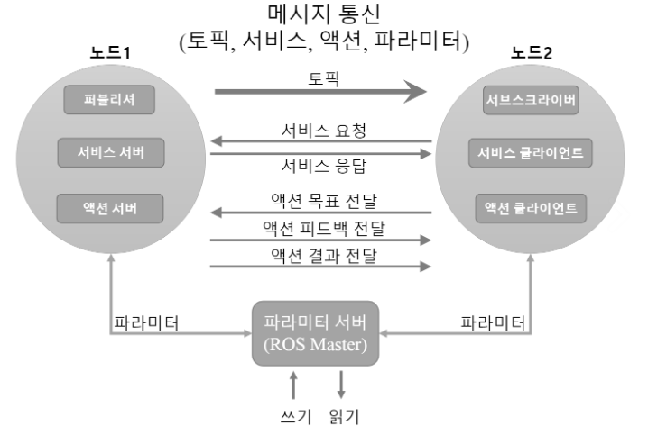

*표 4-1 토픽, 서비스, 액션간의 차이*

| 종류   | 차이점 |        |                                                              |
| ------ | ------ | ------ | ------------------------------------------------------------ |
| 토픽   | 비동기 | 단방향 | 연속적으로 데이터를 송수신 하는 경우에 사용                  |
| 서비스 | 동기   | 양방향 | 요청 처리가 순간적인 현재 상태의 요청 및 응답 등에 사용      |
| 액션   | 비동기 | 양방향 | 요청 처리 후 응답까지 오랜 시간이 걸려서 서비스를 이용하기 어려운 경우나 중간 피드백값이 필요한 경우에 사용 |

### 4.2.1. 토픽(topic)

토픽 메시지 통신은 그림 4-2와 같이 정보를 송신하는 퍼블리셔와 정보를 수신하는 서브스크라이버가 토픽 메시지 형태로 정보를 송수신하는 것이다. 토픽을 수신받기를 원하는 서브스크라이버 노드는 마스터에 등록된 토픽 이름에 해당하는 퍼블리셔 노드의 정보를 받는다. 이 정보를 기반으로 서브스크라이버 노드는 퍼블리셔 노드와 직접 연결하여 메시지를 송수신한다. 예를 들어 모바일로 로봇의 양바퀴 엔코더 값을 계산하여 로봇의 현재 위치인 [오도메트리(odometry)](http://wiki.ros.org/nevigation/Tutorial/RobotSetup/Odom) 정보를 생성, 토픽 메시지(x, y, theta)로 전달하는 것으로 비동기식으로 단방향으로 연속적인 메시지 송수신이 가능하다. 토픽은 단방향 통신이면서 한 번의 접속으로 지속해서 메시지를 송수신하기 때문에 지속해서 메시지를 발송해야 하는 센서 데이터에 적합하다. 더불어, 하나의 퍼블리셔에 여럿의 서브스크라이버의 통신도 가능하고 반대로 하나의 토픽에 대해 여럿의 퍼블리셔에 하나의 서브스크라이버의 통신도 가능하다. 물론 양쪽 모두 여럿의 퍼블리셔에 여럿의 서브스크라이버의 경우에도 통신이 가능하다.

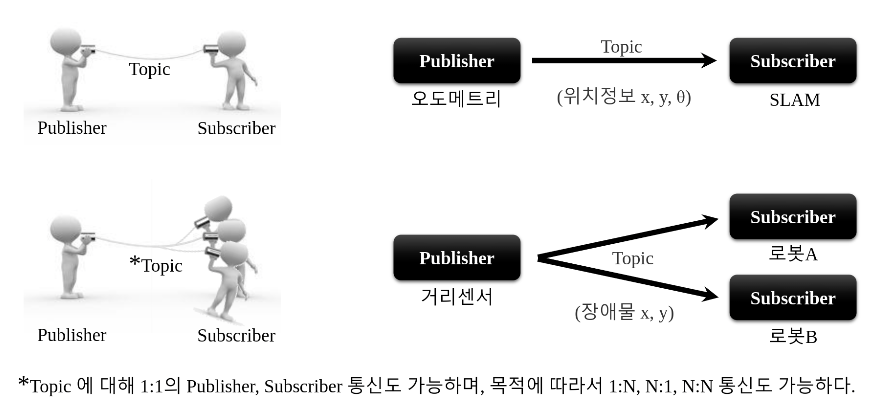

### 4.2.2. 서비스(service)

서비스 메시지 통신은 그림 4-3과 같이 서비스 요청(request)하는 서비스 클라이언트와 서비스 응답(response)을 담당하는 서비스 서버 간의 동기적 양방향 서비스 메시지 통신을 말한다. 앞서 설명한 퍼블리시와 서브스크라이브 개념의 토픽 통신 방식은 비동기 방식이라 필요에 따라서 주어진 데이터를 전송하고 받기에 매우 훌륭한 방법이다. 하지만 때에 따라서는 요청과 응답이 함께 사용되는 동기 방식의 메시지 교환 방식도 필요하다. 이에 따라, ROS에서는 서비스라는 이름으로 메시지 동기 방식을 제공한다.

서비스는 요청이 있을 때만 응답하는 서비스 서버와 요청하고 응답받는 서비스 클라이언트로 나뉜다. 서비스는 토픽과 달리 일회성 메시지 통신이다. 따라서 서비스의 요청과 응답이 완료되면 연결된 두 노드는 접속이 끊긴다. 이러한 서비스는 로봇에 특정 동작을 수행하도록 요청할 때에 사용되는 명령어로 많이 사용되거나, 혹은 특정 조건에 따라 이벤트를 발생해야 할 노드에 사용된다. 또한 일회성 통신 방식이라서 네트워크에 부하가 적기 때문에 토픽을 대체하는 수단으로도 사용되는 등 매우 유용한 통신 수단이다. 예를 들어 아래 그림과 같이 클라이언트가 서버에 현재 시각을 요청하면 서버는 시간을 알아보고 응답하게 된다.


### 4.2.3. 액션(action)

[액션](http://wiki.ros.org/actionlib) 메시지 통신은 요청 처리 후 응답까지 오랜 시간이 걸리고 중간 결괏값이 필요한 경우에 사용되는 메시지 통신방식이다. 이는 서비스와 많이 비슷한데 요청과 응답에 해당되는 목표(goal)와 결과(result)가 있다. 여기에 피드백(feedback)이 추가되었다. 이는 요청 처리 후 응답까지 오랜 시간이 걸리고 중간 결괏값이 필요할 때 이 피드백을 이용하여 관련 데이터를 전송한다. 메시지 전송 방식 자체는 비동기식인 토픽과 동일하다. 피드백은 액션의 목표(goal)을 정하는 액션 클라이언트(action client)와 목표에 맞추어 정해진 일을 수행하고 액션 피드백과 결과를 전달하는 액션 서버(action server) 간의 비동기식 양방향 메시지 통신을 수행한다. 예를 들어 아래 그림과 같이 클라이언트가 서버에게 집안일을 목표로 설정하면 서버는 설거지, 빨래, 청소 등의 일의 경과를 피드백으로 알리고 최종적으로 결괏값을 클라이언트에게 보내게 된다. 액션은 서비스와 달리 목푯값을 전달한 후, 임의의 시점에서 목표를 취소하는 명령어를 전달할 수 있는 기능도 갖고 있는 등 복잡한 로봇의 업무를 지시하는데에 많이 사용되고 있다.


여기서 퍼블리셔, 서브스크라이버, 서비스 서버, 서비스 클라이언트, 액션 서버, 액션 클라이언트는 모두 각각 다른 노드 안에 존재하게 되는데 이러한 노드들이 메시지 통신을 하는 데에는 접속이 필요하다. 이때 노드 간의 접속을 돕는 것이 마스터이다. 마스터는 노드의 이름, 토픽과 서비스, 액션의 이름, URI 주소와 포트, 파라미터 등의 네임 서버와 같은 역할을 한다. 즉 노드는 생성과 동시에 마스터에 자신의 정보를 등록하고, 다른 노드가 마스터를 통해 접속하려는 노드의 정보를 마스터로부터 취득한다. 그런 다음, 노드와 노드가 직접 접속하여 메시지 통신을 수행한다. 이를 그림으로 나타내면 아래와 같다.

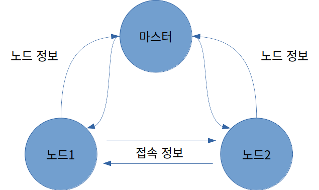


### 4.2.4. 파라미터(parameter)

메시지 통신에는 크게 토픽, 서비스, 액션으로 나뉘고 큰 틀에서는 파라미터 또한 메시지 통신이라고 볼 수 있다. 파라미터는 노드에서 사용되는 글로벌 변수라고 생각하면 된다. 흔히, 윈도우 프로그램에서 *.ini 설정 파일과 쓰임새가 같다고 여기면 된다. 디폴트로 설정값들이 지정되어 있고, 필요에 따라서 외부에서 이 매개변수를 읽거나 쓸 수 있다. 특히 외부에서 쓰기 기능을 이용하여 설정값을 실시간으로 바꿀 수 있기 때문에 상황에 따라 유연하게 대처할 수 있다.

매개변수는 엄밀히 따지면 메시지 통신이라고 볼 수 없지만, 메시지를 이용하기는 한다. 해서 통신의 범주에서 제외시킬 수는 없다. 사용 예를 들자면 접속하는 USB 포트나 카메라 색 보정값, 속도나 명령어들의 최댓값이나 최솟값 등의 설정을 꼽을 수 있다.

### 4.2.5. 메시지 통신의 흐름

마스터는 노드들의 정보를 관리하며, 각 노드는 필요에 따라 다른 노드와 접속, 메시지 통신을 수행한다. 여기서 마스터, 노드, 토픽, 서비스, 액션 메시지의 흐름에 대해 알아본다.

#### 마스터 구동

노드 간의 메시지 통신에서 연결 정보를 관리하는 마스터는 ROS를 사용하기 위해서 제일 먼저 구동해야 하는 필수 요소이다. ROS 마스터는 roscore 명령어로 구동되며, XMLRPC로 서버를 구동한다. 마스터는 노드 간의 접속을 위하여 노드들의 이름, 토픽, 서비스, 액션의 이름, 메시지 형태, URI 주소와 포트를 등록받고, 요청이 있을 때 이 정보를 다른 노드에 알린다.

```
roscore
```

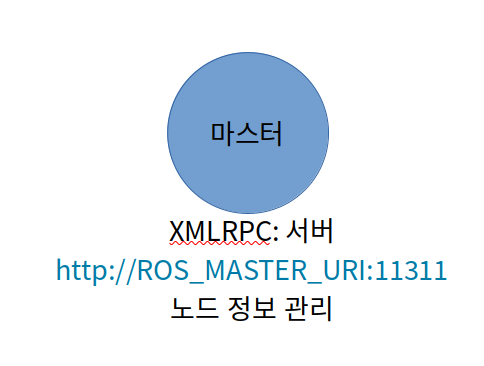

#### 서브스크라이버 노드 구동

서브스크라이버 노드는 rosrun 또는 roslaunch 명령어로 구동된다. 서브스크라이버 노드는 구동과 함께 마스터에 자신의 서브스크라이브 노드 이름, 토픽 이름, 메시지 형태, URI 주소와 포트를 등록한다. 마스터와 노드는 XMLRPC를 이용하여 통신한다.

```
rosrun PACKAGE_NAME NODE_NAME
roslaunch PACKAGE_NAME LAUNCH_NAME
```

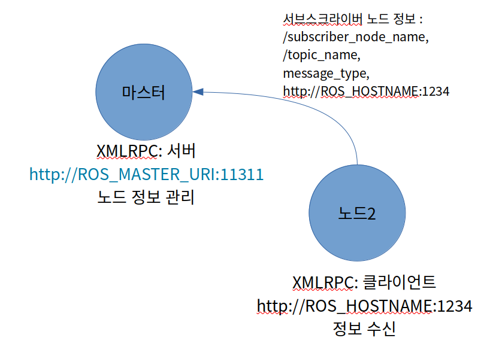

#### 퍼블리셔 노드 구동

퍼블리셔 노드는 서브스크라이버 노드와 마찬가지로 rosrun 또는 roslaunch 명령어로 구동된다. 퍼블리셔 노드는 구동과 함께 마스터에 자신의 퍼블리셔 노드 이름, 토픽 이름, 메시지 형태, URI 주소와 포트를 등록한다. 마스터와 노드는 XMLRPC를 이용하여 통신한다.

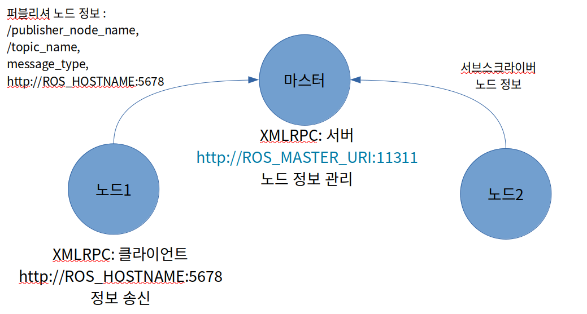

#### 퍼블리셔 정보 알림

마스터는 서브스크라이버 노드에 서브스크라이버가 접속하기 원하는 퍼블리셔의 이름, 토픽 이름, 메시지 형태, URI 주소와 포트 등의 정보를 전송한다. 마스터와 노드는 XMLRPC를 이용하여 통신한다.

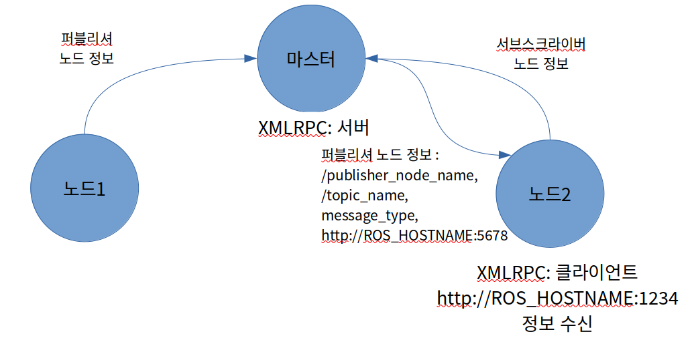

#### 서브스크라이버 노드의 접속 요청

서브스크라이버 노드는 마스터로부터 받은 퍼블리셔 정보를 기반으로 퍼블리셔 노드에 직접 접속을 요청한다. 이때 전송하는 정보로는 자신의 서브스크라이버 노드 이름, 토픽 이름, 메시지 방식이 있다. 퍼블리셔 노드와 서브스크라이버 노드는 XMLRPC를 이용해 통신한다.

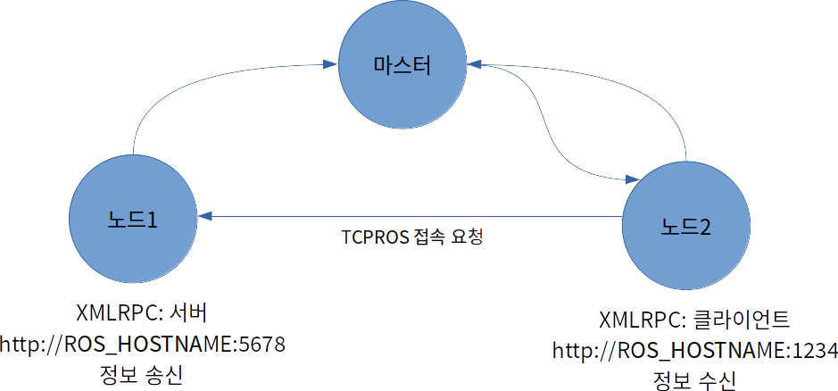

#### 퍼블리셔 노드의 접속 응답

퍼블리셔 노드는 서브스크라이버 노드에 접속 응답에 해당하는 자신의 TCP 서버의 정보인 URI 주소와 포트를 전송한다. 퍼블리셔 노드와 서브스크라이버 노드는 XMLRPC를 이용하여 통신한다.

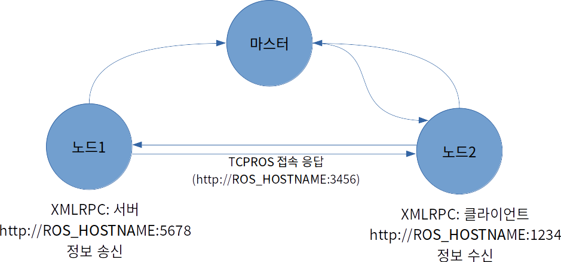

#### TCPROS 접속

서브스크라이버 노드는 TCPROS를 이용하여 퍼블리셔 노드에 대한 클라이언트를 만들고, 퍼블리셔 노드와 직접 연결한다. 노드 간 통신은 TCPROS라는 TCP/IP 방식을 이용한다.

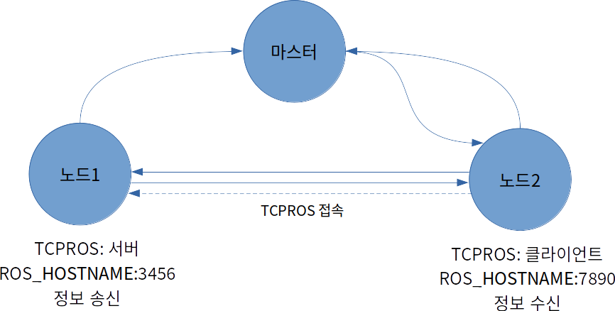

#### 메시지 전송

퍼블리셔 노드는 서브스크라이버 노드에 정해진 메시지를 전송한다. 노드 간 통신은 TCPROS라는 TCP/IP 방식을 이용한다.

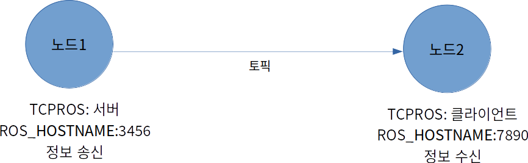

#### 서비스 요청 및 응답

앞에서 설명한 내용은 메시지 통신 중에 토픽에 해당한다. 토픽 메시지 통신은 퍼블리셔나 서브스크라이버가 중지하지 않는 이상, 메시지를 연속해서 퍼블리시하고 서브스크라이브한다. 서비스는 다음 두 가지로 구분한다.

* 서비스 클라이언트 : 서비스를 요청
* 서비스 서버 : 서비스를 요청받아 정해진 프로세스를 수행하고 응답

서비스 서버와 클라이언트의 접속은 앞서 설명한 퍼블리셔와 서브스크라이브에서의 TCPROS 접속과 같지만, 서비스는 토픽과 달리 1회에 한해 접속하여, 요청과 응답을 수행하고 서로의 접속을 끊는다. 다시 필요하면 접속부터 새롭게 진행해야 한다.

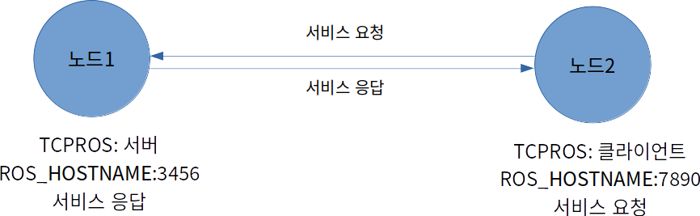

#### 액션 목표, 결과, 피드백

액션은 수행하는 방법론에서 서비스의 요청과 응답의 중간 결괏값 전달용으로 피드백을 추가한 형태이지만 실제 구동 방식은 토픽과 같다. 실제로 rostopic 명령어를 이용하여 토픽을 확인하면 액션은 goal, status, cancel, result, feedback과 같이 액션에서 사용하는 5개의 토픽을 확인할 수 있다. 액션 서버와 클라이언트의 접속은 앞서 설명한 퍼블리셔와 서브스크라이브에서의 TCPROS 접속과 같지만 액션 클라이언트에서 취소 명령을 보내거나 서버에서 결괏값을 보내면 접속이 종료되는 등 사용법은 조금 상이하다.

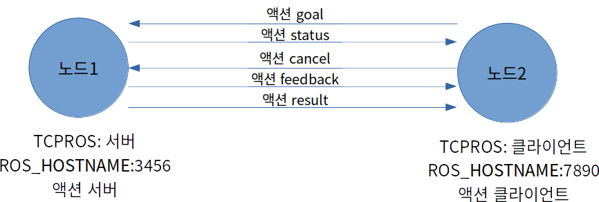

turtlesim을 이용한 ROS 구동 테스트를 예로 들어 설명하자면, 아래 그림처럼 나타낼 수 있다.


## 4.3. 메시지

[메시지(message)](http://wiki.ros.org/msg)는 노드 간에 데이터를 주고 받을 때 사용하는 데이터의 형태이다. 앞서 설명한 토픽, 서비스, 액션은 모두 메시지를 사용하고 있다. 메시지는 정수(integer), 부동 소수점(floating point), 불(boolean)과 같은 단순한 자료형으로부터 [geometry_msgs/PoseStamped](http://docs.ros.org/api/geometry_msgs/html/msg/PoseStamped.html)와 같은 메시지 안에 메시지를 품고 있는 간단한 데이터 구조, 'float32[ ] ranges'나 'Point32[10] point' 같은 메시지들이 나열된 배열과 같은 구조도 사용할 수 있다. 더불어 ROS에서 많이 사용되는 헤더(Header, std_msgs/Header)도 메시지로 사용할 수 있다.

이러한 메시지는 필드타입(fieldtype)과 필드네임(fieldname)이라는 두 가지로 구성되어 있다.

```
fieldtype1 fieldname1
fieldtype2 fieldname2
fieldtype3 fieldname3
```

필드타입에는 다음 표 4-2와 같이 ROS 자료형을 기입하게 되어 있으며, 필드네임에는 데이터를 의미하는 이름을 적어주게 되어 있다. 예를 들어 다음과 같이 사용할 수 있다. 이는 가장 단순한 형태의 메시지 형태이고 여기에 더 추가한다면 필드타입을 표 4-3과 같이 배열로 사용하기도 하며, 메시지 안의 메시지와 같은 형태도 자주 이용된다.

```
int32 x
int32 y
```

*표 4-2) ROS의 기본 메시지 자료형, 직렬화 방법, 이와 대응되는 C++, Python 자료형*

| ROS 자료형 | 직렬화(Serialization)           | C++ 자료형    | Python 자료형  |
| ---------- | ------------------------------- | ------------- | -------------- |
| bool       | unsigned 8-bit int              | uint8_t       | bool           |
| int8       | signed 8-bit int                | int8_t        | int            |
| uint8      | unsigned 8-bit int              | uint8_t       | int            |
| int16      | signed 16-bit int               | int16_t       | int            |
| uint16     | unsigned 16-bit int             | uint16_t      | int            |
| int32      | signed 32-bit int               | int32_t       | int            |
| uint32     | unsigned 32-bit int             | uint32_t      | int            |
| int64      | signed 64-bit int               | int64_t       | long           |
| uint64     | unsigned 64-bit int             | uint64_t      | long           |
| float32    | 32-bit IEEE float               | float         | float          |
| float64    | 64-bit IEEE float               | double        | float          |
| string     | ascii string                    | std::string   | str            |
| time       | secs/nsecs unsigned 32-bit ints | ros::Time     | rospy.Time     |
| duration   | secs/nsecs signed 32-bit ints   | ros::Duration | rospy.Duration |

*표 4-3) ROS의 메시지 자료형에서 배열처럼 사용하는 방법, 이와 대응되는 C++, Python 자료형*

| ROS 자료형      | 직렬화(Serialization)  | C++ 자료형                | Python 자료형 |
| --------------- | ---------------------- | ------------------------- | ------------- |
| fixed-length    | no extra serialization | boost::array, std::vector | tuple         |
| variable-length | uint32 length prefix   | std::vector               | tuple         |
| uint8[ ]        | uint32 length prefix   | std::vector               | bytes         |
| bool[ ]         | uint32 length prefix   | std::vector<uint8_t>      | list of bool  |

앞서 ROS에서 일반적으로 많이 사용되는 헤더(Header, std_msgs/Header)도 메시지로 사용할 수 있다고 했는데 이는 [std_msgs](http://wiki.ros.org/std_msgs) 중의 Header.msg 파일에 기재되어 있듯이 시퀀스 아이디와 타임스탬프, 프레임 아이디를 기재하여 현재 이용하고 있는 메시지의 계측 또는 계산된 시간을 이요할 때 메시지에 함께 포함시켜서 사용한다.

```
# 시퀀스 아이디 : 연속하여 증가하는 ID로 메시지가 차례대로 +1씩 증가한다.
uint32 seq
# 타임스탬프 : 초단위의 stamp.sec와 나노 초단위의 stamp.nsec의 2개의 하위 속성을 갖고 있다.
time stamp
# 프레임 아이디를 기재한다.
string frame_id
```

실제 프로그램에서의 메시지 사용법은 다음과 같다. 예를 들어 3장에서 ROS의 동작 테스트로 실행해봤던 turtlesim 패키지의 teleop_turtle_key 노드의 경우, 실행된 후 입력되는 키보드의 방향키에 따라 turtlesim_node 노드에게 병진속도와 회전속도를 전달하고 있다. 이 전달 받은 속도값을 이용하여 화면 속 터틀봇이 움직이게 된다. 이때 사용된 메시지는 geometry_msgs 중의 [Twist](http://docs.ros.org/api/geometry_msgs/html/msg/Twist.html) 메시지로 다음과 같은 형태이다.

```
Vector3 linear
Vector3 angular
```

이는 Vector3 메시지 형태로 linear와 angular 이름으로 선언해 두었다. 이는 메시지 안의 메시지와 같은 형태로 Vector3 메시지는 [geometry_msgs](http://docs.ros.org/api/geometry_msgs/html/index-msg.html) 중의 하나이다. 이 [Vector3](http://docs.ros.org/api/geometry_msgs/html/msg/Vector3.html)는 다음과 같은 형태이다.

```
float64 x
float64 y
float64 z
```

즉 teleop_turtle_key 노드에서 퍼블리시되는 토픽은 linear.x, linear.y, linear.z, angular.x, angular.y, angular.z로 총 6개의 메시지가 있다. 이는 모두 앞서 설명한 ROS 기본 자료형 중 하나인 float64 형태를 띤다. 이를 이용하여 키보드의 화살표가 병진속도와 회전속도 메시지로 전송하여 터틀봇이 구동할 수 있게 되었던 것이다.

앞 절에서 설명한 메시지 방식의 토픽(topic), 서비스(service), 액션(action) 모두 메시지를 사용하고 있는데 형태는 비슷하고 개념도 같지만 사용법에 따라 3가지 형태로 나뉘게 된다. 이는 이어지는 절에서 더 자세히 다루도록 하겠다.

### 4.3.1. msg 파일

msg 파일은 토픽에서 사용되는 메시지 파일로, *.msg라는 확장자를 이용한다. 예를 들어 앞서 설명한 geometry_msgs 중의 [Twist](http://docs.ros.org/api/geometry_msgs/html/msg/Twist.html) 메시지가 대표적이다. 이와 같은 msg 파일은 필드타입과 필드네임만으로 구성되어 있다.

```
Vector3 linear
Vector3 angular
```

### 4.3.2. srv 파일

srv 파일은 서비스에서 사용되는 메시지 파일로 확장자는 *.srv이다. 예를 들어 sensor_msgs 중 [SetCameraInfo](http://docs.ros.org/api/sensor_msgs/html/srv/SetCameraInfo.html) 메시지가 대표적인 srv 파일이다. msg 파일과의 큰 차이점은 3개의 하이픈(---)이 구분자 역할을 하여 상위 메시지가 서비스 요청 메시지, 하위 메시지가 서비스 응답 메시지로 사용된다.

```
sensor_msgs/CameraInfo camera_info
---
bool success
string status_message
```

### 4.3.3. action 파일

[action 메시지](http://wiki.ros.org/actionlib_msgs) 파일은 [액션](http://wiki.ros.org/actionlib)에서 사용되는 메시지 파일로 *.action이라는 확장자를 이용한다. msg 및 srv와는 달리 비교적 많이 사용되는 메시지 파일은 아니기 때문에 대표적인 공식 메시지 파일은 없지만 다음 예제처럼 사용이 가능하다. msg 및 srv 파일과의 큰 차이점은 3개의 하이픈(---)이 구분자 역할로 2군데 사용되어 첫 번째가 goal 메시지, 두 번째가 result 메시지, 세 번째가 feedback 메시지로 사용된다. 가장 큰 차이점은 action 파일의 feedback 메시지이다. action 파일의 goal 메시지와 result 메시지의 역할이 위에서 언급한 srv 파일의 요청과 응답 메시지의 역할과 같지만 action 파일의 feedback 메시지는 지정된 프로세스가 수행되면서 중간 결괏값 전송 목적으로 이용한다는 것에 차이가 있다. 다음 예제로 설명하면 로봇의 출발지점 start_pose와 목표지점 goal_pose의 위치와 자세를 요청값으로 전송하게 되면 로봇은 정해진 목표지점으로 이동하여 최종적으로 도달된 result_pose의 위치 자세값으로 전달한다. 더불어, 주기적으로 중간 결괏값으로 percent_complete 메시지로 목표지점까지의 도달 정도를 퍼센트로 전달하게 된다.

```
geometry_msgs/PoseStamped start_pose
geometry_msgs/PoseStamped goal_pose
---
geometry_msgs/PoseStamped result_pose
---
float32 percent_complete
```

## 4.4. 네임(name)

ROS는 그래프(graph)라는 추상 데이터 형태(abstract data type)를 기본 [콘셉트](http://wiki.ros.org/ROS/Concepts)로 가지고 있다. 이는 각 노드들의 연결 관계를 나타내고 화살표로 메시지(데이터)를 주고받는 관계를 설명하게 된다. 이를 위해서 ROS에서 사용되는 노드, 토픽과 서비스에서 사용하는 메시지 그리고 파라미터는 모두 고유의 [네임(name)](http://wiki.ros.org/Names)을 가지도록 되어 있다. 여기서 토픽의 네임에 대해서 더 자세히 알아보도록 하자. 토픽의 네임은 다음 표 4-4와 같이 상대적인 방법과 글로벌(global), 프라이빗(private)으로 나뉘어 사용한다.

일반적으로 사용되는 토픽의 선언은 다음 코드와 같다. 이는 제 7장에서 더 자세히 다룰텐데 여기서는 네임의 사용법에 대해서 토픽명을 수정해보면서 이해하도록 한다.

```cpp
int main(int argc, char **argv)		// 노드 메인 함수
    ros::init(argc, argv, "node1"); // 노드명 초기화
	ros::NodeHandle nh;				// 노드 핸들 선언
	// 퍼블리셔 선언, 토픽명 = bar
	ros::Publisher node1_pub = nh.advertise<std_msg::Int32>("bar", 10);
```

여기서 노드명은 /node1이 된다. 그리고 아무런 문자를 붙이지 않고 상대적인 bar로 퍼블리셔를 선언하게 되면 토픽은 /bar와 같은 네임을 가지게 된다. 만약에 이를 다음과 같이 슬래시(/) 문자로 글로벌로 사용하였다 하더라도 토픽 네임은 /bar가 된다.

```cpp
ros::Publisher node1_pub = nh.advertise<std_msg::Int32>("/bar", 10);
```

하지만 다음과 같이 틸트(~) 문자를 이용하여 private로 선언하게 되면 토픽 네임은 /node1/bar가 된다.

```
ros::Publisher node1_pub = nh.advertise<std_msg::Int32>("~bar", 10);
```

이를 더 다양한 경우의 수로 나타내면 표 4-4와 같이 다양한 방법과 용도로 이용 가능하다. 여기서 /wg은 네임스페이스의 변경으로 이어지는 설명에서 다룬다.

*표 4-4) 네임 규칙*

| Node      | Relative(기본)        | Global              | Private                      |
| --------- | --------------------- | ------------------- | ---------------------------- |
| /node1    | bar → /bar            | /bar → /bar         | ~bar → /node1/bar            |
| /wg/node2 | bar → /wg/bar         | /bar → /bar         | ~bar → /wg/node2/bar         |
| /wg/node3 | foo/bar → /wg/foo/bar | /foo/bar → /foo/bar | ~foo/bar → /wg/node3/foo/bar |

두 대의 카메라를 구동하려면 어떻게 해야 할까? 단순히 관련 노드를 두 번 실행하면 고유의 네임을 가져야하는 ROS의 특성상 이전에 실행한 노드가 종료된다. 그렇다고 별도의 프로그램을 실행하거나 소스 코드를 변경하는 것이 아니라 노드를 실행할 때 노드의 이름을 변경하여 실행할 수 있다. 방법으로는 네임스페이스(namespace)와 리맵핑(remapping)이 있다.

이해를 돕기 위해 가상의 camera_package가 있다고 하자. 이 camera_package 패키지의 camera_node를 실행했을 때 camera 노드가 실행된다고 했을 때 이 구동 방법은 다음과 같다.

```
rosrun camera_package camera_node
```

이 노드에서 카메라의 영상값을 image 토픽으로 전송한다고 했을 때, 다음과 같이 rqt_image_view를 통해서 이 image 토픽을 전송받을 수 있다.

```
rosrun rqt_image_view rqt_image_view
```

이제 이 노드들의 토픽값을 리맵핑을 통해 수정해보자. 다음과 같이 실행하게 되면 주고받는 토픽명만 /front/image로 변경된다. 여기서 image는 camera_node에서의 토픽명으로 이 토픽명과 관련된 두 노드의 실행과 함께 옵션으로 네임을 변경하는 명령어의 예이다.

```
$ rosrun camera_package camera_node image:=front/image
$ rosrun rqt_image_view rqt_image_view image:=front/image
```

예를 들어 front, right와 같이 카메라 3대가 있을 때, 이를 동일 이름으로 노드를 복수 실행할 때 노드의 고유 네임이 중복되어 전에 실행된 노드가 중단된다. 때문에 다음과 같은 방법으로 같은 이름이지만 복수 개의 다른 노드로 실행 가능하다. 여기서 name 옵션에 밑줄(`__`)이 2개 사용되었는데 `__ns`, `__name`, `__log`, `__ip`, `__hostname`, `__master` 등의 옵션은 노드를 실행할 때 사용하는 특수 옵션이다. 그리고 토픽명의 옵션에 앞서서 밑줄(`_`) 하나를 사용했는데 이는 private로 사용되는 네임일 경우 네임에 덧붙여 사용한다.

```
$ rosrun camera_package camera_node __name:=front _device:=/dev/video0
$ rosrun camera_package camera_node __name:=left _device:=/dev/video1
$ rosrun camera_package camera_node __name:=right _device:=/dev/video2
$ rosrun rqt_image_view rqt_image_view
```

만약에 하나의 네임스페이스로 묶어주고 싶다면 다음과 같이 하면 된다. 이렇게 하면 정해진 노드 및 토픽 모두 하나의 네임스페이스에 묶여서 모든 네임이 변경된다.

```
$ rosrun camera_package camera_node __ns:=back
$ rosrun rqt_image_view rqt_image_view __ns:=back
```

다양한 네임의 사용법에 대해서 알아보았다. 네임은 ROS 시스템을 전체적으로 유연하게 연동할 수 있도록 지원하고 있다. 이 절에서는 노드 실행 명령어인 rosrun을 통해서 네임값 변동에 대해 알아봤는데 같은 개념으로 이들의 옵션을 한 번에 지정하여 실행하는 방법인 roslaunch를 이용하는 방법이다. 이는 7장에서 실전 예제와 함께 더 자세히 다루도록 하겠다.

## 4.5. 좌표변환(TF)

그림 4-17과 같은 로봇의 팔 자세를 설명할 때 각 관절(joint)들의 [상대 좌표 변환](http://wiki.ros.org/geometry/CoordinateFrameConventions)으로 기술할 수 있다. 예를 들어 휴머노이드 로봇의 손을 예로 들어보자. 손은 손목에 연결되어 있고, 다시 팔꿈치에 연결되어 있고, 팔굼치는 어깨에 연결되어 있다. 또한 팔꿈치는 로봇이 보행하며 이동하면서 각 다리 관절들의 관계로 표시할 수 있으며 최종적으로 로봇의 양 발바닥의 가운데에 오게 된다. 반대로 말하면 로봇이 보행하여 이동하게 되면 로봇 손의 좌표는 각 상관 관계가 있는 관절들의 상대 좌표 변환에 따라서 이동하게 되는 것이다. 또한 로봇 이외에도 로봇이 잡으려는 물체가 있다고 한다면 로봇 원점이 특정 지도 위에 상대적으로 위치해 있을테고 그 물체 또한 지도 위에 위치해 있을 것이다 로봇은 그 물체를 잡기 위하여 지도상에 자신의 자세로부터 상대적으로 물체의 위치를 계산하여 잡을 수 있게 된다. 이렇게 로봇 프로그래밍에서 좌표 변환을 통한 각 로봇 관절(혹은 회전축 등을 갖는 바퀴) 및 물체의 위치는 매우 중요하며 ROS에서는 이를 [TF(transform)](http://wiki.ros.org/tf)로 표현하고 있다.

*그림 4-17) 로봇의 각 좌표의 표현( cf) : THORMANG3, OpenMANIPULATOR, http://robots.ros.org/thormang/, https://e-shop.robotis.co.jp/product.php?id=265)


ROS에서 좌표 변환 TF는 로봇을 구성하는 각 부분 및 장애물과 물체들을 기술할 때 매우 유용한 개념 중에 하나이다. 이들은 자세(pose)라 하여 위치(position)와 방향(orientation)으로 기술할 수 있다. 여기서 위치는 x, y, z과 같이 3개의 벡터로 설명하고 방향은 사원수라 일컫는 쿼터니언(quaternion) 형태의 x, y, z, w를 이용한다. 쿼터니언은 흔히 우리 생활에서 사용하는 각도 표현형인 롤(roll), 피치(pitch), 요(yaw)와 같이 3가지 축(x, y, z)의 회전으로 기술하는 게 아니다 보니 직관적이지는 않다. 하지만 롤, 피치, 요 벡터의 오일러(Euler) 방식이 갖는 짐벌락(gimbal lock) 문제나 속도 문제가 없어서 로보틱스에서는 기본적으로 쿼터니언(quaternion) 형태를 더 선호하며 ROS에서도 이와 같은 이유로 쿼터니언을 많이 사용한다. 물론 편의성을 고려하여 오일러 값을 쿼터니언으로 변환해주는 함수도 제공해주고 있다.

TF는 앞서 설명한 메시지처럼 다음과 같은 [형태](http://docs.ros.org/api/geometry_msgs/html/msg/TransformStamped.html)로 사용한다. 변환된 시간을 기록할 목적으로 Header를 사용하며, 하위 좌표를 명시하기 위하여 child_frame_id라는 이름의 메시지를 사용한다. 그리고 상대 좌표 변환값을 알려주기 위하여 transform.translation.x / transform.translation.y / transform. translation.z / transform.rotation.x / transform.rotation.y / transform.rotation.z / transform.rotation.w 데이터 형태로 상대 위치와 방향을 기술하게 되어 있다.

*geometry_msgs/TransformStamped.msg*

```
Header header
string child_frame_id
Transform transform
```

간단하게 나마 TF에 대해 알아보았다. TF의 실전 예제는 모바일 로봇 및 매니퓰레이터의 모델링 부분에서 더 심도 있게 알아보자.

## 4.6. 클라이언트 라이브러리

프로그래밍 언어는 정말 다양하다. 흔히 더 빠르고 하드웨어 제어 목적이라면 C++, 높은 생산성을 추구한다면 파이썬 및 루비를 이용한다. 그것뿐만이 아니다. 인공지능 분야에서 많이 사용되는 리스프, 수치 해석 등의 공학용 소프트웨어인 매트랩, 안드로이드에서 많이 사용되는 자바, 이외에도 C#, Go, Haskell, Node.js, Lua, R, EusLisp, Julia 등 많은 언어들이 존재한다. 이 언어들은 어떤 것이 더 중요하다고 단언할 수는 없다. 하고자 하는 작업의 특성에 따라 가장 적합한 언어는 따로 존재하게 된다. 이에 특성상 다양한 목적을 갖는 로봇을 지원하는 ROS는 이들의 언어들을 목적에 맞게 골라서 사용할 수 있도록 지원하고 있다. 그 방법론으로 노드는 각각의 언어로 작성이 가능하고 노드 간의 메시지 통신을 통해 정보를 교환하는 방법을 이용하고 있다. 이중 각각의 언어로 작성 가능하게 해주는 소프트웨어 모듈이 클라이언트 [라이브러리(client library)](http://wiki.ros.org/Client%20Libraries)이다. 대표적으로 많이 사용되고 있는 라이브러리는 C++ 언어를 위한 roscpp, python 언어를 위한 rospy, LISP를 위한 roslisp, Java를 위한 rosjava가 있다. 이외에도 roscs, roseus, rosgo, roshask, rosnodejs, RobotOS.jl, roslua, PhaROS, rosR, rosruby, Unreal-Ros-Plugin 등이 있으며 각 클라이언트 라이브러리는 지금도 ROS의 언어 다양성을 위해 개발 중에 있다.

이 책에서는 이중에서 C++ 언어를 위한 roscpp 위주로 설명을 진행할 예정이다. 하지만 다른 언어를 이용하고 있다고 하더라도 프로그래밍 문법만 상이할 뿐 개념은 모두 동일하기 때문에 [각 클라이언트 라이브러리 위키](http://wiki.ros.org/Client%20Libraries)를 참조하여 각자 편한 언어로 프로그래밍하면 된다.

## 4.7. 이기종 디바이스 간의 통신

2장에서 설명한 메타 운영체제, 4장에서 설명한 메시지 통신, 메시지, 네임, 좌표 변환, 클라이언트 라이브러리 등의 콘셉트를 통해 ROS는 이기종 디바이스 간의 통신(그림 4-18 참조)을 기본적으로 지원한다 ROS가 설치되어 사용하는 운영체제의 종류와도 상관없고, 사용하는 프로그래밍 언어도 상관없이 ROS가 설치되어 각 노드가 개발되었다면 각 노드들 간의 통신은 매우 쉽게 이용 가능하다. 예를 들어 로봇에는 리눅스의 한 배포판인 우분투가 설치되어 있더라도, 개발자가 사용하는 MacOS에서 로봇의 상태를 모니터링 할 수 있다. 이와 동시에 사용자는 안드로이드 기반의 앱(APP)에서 로봇에게 명령을 내릴 수 있다. 이를 테스트하는 예제는 8장 USB 카메라 설명에서 서로 다른 두 PC간의 영상 스트림 전송 예를 통해 다루도록 하겠다. 그리고 ROS를 설치할 수 없는 임베디드 시스템인 마이크로컨트롤러 디바이스라고 하더라도 ROS의 메시지를 송수신만 받을 수 있도록 지원해준다면 로봇 제어에서 많이 사용되는 제어기 레벨에서도 메시지 통신이 가능하게 된다. 이와 관련해서는 9장 임베디드 시스템에서 더 자세히 설명하도록 하겠다.

*그림 4-18) 이기종 간의 통신*


## 4.8. 파일 시스템

### 4.8.1. 파일 구성

ROS의 파일 구성에 대해서 알아보자. ROS에서 소프트웨어 구성을 위한 기본 단위는 패키지(package)로써 ROS의 응용프로그램은 패키지 단위로 개발된다. 패키지는 ROS에서 최소 단위의 실행 프로세서인 노드(node)를 하나 이상 포함하거나 다른 노드를 실행하기 위한 설정 파일들을 포함하게 된다. 2017년 7월을 기준으로 ROS Indigo는 약 2500개의 패키지, ROS Kinetic은 약 1600개의 패키지가 공식 패키지로 등록되어 있다. 사용자들이 개발하여 공개된 패키지는 어느정도 중복이 있을 수도 있지만 약 5000개에 달한다 이러한 패키지는 메타패키지(metapackage)라는 공통된 목적을 지닌 패키지들을 모아둔 패키지들의 집합 단위로 관리되기도 한다. 예를 들어 Navigation 메타패키지는 AMCL, DWA, EKF, map_server 등 10여 개의 패키지로 구성되어 있다. 각 패키지는 package.xml이라는 파일을 포함하고 있는데 이는 패키지의 정보를 담은 XML 파일로서 패키지의 이름, 저작자, 라이선스, 의존성 패키지 등을 기술하고 있다. 또한 ROS의 빌드 시스템은 캐킨은 기본적으로 CMake를 사용하고 있어서 패키지 폴더에 CMakeList.txt라는 파일에 빌드 환경을 기술하고 있다. 이외에 노드의 소스 코드 및 노드 간의 메시지 통신을 위한 메시지 파일 등으로 구성되어 있다.

ROS의 파일 시스템은 설치 폴더와 사용자 작업 폴더로 구분된다. ROS 설치 폴더는 ROS의 데스크톱 버전을 설치하면 /opt 폴더에 ros 이름으로 폴더가 생성되고 그 안에 roscore를 포함한 핵심 유틸리티와rqt, RViz, 로봇 관련 라이브러리, 시뮬레이션, 내비게이션 등이 설치된다. 사용자가 이 부분의 파일들을 손댈 일은 거의 없다. 만약에 바이너리 파일로 공식 배포되는 패키지를 수정하고자 하는 경우는 'sudo apt-get install ros-noetic-xxx'의 패키지 설치 명령어가 아닌 직접 원본 소스가 있는 리포지토리를 확인한 다음'~/catkin_ws/src'에 'git clone [리포지토리 주소]'와 같이 직접 소스를 복사하여 사용하면 된다.

사용자작업 폴더는 사용자가 원하는 곳에 폴더를 생성할 수 있는데 리눅스 사용자 폴더인'~/catkin_ws/'를 사용하도록 하자. 이어서 ROS 설치 폴더와 사용자 작업 폴더에 대해서 알아보자.

※ cf) : 바이너리 설치와 소스 코드 설치

> ROS 패키지 설치는 바이너리 형태로 제공되어 별도의 빌드 과정 없이 바로 실행 가능한 방법과 해당 패키지의 소스 코드를 직접 다운로드 한 후 사용자가 빌드하여 사용하는 방법이 있다. 이는 패키지 사용 목적에 따라 달리 사용된다. 만약, 해당 패키지를 수정해 사용할 경우나 소스 코드 내용을 확인할 필요가 있다면 후자의 설치 방법을 이용하면 된다. 다음은 turtlebot3 패키지를 예로 들어 두 설치 방법의 차이를 기술한다.
>
> 1. 바이너리 설치
>
>    ```
>    $ sudo apt-get install ros-kinetic-turtlebot3
>    ```
>
> 2. 소스코드 설치
>
>    ```
>    $ cd ~/catkin_ws/src
>    $ git clone https://github.com/ROBOTIS-GIT/turtlebot3.git
>    $ cd ~/catkin_ws/
>    $ catkin_make
>    ```

4.8.2. 설치 폴더

ROS는 'opt/ros/[버전이름]' 폴더에 설치된다. 예를 들어 ROS Kinetic Kame 버전을 설치했다면 ROS가 설치된 경로는 다음과 같다.

* ROS 설치 폴더 경로 : /opt/ros/kinetic

#### 파일 구성

다음과 같이 '/opt/ros/kinetic'의 폴더 아래에 bin, etc, include, lib, share 폴더와 몇 가지 환경설정 파일들로 구성되어 있다.

```
oem@user:/opt/ros/noetic$ ls
_setup_util.py  etc      local_setup.bash  setup.bash  share
bin             include  local_setup.sh    setup.sh
env.sh          lib      local_setup.zsh   setup.zsh
```

#### 세부 내용

ROS 폴더에는 ROS를 설치할 때 선택했던 패키지와 ROS 구동 프로그램이 포함되고 있다. 세부 내용은 다음과 같다.

* /bin

  실행 가능한 바이너리 파일

* /etc

  ROS 및 catkin 관련 설정 파일

* /include

  헤더 파일

* /lib

  라이브러리 파일

* /share

  ROS 패키지

* env.*

  환경설정 파일

* setup.*

  환경설정 파일

### 4.8.3. 작업 폴더

작업 폴더는 사용자가 원하는 곳에 생성할 수 있으나 이 책에서는 원활한 진행을 위하여 리눅스 사용자 폴더인 '~/catkin_ws/'를 사용하도록 하자. 즉 '/home/사용자이름/catkin_ws'를 사용할 것이다. 예를 들어, 사용자 이름이 'oem'이고 catkin 폴더 이름은 'catkin_ws'라고 설정하였다면 경로는 다음과 같다.

* 작업 폴더 경로 : /home/oem/catkin_ws/

#### 파일 구성

아래와 같이 '/home/사용자이름/' 폴더 아래에 catkin_ws라는 폴더가 있고, build, devel, src 폴더로 구성되어 있다. 참고로 build와 devel 폴더는 catkin_make 후에 생성된다.

```
oem@user:~/catkin_ws$ ls
build  devel  src
```

#### 세부 내용

작업 폴더는 사용자가 작성한 패키지와 공개된 다른 개발자의 패키지를 저장하고 빌드하는 공간이다. 사용자는 ROS와 관련된 대부분의 작업을 이 폴더에서 수행한다. 세부 내용은 다음과 같다.

* /build

  빌드 관련 파일

* /devel

  msg, srv 헤더 파일과 사용자 패키지 라이브러리, 실행 파일

* /src

  사용자 패키지

#### 사용자 패키지

'~/catkin_ws/src' 폴더는 사용자 소스 코드의 공간이다. 이 폴더에 사용자가 개발한 ROS 패키지나 다른 개발자가 개발한 패키지를 저장하고 빌드할 수 있다. ROS 빌드 시스템은 다음 절에서 자세히 알아보고, 여기서는 폴더와 파일 구성 정도만 알아두고 넘어가기로 하자. 다음은 필자가 작성한 ros_tutorial_topic 패키지를 작성한 후의 상태이다. 패키지의 목적에 따라 그 구성이 달리할 수 있는데 일반적으로 많이 사용되는 각 폴더 및 파일을 설명한다.

```
... 생략
```

* /include

  헤더 파일

* /launch

  roslaunch에 사용되는 launch 파일

* /node

  rospy용 스크립트

* /msg

  메시지 파일

* /src

  코드 소스 파일

* /srv

  서비스 파일

* CMakeList.txt

  빌드 설정 파일

* package.xml

  패키지 설정 파일

## 4.9. 빌드 시스템

ROS의 빌드 시스템은 기본적으로 CMake(Cross Platform Make)를 사용하고 빌드 환경은 패키지 폴더의 CMakeList.txt 파일에 기술한다. ROS에서는 CMake를 ROS에 맞도록 수정하여 ROS에 특화된 캐킨(catkin) 빌드 시스템을 제공한다.

ROS에서 CMake를 사용하는 이유는 ROS 패키지를 멀티 플랫폼에서 빌드할 수 있게 하기 위함이다. Make가 유닉스 계열만 지원하는 것과 달리, CMake는 유닉스 계열인 리눅스, BSD, OS X뿐만 아니라 원도우 게열도 지원하기 때문이다. 또한 마이크로소프트 비주얼 스튜디오도 지원하고 Qt 개발에도 쉽게 적용할 수 있다. 더욱이, 캐킨 빌드 시스템은 ROS와 관련된 빌드, 패키지 관리, 패키지 간 의존관계 등을 편리하게 사용할 수 있도록 하고 있다.

### 4.9.1. 패키지 생성

ROS 패키지를 생성하는 명령어는 다음과 같다.

```
$ catkin_create_pkg [패키지이름] [의존하는패키지1] [의존하는패키지n]
```

'catkin_create_pkg'는 사용자가 패키지를 작성할 때 캐킨 빌드 시스템에 꼭 필요한 CMakeLists.txt와 package.xml을 포함한 패키지 폴더를 생성한다. 이해를 돕기 위해 간단한 패키지를 작성해보자. 먼저 새로운 터미널 창을 열고(Ctrl + Alt + t) 다음 명령어를 실행하여 작업 폴더로 이동한다.

```
$ cd ~/catkin_ws/src
```

생성할 패키지 이름은 'my_first_ros_pkg'이다(ROS 프로그래밍에서 코딩 스타일([1](http://wiki.ros.org/CppStyleGuide), [2](http://wiki.ros.org/PyStyleGuide))과 이름 규칙은 관련 페이지를 참고하도록 하자).

그럼 다음 명령어로 my_first_ros_pkg 이름의 패키지를 생성해보자.

```
$ catkin_create_pkg my_first_ros_pkg std_msgs roscpp
```

앞의 명령어에서 의존하는 패키지로 'std_msgs'와 'roscpp'를 옵션으로 달아주었다. ROS의 표준 메시지 패키지인 std_msgs와 ROS에서 C/C++를 사용하기 위하여 클라이언트 라이브러리인 roscpp를 사용하겠다는 것으로 패키지 생성에 앞서 미리 설치해야 한다는 의미이다. 이러한 의존하는 패키지 설정은 패키지를 생성할 때 지정할 수도 있지만, 생성한 다음 package.xml에서 직접 입력해도 된다.

패키지를 생성하였다면 '~/catkin_ws/src'에 'my_first_ros_pkg' 패키지 폴더와 ROS 패키지가 갖추어야 할 기본 내부 폴더 그리고 CMakeList.txt와 package.xml 파일이 생성된다. 다음은 생성한 my_first_ros_pkg의 내부이다.

```
$ cd my_first_ros_pkg
$ ls
CMakeLists.txt  include  package.xml  src
```

* CMakeList.txt

  빌드 설정 파일

* include

  인클루드 폴더

* src

  소스 코드 폴더

* package.xml

  패키지 설정 파일

### 4.9.2. 패키지 설정 파일(package.xml) 수정

ROS의 필수 설정 파일 중 하나인 package.xml은 패키지의 정보를 담은 XML 파일로서 패키지의 이름, 저작자, 라이선스, 의존성 패키지 등을 기술하고 있다. 처음에 아무런 수정을 가하지 않은 원본 파일은 다음과 같다.

```xml
<?xml version="1.0"?>
<package format="2">
  <name>my_first_ros_pkg</name>
  <version>0.0.0</version>
  <description>The my_first_ros_pkg package</description>

  <!-- One maintainer tag required, multiple allowed, one person per tag -->
  <!-- Example:  -->
  <!-- <maintainer email="jane.doe@example.com">Jane Doe</maintainer> -->
  <maintainer email="oem@todo.todo">oem</maintainer>


  <!-- One license tag required, multiple allowed, one license per tag -->
  <!-- Commonly used license strings: -->
  <!--   BSD, MIT, Boost Software License, GPLv2, GPLv3, LGPLv2.1, LGPLv3 -->
  <license>TODO</license>


  <!-- Url tags are optional, but multiple are allowed, one per tag -->
  <!-- Optional attribute type can be: website, bugtracker, or repository -->
  <!-- Example: -->
  <!-- <url type="website">http://wiki.ros.org/my_first_ros_pkg</url> -->


  <!-- Author tags are optional, multiple are allowed, one per tag -->
  <!-- Authors do not have to be maintainers, but could be -->
  <!-- Example: -->
  <!-- <author email="jane.doe@example.com">Jane Doe</author> -->


  <!-- The *depend tags are used to specify dependencies -->
  <!-- Dependencies can be catkin packages or system dependencies -->
  <!-- Examples: -->
  <!-- Use depend as a shortcut for packages that are both build and exec dependencies -->
  <!--   <depend>roscpp</depend> -->
  <!--   Note that this is equivalent to the following: -->
  <!--   <build_depend>roscpp</build_depend> -->
  <!--   <exec_depend>roscpp</exec_depend> -->
  <!-- Use build_depend for packages you need at compile time: -->
  <!--   <build_depend>message_generation</build_depend> -->
  <!-- Use build_export_depend for packages you need in order to build against this package: -->
  <!--   <build_export_depend>message_generation</build_export_depend> -->
  <!-- Use buildtool_depend for build tool packages: -->
  <!--   <buildtool_depend>catkin</buildtool_depend> -->
  <!-- Use exec_depend for packages you need at runtime: -->
  <!--   <exec_depend>message_runtime</exec_depend> -->
  <!-- Use test_depend for packages you need only for testing: -->
  <!--   <test_depend>gtest</test_depend> -->
  <!-- Use doc_depend for packages you need only for building documentation: -->
  <!--   <doc_depend>doxygen</doc_depend> -->
  <buildtool_depend>catkin</buildtool_depend>
  <build_depend>roscpp</build_depend>
  <build_depend>std_msgs</build_depend>
  <build_export_depend>roscpp</build_export_depend>
  <build_export_depend>std_msgs</build_export_depend>
  <exec_depend>roscpp</exec_depend>
  <exec_depend>std_msgs</exec_depend>


  <!-- The export tag contains other, unspecified, tags -->
  <export>
    <!-- Other tools can request additional information be placed here -->

  </export>
</package>
```

다음은 각 구문에 대한 설명이다. 참고로 package.xml의 태그는 2가지의 다른 버전의 포맷이 있다. 최근 제안된 package 포맷2 (http://docs.ros.org/jade/api/catkin/html/howto/format2/index.html)는 기능적으로 더 많은 내용을 포함하고 있지만 이 책에서는 호환성을 고려하여 package 포맷1을 기준으로 설명한다. 각 태그의 의미는 다음과 같다.

* <?xml>

  문법 문서를 정의하는 문구로 아래의 내용은 xml 버전 1.0을 따르고 있다는 것을 알린다.

* <package>

  이 구문부터 맨 끝의 </package>까지가 ROS 패키지 설정 부분이다.

* <name>

  패키지의 이름이다. 패키지를 생성할 때 입력한 패키지 이름이 사용된다. 다른 옵션도 마찬가지지만 이는 사용자가 원할 때 언제든지 변경할 수 있다.

* <version>

  패키지의 간단한 설명이다. 보통 2-3문장으로 기술한다.

* <maintainer>

  패키지 관리자의 이름과 이메일 주소를 기재한다.

* <license>

  라이센스를 기재한다. BSD, MIT, Apache, GPLv3, LGPLv3 등을 기재하면 된다.

* <url>

  패키지를 설명하는 웹 페이지 또는 버그 관리, 저장소 등의 주소를 기재한다. 이 종류에 따라 type에 website, bugtracker, repository를 대입하면 된다.

* <author>

  패키지 개발에 참여한 개발자의 이름과 이메일 주소를 적는다. 복수의 개발자가 참여한 경우에는 바로 다음 줄에 <author> 태그를 이용하여 추가로 넣어주면 된다.

* <buildtool_depend>

  빌드 시스템의 의존성을 기술한다. 지금은 캐킨 빌드 시스템을 이용하고 있으므로 catkin을 입력한다.

* <build_depend>

  패키지를 빌드할 때 의존하는 패키지 이름을 적는다.

* <run_depend>(혹은 <exec_depend>)

  패키지를 실행할 때 의존하는 패키지 이름을 적는다.

* <test_depend>

  패키지를 테스트할 때 의존하는 패키지 이름을 적는다.

* <export>

  ROS에서 명시하지 않은 태그명을 사용할 때 쓰인다. 제일 널리 쓰이는 것은 메타패키지일 때 <export><metapackage/></export>와 같이 메타패키지임을 기술한다.

* <metapackage>

  export 태그 안에서 사용하는 공식적인 태그로 현재의 패키지가 메타패키지이면 이를 선언한다.

다음과 같이 패키지 설정 파일을 자신의 환경에 맞게 수정해보자.

```xml
<?xml version="1.0"?>
<package format="2">
  <name>my_first_ros_pkg</name>
  <version>0.0.1</version>
  <description>The my_first_ros_pkg package</description>

  <maintainer email="oem@todo.todo">oem</maintainer>

  <license>Apache License 2.0</license>
  <author email="jungsoeko@gmail.com">ojs</author>
  <maintainer email="jungsoeko@gmail.com">ojs</maintainer>
  <url type="bugtracker">https://github.com/jungsoek/rosstudy/issues</url>
  <url type="repository">https://github.com/jungsoek/rosstudy/ros_tutorial</url>
  <url type="website">http://www.robotis.com</url>
  <buildtool_depend>catkin</buildtool_depend>
  <build_depend>roscpp</build_depend>
  <build_depend>std_msgs</build_depend>
  <build_export_depend>roscpp</build_export_depend>
  <build_export_depend>std_msgs</build_export_depend>
  <exec_depend>roscpp</exec_depend>
  <exec_depend>std_msgs</exec_depend>
  <export></export>
</package>
```

### 4.9.3. 빌드 설정 파일(CMakeList.txt) 수정

ROS의 빌드 시스템인 캐킨은 기본적으로 CMake를 이용하고 있어서 패키지 폴더의 CMakeLists.txt라는 파일에 빌드 환경을 기술하고 있다. 이는 실행 파일 생성, 의존성 패키지 우선 빌드, 링크 생성 등을 설정하게 되어 있다. 처음에 아무런 수정을 가하지 않은 원본 파일은 다음과 같다.

```
cmake_minimum_required(VERSION 3.0.2)
project(my_first_ros_pkg)

## Compile as C++11, supported in ROS Kinetic and newer
# add_compile_options(-std=c++11)

## Find catkin macros and libraries
## if COMPONENTS list like find_package(catkin REQUIRED COMPONENTS xyz)
## is used, also find other catkin packages
find_package(catkin REQUIRED COMPONENTS
  roscpp
  std_msgs
)

## System dependencies are found with CMake's conventions
# find_package(Boost REQUIRED COMPONENTS system)


## Uncomment this if the package has a setup.py. This macro ensures
## modules and global scripts declared therein get installed
## See http://ros.org/doc/api/catkin/html/user_guide/setup_dot_py.html
# catkin_python_setup()

################################################
## Declare ROS messages, services and actions ##
################################################

## To declare and build messages, services or actions from within this
## package, follow these steps:
## * Let MSG_DEP_SET be the set of packages whose message types you use in
##   your messages/services/actions (e.g. std_msgs, actionlib_msgs, ...).
## * In the file package.xml:
##   * add a build_depend tag for "message_generation"
##   * add a build_depend and a exec_depend tag for each package in MSG_DEP_SET
##   * If MSG_DEP_SET isn't empty the following dependency has been pulled in
##     but can be declared for certainty nonetheless:
##     * add a exec_depend tag for "message_runtime"
## * In this file (CMakeLists.txt):
##   * add "message_generation" and every package in MSG_DEP_SET to
##     find_package(catkin REQUIRED COMPONENTS ...)
##   * add "message_runtime" and every package in MSG_DEP_SET to
##     catkin_package(CATKIN_DEPENDS ...)
##   * uncomment the add_*_files sections below as needed
##     and list every .msg/.srv/.action file to be processed
##   * uncomment the generate_messages entry below
##   * add every package in MSG_DEP_SET to generate_messages(DEPENDENCIES ...)

## Generate messages in the 'msg' folder
# add_message_files(
#   FILES
#   Message1.msg
#   Message2.msg
# )

## Generate services in the 'srv' folder
# add_service_files(
#   FILES
#   Service1.srv
#   Service2.srv
# )

## Generate actions in the 'action' folder
# add_action_files(
#   FILES
#   Action1.action
#   Action2.action
# )

## Generate added messages and services with any dependencies listed here
# generate_messages(
#   DEPENDENCIES
#   std_msgs
# )

################################################
## Declare ROS dynamic reconfigure parameters ##
################################################

## To declare and build dynamic reconfigure parameters within this
## package, follow these steps:
## * In the file package.xml:
##   * add a build_depend and a exec_depend tag for "dynamic_reconfigure"
## * In this file (CMakeLists.txt):
##   * add "dynamic_reconfigure" to
##     find_package(catkin REQUIRED COMPONENTS ...)
##   * uncomment the "generate_dynamic_reconfigure_options" section below
##     and list every .cfg file to be processed

## Generate dynamic reconfigure parameters in the 'cfg' folder
# generate_dynamic_reconfigure_options(
#   cfg/DynReconf1.cfg
#   cfg/DynReconf2.cfg
# )

###################################
## catkin specific configuration ##
###################################
## The catkin_package macro generates cmake config files for your package
## Declare things to be passed to dependent projects
## INCLUDE_DIRS: uncomment this if your package contains header files
## LIBRARIES: libraries you create in this project that dependent projects also need
## CATKIN_DEPENDS: catkin_packages dependent projects also need
## DEPENDS: system dependencies of this project that dependent projects also need
catkin_package(
#  INCLUDE_DIRS include
#  LIBRARIES my_first_ros_pkg
#  CATKIN_DEPENDS roscpp std_msgs
#  DEPENDS system_lib
)

###########
## Build ##
###########

## Specify additional locations of header files
## Your package locations should be listed before other locations
include_directories(
# include
  ${catkin_INCLUDE_DIRS}
)

## Declare a C++ library
# add_library(${PROJECT_NAME}
#   src/${PROJECT_NAME}/my_first_ros_pkg.cpp
# )

## Add cmake target dependencies of the library
## as an example, code may need to be generated before libraries
## either from message generation or dynamic reconfigure
# add_dependencies(${PROJECT_NAME} ${${PROJECT_NAME}_EXPORTED_TARGETS} ${catkin_EXPORTED_TARGETS})

## Declare a C++ executable
## With catkin_make all packages are built within a single CMake context
## The recommended prefix ensures that target names across packages don't collide
# add_executable(${PROJECT_NAME}_node src/my_first_ros_pkg_node.cpp)

## Rename C++ executable without prefix
## The above recommended prefix causes long target names, the following renames the
## target back to the shorter version for ease of user use
## e.g. "rosrun someones_pkg node" instead of "rosrun someones_pkg someones_pkg_node"
# set_target_properties(${PROJECT_NAME}_node PROPERTIES OUTPUT_NAME node PREFIX "")

## Add cmake target dependencies of the executable
## same as for the library above
# add_dependencies(${PROJECT_NAME}_node ${${PROJECT_NAME}_EXPORTED_TARGETS} ${catkin_EXPORTED_TARGETS})

## Specify libraries to link a library or executable target against
# target_link_libraries(${PROJECT_NAME}_node
#   ${catkin_LIBRARIES}
# )

#############
## Install ##
#############

# all install targets should use catkin DESTINATION variables
# See http://ros.org/doc/api/catkin/html/adv_user_guide/variables.html

## Mark executable scripts (Python etc.) for installation
## in contrast to setup.py, you can choose the destination
# catkin_install_python(PROGRAMS
#   scripts/my_python_script
#   DESTINATION ${CATKIN_PACKAGE_BIN_DESTINATION}
# )

## Mark executables for installation
## See http://docs.ros.org/melodic/api/catkin/html/howto/format1/building_executables.html
# install(TARGETS ${PROJECT_NAME}_node
#   RUNTIME DESTINATION ${CATKIN_PACKAGE_BIN_DESTINATION}
# )

## Mark libraries for installation
## See http://docs.ros.org/melodic/api/catkin/html/howto/format1/building_libraries.html
# install(TARGETS ${PROJECT_NAME}
#   ARCHIVE DESTINATION ${CATKIN_PACKAGE_LIB_DESTINATION}
#   LIBRARY DESTINATION ${CATKIN_PACKAGE_LIB_DESTINATION}
#   RUNTIME DESTINATION ${CATKIN_GLOBAL_BIN_DESTINATION}
# )

## Mark cpp header files for installation
# install(DIRECTORY include/${PROJECT_NAME}/
#   DESTINATION ${CATKIN_PACKAGE_INCLUDE_DESTINATION}
#   FILES_MATCHING PATTERN "*.h"
#   PATTERN ".svn" EXCLUDE
# )

## Mark other files for installation (e.g. launch and bag files, etc.)
# install(FILES
#   # myfile1
#   # myfile2
#   DESTINATION ${CATKIN_PACKAGE_SHARE_DESTINATION}
# )

#############
## Testing ##
#############

## Add gtest based cpp test target and link libraries
# catkin_add_gtest(${PROJECT_NAME}-test test/test_my_first_ros_pkg.cpp)
# if(TARGET ${PROJECT_NAME}-test)
#   target_link_libraries(${PROJECT_NAME}-test ${PROJECT_NAME})
# endif()

## Add folders to be run by python nosetests
# catkin_add_nosetests(test)
```

빌드 설정 파일(CMakeLists.txt)의 각 옵션은 다음과 같다. 우선 운영체제에 설치된 cmake의 최소 요구 버전이다. 현재 3.0.2 버전으로 명시되어 있으므로 이보다 낮은 cmake를 사용한다면 버전을 업데이트해줘야 한다.

```
cmake_minimum_required(VERSION 3.0.2)
```

project 항목은 패키지의 이름이다. package.xml에서 입력한 패키지 이름을 그대로 사용하자. 만약 package.xml의 <name> 태그에 기술한 패키지 이름과 다르면 빌드할 때 에러가 발생하므로 주의하자.

```
project(my_first_ros_pkg)
```

find_package 항목은 캐킨 빌드를 할 때 요구되는 구성 요소 패키지이다. 현재 의존성 패키지로 roscpp와 std_msgs가 추가되어 있다. 여기에 입력된 패키지가 없다면 캐킨 빌드할 때 사용자에게 에러가 표시된다. 즉 사용자가 만든 패키지가 의존하는 다른 패키지를 먼저 설치하게 만드는 옵션이다.

```
find_package(catkin REQUIRED COMPONENTS
  roscpp
  std_msgs
)
```

다음은 ROS 이외의 패키지를 사용할 때 사용되는 방법이다. 예를 들어 Boost를 사용할 때 system 패키지가 설치되어 있어야 한다. 기능은 앞에서 설명한 의존하는 패키지를 먼저 설치하게 만드는 옵션이다.

```
# find_package(Boost REQUIRED COMPONENTS system)
```

catkin_python_setup() 옵션은 파이썬, 즉 rospy를 상요할 때 설정하는 옵션이다. 파이썬 설치 프로세스인 setup.py를 부르는 역할을 한다.

```
# catkin_python_setup()
```

add_message_files는 메시지 파일을 추가하는 옵션이다.FILES를 사용하면 현재 패키지 폴더의 msg 폴더 안의 .msg 파일들을 참조하여 헤더 파일(*.h)을 자동으로 생성하게 된다. 이 예제에서는 Message1.msg와 Message2.msg의 메시지 파일을 이용하겠다는 옵션이다.

```
# add_message_files(
#   FILES
#   Message1.msg
#   Message2.msg
# )
```

add_service_files는 사용하는 서비스 파일을 추가하는 옵션이다. FILES를 사용하면 패키지 폴더의 srv 폴더 안의 .srv 파일들을 참조한다. 이 예제에서는 Service1.srv와 Service2.srv의 서비스 파일을 이용하겠다는 옵션이다.

```
# add_service_files(
#   FILES
#   Service1.srv
#   Service2.srv
# )
```

generate_messages는 의존하는 메시지를 설정하는 옵션이다. 이 예제는 DEPENDENCIES 옵션에 의해 std_msgs 메시지 패키지를 사용하겠다는 설정이다.

```
# generate_messages(
#   DEPENDENCIES
#   std_msgs
# )
```

다음은 캐킨 빌드 옵션이다. INCLUDE_DIRS는 뒤에 설정한 패키지 내부 폴더인 include의 헤더 파일을 사용하겠다는 설정이다. LIBRARIES는 뒤에 설정한 패키지의 라이브러리를 사용하겠다는 설정이다. CATKIN_DEPENDS 뒤에는 roscpp나 std_msgs 등 의존하는 패키지를 지정한다. 현재 roscpp와 std_msgs가 의존하고 있다는 설정이다. DEPENDS는 시스템 의존 패키지를 기술하는 설정이다.

```
catkin_package(
#  INCLUDE_DIRS include
#  LIBRARIES my_first_ros_pkg
#  CATKIN_DEPENDS roscpp std_msgs
#  DEPENDS system_lib
)
```

include_directories는 인클루드 폴더를 지정할 수 있는 옵션이다. 현재 ${catkin_INCLUDE_DIRS}라고 설정되어 있는데 이는 각 패키지 안의 include 폴더를 의미하고 이 안의 헤더 파일을 이용하겠다는 설정이다. 사용자가 추가로 인클루드 폴더를 지정할 때는 ${catkin_INCLUDE_DIRS} 아랫줄에 기재하면 된다.

```
include_directories(
# include
  ${catkin_INCLUDE_DIRS}
)
```

add_library는 빌드 후 생성할 라이브러리를 선언한다. 다음 내용은 my_first_ros_pkg 패키지의 src 폴더에 위치한 my_first_ros_pkg.cpp 파일을 참조하여 my_first_ros_pkg 라이브러리를 생성하는 명령이다.

```
# add_library(${PROJECT_NAME}
#   src/${PROJECT_NAME}/my_first_ros_pkg.cpp
# )
```

add_dependencies는 해당 라이브러리 및 실행 파일을 빌드하기에 앞서 생성해야 할 의존성이 있는 메시지 및 dynamic reconfigure가 있다면 우선적으로 이를 수행하라는 설정이다. 다음 내용은 위에서 언급한 my_first_ros_pkg 라이브러리에 의존성있는 메시지 및 dynamic reconfigure 생성을 우선적으로 진행하라는 옵션이다.

```
# add_dependencies(${PROJECT_NAME} ${${PROJECT_NAME}_EXPORTED_TARGETS} ${catkin_EXPORTED_TARGETS})
```

add_executable는 빌드 후 생성할 실행 파일에 대한 옵션을 지정한다. 다음 내용은 src/my_first_ros_pkg_node.cpp 파일을 참조하여 my_first_ros_pkg_node 실행 파일을 생성하라는 내용이다. 만약 참조해야할 *.cpp 파일이 많은 경우 my_first_ros_pkg.cpp 뒤에 이어서 적어주고, 생성할 실행 파일이 2개 이상인 경우, add_executable 항목을 추가로 적어준다.

```
# add_executable(${PROJECT_NAME}_node src/my_first_ros_pkg_node.cpp)
```

add_dependencies는 앞서 설명한 add_dependencies와 마찬가지로 해당 라이브러리 및 실행 파일을 빌드하기에 앞서 생성해야 할 의존성이 있는 메시지 및 dynamic reconfigure가 있다면 우선적으로 이를 수행하라는 설정이다. 다음 내용은 위에서 언급한 라이브러리가 아닌 my_first_ros_pkg_node라는 실행 파일의 의존성을 기술한다. 흔히 실행 파일을 빌드하기 앞서 메시지 파일을 우선 생성할 때 가장 많이 사용된다.

```
# add_dependencies(${PROJECT_NAME} ${${PROJECT_NAME}_EXPORTED_TARGETS} ${catkin_EXPORTED_TARGETS})
```

target_link_libraries는 지정 실행 파일을 생성하기에 앞서 링크해야 하는 라이브러리와 실행 파일을 링크해주는 옵션이다.

```
# target_link_libraries(${PROJECT_NAME}_node
#   ${catkin_LIBRARIES}
# )
```

그 이외에도 공식 배포판 ROS 패키지를 생성할 때 이용되는 Install 항목 및 단위별 테스트에 이용되는 Testing 항목도 제공하고 있다.

다음과 같이 빌드 설정 파일(CMakeLists.txt)를 자신의 환경에 맞게 수정하였다.

*CMakeLists.txt*

```
cmake_minimum_required(VERSION 3.0.2)
project(my_first_ros_pkg)

find_package(catkin REQUIRED COMPONENTS
  roscpp
  std_msgs
)
catkin_package(
  CATKIN_DEPENDS roscpp std_msgs
)

include_directories(
  ${catkin_INCLUDE_DIRS}
)

add_executable(hello_world_node src/hello_world_node.cpp)

target_link_libraries(
  hello_world_node
  ${catkin_LIBRARIES}
)
```

### 4.9.4. 소스 코드 작성

앞에서 설명한 CMakeLists.txt 파일의 실행 파일 생성 부분(add_executable)에서 다음과 같이 설정해 놓았다.

```
add_executable(hello_world_node src/hello_world_node.cpp)
```

즉 패키지의 src 폴더에 있는 hello_world_node.cpp 소스 코드를 참고하여 hello_world_node 실행 파일을 생성하는 설정이다. 여기서 hello_world_node.cpp 소스 코드가 없기 때문에 간단한 예제로 하나 작성해보자.

먼저 cd 명령어로 자신의 패키지 폴더 안의 소스 코드를 담는 폴더(src)로 이동하고 hello_world_node.cpp 파일을 생성하자. 

```
$ cd ~/catkin_ws/src/my_first_ros_pkg/src/
$ code hello_world_node.cpp
```

그리고 다음과 같은 소스 코드를 입력한다.

*hello_world_node.cpp*

```cpp
#include <ros/ros.h>
#include <std_msgs/String.h>
#include <sstream>

int main(int argc, char **argv) {
    ros::init(argc, argv, "hello_world_node");
    ros::NodeHandle nh;
    ros::Publisher chatter_pub = nh.advertise<std_msgs::String>("say_hello_world", 1000)
    ros::Rate loop_rate(10);
    int count = 0;

    while (ros::ok()) {
        std_msgs::String msg;
        std::stringstream ss;
        ss << "hello world!" << count;
        msg.data = ss.str();
        ROS_INFO("%s", msg.data.c_str());
        chatter_pub.publish(msg);
        ros::spinOnce();
        loop_rate.sleep();
        ++count;
    }
    return 0;
}
```

### 4.9.5. 패키지 빌드

패키지 빌드를 위한 모든 작업이 완료되었다. 빌드에 앞서 다음 명령어로 ROS 패키지의 프로파일을 갱신하자. 앞서 제작한 패키지를 ROS 패키지 목록에 반영하는 명령어로 필수 사항은 아니지만 새로운 패키지를 생성한 후에 갱신하면 이용하기 편리하다.

```
$ rospack profile
Full tree crawl took 0.014612 seconds.
Directories marked with (*) contain no manifest.  You may
want to delete these directories.
To get just of list of directories without manifests,
re-run the profile with --zombie-only
-------------------------------------------------------------
0.013751   /opt/ros/noetic/share
0.000221   /home/oem/catkin_ws/src
0.000048 * /opt/ros/noetic/share/sophus
0.000012 * /opt/ros/noetic/share/sophus/cmake
```

다음은 캐킨 빌드이다. 캐킨 작업 폴더로 이동하여 캐킨 빌드를 해주자.

```
$ catkin_make
```

> cf) : 
>
> 3.2절 'ROS 개발환경 구축'에서 언급했듯이 '.bashrc' 파일에 'alias cm='cd ~/catkin_ws && catkin_make''라고 설정해두면 터미널 창에서 cm 명령어로 앞의 명령어를 대체할 수 있다. 유용한 만큼 이전 강좌를 보고 꼭 설정해두자.

### 4.9.6. 노드 실행

에러 없이 빌드가 완료되었다면 '~/catkin_ws/devel/lib/my_first_ros_pkg'에 'hello_world_node' 파일이 생성되었을 것이다.

```
oem@user:~/catkin_ws/devel/lib$ ls
my_first_ros_pkg  pkgconfig  python3
```

다음 단계는 노드를 실행하는 것인데 터미널 창을 열어(Ctrl + Alt + t) 노드 실행에 앞서 roscore를 구동하자. 참고로 ROS의 모든 노드는 roscore를 구동한 후에 이용할 수 있으며 roscore를 종료하지 않는 이상 단 한번만 실행해두면 된다.

```
roscore
```

마지막으로 새로운 터미널 창을 열고 다음 명령어로 노드를 실행해보자. 이는 my_first_ros_pkg라는 패키지의 hello_world_node라는 노드를 실행하라는 명령어이다.

```
$ rosrun my_first_ros_pkg hello_world_node
[ INFO] [1714166236.042334069]: hello world!0
[ INFO] [1714166236.142511831]: hello world!1
[ INFO] [1714166236.242531284]: hello world!2
[ INFO] [1714166236.342706529]: hello world!3
[ INFO] [1714166236.442454050]: hello world!4
[ INFO] [1714166236.542778410]: hello world!5
[ INFO] [1714166236.642503771]: hello world!6
[ INFO] [1714166236.742526899]: hello world!7
[ INFO] [1714166236.842528318]: hello world!8
[ INFO] [1714166236.942479726]: hello world!9
[ INFO] [1714166237.042635886]: hello world!10
```

노드를 실행하면 hello world!0, 1, 2, 3과 같이 전송되는 메시지를 터미널 창에서 문자열로 확인 가능하다. 이는 실질적인 메시지 전송은 아니지만 본 절에서 설명하려고 했던 빌드 시스템에 대한 결과물로 보면 된다. 이번 절은 ROS의 빌드 시스템을 설명하기 위한 것이므로 메시지 및 노드의 소스 코드에 관해서는 이어지는 장에서 더 자세히 다루기로 하자.

# 5장. ROS 명령어

## 5.1. ROS 명령어 정리

> ※ cf) : ROS Wiki
>
> ROS 명령어는 http://wiki.ros.org/ROS/CommandLineTools의 위키 페이지에서 자세히 다루고 있다. 더불어 http://github.com/ros/cheatsheet/release의 깃허브 리포지토리에서 이번 장에서 설명하고 있는 명령어 중 중요한 명령어를 요약해 두었다. 본 장의 설명과 함께 보면 도움이 될 것이다.

ROS는 쉘 환경에서 명령어를 입력하여 파일 시스템 이용, 소스 코드 편집, 빌드, 디버깅, 패키지 관리 등을 처리할 수 있다. ROS를 제대로 사용하려면 리눅스 명령어 이외에도 ROS의 고유한 명령어들을 익혀둘 필요가 있다.

ROS의 다양한 명령어를 숙달하기 위해 각 명령어의 기능을 간단하게 설명하고, 하나하나 예를 들어가며 자세하게 소개한다. 각 명령어를 소개할 때마다 사용 빈도와 중요도를 고려하여 별표로 표시해두었다.

#### ROS 쉘 명령어

| 명령어 | 세부 설명                           |
| ------ | ----------------------------------- |
| roscd  | 지정한 ROS 패키지의 디렉터리로 이동 |
| rosls  | ROS 패키지의 파일 목록 확인         |
| rosed  | ROS 패키지의 파일 편집              |
| roscp  | ROS 패키지의 파일 복사              |
| rospd  | ROS 디렉터리 인덱스에 디렉터리 추가 |
| rosd   | ROS 디렉터리 인덱스 확인            |

#### ROS 실행 명령어

| 명령어    | 세부 설명                                                    |
| --------- | ------------------------------------------------------------ |
| roscore   | master(ROS 네임 서비스) + rosout(로그 기록) + parameter server(파라미터 관리) |
| rosrun    | 노드 실행                                                    |
| roslaunch | 노드를 여러 개 실행 및 실행 옵션 설정                        |
| rosclean  | ROS 로그 파일을 검사하거나 삭제                              |

#### ROS 정보 명령어

| 명령어     | 세부 설명                                |
| ---------- | ---------------------------------------- |
| rostopic   | ROS 토픽 정보 확인                       |
| rosservice | ROS 서비스 정보 확인                     |
| rosnode    | ROS 노드 정보 확인                       |
| rosparam   | ROS 파라미터 정보 확인, 수정             |
| rosbag     | ROS 메시지 기록, 재생                    |
| rosmsg     | ROS 메시지 정보 확인                     |
| rossrv     | ROS 서비스 정보 확인                     |
| rosversion | ROS 패키지 및 배포 릴리즈 버전 정보 확인 |
| roswtf     | ROS 시스템 검사                          |

#### ROS 캐킨 명령어

| 명령어                    | 세부 설명                                                    |
| ------------------------- | ------------------------------------------------------------ |
| catkin_create_pkg         | 캐킨 빌드 시스템으로 패키지 자동 생성                        |
| catkin_make               | 캐킨 빌드 시스템에 기반을 둔 빌드                            |
| catkin_eclipse            | 캐킨 빌드 시스템으로 생성한 패키지를 이클립스에서 사용할 수 있게 변경 |
| catkin_prepare_release    | 릴리즈할 때 사용되는 로그 정리 및 버전 태깅                  |
| catkin_generate_changelog | 릴리즈할 때 CHANGELOG.rst 파일 생성 또는 업데이트            |
| catkin_init_workspace     | 캐킨 빌드 시스템의 작업 폴더 초기화                          |
| catkin_find               | 캐킨 검색                                                    |

#### ROS 패키지 명령어

| 명령어        | 세부 설명                      |
| ------------- | ------------------------------ |
| rospack       | ROS 패키지와 관련된 정보 보기  |
| rosinstall    | ROS 추가 패키지 설치           |
| rosdep        | 해당 패키지의 의존성 파일 설치 |
| roscreate_pkg | ROS 패키지 자동 생성           |
| rosmake       | ROS 패키지를 빌드              |

## 5.2. ROS 쉘 명령어

ROS 쉘 명령어는 일명 [rosbash](http://wiki.ros.org/rosbash)라 부른다. 이는 리눅스에서 일반적으로 사용하는 bash 쉘 명령어를 ROS 개발환경에서 사용할 수 있게 해준다. 주로 ros 접두사에 cd, pd, d, ls, ed, cp, run 등의 접미사를 붙여서 사용한다. 이와 관련된 명령어들은 다음과 같다.

| 명령어 | 세부 설명                           |
| ------ | ----------------------------------- |
| roscd  | 지정한 ROS 패키지의 디렉터리로 이동 |
| rosls  | ROS 패키지의 파일 목록 확인         |
| rosed  | ROS 패키지의 파일 편집              |
| roscp  | ROS 패키지의 파일 복사              |
| rospd  | ROS 디렉터리 인덱스에 디렉터리 추가 |
| rosd   | ROS 디렉터리 인덱스 확인            |

이중, 비교적 자주 사용되는 roscd, rosls, rosed 명령어에 대해서 알아보자.

> ※ cf) : ROS 쉘 명령어 사용 환경
>
> ROS 쉘 명령어를 사용하려면 다음 명령어로 rosbash가 설치되어 있고, source /opt/ros/<rosdistribution>/setup.bash가 설정된 터미널 창에서만 사용 가능하다. 이는 따로 설치할 필요는 없고 ROS 개발 환경 구축을 마무리했다면 사용 가능하다.
>
> ```
> sudo apt-get install ros-<ros distribution>-rosbash
> ```

### 5.2.1. roscd : ROS 디렉터리 이동

```
roscd [패키지 이름]
```

패키지가 저장된 디렉터리로 이동하는 명령이다. 명령어의 기본 사용법은 roscd 명령어 이후 파리마터에 패키지 이름을 적으면 된다. 다음 예에서 turtlesim 패키지는 ROS가 설치된 폴더에 있으므로 다음 결과처럼 나왔으나, 자신이 작성한 패키지의 이름을 파라미터로 넣으면 자신이 설정한 패키지의 폴더로 이동한다. 명령어 기반의 ROS를 사용하는 데 있어서 자주 사용하는 명령어이다.

```
oem@user:~/catkin_ws$ roscd turtlesim
oem@user:/opt/ros/noetic/share/turtlesim$ roscd my_first_ros_pkg
oem@user:~/catkin_ws/src/my_first_ros_pkg$ 
```

참고로 이번 예제를 실행하고 같은 결과를 얻으려면 관련 패키지인 ros-noetic-turtlesim이 설치되어 있어야 한다. 만약 설치되어 있지 않다면 다음 명령어로 설치하자.

```
$ sudo apt-get install ros-noetic-turtlesim
```

만약 미리 설치되어 있다면 다음과 같이 해당 패키지가 설치되어 있다는 메시지를 볼 수 있다.

```
패키지 목록을 읽는 중입니다... 완료
의존성 트리를 만드는 중입니다       
상태 정보를 읽는 중입니다... 완료
패키지 ros-noetic-turtlesim는 이미 최신 버전입니다 (0.10.2-1focal.20230620.184400).
ros-noetic-turtlesim 패키지는 수동설치로 지정합니다.
다음 패키지가 자동으로 설치되었지만 더 이상 필요하지 않습니다:
  nvidia-firmware-550-550.54.14
'sudo apt autoremove'를 이용하여 제거하십시오.
0개 업그레이드, 0개 새로 설치, 0개 제거 및 4개 업그레이드 안 함.
```

## 5.3. ROS 실행 명령어

ROS 실행 명령어는 ROS 노드의 실행을 주관한다. 무엇보다 필수는 roscore로 노드 간의 네임 서버로 사용된다. 그리고 실행 명령어로는 rosrun과 roslaunch가 있다. rosrun은 하나의 노드를 실행하며, roslaunch는 하나 이상의 노드를 실행할 때나 각종 옵션을 추가로 설정할 때 사용한다. 그리고 rosclean은 노드를 실행할 때 기록되는 로그를 삭제하는 명령어이다.

| 명령어    | 세부 설명                                                    |
| --------- | ------------------------------------------------------------ |
| roscore   | master(ROS 네임 서비스) + rosout(로그 기록) + parameter server(파라미터 관리) |
| rosrun    | 노드 실행                                                    |
| roslaunch | 노드를 여러 개 실행 및 실행 옵션 설정                        |
| rosclean  | ROS 로그 파일을 검사하거나 삭제                              |

### 5.3.1. roscore : roscore 실행

roscore를 실행하면 노드 간의 메시지 통신에서 연결 정보를 관리하는 마스터가 실행된다. 이는 ROS를 사용하기 위해서 제일 먼저 구동해야 하는 필수 요소이다. ROS 마스터는 roscore 실행 명령어로 구동되며, XMLRPC 서버로 구동하게 된다. 마스터는 노드 간의 접속을 위하여 노드들의 이름, 토픽과 서비스 이름, 메시지 형태, URI 주소와 포트를 등록받고, 요청이 있을 때 이 정보를 다른 노드에 알려주는 역할을 한다. 더불어 ROS에서 사용되는 로그 기록인 DEBUG, INFO, WARN, ERROR, FATAL 등의 ROS 표준 출력 로그 기록을 담당하는 roscout이 실행된다. 또한 파라미터를 관리하는 parameter server를 실행하게 된다.

roscore를 실행하면 사용자가 설정해 둔 ROS_MASTER_URI를 마스터 URI로 하여, 마스터를 구동한다. ROS_MASTER_URI는 3장 ROS 환경설정에서 언급했듯이 ~/.bashrc에서 사용자가 설정할 수 있다.

```
$ roscore
... logging to /home/oem/.ros/log/37d47874-0412-11ef-afbb-e9e0ce3090e7/roslaunch-user-99593.log
Checking log directory for disk usage. This may take a while.
Press Ctrl-C to interrupt
Done checking log file disk usage. Usage is <1GB.

started roslaunch server http://localhost:45633/
ros_comm version 1.16.0


SUMMARY
========

PARAMETERS
 * /rosdistro: noetic
 * /rosversion: 1.16.0

NODES

auto-starting new master
process[master]: started with pid [99608]
ROS_MASTER_URI=http://localhost:11311/

setting /run_id to 37d47874-0412-11ef-afbb-e9e0ce3090e7
process[rosout-1]: started with pid [99625]
started core service [/rosout]
```

결과에서 /home/xxx/.ros/log/ 폴더에 로그들이 저장되고 있다는 것과 [Ctrl + C]로 roscore를 종료할 수 있다는 것, roslaunch server, ROS_MASTER_URI 등의 정보, /rosdistro와 /rosversion의 파라미터 서버, /rosout 노드가 실행되었음을 알 수 있다.

> ※ cf) : Log 저장 위치
>
> 위에서는 Log가 저장되는 장소가 '/home/xxx/.ros/log/'로 되어 있지만 실제로는 ROS_HOME 환경 변수가 설정된 곳에 기록된다. ROS_HOME 환경변수가 설정되지 않았을 시에는 default 값인 '~/.ros/log/'를 사용한다.

### 5.3.2. rosrun : ROS 노드 실행

```
rosrun [패키지 이름] [노드 이름]
```

 rosrun은 지정한 패키지에서 하나의 노드를 실행하는 명령어이다. 다음 예제는 turtlesim 패키지의 turtlesim_node 노드를 실행하는 명령어이다.

```
$ rosrun turtlesim turtlesim_node
[ INFO] [1714178714.119896308]: Starting turtlesim with node name /turtlesim
[ INFO] [1714178714.123193877]: Spawning turtle [turtle1] at x=[5.544445], y=[5.544445], theta=[0.000000]
```

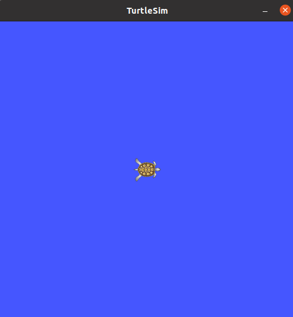

### 5.3.3. roslaunch : ROS 노드 여럿 실행

```
roslaunch [패키지 이름] [launch 파일 이름]
```

roslaunch는 지정한 패키지에서 하나 이상의 노드를 실행하거나 실행 옵션을 설정하는 명령어이다. 다음 예처럼 openni_launch 패키지를 구동하는 것만으로도 camera_nodelet_manager, depth_metric, depth_metric_rect, depth_points 등의 20개 이상의 노드와 10여 개의 파라미터 서버가 실행된다. 이렇듯 launch 파일을 이용한 실행은 여러 노드를 실행하는 데 매우 유용하며, ROS에서 자주 사용되는 실행 방법이다. 이때 사용되는 '*.launch' 파일 작성에 대해서는 7.6절 roslaunch 사용법에서 더 자세히 다루겠다.

```
$ roslaunch openni_launch openni.launch
```

참고로 이번 예제를 실행하고 같은 결과를 얻으려면 관련 패키지인 ros-noetic-openni-launch 패키지가 설치되어 있어야 한다. 만약 설치되어 있지 않다면 다음 명령어로 설치하자.

```
sudo apt-get install ros-noetic-openni-launch
```

### 5.3.4. rosclean : ROS 로그 검사 및 삭제

```
rosclean [옵션]
```

ROS 로그 파일을 검사하거나 삭제하는 명령어이다. roscore 구동과 함께 모든 노드에 대한 기록은 로그 파일로 기록되는데, 시간이 지날수록 데이터가 축적되므로 주기적으로 rosclean 명령어를 이용하여 삭제할 필요가 있다.

다음은 로그 사용량을 검사하는 예이다.

```
$ rosclean check
13M ROS node logs → ROS 노드 로그 총 사용량이 320KB라는 의미
```

roscore를 실행할 때, 다음과 같은 WARNING 메시지가 표시되면 로그 파일이 1GB를 초과했다는 것이므로, 시스템에 무리가 예상된다면 rosclean 명령어로 삭제한다.

```
WARNING: disk usage in log directory [/xxx/.ros/log] is over 1GB.
```

다음은 자신의 ROS 로그 저장소의 로그를 모두 삭제하는 예이다. 삭제할 때는 y 버튼을 눌러 삭제하자.

```
$ rosclean purge
Purging ROS node logs.
PLEASE BE CAREFUL TO VERIFY THE COMMAND BELOW!
Okay to perform:

rm -rf /home/oem/.ros/log
(y/n)?
y
```

## 5.4. ROS 정보 명령어

ROS 정보 명령어는 토픽, 서비스, 노드, 파라미터 등의 정보를 확인하는 데 사용한다. 특히 rostopic, rosservice, rosnode, rosparam은 자주 사용되며, rosbag는 ROS의 큰 특징 중의 하나인 데이터 기록, 재생 기능을 갖춘 명령어이므로 꼭 알아두고 활용한다.

| 명령어     | 세부 설명                                |
| ---------- | ---------------------------------------- |
| rostopic   | ROS 토픽 정보 확인                       |
| rosservice | ROS 서비스 정보 확인                     |
| rosnode    | ROS 노드 정보 확인                       |
| rosparam   | ROS 파라미터 정보 확인, 수정             |
| rosbag     | ROS 메시지 기록, 재생                    |
| rosmsg     | ROS 메시지 정보 확인                     |
| rossrv     | ROS 서비스 정보 확인                     |
| rosversion | ROS 패키지 및 배포 릴리즈 버전 정보 확인 |
| roswtf     | ROS 시스템 검사                          |

### 5.4.1. 노드 실행

다음에 나오는 명령어들을 사용해 ROS에서 제공하는 turtlesim을 이용하여 관련 노드, 토픽, 서비스 등을 알아볼 것이다. ROS 정보 명령어를 이용한 테스트를 하기 전에 다음처럼 사전 준비가 필요하다.

#### roscore 실행

```
roscore
```

#### turtlesim 패키지의 turtlesim_node 노드 실행

```
rosrun turtlesim turtlesim_node
```

#### turtlesim 패키지의 turtle_teleop_key 노드 실행

새로운 터미널을 열고 다음과 같은 명령어를 실행한다. 그러면 turtlesim 패키지의 turtle_teleop_key가 실행된다. 실행된 다음, 이 터미널 창 위에서 키보드의 방향키를 이용하여 거북이를 제어할 수 있다. 방향키를 누르면 거북이가 움직이는데, 이는 간단한 시뮬레이션이지만 로봇 구동에 필요한 병진속도(m/s), 회전속도(rad/s)를 메시지로 전송한 것으로 실제 로봇도 이와 같은 방법으로 원격 조종할 수 있다. 메시지에 대한 자세한 정보 및 사용법은 4.2절 메시지 통신 및 7장  ROS 기본 프로그래밍을 참고한다.

```
rosrun turtlesim turtle_teleop_key
```

### 5.4.2. rosnode : ROS 노드

우선 노드(node)에 대해서 이해하고 있어야 하므로 4.1절 용어 정리를 참고하도록 하자.

| 명령어                            | 세부 설명                                          |
| --------------------------------- | -------------------------------------------------- |
| rosnode list                      | 활성화된 노드 목록 확인                            |
| rosnode ping [노드 이름]          | 지정된 노드와 연결 테스트                          |
| rosnode info [노드 이름]          | 지정된 노드 정보 확인                              |
| rosnode machine [PC 이름 또는 IP] | 해당 PC에서 실행되고 있는 노드 목록 확인           |
| rosnode kill [노드 이름]          | 지정된 노드 실행 중단                              |
| rosnode cleanup                   | 연결 정보가 확인 안되는 유령 노드의 등록 정보 삭제 |

#### rosnode list : 실행 중인 노드 목록 확인

roscore에 연결된 모든 노드의 목록을 확인하는 명령어이다. roscore와 앞에서 사전 준비한 노드(turtlesim_node, turtle_teleop_key)만 실행하였다면, roscore와 함께 실행되는 로그 기록용 rosout과 사전 준비에서 실행한 teleop_turtle과 turtlesim 노드가 목록에 있음을 확인할 수 있다.

```
$ rosnode list
/rosout
/teleop_turtle
/turtlesim
```

> ※ cf) : 노드 실행과 실제 노드의 이름
>
> 앞 예제에서 실행된 노드는 turtlesim_node와 turtlesim_teleop_key인데 rosnode list에는 teleop_turtle와 turtlesim라고 표시된 이유는 실행 노드 이름과 실제 노드 이름이 다르기 때문이다. 예를 들어 turtle_teleop_key 노드는 소스 파일 안에 "ros::init(argc, argv, "teleop_turtle");"와 같이 설정되어 있다. 실행 노드 이름과 실제 노드 이름을 동일하게 설정하는 것을 추천한다.

#### rosnode ping [노드 이름] : 지정된 노드와 연결 테스트

다음은 turtlesim 노드가 실제로 현재 사용 중인 컴퓨터와 연결되어 있는지를 테스트한 것이다. 연결되어 있다면 다음과 같이 해당 노드로부터 XMLRPC 응답을 받게 된다.

```
$ rosnode ping /turtlesim
rosnode: node is [/turtlesim]
pinging /turtlesim with a timeout of 3.0s
xmlrpc reply from http://localhost:46813/	time=0.396490ms
xmlrpc reply from http://localhost:46813/	time=1.452208ms
xmlrpc reply from http://localhost:46813/	time=1.632214ms
xmlrpc reply from http://localhost:46813/	time=1.409769ms
```

만약에 해당 노드의 실행에 문제가 있거나 통신이 차단되었을 경우 다음과 같은 에러 메시지를 출력한다.

```
ERROR: connection refuged to [http://192.168.0.15:55996/]
```

#### rosnode info [노드 이름] : 지정된 노드 정보 확인

rosnode info 명령어를 이용하면 지정된 노드의 정보를 확인할 수 있다. 기본적으로 Publications, Subscriptions, Services 등을 확인할 수 있으며, 노드 실행 URI와 토픽 입출력에 대한 정보들도 확인할 수 있다. 

```
$ rosnode info /turtlesim
--------------------------------------------------------------------------------
Node [/turtlesim]
Publications: 
 * /rosout [rosgraph_msgs/Log]
 * /turtle1/color_sensor [turtlesim/Color]
 * /turtle1/pose [turtlesim/Pose]

Subscriptions: 
 * /turtle1/cmd_vel [geometry_msgs/Twist]

Services: 
 * /clear
 * /kill
 * /reset
 * /spawn
 * /turtle1/set_pen
 * /turtle1/teleport_absolute
 * /turtle1/teleport_relative
 * /turtlesim/get_loggers
 * /turtlesim/set_logger_level


contacting node http://localhost:46813/ ...
Pid: 112453
Connections:
 * topic: /rosout
    * to: /rosout
    * direction: outbound (37745 - 127.0.0.1:52064) [30]
    * transport: TCPROS
 * topic: /turtle1/cmd_vel
    * to: /teleop_turtle (http://localhost:43069/)
    * direction: inbound (56914 - localhost:42629) [32]
    * transport: TCPROS
```

#### rosnode machine [PC 이름 또는 IP] : 해당 PC에서 실행되고 있는 노드 목록 확인

지정된 특정 기기(PC나 단말기)에서 작동 중인 노드의 목록을 확인할 수 있다.

```
$ rosnode machine localhost(혹은 IP주소; 여기에서는 hostname을 사용하였다)
/rosout
/teleop_turtle
/turtlesim
```

#### rosnode kill [노드 이름] : 지정한 노드 실행 종료

실행 중인 노드를 종료하는 명령어이다. 노드가 실행된 터미널 창에서 Ctrl + C를 이용하여 직접 노드를 종료할 수도 있지만, 다음과 같이 해당 노드를 지정하여 종료할 수도 있다.

```
$ rosnode kill /turtlesim
killing /turtlesim
killed
```

만약 노드를 이 명령어로 종료하게 되면 다음과 같이 해당 노드가 실행 중인 터미널 창에 경고 메시지가 출력되면서 노드가 종료된다.

```
[ WARN] [1714182737.538940071]: Shutdown request received.
[ WARN] [1714182737.538964759]: Reason given for shutdown: [user request]
```

#### rosnode cleanup : 연결 정보가 확인 안되는 유령 노드의 등록 정보 삭제

연결 정보가 확인되지 않는 유령 노드의 등록 정보를 삭제한다. 예기치 못한 일로 노드가 비정상 종료되었을 때, 이 명령어로 연결 정보가 끊어진 노드를 목록에서 삭제하게 된다. 이 명령어는 드물게 사용되지만 roscore를 재실행하지 않아도 되므로 매우 유용하다.

```
rosnode cleanup
```

### 5.4.3. rostopic : ROS 토픽

우선, 토픽(topic)에 대해서 이해하고 있어야 하므로 4.1절 ROS 용어 정리를 참고하도록 하자. 

| 명령어                                            | 세부 설명                                          |
| ------------------------------------------------- | -------------------------------------------------- |
| rostopic list                                     | 활성화된 토픽 목록 표시                            |
| rostopic echo [토픽 이름]                         | 지정한 토픽의 메시지 내용 실시간 표시              |
| rostopic find [타입 이름]                         | 지정한 타입의 메시지를 사용하는 토픽 표시          |
| rostopic type [토픽 이름]                         | 지정한 토픽의 메시지 타입 표시                     |
| rostopic bw [토픽 이름]                           | 지정한 토픽의 메시지 데이터 대역폭(bandwidth) 표시 |
| rostopic hz [토픽 이름]                           | 지정한 토픽의 메시지 데이터 퍼블리시 주기 표시     |
| rostopic info [토픽 이름]                         | 지정한 토픽의 정보 표시                            |
| rostopic pub [토픽 이름] [메시지 타입] [파라미터] | 지정한 토픽 이름으로 메시지 퍼블리시               |

ROS 토픽 관련 예제를 실행하기 전에 모든 노드를 종료하자. 그리고 각각 다른 터미널 창에 다음 명령어를 실행하여 turtlesim_node와 turtle_teleop_key를 실행하자.

```
$ roscore
$ rosrun turtlesim turtlesim_node
$ rosrun turtlesim turtle_teleop_key
```

#### rostopic list : 활성화된 토픽 목록 표시

rostopic list 명령어는 현재 송수신되고 있는 모든 토픽의 목록을 확인할 수 있다.

```
$ rostopic list
/rosout
/rosout_agg
/turtle1/cmd_vel
/turtle1/color_sensor
/turtle1/pose
```

rostopic list 명령어에 '-v' 옵션을 추가하면, 퍼블리시 토픽과 서브스크라이브 토픽을 나눠서 보여주고, 각 토픽의 메시지 타입까지 함께 표시한다.

```
$ rostopic list -v

Published topics:
 * /rosout_agg [rosgraph_msgs/Log] 1 publisher
 * /rosout [rosgraph_msgs/Log] 2 publishers
 * /turtle1/pose [turtlesim/Pose] 1 publisher
 * /turtle1/color_sensor [turtlesim/Color] 1 publisher
 * /turtle1/cmd_vel [geometry_msgs/Twist] 1 publisher

Subscribed topics:
 * /rosout [rosgraph_msgs/Log] 1 subscriber
 * /turtle1/cmd_vel [geometry_msgs/Twist] 1 subscriber
```

#### rostopic echo [토픽 이름] : 지정한 토픽의 메시지 내용 실시간 표시

다음 예제로 /turtle1/pose 토픽을 구성하는 x, y, theta, linear_velocity, angular_velocity의 데이터를 실시간으로 확인할 수 있다.

```
$ rostopic echo /turtle1/pose
x: 6.197116374969482
y: 5.303775310516357
theta: -0.14881469309329987
linear_velocity: 0.0
angular_velocity: 0.0
---
x: 6.197116374969482
y: 5.303775310516357
theta: -0.14881469309329987
linear_velocity: 0.0
angular_velocity: 0.0
---
x: 6.197116374969482
y: 5.303775310516357
theta: -0.14881469309329987
linear_velocity: 0.0
angular_velocity: 0.0
---
```

#### rostopic find [타입 이름] : 지정한 타입의 메시지를 사용하는 토픽 표시

```
$ rostopic find turtlesim/Pose
/turtle1/pose
```

#### rostopic type [토픽 이름] : 지정한 토픽의 메시지 타입

```
$ rostopic type /turtle1/pose
turtlesim/Pose
```

#### rostopic bw [토픽 이름] : 지정한 토픽의 메시지 데이터 대역폭(bandwidth) 표시

다음 예제에서 /turtle1/pose 토픽에 사용되는 데이터 대역폭은 초당 평균 1.27KB임을 확인할 수 있다.

```
$ rostopic bw /turtle1/pose
subscribed to [/turtle1/pose]
average: 1.25KB/s
	mean: 0.02KB min: 0.02KB max: 0.02KB window: 62
average: 1.26KB/s
	mean: 0.02KB min: 0.02KB max: 0.02KB window: 100
average: 1.25KB/s
```

#### rostopic hz [토픽 이름] : 지정한 토픽의 메시지 데이터 퍼블리시 주기 표시

다음 예제에서 /turtle1/pose 데이터의 퍼블리시 주기를 확인해 볼 수 있다. 결과로는 약 62.5Hz(0.016sec = 16msec) 주기로 메시지가 퍼블리시되고 있음을 알 수 있다.

```
$ rostopic hz /turtle1/pose
subscribed to [/turtle1/pose]
average rate: 62.509
	min: 0.015s max: 0.017s std dev: 0.00053s window: 62
average rate: 62.515
	min: 0.015s max: 0.017s std dev: 0.00052s window: 125
average rate: 62.501
	min: 0.015s max: 0.017s std dev: 0.00053s window: 187
```

#### rostopic info [토픽 이름] : 지정한 토픽의 정보 표시

다음 예제에서 /turtle1/pose 토픽은 turtlesim/Pose 메시지 타입을 사용하고 있고, /turtlesim 노드에 퍼블리시되고 있으며, 실제로는 서브스크라이브되고 있는 토픽은 없다는 정보를 확인할 수 있다.

```
$ rostopic info /turtle1/pose
Type: turtlesim/Pose

Publishers: 
 * /turtlesim (http://localhost:38545/)

Subscribers: None
```

#### rostopic pub [토픽 이름] [메시지 타입] [파라미터] : 지정한 토픽 이름으로 메시지 퍼블리시

다음은 /turtle1/cmd_vel 토픽 이름으로 geometry_msgs/Twist 타입의 메시지를 퍼블리시하는 예제이다.

```
$ rostopic pub -1 /turtle1/cmd_vel geometry_msgs/Twist -- '[2.0, 0.0, 0.0]' '[0.0, 0.0, 1.8]'
publishing and latching message for 3.0 seconds
```

각 옵션에 대한 설명은 다음과 같다.

* -1

  메시지를 한 번만 퍼블리시한다(실제로 한 번 실행되기는 하지만 앞의 결과처럼 3초간 실행된다).

* /turtle1/cmd_vel

  지정한 토픽 이름

* geometry_msgs/Twist

  퍼블리시되는 메시지 타입 이름

* -- '[2.0, 0.0, 0.0]' '[0.0, 0.0, 1.8]'

  x축 좌표로 초당 2.0m의 속도 이동, z축을 중심으로 초당 1.8rad 회전하는 값

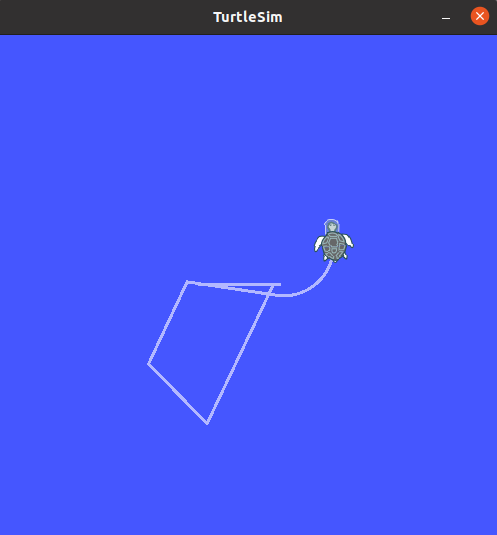

### 5.4.4. rosservice : ROS 서비스

| 명령어                                   | 세부 설명                        |
| ---------------------------------------- | -------------------------------- |
| rosservice list                          | 활성화된 서비스 정보 표시        |
| rosservice info [서비스 이름]            | 지정한 서비스의 정보 표시        |
| rosservice type [서비스 이름]            | 서비스 타입 출력                 |
| rosservice find [서비스 이름]            | 지정한 서비스 타입의 서비스 검색 |
| rosservice uri [서비스 이름]             | ROSSRPC URI 서비스 출력          |
| rosservice args [서비스 이름]            | 서비스 파라미터 출력             |
| rosservice call [서비스 이름] [파라미터] | 입력된 파라미터로 서비스 요청    |

ROS 서비스 관련 예제를 실행하기 전에 모든 노드를 종료하자. 그리고 각각 다른 터미널 창에 다음 명령어를 실행하여 turtlesim_node와 turtle_teleop_key를 실행하자.

```
$ roscore
$ rosrun turtlesim turtlesim_node
$ rosrun turtlesim turtle_teleop_key
```

#### rosservice list : 활성화된 서비스 정보 출력

활성화된 서비스에 대한 정보를 출력한다. 같은 네트워크에서 사용 중인 서비스가 모두 표시된다.

```
$ rosservice list
/clear
/kill
/reset
/rosout/get_loggers
/rosout/set_logger_level
/spawn
/teleop_turtle/get_loggers
/teleop_turtle/set_logger_level
/turtle1/set_pen
/turtle1/teleport_absolute
/turtle1/teleport_relative
/turtlesim/get_loggers
/turtlesim/set_logger_level
```

#### rosservice info [서비스 이름] : 지정한 서비스의 정보 표시

다음은 rosservice의 info 옵션을 이용하여 /turtle1/set_pen 서비스의 노드 이름, URI, 타입, 파라미터들을 확인하는 예제이다.

```
$ rosservice info /turtle1/set_pen
Node: /turtlesim
URI: rosrpc://localhost:51313
Type: turtlesim/SetPen
Args: r g b width off
```

#### rosservice type [서비스 이름] : 서비스 타입 출력

다음 예제에서 /turtle1/set_pen 서비스는 turtlesim/SetPen 타입임을 확인할 수 있다.

```
$ rosservice type /turtle1/set_pen
turtlesim/SetPen
```

#### rosservice find [서비스 타입] : 지정한 서비스 타입의 서비스 검색

다음 예제는 turtlesim/SetPen 타입의 서비스를 검색하는 명령어이다. 결과로 /turtle1/set_pen이 나왔음을 확인할 수 있다.

```
$ rosservice find turtlesim/SetPen
/turtle1/set_pen
```

#### rosservice uri [서비스 이름] : ROSRPC uri 서비스 출력

rosservice의 uri 옵션을 이용하면 다음과 같이 /turtle1/set_pen 서비스의 ROSRPC URI를 확인할 수 있다.

```
$ rosservice uri /turtle1/set_pen
rosrpc://localhost:51313
```

#### rosservice args [서비스 이름] : 서비스 파라미터 출력

이 명령어를 통해 /turtle1/set_pen 서비스에서는 r, g, b, width, off 파라미터가 사용되고 있음을 확인할 수 있다.

```
$ rosservice args /turtle1/set_pen
r g b width off
```

#### rosservice call [서비스 이름] [파라미터] : 입력된 파라미터로 서비스 요청

다음 예제는 /turtle1/set_pen 서비스를 요청하는 명령어이다. 사용된 '255 0 0 5 0'은 /turtle1/set_pen 서비스에 사용되는 파라미터(r, g, b, width, off)에 해당하는 수치이다. 빨간색을 나타내는 r은 최대치인 255, g, b는 모두 0이므로 펜의 색은 빨간색이 된다. width는 5의 굵기로 설정, off는 0(false)이므로 선이 보이도록 한다. rosservice call은 서비스를 사용함에 있어서 테스트용으로 사용되는 매우 유용한 명령어이고 자주 사용된다.

```
$ rosservice call /turtle1/set_pen 255 0 0 5 0
```

앞의 명령어로 서비스를 요청하여 turtlesim에 사용되는 펜의 특성을 바꾸었고, turtle_teleop_key에서 명령을 내려 이동한 결과 다음과 같이 흰색이었던 펜 색이 빨간색으로 표시됨을 확인할 수 있다.

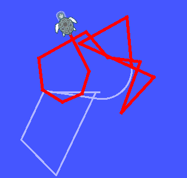

### 5.4.5. rosparam : ROS 파라미터

| 명령어                          | 세부 설명                              |
| ------------------------------- | -------------------------------------- |
| rosparam list                   | 파라미터 목록 보기                     |
| rosparam get [파라미터 이름]    | 파라미터 값 불러오기                   |
| rosparam set [파라미터 이름]    | 파라미터 값 설정                       |
| roaparam dump [파일 이름]       | 파라미터를 지정한 파일에 저장          |
| rosparam load [파일 이름]       | 지정한 파일에 저장된 파라미터 불러오기 |
| rosparam delete [파라미터 이름] | 파라미터 삭제                          |

ROS 파라미터 관련 예제를 실행하기 전에 모든 노드를 종료하자. 그리고 각각 다른 터미널 창에 다음 명령어를 실행하여 turtlesim_node와 turtle_teleop_key를 실행하자.

```
$ roscore
$ rosrun turtlesim turtlesim_node
$ rosrun turtlesim turtle_teleop_key
```

#### rosparam list : 파라미터 목록 보기

같은 네트워크에서 사용 중인 파라미터 목록이 표시된다.

```
$ rosparam list
/camera/camera_nodelet_manager/num_worker_threads
/camera/depth_metric/queue_size
/camera/depth_metric_rect/queue_size
/camera/depth_points/queue_size
/camera/depth_rectify_depth/interpolation
/camera/depth_rectify_depth/queue_size
/camera/depth_registered_hw_metric_rect/queue_size
/camera/depth_registered_metric/queue_size
/camera/depth_registered_rectify_depth/interpolation
/camera/depth_registered_rectify_depth/queue_size
/camera/depth_registered_sw_metric_rect/queue_size
/camera/disparity_depth/max_range
/camera/disparity_depth/min_range
/camera/disparity_depth/queue_size
/camera/disparity_registered_hw/max_range
/camera/disparity_registered_hw/min_range
/camera/disparity_registered_hw/queue_size
/camera/disparity_registered_sw/max_range
/camera/disparity_registered_sw/min_range
/camera/disparity_registered_sw/queue_size
/camera/driver/depth_camera_info_url
/camera/driver/depth_frame_id
/camera/driver/depth_registration
/camera/driver/device_id
/camera/driver/rgb_camera_info_url
/camera/driver/rgb_frame_id
/camera/ir_rectify_ir/queue_size
/camera/points_xyzrgb_hw_registered/queue_size
/camera/points_xyzrgb_sw_registered/queue_size
/camera/register_depth_rgb/queue_size
/camera/rgb/image_rect_color/compressed/format
/camera/rgb/image_rect_color/compressed/jpeg_optimize
/camera/rgb/image_rect_color/compressed/jpeg_progressive
/camera/rgb/image_rect_color/compressed/jpeg_quality
/camera/rgb/image_rect_color/compressed/jpeg_restart_interval
/camera/rgb/image_rect_color/compressed/png_level
/camera/rgb/image_rect_color/compressedDepth/depth_max
/camera/rgb/image_rect_color/compressedDepth/depth_quantization
/camera/rgb/image_rect_color/compressedDepth/format
/camera/rgb/image_rect_color/compressedDepth/png_level
/camera/rgb/image_rect_color/theora/keyframe_frequency
/camera/rgb/image_rect_color/theora/optimize_for
/camera/rgb/image_rect_color/theora/quality
/camera/rgb/image_rect_color/theora/target_bitrate
/camera/rgb/image_rect_mono/compressed/format
/camera/rgb/image_rect_mono/compressed/jpeg_optimize
/camera/rgb/image_rect_mono/compressed/jpeg_progressive
/camera/rgb/image_rect_mono/compressed/jpeg_quality
/camera/rgb/image_rect_mono/compressed/jpeg_restart_interval
/camera/rgb/image_rect_mono/compressed/png_level
/camera/rgb/image_rect_mono/compressedDepth/depth_max
/camera/rgb/image_rect_mono/compressedDepth/depth_quantization
/camera/rgb/image_rect_mono/compressedDepth/format
/camera/rgb/image_rect_mono/compressedDepth/png_level
/camera/rgb/image_rect_mono/theora/keyframe_frequency
/camera/rgb/image_rect_mono/theora/optimize_for
/camera/rgb/image_rect_mono/theora/quality
/camera/rgb/image_rect_mono/theora/target_bitrate
/camera/rgb_debayer/queue_size
/camera/rgb_rectify_color/interpolation
/camera/rgb_rectify_color/queue_size
/camera/rgb_rectify_mono/interpolation
/camera/rgb_rectify_mono/queue_size
/rosdistro
/roslaunch/uris/host_localhost__41531
/roslaunch/uris/host_localhost__45633
/rosversion
/run_id
/turtlesim/background_b
/turtlesim/background_g
/turtlesim/background_r
```

#### rosparam get [파라미터 이름] : 파라미터 값 불러오기

```
$ rosparam get turtlesim/background_b
255
```

특정 파라미터가 아닌 모든 파라미터 값을 확인하고 싶을 때는 옵션을 '/'를 붙인다.

```
$ rosparam get /
camera:
  camera_nodelet_manager:
    num_worker_threads: 4
  depth_metric:
    queue_size: 5
  depth_metric_rect:
    queue_size: 5
  depth_points:
    queue_size: 5
  depth_rectify_depth:
    interpolation: 0
    queue_size: 5
  depth_registered_hw_metric_rect:
    queue_size: 5
  depth_registered_metric:
    queue_size: 5
  depth_registered_rectify_depth:
    interpolation: 0
    queue_size: 5
  depth_registered_sw_metric_rect:
    queue_size: 5
  disparity_depth:
    max_range: 4.0
    min_range: 0.5
    queue_size: 5
  disparity_registered_hw:
    max_range: 4.0
    min_range: 0.5
    queue_size: 5
  disparity_registered_sw:
    max_range: 4.0
    min_range: 0.5
    queue_size: 5
  driver:
    depth_camera_info_url: ''
    depth_frame_id: camera_depth_optical_frame
    depth_registration: false
    device_id: '#1'
    rgb_camera_info_url: ''
    rgb_frame_id: camera_rgb_optical_frame
  ir_rectify_ir:
    queue_size: 5
  points_xyzrgb_hw_registered:
    queue_size: 5
  points_xyzrgb_sw_registered:
    queue_size: 5
  register_depth_rgb:
    queue_size: 5
  rgb:
    image_rect_color:
      compressed:
        format: jpeg
        jpeg_optimize: false
        jpeg_progressive: false
        jpeg_quality: 80
        jpeg_restart_interval: 0
        png_level: 9
      compressedDepth:
        depth_max: 10.0
        depth_quantization: 100.0
        format: png
        png_level: 9
      theora:
        keyframe_frequency: 64
        optimize_for: 1
        quality: 31
        target_bitrate: 800000
    image_rect_mono:
      compressed:
        format: jpeg
        jpeg_optimize: false
        jpeg_progressive: false
        jpeg_quality: 80
        jpeg_restart_interval: 0
        png_level: 9
      compressedDepth:
        depth_max: 10.0
        depth_quantization: 100.0
        format: png
        png_level: 9
      theora:
        keyframe_frequency: 64
        optimize_for: 1
        quality: 31
        target_bitrate: 800000
  rgb_debayer:
    queue_size: 5
  rgb_rectify_color:
    interpolation: 1
    queue_size: 5
  rgb_rectify_mono:
    interpolation: 1
    queue_size: 5
rosdistro: 'noetic

  '
roslaunch:
  uris:
    host_localhost__41531: http://localhost:41531/
    host_localhost__45633: http://localhost:45633/
rosversion: '1.16.0

  '
run_id: 37d47874-0412-11ef-afbb-e9e0ce3090e7
turtlesim:
  background_b: 255
  background_g: 86
  background_r: 69
```

#### rosparam dump [파일 이름] : 파라미터를 지정한 파일에 저장

다음 예제는 현재의 파라미터 값을 parameter.yaml 파일에 저장하는 명령어이다. 매번 사용되는 파라미터 값을 저장하여 다음 실행에 사용할 때 쓰인다.

```
rosparam dump ~/parameters.yaml
vi parameters.yaml
```

```
amera:
  camera_nodelet_manager:
    num_worker_threads: 4
  depth_metric:
    queue_size: 5
    
    ...
    
run_id: 37d47874-0412-11ef-afbb-e9e0ce3090e7
turtlesim:
  background_b: 255
  background_g: 86
  background_r: 69
```

#### rosparam set [파라미터 이름] : 파라미터 값 설정

turtlesim 노드의 배경색 관련 파라미터인 /turtlesim/background_b를 0으로 설정하였다.

```
$ rosparam set /turtlesim/background_b 0
$ rosservice call clear
```


turtlesim 노드는 파라미터를 매번 읽는 것이 아니므로 파라미터를 수정한 후에, 'rosservice call clear' 명령어로 갱신해 줘야 한다.

#### rosparam load [파일 이름] : 파라미터를 지정한 파일에 저장

rosparam dump와 반대로 parameters.yaml 파일을 불러와서 현재의 파라미터 값으로 사용한다. 

```
$ rosparam load ~/parameters.yaml
$ rosservice call clear
```

parameters.yaml에 저장된 파라미터 값에 따라 녹색으로 바뀌었던 배경이 다시 파란색으로 바뀐다.

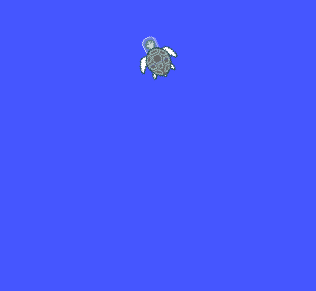

#### rosparam delete [파라미터 이름] : 파라미터 삭제

```
$ rosparam delete /turtlesim/background_b
```

### 5.4.6. rosmsg : ROS 메시지 정보

| 명령어                       | 세부 설명                                   |
| ---------------------------- | ------------------------------------------- |
| rosmsg list                  | 모든 메시지 목록 표시                       |
| rosmsg show [메시지 이름]    | 지정한 메시지 정보 표시                     |
| rosmsg md5 [메시지 이름]     | md5sum을 표시                               |
| rosmsg package [패키지 이름] | 지정한 패키지에서 사용되는 메시지 목록 표시 |
| rosmsg packages              | 메시지를 사용하는 모든 패키지 목록 표시     |

#### rosmsg list : 모든 메시지 목록 표시

```
$ rosmsg list
actionlib/TestAction
actionlib/TestActionFeedback
actionlib/TestActionGoal
actionlib/TestActionResult
actionlib/TestFeedback
actionlib/TestGoal
actionlib/TestRequestAction
actionlib/TestRequestActionFeedback
actionlib/TestRequestActionGoal
actionlib/TestRequestActionResult
actionlib/TestRequestFeedback
actionlib/TestRequestGoal
actionlib/TestRequestResult

...
```

#### rosmsg show [메시지 이름] : 지정한 메시지 정보 표시

```
$ rosmsg show turtlesim/Pose
float32 x
float32 y
float32 theta
float32 linear_velocity
float32 angular_velocity
```

#### rosmsg md5 [메시지 이름] : md5sum을 표시

간혹 메시지 통신 중에 MD5 문제가 발생한다면 md5sum을 확인할 필요가 있다.

```
$ rosmsg md5 turtlesim/Pose
863b248d5016ca62ea2e895ae5265cf9
```

#### rosmsg package [패키지 이름] : 지정한 패키지에서 사용되는 메시지 목록 표시

```
$ rosmsg package turtlesim
turtlesim/Color
turtlesim/Pose
```

#### rosmsg packages : 메시지를 사용하는 모든 패키지 목록 표시

```
$ rosmsg packages
actionlib
actionlib_msgs
actionlib_tutorials

...

```

### 5.4.7. rossrv : ROS 서비스 정보

| 명령어                       | 세부 설명                                   |
| ---------------------------- | ------------------------------------------- |
| rossrv list                  | 모든 서비스 목록 표시                       |
| rossrv show [서비스 이름]    | 지정한 서비스 정보 표시                     |
| rossrv md5 [서비스 이름]     | md5sum을 표시                               |
| rossrv package [패키지 이름] | 지정한 패키지에서 사용되는 서비스 목록 표시 |
| rossrv packages              | 서비스를 사용하는 모든 패키지 목록 표시     |

#### rossrv list : 모든 서비스 목록 표시

```
$ rossrv list
basics/WordCount
control_msgs/QueryCalibrationState
control_msgs/QueryTrajectoryState
control_toolbox/SetPidGains

...

```

#### rossrv show [서비스 이름] : 지정한 서비스 정보 표시

다음 예제는 turtlesim/SetPen 서비스 정보를 출력한다. uint8 변수로 r, g, b, width, off 5개의 정보가 포함된 서비스임을 확인할 수 있다. 참고로 "---"은 서비스 파일에서 요청과 응답을 구분짓는 선으로 사용되는데 turtlesim/SetPen의 경우 요청만 있고 응답에 해당되는 내용은 없다는 것을 알 수 있다. 

```
$ rossrv show turtlesim/SetPen
uint8 r
uint8 g
uint8 b
uint8 width
uint8 off
---
```

#### rossrv md5 [서비스 이름] : md5sum을 표시

서비스 요청 / 응답 중에 MD5 문제가 발생할 경우 md5sum을 확인할 때 쓰인다.

```
$ rossrv md5 turtlesim/SetPen
9f452acce566bf0c0954594f69a8e41b
```

#### rossrv package [패키지 이름] : 지정한 패키지에서 사용되는 서비스 목록

```
$ rossrv package turtlesim
turtlesim/Kill
turtlesim/SetPen
turtlesim/Spawn
turtlesim/TeleportAbsolute
turtlesim/TeleportRelative
```

#### rossrv packages : 서비스를 사용하는 모든 패키지 목록 표시

```
$ rossrv packages
basics
control_msgs
control_toolbox
controller_manager_msgs
diagnostic_msgs
dynamic_reconfigure
gazebo_msgs
laser_assembler
map_msgs
nav_msgs
nodelet
pcl_msgs
polled_camera
roscpp
roscpp_tutorials
rospy_tutorials
rviz
sensor_msgs
std_srvs
tf
tf2_msgs
topic_tools
turtlesim
```

#### 5.4.8. rosbag : ROS 로그 정보

| 명령어                                        | 세부 설명                                            |
| --------------------------------------------- | ---------------------------------------------------- |
| rosbag record [옵션] [토픽 이름]              | 지정한 토픽의 메시지를 bsg 파일에 기록               |
| rosbag info [파일 이름]                       | bag 파일의 정보 확인                                 |
| rosbag play [파일 이름]                       | 지정한 bag 파일 재생                                 |
| rosbag compress [파일 이름]                   | 지정한 bag 파일 압축                                 |
| rosbag decompress [파일 이름]                 | 지정한 bag 파일 압축 해제                            |
| rosbag filter [입력 파일]  [출력 파일] [옵션] | 지정된 내용을 제거한 새로운 bag 파일 생성            |
| rosbag reindex bag [파일 이름]                | 인덱스 재색인                                        |
| rosbag check bag [파일 이름]                  | 지정한 bag 파일이 현재 시스템에서 재생 가능한지 확인 |
| rosbag fix [입력 파일] [출력 파일] [옵션]     | 버전이 다른 재생 불가능 bag 파일을 재생가능하게 수정 |

#### rosbag record [옵션] [토픽 이름] : 지정한 토픽의 메시지 기록

우선, 현재 ROS 네트워크에서 사용 중인 토픽 목록 확인

```
$ rostopic list
/rosout
/rosout_agg
/turtle1/cmd_vel
/turtle1/color_sensor
/turtle1/pose
```

사용 중인 토픽 중에서 기록할 토픽을 옵션으로 입력하여 bag 기록 시작. 기록을 시작한 다음 turtle_teleop_key 노드가 실행 중인 터미널 창에서 방향키로 거북이를 이동시키면, 옵션으로 지정한 /turtle1/cmd_vel 토픽이 기록된다. 그리고 Ctrl + C를 눌러 기록을 종료하면 일시를 이름으로 한 bag 파일이 생성된다.

```
$ rosbag record /turtle1/cmd_vel
[ INFO] [1714261700.017845836]: Subscribing to /turtle1/cmd_vel
[ INFO] [1714261700.020838855]: Recording to '2024-04-28-08-48-20.bag'.
```

특정 토픽이 아닌 모든 토픽을 동시에 기록하고 싶다면 '-a' 옵션을 붙인다.

```
$ rosbag record -a
[ INFO] [1714261753.710502074]: Recording to '2024-04-28-08-49-13.bag'.
[ INFO] [1714261753.711361137]: Subscribing to /rosout_agg
[ INFO] [1714261753.712991824]: Subscribing to /rosout
[ INFO] [1714261753.714292750]: Subscribing to /turtle1/cmd_vel
[ INFO] [1714261753.715647801]: Subscribing to /turtle1/pose
[ INFO] [1714261753.716746952]: Subscribing to /turtle1/color_sensor
```

#### rosbag info [bag 파일 이름] : bag 파일의 정보 확인

```
$ rosbag info 2024-04-28-08-52-26.bag 
path:        2024-04-28-08-52-26.bag
version:     2.0
duration:    6.2s
start:       Apr 28 2024 08:52:33.86 (1714261953.86)
end:         Apr 28 2024 08:52:40.09 (1714261960.09)
size:        6.8 KB
messages:    9
compression: none [1/1 chunks]
types:       geometry_msgs/Twist [9f195f881246fdfa2798d1d3eebca84a]
topics:      /turtle1/cmd_vel   9 msgs    : geometry_msgs/Twist
```

#### rosbag play [bag 파일 이름] : 지정한 bag 파일 재생

```$ rosbag play 2024-04-28-08-52-26.bag 
[ INFO] [1714262119.146105717]: Opening 2024-04-28-08-52-26.bag

Waiting 0.2 seconds after advertising topics... done.

Hit space to toggle paused, or 's' to step.
 [RUNNING]  Bag Time: 1714261953.862113   Duration: 0.0000 [RUNNING]  Bag Time: 1714261953.862339   Duration: 0.0002 [RUNNING]  Bag Time: 1714261953.962859   Duration: 0.1007
```

다음 그림처럼 원본과 재생할 때의 데이터가 같음을 확인할 수 있다.

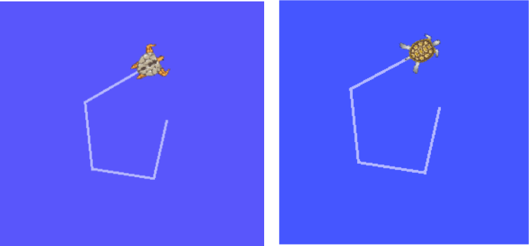

#### rosbag compress [bag 파일 이름] : 지정한 bag 파일 압축

```
$ rosbag compress 2024-04-28-08-52-26.bag 
 ...04-28-08-52-26.bag 100%              1.6 KB 00:00
```

#### rosbag decompress [bag 파일 이름] : 지정한 bag 파일 압축 해제

```
$ rosbag decompress 2024-04-28-08-52-26.bag
 ...-08-52-26.orig.bag 100%              1.6 KB 00:00  
```

## 5.5. ROS catkin 명령어

ROS catkin 명령어는 catkin 빌드 시스템을 사용하여 패키지를 빌드할 때 사용된다.

| 명령어                    | 세부 설명                                                    |
| ------------------------- | ------------------------------------------------------------ |
| catkin_create_pkg         | 패키지 자동 생성                                             |
| catkin_make               | 캐킨 빌드 시스템에 기반을 둔 빌드                            |
| catkin_eclipse            | 캐킨 빌드 시스템으로 생성한 패키지를 이클립스에서 사용할 수 있게 변경 |
| catkin_prepare_release    | 릴리즈할 때 사용되는 로그 정리 및 버전 태깅                  |
| catkin_generate_changelog | 릴리즈할 때 CHANGELOG.rst 파일 생성 또는 업데이트            |
| catkin_init_workspace     | 캐킨 빌드 시스템의 작업 폴더 초기화                          |
| catkin_find               | 캐킨 검색                                                    |

#### catkin_create_pkg : 패키지를 자동으로 생성

```
catkin_create_pkg [패키지 이름] [의존성 패키지1] [의존성 패키지2] ...
```

```
catkin_create_pkg my_package roscpp std_msgs
```

#### catkin_make : 캐킨 빌드 시스템에 기반을 둔 빌드

```
catkin_make [옵션]
```

catkin_make는 사용자가 만든 패키지 또는 다운로드한 패키지를 빌드하는 명령어이다. 다음의 예제는 ~/catkin_ws/src 폴더에 있는 모든 패키지를 빌드하는 예제이다.

```
catkin_make
```

모든 패키지가 아닌 일부 패키지만 빌드하려면 다음처럼 '--pkg [패키지 이름]' 옵션을 지정하여 실행한다.

```
catkin_make --pkg my_package
```

#### catkin_eclipse : 캐킨 빌드 시스템으로 생성한 패키지를 이클립스에서 사용할 수 있게 변경

이 명령을 실행하면 ~/catkin_ws/build/.cproject, ~/catkin_ws/build/.project 등 이클립스용 프로젝트 파일이 생성된다. 이클립스 메뉴 중 [Makefile Project with Existing Code]를 선택하고 ~/catkin_ws/build/를 선택하면 ~/catkin_ws/src에 있는 모든 패키지를 이클립스에서 관리할 수 있다.

```
$ cd ~/catkin_ws
$ catkin_eclipse
```

#### catkin_generate _changelog : CHANGELOG.rst 파일 생성

catkin_generate_chanagelog는 패키지의 버전을 업데이트할 때 변경 사항을 기술하는 CHANGELOG.rst 파일을 만드는 명령이다.

#### catkin_prepare_release : 릴리즈를 준비할 때 사용되는 변경 이력과 버전 태그 관리

catkin_generate_changelog 명령으로 생성된 CHANGELOG.rst를 업데이트할 때 사용하는 명령이다. catkin_generate_changelog와 catkin_prepare_release 명령은 작성한 패키지를 공식 ROS 리포지토리에 등록할 때나, 등록된 패키지의 버전을 업데이트할 때 사용하는 명령어이다.

#### catkin_init_workspace : 캐킨 빌드 시스템의 작업 폴더 초기화

사용자 작업 폴더(~/catkin_ws/src)의 초기화 명령어이다.

```
$ cd ~/catkin_ws/src
$ catkin_init_workspace
```

#### catkin_find : 캐킨 검색, 작업 공간을 찾아서 표시

```
catkin_find [패키지 이름]
```

사용하고 있는 모든 작업 폴더를 알아낼 수 있다. 

```
$ catkin_find
/home/oem/catkin_ws/devel/include
/home/oem/catkin_ws/devel/lib
/home/oem/catkin_ws/devel/share
/opt/ros/noetic/bin
/opt/ros/noetic/etc
/opt/ros/noetic/include
/opt/ros/noetic/lib
/opt/ros/noetic/share
```

또한 다음과 같이 옵션에서 지정한 패키지에 관련된 작업 폴더가 나타난다.

```
$ catkin_find turtlesim
/opt/ros/noetic/include/turtlesim
/opt/ros/noetic/lib/turtlesim
/opt/ros/noetic/share/turtlesim
```

## 5.6. ROS 패키지 명령어

| 명령어        | 세부 설명                      |
| ------------- | ------------------------------ |
| rospack       | ROS 패키지와 관련된 정보 보기  |
| rosinstall    | ROS 추가 패키지 설치           |
| rosdep        | 해당 패키지의 의존성 파일 설치 |
| roscreate_pkg | ROS 패키지 자동 생성           |
| rosmake       | ROS 패키지를 빌드              |

#### rospack : 지정한 ROS 패키지의 관련 정보 표시

rospack은 지정한 ROS 패키지의 관련한 저장 위치, 의존 관계, 전체 패키지 목록 등의 정보를 표시하는 명령어로, find, list, depends-on, depends, profile 등의 옵션을 사용할 수 있다. 다음 예제와 같이 rospack find 명령어 다음에 패키지 이름을 지정하면 해당 패키지의 저장 위치가 표시된다.

```
$ rospack find turtlesim
/opt/ros/noetic/share/turtlesim
```

rospack list 명령어는 PC에 있는 모든 패키지를 표시하는 명령어이다.

```
$ rospack list
actionlib /opt/ros/noetic/share/actionlib
actionlib_msgs /opt/ros/noetic/share/actionlib_msgs
actionlib_tutorials /opt/ros/noetic/share/actionlib_tutorials

...

```

```
$ rospack list | grep turtle
turtle_actionlib /opt/ros/noetic/share/turtle_actionlib
turtle_tf /opt/ros/noetic/share/turtle_tf
turtle_tf2 /opt/ros/noetic/share/turtle_tf2
turtlesim /opt/ros/noetic/share/turtlesim
```

rospack depends-on 명령어 뒤에 패키지 이름을 지정하면 패키지를 지정한 패키지를 이용하는 패키지 목록만 표시된다.

```
$ rospack depends-on turtlesim
turtle_tf
turtle_tf2
turtle_actionlib
```

rospack depends 명령어 뒤에 패키지 이름을 지정하면 지정한 패키지의 실행에 필요한 의존성 패키지의 목록이 표시된다.

```
$ rospack depends turtlesim
cpp_common
rostime
roscpp_traits
roscpp_serialization
catkin
genmsg
genpy
message_runtime
std_msgs
geometry_msgs
gencpp
geneus
gennodejs
genlisp
message_generation
rosbuild
rosconsole
rosgraph_msgs
xmlrpcpp
roscpp
ros_environment
rospack
roslib
std_srvs
```

rospack profile 명령어는 패키지가 저장되어 있는 '/opt/ros/noetic/share' 또는 '~/catkin_ws/src' 등의 작업 폴더 및 패키지의 정보를 확인하여 패키지 인덱스를 재구축하는 명령어이다. 새롭게 추가한 패키지가 'roscd' 등을 사용하였을 때, 목록에 반영되지 않았을 경우 사용하면 된다.

```
$ rospack profile
Full tree crawl took 0.037708 seconds.
Directories marked with (*) contain no manifest.  You may
want to delete these directories.
To get just of list of directories without manifests,
re-run the profile with --zombie-only
-------------------------------------------------------------
0.034363   /opt/ros/noetic/share
0.000952   /home/oem/catkin_ws/src
0.000080 * /opt/ros/noetic/share/sophus
0.000019 * /opt/ros/noetic/share/sophus/cmake
```

#### rosinstall : ROs 추가 패키지 설치

rosinstall은 SVN, Mercurial, Git, Bazaar 등의 소스 코드 매니지먼트(SCM)에서 관리하고 있는 ROS 패키지를 자동으로 설치 또는 업데이트하는 명령어이다. 한 번 실행하게 되면 그 후에 피키지의 업데이트가 있을 때 자동으로 필요한 패키지가 설치 또는 업데이트된다.

#### rosdep : ROS 해당 패키지의 의존성 설치

```
rosdep [옵션]
```

rosdep은 지정한 패키지의 의존 관계 파일을 설치하는 명령어이다. 옵션으로는 check, install, init, update 등이 있다. 

```
$ rosdep check turtlesim
All system dependencies have been satisfied
$ rosdep install turtlesim
#All required rosdeps installed successfully
```

# 6장. ROS 도구

## 6.1. 3차원 시각화 도구(RViz)

[RViz](http://wiki.ros.org/rviz)는 ROS의 3차원 시각화 도구이다. 주요 목적은 데이터 시각화이다. 예를 들어 레이저 레인지 파인더(LRF, Laser Range Finder)의 센서로부터의 장애물과의 거리, RealSense 및 Kinect나 Xtion와 같은 3차원 거리 센서의 포인트 클라우드 데이터(PCD, Point Cloud Data), 카메라로부터 취득한 이미지값 등이다.

또한 사용자가 지정한 폴리곤(polygon)을 이용하여 각종 표시를 지원하고 있고, [인터펙티브 마커(Interactive Marker)](http://wiki.ros.org/rviz/Tutorials/Interactive%20Markers%3A%20Getting%20Started)를 이용하면 사용자의 노드로부터 명령이나 데이터를 수신하여 상호작용하는 움직임을 나타낼 수 있다. 더불어, ROS에서는 로봇을 [URDF(Unified Robot Description Format)](http://wiki.ros.org/urdf) 포맷으로 기술하는데 이를 3차원 모델로 표현하고, 각각의 모델은 자유도에 따라 이동하거나 구동할 수 있어서 시뮬레이션이나 제어에 사용할 수 있다. 예를 들어 모바일 로봇 모델을 표시할 수 있고 동시에 LDS(Laser Distance Sensor)로부터 거릿값을 받아 내비게이션에 활용할 수 있다. 또한 로봇에 장착된 카메라의 영상까지도 표시할 수 있다. 그 이외에도 다양한 센서로부터 데이터를 얻어 3차원으로 시각화할 수 있다.

### 6.1.1. RViz 설치 및 실행

```
$ sudo apt-get install ros-noetic-rviz
```

```
$ rviz
```


1. 3D 뷰 

   각종 데이터를 3차원으로 볼 수 있는 메인 화면이다. 3D 뷰의 배경색, 고정 프레임, 그리드 등은 왼쪽 디스플레이의 Global Options 및 Grid 항목에서 세부적으로 설정할 수 있다.

2. 디스플레이

   왼쪽에 있는 디스플레이 화면은 각종 토픽으로부터 사용자가 원하는 데이터의 뷰를 선택하는 화면이다. [디스플레이](http://wiki.ros.org/rviz/Display/Types)는 화면 아래에 [Add]를 클릭하면 선택 화면이 나온다. 현재 약 30여 종류의 디스플레이를 선택할 수 있다.

3. 메뉴

   현재의 디스플레이 상태를 저장하거나 읽어오는 명령, 각종 패널을 선택할 수 있다.

4. 도구

   맨 위에 있는 버튼들로서 인터렉트, 카메라 이동, 선택, 카메라 초점 변경, 거리 측정, 2차원 위치 측정, 2차원 내비게이션 목표점, 퍼블리시 포인트 등 다양한 기능의 도구를 버튼으로 선택할 수 있다.

5. 뷰

   3D 뷰의 시점을 설정한다.

   * Orbit

     지정 시점을 포커스라하며 이를 중심으로 회전한다. 이는 디폴트값으로 가장 흔히 사용되는 기본 뷰이다.

   * FPS(first-person)

     1인칭 게임 시점으로 보여준다.

   * ThirdPersonFollow

     3인칭 시점에서 특정 대상을 쫓아가는 뷰를 보여준다.

   * ToolDownOrtho

     Z축이 기준이며 다른 뷰들과는 달리 원근법이 아닌 정사법으로 보여준다.

   * XYOrbit

     디폴트 값인 Orbit과 비슷하지만 포커스는 Z축이 0인 XY 평면에 고정되어 있다.

6. 시간

   현재 시간과 ROS Time, 그리고 이들의 각각의 경과 시간을 보여준다. 이는 주로 시뮬레이션에서 사용되며 재시작을 하려면 맨 아래 Reset 버튼을 클릭하면 된다.

### 6.1.3. RViz 디스플레이

[디스플레이](http://wiki.ros.org/rviz/DisplayTypes) 메뉴는 3D 뷰 화면에 표시하고 싶은 메시지를 선택하는 화면이다.


| 아이콘                                                       | 설명                                                         |
| ------------------------------------------------------------ | ------------------------------------------------------------ |
|  | x, y, z 축                                                   |
|  | 카메라 영상 오버레이                                         |
|  | 거리 영상(point cloud)에 카메라 영상을 입힘                  |
|  | 회전 관절의 힘                                               |
|  | 유체 압력                                                    |
|  | 그리드                                                       |
|  | 그리드 셀(지도에 이용). 주로 내비게이션 costmap의 장애물 표시에 사용. |
|  | 디스플레이들을 그룹으로 묶음                                 |
|  | 조도                                                         |
|  | 이미지 영상. Camera와는 달리 오버레이를 하지 않는다.         |
|  | 인터렉티브 마커 표시. 마우스로 위치(x, y, z) 및 자세(roll, pitch, yaw)를 바꿀 수 있다. |
|  | 레이저 스캔값 표시                                           |
|  | 내비게이션에서 사용하는 점유지도(occupancy map)를 ground plane 위에 표시 |
|  | 마커 표시                                                    |
|  | 마커 디스플레이를 여러 개 표시                               |
|  | 시간 경과에 따른 오도메트리(odometry) 정보를 화살표 형태로 표시. |
|  | 비게이션에서 사용되는 로봇의 경로 표시                       |
|  | 포인트 클라우드 표시. 센서 데이터 표시에 사용. PointCloud와 PointCloud2가 따로 존재 |
|  | PointCloud2가 최신 PCL(Point Cloud Library)에서 사용하고 있는 포맷에 맞추어 있으므로 일반적으로 PointCloud2를 사용하면 된다. |
|  | 둥근 포인트를 표시한다.                                      |
|  | 라인 형태의 폴리곤 외곽선을 표시한다. 주로 로봇의 외형 등을 간단히 2차원 상에 나타내기 위하여 사용된다. |
|  | 3차원상의 자세(pose, 위치 + 방향)를 표시. 위치(x, y, z)와 방향(roll, pitch, yaw)을 나타낸다. 로봇의 위치와 방향, 자세, 목표점. |
|  | 자세(pose)를 복수 개 표시                                    |
|  | 거리 센서의 측정 범위 시각화                                 |
|  | 상대 습도 표시                                               |
|  | 로봇 모델 표시                                               |
|  | 좌표 변환 TF 표시.                                           |
|  | 온도 표시                                                    |
|  | 힘과 토그로 비틀림 동작인 렌치를 표시                        |

## 6.2. ROS GUI 개발 도구(rqt)

ROS에서는 RViz 이외에도 다양한 GUI 도구를 제공한다. 예를 들어 각 노드의 계층 구조를 그래프로 나타내어 현재 노드와 토픽의 상태를 확인 가능한 graph, 메시지를 2차원의 플롯으로 도식화하는 plot 등이 있다. ROS는 이러한 GUI 개발 도구가 [rqt](http://wiki.ros.org/rqt)라는 이름으로 30여 가지의 도구들이 통폐합되어 종합 GUI 도구로써 제공된다. RViz 또한 rqt 플러그인으로 편입되었다.

### 6.2.1. rqt 실행

```
rqt
```

rqt의 각 메뉴는 다음과 같다.

* 파일(file)

  단순히 rqt를 종료하는 서브 메뉴만 있다.

* 플러그인(Plugin)

  30여 가지 플러그인이 있다.

* 동작(Running)

  현재 동작 중인 플러그인이 표시되어 필요치 않을 때 동작을 중단할 수 있다.

* 시각(Perspectives)

  현재 동작 중인 플러그인을 세트를 저장하였다가 다음에 같은 플러그인들을 실행할 때 사용한다.

### 6.2.2. rqt 플러그인

rqt 상단 메뉴에서 [플러그인(plugin)](http://wiki.ros.org/rqt/Plugins)을 선택하면 30여 가지의 플러그인을 확인할 수 있다. 비공식 플러그인도 추가 가능하며, 필요하다면 사용자가 직접 개발한 rqt 플러그인도 추가할 수 있다.

#### 액션(Action)

* Action Type Browser

  액션 타입의 데이터 구조를 확인하는 플로그인이다.

#### 구성(Configuration)

* Dynamic Reconfigure

  노드의 파라미터 값 변경을 위한 플러그인이다.

* Launch

  roslaunch의 GUI 플러그인, roslaunch의 이름이나 구성이 생각나지 않을 때 유용하다.

#### 내성(Introspection)

* Node Graph

  구동 중인 노드들의 관계도나 메시지의 흐름을 확인할 수 있는 그래프 뷰 형식의 플러그인이다.

* Package Graph

  패키지의 의존 관계를 표시하는 그래프 뷰 형식의 플러그인이다.

* Process Monitor

  현재 실행 중인 노드들의 PID(프로세서 ID), CPU 사용률, 메모리 사용률, 스레드 수를 확인할 수 있다.

#### 로깅(Logging)

* Bag ROS

  데이터 로깅 관련 플러그인이다.

* Console

  노드들에서 발생하는 경고, 에러 등의 메시지들을 한 화면에서 확인할 수 있는 플러그인이다.

* Logger Level

  노드들에서 로그 발생을 담당하는 로거를 선택하여 로거 레벨이라 불리우는 Debug, Info, Warn, Error, Fatal 로그 정보를 설정하는 도구이다. 디버깅할 때 Debug로 선택하여 사용하면 매우 편리하다.

#### 다양한 도구(Miscellaneous Tools)

* Python Console

  파이썬 콘솔 화면 플러그인이다.

* Shell

  쉘을 구동하는 플러그인이다.

* Web

  웹 브라우저를 구동하는 플러그인이다.

#### 로봇(Robot)

사용하는 로봇에 따라 계기판(Dashboard) 등의 플러그인을 이곳에 추가하면 된다.

#### 로봇 도구(Robot Tools)

* Controller Manager

  로봇 제어기의 상태, 타입, 하드웨어 인터페이스 정보 등을 확인할 수 있는 플러그인이다.

* Diagnostic Viewer

  로봇 기기 및 에러 확인 플러그인이다.

* Moveit! Monitor

  모션 플래닝에 사용되는 Moveit! 데이터를 확인하는 플러그인이다.

* Robot Steering

  로봇 수동 제어 GUI 도구, 원격 조정에서 이 GUI 도구를 이용하여 로봇을 조종하기에 유용하다.

* Runtime Monitor

  실시간으로 노드들에서 발생하는 경고나 에러를 확인할 수 있는 플러그인이다.

#### 서비스(Service)

* Service Caller

  구동 중인 서비스 서버에 접속하여 서비스를 요청하는 GUI 플러그인이다. 서비스 테스트에 유용하다.

* Service Type Browser

  서비스 타입의 데이터 구조를 확인하는 플러그인이다.

#### 토픽(Topics)

* Easy Message Publisher

  GUI 환경에서 토픽을 발행할 수 있는 플러그인이다.

* Topic Publisher

  토픽을 발행할 수 있는 GUI 플러그인이다. 토픽 테스트에 유용하다.

* Topic Type Browser

  토픽 타입의 데이터 구조를 확인하는 플러그인이다. 토픽 타입 확인에 유용하다.

* Topic Monitor

  현재 사용 중인 토픽을 나열, 그중에서 사용자가 선택한 토픽의 정보를 확인하는 플러그인이다.

#### 시각화(Visualization)

* Image View

  카메라의 영상 데이터를 확인할 수 있는 플러그인이다. 간단한 카메라 데이터 테스트에 유용하다.

* Navigation Viewer

  내비게이션에서 로봇의 위치나 목표지점을 확인하는 플러그인이다.

* Plot

  2차원 데이터 플롯 GUI 플러그인이다. 2차원 데이터의 도식화에 매우 유용하다.

* Pose View

  로봇 모델 및 TF 등의 자세(pose, 위치+방향)를 표시해주는 플러그인이다.

* RViz

  3차원 시각화 도구인 RViz 플러그인이다.

* TF Tree

  TF를 통해 수집한 각 좌표들의 관계를 트리로 나타내는 그래프 뷰 형식의 플러그인이다.

### 6.2.3. rqt_image_view

[카메라의 이미지 데이터를 표시하는 플러그인](http://wiki.ros.org/rqt_image_view)이다. 이미지 처리 프로세스는 아니지만, 단순히 영상을 확인하는 용도로 사용된다. 일반 USB 카메라는 UVC를 지원하므로 ROS의 uvc_camera 패키지를 이용하면 된다.

!!. uvc_camera는 지원을 만료했기에 대신 usb-cam을 설치하고 사용한다. 

```
sudo apt-get install ros-noetic-usb-cam
```

```
rosrun usb_cam usb_cam_node
```

```
rqt_image_view
```

### 6.3.4. rqt_graph

[rqt_graph](http://wiki.ros.org/rqt_graph)는 현재 구동 중인 노드와 ROS 네트워크상에 전송되고 있는 메시지 간의 상관 관계를 그래프로 나타내주는 도구이다. 현재 ROS 네트워크의 상황을 파악하는 데에 사용된다. 

```
$ rosrun turtlesim turtlesim_node
$ rusrun turtlesim turtle_teleop_key
```

```
$ rqt_graph
```

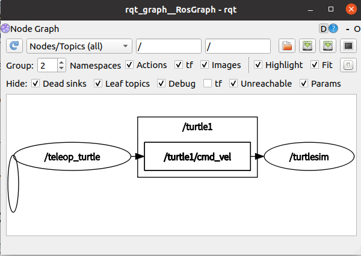

동그라미는 노드를 의미하고 네모는 토픽 메시지를 의미한다. 화살표는 메시지의 송수신을 의미한다. turtle_teleop_key를 실행할 때 teleop_turtle 노드, turtlesim_node 노드를 실행할 때 turtlesim 노드가 각각 실행되었다. 이 두 노드는 키보드 방향키 값을 병진속도와 회전속도 메시지 형태(토픽명 : /turtle1/cmd_vel)로 데이터를 송수신하고 있다는 것을 확인할 수 있다.

실제 ROS 프로그래밍에서는 수십 개에 달하는 노드들이 다양한 토픽 메시지를 주고받게 된다. 이때에 rqt_graph는 현재 ROS 네트워크상의 노드들의 상호관계를 확인하는 데 매우 유용하게 쓰인다.

### 6.2.5. rqt_plot

```
rqt_plot
```

[rqt_plot](http://wiki.ros.org/rqt_plot)은 2차원 데이터 플롯 도구이다. turtlesim 노드 pose 메시지의 x, y좌표를 표기해보자. 우선 turtlesim 패키지의 turtlesim_node를 구동하자.

``` 
rosrun turtlesim turtlesim_node
```

그 다음 rqt_plot 위쪽의 Topic란에 /turtle1/pose/를 입력하면 /turtle1/pose/ 토픽이 2차원상에 도식화된다.

혹은 다음 명령으로도 도식할 토픽 지정을 포함하여 단번에 실행할 수 있다.

```
rqt_plot /turtle1/pose/
```

다음으로 turtlesim 패키지의 turtle_teleop_key을 구동하여, 화면 속 거북이를 움직여본다.

```
rosrun turtlesim turtle_teleop_key
```

아래와 같이 거북이의 x, y 위치, theta 방향 그리고 병진속도와 회전속도가 표시됨을 확인할 수 있다. 속도, 가속도 등의 시간경과에 따른 센서값 표시에 적합하다.

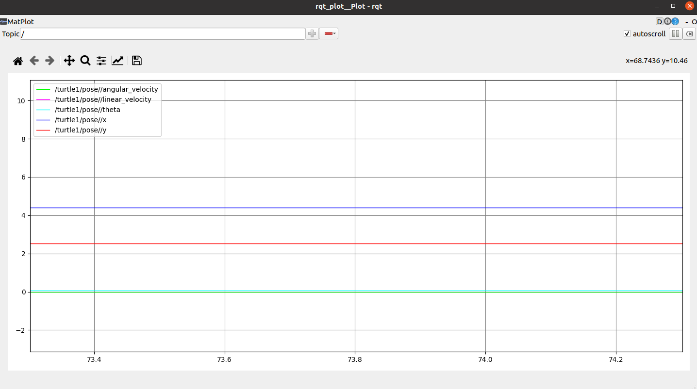

### 6.2.6. rqt_bag

[rqt_bag](http://wiki.ros.org/rqt_bag)는 메시지를 시각화하는 GUI 도구이다. 5.4.8에서 ROS 로그 정보에서 다른 rosbag는 텍스트 기반이지만 rqt_bag는 시각화 기능이 추가되어 카메라의 이미지값을 바로 확인할 수 있기 때문에 영상 데이터 메시지 관리에 매우 유용하다. 이를 테스트하기에 앞서 rqt_image_view 및 rqt_graph 도구 설명에서 다룬 turtlesim 및 usb_cam 관련 노드들을 전부 실행한다. 그 다음 아래의 명령어로 카메라의 /image_raw와 turtlesim의 /turtle1/cmd_vel 값을 bag 파일로 생성하자.

5.4절에서 rosbag 프로그램을 이용하여 ROS상의 각종 토픽 메시지를 bag 파일로 저장, 재생, 압축해보았다. rqt_bag는 앞서 설명한 rosbag의 GUI 버전으로 rosbag와 마찬가지로 토픽 메시지의 저장, 재생, 압축 등이 가능하다. 더불어 카메라 영상 등을 시간 축으로 넘기면서 확인할 수 있다.

```
rosrun usb_cam usb_cam_node
rosbag record /usb_cam/image_raw
rqt
```

'rqt' 명령어로 rqt를 실행하고 메뉴의 [플러그인(Plugins)] → [로깅(logging)] → [Bag]를 선택한다. 그 다음 왼쪽 폴더 모양(Load Bag) 아이콘을 선택하여 방금 기록해둔 *.bag 파일을 불러온다. 그러면 카메라 영상을 시간 축 변화로 확인할 수 있다. 또한 이를 확대, 재생, 시간별 데이터 수 등을 확인할 수 있으며, 마우스 오른쪽 버튼을 누르면 'Publish' 옵션이 있는데 이를 통해 메시지를 다시 발행할 수 있다.


# 7장. ROS 기본 프로그래밍

## 7.1. ROS 프로그래밍 전에 알아둬야 할 사항

### 7.1.1. 표준 단위

ROS에서 사용하는 메시지는 세계에서 가장 널리 사용되는 표준 단위 SI를 권장하고 있다. 이를 지키기 위하여 [REP-0103](https://www.ros.org/reps/rep-0103.html)에도 이를 명시하고 있다. 예를 들어 길이는 미터, 질량은 킬로그램, 시간은 초, 단위는 암페어, 각은 라디안, 주기는 헤르츠, 힘은 뉴턴, 전력은 와트, 전압은 볼트, 온도는 섭씨를 이용한다. 그외의 단위들도 모두 다음의 단위들의 조합으로 이루어진다. 예를 들어 병진속도는 meter/sec, 회전속도는 radian/sec를 이용하고 있다. 메시지는 ROS에서 제공하고 있는 것을 재사용하기를 권장하고는 있지만 필요에 따라서 사용자가 재정의한 완전히 새로운 형태의 메시지를 만들어 사용해도 문제없다. 하지만 그 메시지가 사용하는 단위만큼은 SI 단위를 지켜야지 다른 사용자들이 단위 변환없이 사용할 수 있기 때문에 반드시 지켜야 할 사항 중의 하나이다.

> ※ cf) : REP(ROS Enhancement Proposals)
>
> REP는 ROS 커뮤니티에서 유저들이 제안하는 규칙, 새로운 기능, 관리 방법 등을 담은 제안서로 민주적으로 ROS의 규칙을 만들어 내거나 ROS의 개발, 운영, 관리에 필요한 내용을 협의할 때 사용된다. 하나의 제안이 접수되면 많은 ROS 유저들이 이를 리뷰하고 서로 협의를 통해 만들어 나아가는 표준 문서라 볼 수 있다. 정리된 REP 문서는 http://www.ros.org/reps/rep-0000.html에서 확인해 볼 수 있다.

### 7.1.2. 좌표 표현 방식

[ROS에서의 회전축](http://www.ros.org/reps/rep-0103.html#coordinate-frame-conventions)은 그림 7-1의 좌측 그림과 같이 x, y, z축을 사용한다. 정면은 x축의 + 방향이며 축은 빨간색(R)으로 표현한다. 왼쪽은 y축의 + 방향으로 축은 녹색(G)으로 표현한다. 마지막으로 위쪽은 z축의 + 방향으로 축은 파란색(B)으로 표현한다. 오른손 법칙을 사용하면 된다.


### 7.1.3. 프로그래밍 규칙

ROS는 각 프로그램의 소스 코드 재사용성의 극대화를 위해 프로그래밍 스타일 가이드를 지정하여 지키도록 권고하고 있다. 이는 소스 코드 작업 시 빈번히 생기는 개발자의 부가적인 선택을 줄여주면서, 다른 협업 개발자 및 이용자의 코드 이해도를 높이며 상호 간의 코드 리뷰를 쉽게 해준다. 이는 필수 사항은 아니지만 많은 ROS 유저들이 서로 합의하에 지키고 있는 규칙이다.

규칙과 관련한 내용은 언어별로 위키([C++](http://wiki.ros.org/CppStyleGuide), [Python](http://wiki.ros.org/PyStyleGuide))에 상세히 설명되어 있다. 

※ cf) : [기본적인 이름 규칙](http://wiki.ros.org/ROS/Patterns/Conventions#Naming_ROS_Resources)

### 7.2. 퍼블리셔와 서브스크라이버 노드 작성 및 실행

ROS 메시지 통신에서 사용되는 퍼블리셔와 서브스크라이버는 송신과 수신으로 대체할 수 있다. ROS에서는 송신측을 퍼블리셔, 수신측을 서브스크라이버로 부른다. 

### 7.2.1. 패키지 생성

다음은 ros_tutorials_topic 패키지를 생성하는 명령어이다. 이 패키지는 message_generation, std_msgs, roscpp 패키지를 의존하므로 의존성 옵션으로 달아주었다. message_generation는 새로운 메시지를 생성할 때 사용되는 패키지와 ROS의 표준 메시지 패키지인 std_msgs, ROS에서 C/C++를 사용하기 위해 클라이언트 라이브러리인 roscpp를 사용하겠다는 것으로 패키지 생성에 앞서 미리 설치해야 한다는 의미다. 이러한 의존성 패키지 설정은 패키지를 생성할 때 지정할 수도 있지만, 생성한 다음에 package.xml에서 직접 수정해도 상관없다.

```
cd ~/catkin_ws/src
catkin_create_pkg ros_tutorials_topic message_generation std_msgs roscpp
```

### 7.2.2. 패키지 설정 파일(package.xml) 수정

*ros_tutorials_topic/Package.xml*

```
<?xml version="1.0"?>
<package format="2">
  <name>ros_tutorials_topic</name>
  <version>0.0.0</version>
  <description>The ros_tutorials_topic package</description>

  <maintainer email="jungsoeko@gmail.com">ojs</maintainer>

  <license>Apache License 2.0</license>
  <author email="jungsoeko@gmail.com">ojs</author>
  <maintainer email="jungsoeko@gmail.com">ojs</maintainer>
  <url type="bugtracker">https://github.com/jungsoek/rosstudy/issues</url>
  <url type="repository">https://github.com/jungsoek/rosstudy/ros_tutorial</url>
  <url type="website">http://www.robotis.com</url>
  <buildtool_depend>catkin</buildtool_depend>
  <build_depend>roscpp</build_depend>
  <build_depend>std_msgs</build_depend>
  <build_depend>message_generation</build_depend>
  <build_export_depend>roscpp</build_export_depend>
  <build_export_depend>std_msgs</build_export_depend>
  <exec_depend>roscpp</exec_depend>
  <exec_depend>std_msgs</exec_depend>
  <exec_depend>message_runtime</exec_depend>
  <export></export>
</package>
```

### 7.2.3. 빌드 설정 파일(CMakeLists.txt) 구성

*ros_tutorials_topic/CMakeLists.txt*

```
cmake_minimum_required(VERSION 3.0.2)
project(ros_tutorials_topic)

## 캐킨 빌드를 할 때 요구되는 구성요소 패키지이다.
## 의존성 패키지로 message_generation, std_msgs, roscpp이며
## 이 패키지들이 존재하지 않으면 빌드 도중 에러가 난다.
find_package(catkin REQUIRED COMPONENTS
  message_generation
  roscpp
  std_msgs
)

## 메시지 선언 : MsgTutorial.msg
add_message_files(
  FILES
  MsgTutorial.msg
)

## Generate services in the 'srv' folder
# add_service_files(
#   FILES
#   Service1.srv
#   Service2.srv
# )

## Generate actions in the 'action' folder
# add_action_files(
#   FILES
#   Action1.action
#   Action2.action
# )

## 의존하는 메시지를 설정하는 옵션이다.
## std_msgs가 설치되어 있지 않다면 빌드 도중에 에러가 난다.
generate_messages(
  DEPENDENCIES
  std_msgs
)

## 캐킨 패키지 옵션으로
## 라이브러리, 캐킨 빌드 의존성, 시스템 의존 패키지를 기술한다.
catkin_package(
 LIBRARIES ros_tutorials_topic
 CATKIN_DEPENDS roscpp std_msgs
)

## 인클루드 디렉터리를 설정한다.
include_directories(
  ${catkin_INCLUDE_DIRS}
)

## topic_publisher 노드에 대한 빌드 옵션이다.
## 실행 파일, 타깃 링크 라이브러리, 추가 의존성 등을 설정한다.
add_executable(
  topic_publisher src/topic_publisher.cpp
)
add_dependencies(topic_publisher ${${PROJECT_NAME}_EXPORTED_TARGETS} ${catkin_EXPORTED_TARGETS})
target_link_libraries(topic_publisher ${catkin_LIBRARIES}) 

## topic_subscriber 노드에 대한 빌드 옵션이다.
add_executable(topic_subscriber src/topic_subscriber.cpp)
add_dependencies(topic_subscriber ${${PROJECT_NAME}_EXPORTED_TARGETS}
${catkin_EXPORTED_TARGETS})
target_link_libraries(topic_subscriber ${catkin_LIBRARIES})
```

### 7.2.4. 메시지 작성 파일

앞서 CMakeLists.txt 파일에 다음과 같은 옵션을 추가했다.

```
add_message_files(FILES MsgTutorial.msg)
```

이는 이번 노드에서 사용할 메시지인 MsgTutorial.msg를 빌드할 때 포함하라는 이야기다. 현재 MsgTutorial.msg는 생성하지 않았으므로 다음 순서대로 진행한다.

```
roscd ros_tutorials_topic
mkdir msg
cd msg
touch MsgTutorial.msg
```

*ros_tutorials_topic/msg/MsgTutorial.msg*

```
time stamp
int32 data
```

> ※ cf) : 메시지(msg, srv, action) 패키지의 독립화
>
> 일반적으로 메시지 파일인 msg와 서비스 파일인 srv는 실행 노드에 포함하기 보다는 메시지 파일만으로 구성된 독립된 패키지로 만드는 것을 추천한다. 그 이유로 서브스크라이버 노드와 퍼블리셔 노드가 다른 컴퓨터에서 실행된다고 가정했을 때, 그 둘의 노드는 상호 의존성을 갖춰야만 사용이 가능하기에 불필요한 노드를 설치해야 하는 문제점이 있다. 메시지만의 패키지를 독립적으로 만들어주면 메시지 독립 패키지만 의존성 옵션에 추가하면 되기 때문에 불필요한 패키지 간의 의존성을 없앨 수 있다. 다만, 이 책에서는 코드를 간결하게 만들기 위하여 메시지 파일을 실행 노드에 포함하였다.

### 7.2.5. 퍼블리셔 노드 작성

앞서 CMakeLists.txt 파일에 다음과 같은 실행 파일을 생성하는 옵션을 주었다.

```
add_executable(topic_publisher src/topic_publisher.cpp)
```

즉 src 폴더의 topic_publisher.cpp 파일을 빌드하여 topic_publisher 실행 파일을 만든다는 이야기다. 다음 순서대로 퍼블리셔 노드 기능을 수행하는 소스를 작성한다.

```
roscd ros_tutorials_topic/src
touch topic_publisher.cpp
```

*ros_tutorials_topic/src/topic_publisher.cpp*

```cpp
// ROS 기본 헤더파일
#include "ros/ros.h"    
// MsgTutorial 메시지 파일 헤더(빌드 후 자동 생성됨)
#include "ros_tutorials_topic/MsgTutorial.h"    

int main(int argc, char **argv) {   // 노드 메인 함수
    ros::init(argc, argv, "topic_publisher");   // 노드명 초기화
    ros::NodeHandle nh;     // ROS 시스템과 통신을 위한 노드 핸들 선언

    // 퍼블리셔 선언,
    // ros_tutorials_topic 패키지의 MsgTutorial 메시지 파일을 이용한
    // 퍼블리셔 ros_tutorial_pub를 작성한다.
    // 토픽명은 "ros_tutorial_msg"이며,
    // 퍼블리셔 큐(queue) 사이즈를 100개로 설정한다는 것이다.
    ros::Publisher ros_tutorial_pub = 
    nh.advertise<ros_tutorials_topic::MsgTutorial>("ros_tutorial_msg", 100);

    // 루프 주기를 설정한다.
    // "10"이라는 것은 10Hz를 말하는 것으로 0.1초 간격으로 처리가 반복된다.
    ros::Rate loop_rate(10);

    ros_tutorials_topic::MsgTutorial msg;   // MsgTutorial 메시지 파일 형식으로 msg라는 메시지를 선언
    int count = 0;  // 메시지에 사용될 변수 선언

    while (ros::ok()) {
        msg.stamp = ros::Time::now();   // 현재 시간을 msg의 하위 stamp 메시지에 담는다.
        msg.data = count;   // count라는 변숫값을 msg의 하위 data 메시지에 담는다.

        ROS_INFO("send msg = %d", msg.stamp.sec);   // stamp.set 메시지를 표시한다.
        ROS_INFO("send msg = %d", msg.stamp.nsec);   // stamp.nset 메시지를 표시한다.
        ROS_INFO("send msg = %d", msg.data);   // data 메시지를 표시한다.

        ros_tutorial_pub.publish(msg);  // 메시지를 발행한다.

        loop_rate.sleep();

        ++count;
    }

    return 0;
}     
```

### 7.2.6. 서브스크라이버 노드 작성

CMakeLists.txt 파일에 다음과 같은 실행 파일을 생성하는 옵션을 넣었다.

```
add_executable(topic_subscriber src/topic_subscriber.cpp)
```

즉 topic_subscriber.cpp 파일을 빌드하여 topic_subscriber 실행 파일을 만든다는 이야기다. 다음 순서대로 서브스크라이버 노드 기능을 수행하는 소스를 작성해보자.

```
roscd ros_tutorials_topic/src
touch topic_subscriber.cpp
```

```cpp
#include "ros/ros.h"
#include "ros_tutorials_topic/MsgTutorial.h"

// 메시지 콜백함수로써, 밑에서 설정한 ros_tutorial_msg라는 이름의 토픽
// 메시지를 수신하였을 때 동작하는 함수이다.
// 입력 메시지로는 ros_tutorials_topic 패키지의 MsgTutorial 메시지를 받도록 되어있다.
void msgCallback(const ros_tutorials_topic::MsgTutorial::ConstPtr&msg) {
    ROS_INFO("recieve msg = %d", msg->stamp.sec); // stamp.sec 메시지를 표시한다.
    ROS_INFO("recieve msg = %d", msg->stamp.nsec); // stamp.nsec 메시지를 표시한다.
    ROS_INFO("recieve msg = %d", msg->data); // data 메시지를 표시한다.
}

int main(int argc, char **argv) {   // 노드 메인 함수
    ros::init(argc, argv, "topic_subscriber");  // 노드명 초기화

    ros::NodeHandle nh;     // ROS 시스템과 통신을 위한 노드 핸들 선언

    // 서브스크라이버 선언,
    // ros_tutorials_topic 패키지의 MsgTutorial 메시지 파일을 이용한
    // 서브스크라이버 ros_tutorial_sub를 작성한다.
    // 토픽명은 "ros_tutorial_msg"이며,
    // 서브스크라이버 큐(queue) 사이즈를 100개로 설정한다는 것이다.
    ros::Subscriber ros_tutorial_sub = nh.subscribe("ros_tutorial_msg", 100, msgCallback);

    // 콜백함수 호출을 위한 함수로써,
    // 메시지가 수신되기를 대기,
    // 수신되었을 경우 콜백함수를 실행한다.
    ros::spin();

    return 0;
}
```

```
cd ~/catkin_ws
catkin_make
```

### 7.2.7. 노드 빌드

생성한 ros_tutorial_topic 패키지의 메시지 파일, 퍼블리셔 노드, 서브스크라이버 노드를 빌드한다.

빌드된 결과물은 ~/catkin_ws의 /build와 /devel 폴더에 각각 생성된다. /build 폴더에는 캐킨 빌드에서 사용된 설정 내용이 저장되며, '/devel/lib/ros_tutorials_topic' 폴더에는 실행 파일, '/devel/include/ros_tutorials_topic'에는 메시지 파일로부터 자동 생성된 메시지 헤더 파일이 저장된다.

*~/catkin_ws/build*

```
$ ls
CATKIN_IGNORE           bin
CMakeCache.txt          catkin
CMakeFiles              catkin_generated
CTestConfiguration.ini  catkin_make.cache
CTestCustom.cmake       cmake_install.cmake
CTestTestfile.cmake     gtest
Makefile                ros_tutorials_topic
atomic_configure        test_results
```

*~/catkin_ws/devel*

```
$ ls
_setup_util.py  lib               setup.bash
cmake.lock      local_setup.bash  setup.sh
env.sh          local_setup.sh    setup.zsh
include         local_setup.zsh   share
```

### 7.2.8. 퍼블리셔 실행

```
roscore
```

```
rosrun ros_tutorials_topic topic_publisher

[ INFO] [1714496817.967005639]: send msg = 1714496817
[ INFO] [1714496817.967647137]: send msg = 966968017
[ INFO] [1714496817.967659825]: send msg = 0
[ INFO] [1714496818.067189989]: send msg = 1714496818
[ INFO] [1714496818.067323214]: send msg = 67109349
[ INFO] [1714496818.067417885]: send msg = 1
[ INFO] [1714496818.167391335]: send msg = 1714496818

...

```

화면에서 표시되고 있는 것은 printf() 기능과 비슷한 ROS_INFO() 함수를 이용한 것뿐이다. 실제로 토픽을 퍼블리시하기 위해서는 서브스크라이버 노드 및 rostopic과 같은 서브스크라이버 노드와 같은 역할을 하는 명령어를 이용해야만 한다.

우선 rostopic list 명령어로 ros_tutorial_msg 토픽이 있음을 확인한다.

```
$ rostopic list
/ros_tutorial_msg
/rosout
/rosout_agg
/usb_cam/camera_info
/usb_cam/image_raw
/usb_cam/image_raw/compressed
/usb_cam/image_raw/compressed/parameter_descriptions
/usb_cam/image_raw/compressed/parameter_updates
/usb_cam/image_raw/compressedDepth
/usb_cam/image_raw/compressedDepth/parameter_descriptions
/usb_cam/image_raw/compressedDepth/parameter_updates
/usb_cam/image_raw/theora
/usb_cam/image_raw/theora/parameter_descriptions
/usb_cam/image_raw/theora/parameter_updates
```

다음은 ros_tutorial_msg 토픽의 메시지를 확인한다.

```
$ rostopic echo /ros_tutorial_msg
stamp: 
  secs: 1714497601
  nsecs: 243399908
data: 2858
---
stamp: 
  secs: 1714497601
  nsecs: 343246432
data: 2859
---
stamp: 
  secs: 1714497601
  nsecs: 443406938
data: 2860
---

...

```

### 7.2.9. 서브스크라이버 실행

```
rosrun ros_tutorials_topic topic_subscriber
```

```
[ INFO] [1714497740.444568684]: recieve msg = 1714497740
[ INFO] [1714497740.447800931]: recieve msg = 443394612
[ INFO] [1714497740.447865750]: recieve msg = 4250
[ INFO] [1714497740.544223960]: recieve msg = 1714497740
[ INFO] [1714497740.544356935]: recieve msg = 543387470
[ INFO] [1714497740.544447014]: recieve msg = 4251
[ INFO] [1714497740.644251038]: recieve msg = 1714497740
[ INFO] [1714497740.644368140]: recieve msg = 643396796
[ INFO] [1714497740.644456417]: recieve msg = 4252
[ INFO] [1714497740.744242833]: recieve msg = 1714497740
[ INFO] [1714497740.744365578]: recieve msg = 743368325

...

```

### 7.2.10. 실행된 노드들의 통신 상태 확인

rqt를 이용하여 실행된 노드들의 통신 상태를 확인한다. rqt_graph 혹은 rqt 중 하나를 사용하면 되는데, rqt를 실행했을 때는 메뉴에서 [플러그인(Plugins)] → [인트로스펙션(Introsection)] → [노드 그래프(Node Graph)]를 선택하면, ROS에서 구동 중인 노드와 메시지를 확인할 수 있다.

```
rqt_graph 혹은 rqt
```


현재 ROS 네트워크상에는 퍼블리셔 노드(topic_publisher)가 토픽(ros_tutorial_msg)을 송신중이고, 이를 서브스크라이버 노드(topic_subscriber)가 수신하고 있음을 확인할 수 있다.

## 7.3. 서비스 서버와 클라이언트 노드 작성 및 실행

서비스 요청(request)이 있을 때만 응답(response)하는 서비스 서버(service server)와 요청하고 응답받는 서비스 클라이언트(service client)로 나뉜다. 서비스는 토픽과는 달리 일회성 메시지 통신이다. 따라서 서비스의 요청과 응답이 완료되면 연결된 두 노드는 접속이 끊긴다.

이러한 서비스는 로봇에 특정 동작을 수행하도록 요청할 때 많이 사용된다. 혹은 특정 조건에 따라 이벤트를 발생해야 할 노드에 사용된다. 또한 일회성 통신 방식이라서 네트워크에 부하가 적기 때문에 토픽을 대체하는 수단으로 사용되기도 한다.

### 7.3.1. 패키지 생성

다음은 ros_tutorials_service 패키지를 생성하는 명령어이다. 이 패키지는 message_generation, std_msgs, roscpp 패키지를 의존하므로 의존성 옵션으로 달아주었다. 이 의존성 옵션들을 하나씩 살펴보자면 새로운 메시지를 생성할 때 사용되는 message_generation 패키지와 ROS의 표준 메시지인 std_msgs, ROS에서 C/C++을 사용하기 위해 클라이언트 라이브러리인 roscpp를 사용하겠다는 것으로 패키지 생성에 앞서 미리 설치해야 한다는 의미다. 

```
cd ~/catkin_ws/src
catkin_create_pkg ros_tutorials_service message_generation std_msgs roscpp
```

### 7.3.2. 패키지 설정 파일(package.xml) 수정

*ros_tutorials_service/package.xml*

```
<?xml version="1.0"?>
<package format="2">
  <name>ros_tutorials_service</name>
  <version>0.0.0</version>
  <description>The ros_tutorials_service package</description>

  <maintainer email="jungsoeko@gmail.com">ojs</maintainer>

  <license>Apache License 2.0</license>
  <author email="jungsoeko@gmail.com">ojs</author>
  <maintainer email="jungsoeko@gmail.com">ojs</maintainer>
  <url type="bugtracker">https://github.com/jungsoek/rosstudy/issues</url>
  <url type="repository">https://github.com/jungsoek/rosstudy/ros_tutorial</url>
  <url type="website">http://www.robotis.com</url>
  <buildtool_depend>catkin</buildtool_depend>
  <build_depend>roscpp</build_depend>
  <build_depend>std_msgs</build_depend>
  <build_depend>message_generation</build_depend>
  <build_export_depend>roscpp</build_export_depend>
  <build_export_depend>std_msgs</build_export_depend>
  <exec_depend>roscpp</exec_depend>
  <exec_depend>std_msgs</exec_depend>
  <exec_depend>message_runtime</exec_depend>
  <export></export>
</package>
```

### 7.3.3. 빌드 설정 파일(CMakeLists.txt) 수정

*ros_tutorials_service/CMakeLists.txt*

```
cmake_minimum_required(VERSION 3.0.2)
project(ros_tutorials_service)

## 캐킨 빌드를 할 때 요구되는 구성요소 패키지이다.
## 의존성 패키지로 message_generation, std_msgs, roscpp이며
## 이 패키지들이 존재하지 않으면 빌드 도중 에러가 난다.
find_package(catkin REQUIRED COMPONENTS
  message_generation
  std_msgs
  roscpp
)

## 서비스 선언 : SrvTutorial.srv
add_service_files(
  FILES
  SrvTutorial.srv
)

## 의존하는 메시지를 설정하는 옵션이다.
## std_msgs가 설치되어 있지 않다면 빌드 도중에 에러가 난다.
generate_messages(
  DEPENDENCIES
  std_msgs
)

## 캐킨 패키지 옵션으로
## 라이브러리, 캐킨 빌드 의존성, 시스템 의존 패키지를 기술한다.
catkin_package(
 LIBRARIES ros_tutorials_topic
 CATKIN_DEPENDS roscpp std_msgs
)

## 인클루드 디렉터리를 설정한다.
include_directories(
  ${catkin_INCLUDE_DIRS}
)

## service_server 노드에 대한 빌드 옵션이다.
## 실행 파일, 타겟 링크 라이브러리, 추가 의존성 등을 설정한다.
add_executable(
  service_server 
  src/service_server.cpp
)
add_dependencies(
  service_server 
  ${${PROJECT_NAME}_EXPORTED_TARGETS}
  ${catkin_EXPORTED_TARGETS}
)
target_link_libraries(
  service_server
  ${catkin_LIBRARIES}
)

## service_client 노드에 대한 빌드 옵션이다.
add_executable(
  service_client
  src/service_client.cpp
)
add_dependencies(
  service_client
  ${${PROJECT_NAME}_EXPORTED_TARGETS}
  ${catkin_EXPORTED_TARGETS}
)
target_link_libraries(
  service_client
  ${catkin_LIBRARIES}
)
```

### 7.3.4. 서비스 파일 작성

CMakeLists.txt 파일에 다음과 같은 옵션을 넣었다.

```
add_service_files(FILES SrvTutorial.srv)
```

이는 이번 노드에서 사용할 서비스인 SrvTutorial.srv를 빌드할 때 포함한다는 것이다. 패키지 디렉터리에 srv 디렉터리를 생성하고 srv 파일을 생성한다.

```
roscd ros_tutorials_service
mkdir srv
cd srv
touch SrvTutorial.srv
```

*ros_tutorials_service/srv/SrvTutorials.srv*

```
int64 a
int64 b
---
int64 result
```

### 7.3.5. 서비스 서버 노드 작성

CMakeLists.txt 파일에 다음과 같은 실행 파일을 생성하는 옵션을 넣었다.

```
add_executable(service_server src/service_server.cpp)
```

즉 service_server.cpp 파일을 빌드해 service_server 실행 파일을 만든다는 것이다. 서비스 서버 노드 기능을 수행하는 프로그램을 작성한다.

```
roscd ros_tutorials_service/src
touch service_server.cpp
```

*ros_tutorials_service/src/service_server.cpp*

```cpp
// ROS 기본 헤더 파일
#include "ros/ros.h"
// SrvTutorial 서비스 파일 헤더(빌드 후 자동 생성됨)
#include "ros_tutorials_service/SrvTutorial.h"

// 서비스 요청이 있을 경우, 아래의 처리를 수행한다.
// 서비스 요청은 req, 서비스 응답은 res로 설정하였다.
bool calculation(
    ros_tutorials_service::SrvTutorial::Request &req,
    ros_tutorials_service::SrvTutorial::Response &res
) {
    // 서비스 요청시 받은 a와 b값을 더하여 서비스 응답값에 저장한다.
    res.result = req.a + req.b;

    // 서비스 요청에 사용된 a, b값의 표시 및 서비스 응답에 해당되는 result값을 출력한다.
    ROS_INFO("request: x=%ld, y=%ld", (long int)req.a, (long int)req.b);
    ROS_INFO("sending back response: %ld", (long int)res.result);

    return true;
}

int main(int argc, char **argv) {  // 노드 메인 함수
    ros::init(argc, argv, "service_server");    // 노드명 초기화
    ros::NodeHandle nh;    // 노드 핸들 선언

    // 서비스 서버 선언,
    // ros_tutorials_service 패키지의 SrvTutorial 서비스 파일을 이용한
    // 서비스 서버 ros_tutorials_service_server를 선언한다.
    // 서비스명은 ros_tutorial_srv이며 서비스 요청이 있을 때,
    // calculation라는 함수를 실행하라는 설정이다.
    ros::ServiceServer ros_tutorial_service_server 
        = nh.advertiseService("ros_tutorial_srv", calculation);

    ROS_INFO("ready srv server!");

    ros::spin();     // 서비스 요청을 대기한다.

    return 0;
}
```

### 7.3.4. 서비스 클라이언트 노드 작성

CMakeLists.txt 파일에 다음과 같은 실행 파일을 생성하는 옵션을 넣었다.

```
add_executable(service_client src/service_client.cpp)
```

즉 service_client.cpp 파일을 빌드하여 service_client 실행 파일을 만든다는 것이다. 패키지의 src 디렉터리에 service_client.cpp 파일을 생성하고 서비스 클라이언트 노드 기능을 수행하는 프로그램을 작성한다.

```cpp
#include "ros/ros.h"    // ROS 기본 헤더 파일
#include "ros_tutorials_service/SrvTutorial.h"  // SrvTutorial 서비스 파일 헤더(빌드 후 자동 생성됨)
#include <cstdlib>  // atoll 함수 사용을 위한 라이브러리

int main(int argc, char **argv) {
    ros::init(argc, argv, "service_client");

    if(argc !=3) { // 입력값 오류 처리
        ROS_INFO("cmd : rosrun ros_tutorials_service service_client arg0 arg1");
        ROS_INFO("arg0: double number, arg1: double number");
        return 1;
    }

    ros::NodeHandle nh; // ROS 시스템과 통신을 위한 노드 핸들 선언

    // 서비스 클라이언트 선언, ros_tutorial_service 패키지의 
    // SrvTutorial 서비스 파일을 이용한
    // 서비스 클라이언트 ros_tutorials_service_client를 선언한다.
    // 서비스명은 "ros_tutorial_srv"이다.
    ros::ServiceClient ros_tutorial_service_client = 
    nh.serviceClient<ros_tutorials_service::SrvTutorial>("ros_tutorial_srv");

    // srv라는 이름으로 SrvTutorial 서비스 파일을 이용하는 서비스를 선언한다.
    ros_tutorials_service::SrvTutorial srv;

    // 서비스 요청 값으로 노드가 실행될 때 입력으로 사용된 매개변수를 각각 a, b에 저장한다.
    srv.request.a = atoll(argv[1]);
    srv.request.b = atoll(argv[2]);

    // 서비스를 요청하고, 요청이 받아들여졌을 경우, 응답값을 표시한다.
    if(ros_tutorial_service_client.call(srv)) {
        ROS_INFO(
            "send srv, srv.Request.a and b : %ld, %ld", 
            (long int)srv.request.a, 
            (long int)srv.request.b
        );
        ROS_INFO(
            "receive srv, srv.Response.result : %ld",
            (long int)srv.response.result
        );
    } else {
        ROS_ERROR("Failed to call service ros_tutorial_srv");
        return 1;
    }
    return 0;
}
```

### 7.3.7. 노드 빌드

```
cd ~/catkin_ws && catkin_make
```

### 7.3.8. 서비스 서버 실행

앞에서 작성한 서비스 서버는 서비스 요청이 있기 전까지 아무런 처리를 하지 않고 기다리도록 프로그래밍하였다. 그러므로 다음 명령어를 실행하면 서비스 서버는 서비스 요청을 기다린다.

```
$ rosrun ros_tutorials_service service_server
[ INFO] [1714508544.301410658]: ready srv server!
```

### 7.3.9. 서비스 클라이언트 실행

서비스 서버를 실행했다면 다음 명령어로 서비스 클라이언트를 실행한다.

```
$ rosrun ros_tutorials_service service_client 2 3
[ INFO] [1714508756.327421482]: send srv, srv.Request.a and b : 2, 3
[ INFO] [1714508756.328326123]: receive srv, srv.Response.result : 5
```

서비스 클라이언트를 실행하면서 입력해준 실행 매개변수 2와 3을 서비스 요청값으로 전송하도록 프로그래밍하였다. 그 결과 2와 3은 각각 a, b 값으로 서비스를 요청하게 되고, 결괏값으로 둘의 합인 5를 응답값으로 전송받았다. 여기서 단순하게 실행 매개변수로 이를 이용했으나, 실제 활용에서는 명령어로 대체해도 되고, 계산되어야할 값, 트리거용 변수 등을 서비스 요청값으로 사용할 수 있다.

참고로 서비스는 토픽 퍼블리셔 및 서브스크라이버와 달리 일회성이므로 rqt_graph 등에서 확인할 수 없다.

### 7.3.10. rosservice call 명령어 사용 방법

서비스 요청은 앞서 service_client와 같은 서비스 클라이언트 노드를 실행하는 방법도 있지만 'rosservice call' 명령어나 rqt의 ServiceCaller를 이용하는 방법도 있다. 

다음 명령어와 같이 rosservice call 명령어 뒤에 /ros_tutorial_srv 처럼 해당하는 서비스 이름을 적고 그 다음 이어서 서비스 요청에 필요한 매개변수를 적어주면 된다.

```
$ rosservice call /ros_tutorial_srv 10 2
result: 12
```

### 7.3.11. GUI 도구인 Service Caller 사용 방법

rqt를 실행한다.

```
rqt
```

그 다음, rqt 프로그램 메뉴에서 [플러그인(Plugins)] → [서비스(Service)] → [Service Caller]를 선택하면 다음과 같은 화면이 나온다.


상단에 있는 Service 항목에서 서비스 이름을 선택하면 Request에 서비스 요청에 필요한 정보가 보인다. 서비스를 요청하려면 각 요청 정보의 Expression에 정보를 입력한다. 이후 전화기 모양의 <Call> 아이콘을 클릭하면 서비스 요청이 실행되고, 화면 밑에 있는 Response에 서비스 응답에 대한 결과가 표시된다.

## 7.4. 액션 서버와 클라이언트 노드 작성 및 실행

[액션](http://wiki.ros.org/actionlib)은 토픽, 서비스와 달리 비동기, 양방향, 요청 처리 후 응답까지 오랜 시간이 걸리고 중간 결괏값이 필요한 경우의 더 복잡한 프로그래밍을 할 때 사용한다. 여기서는 ROS Wiki에 소개된 [actionlib 예제](http://wiki.ros.org/actionlib_tutorials/Tutorials)를 통해 사용법을 알아본다.

### 7.4.1. 패키지 생성

ros_tutorials_action 패키지를 생성한다. 해당 패키지는 message_generation, std_msgs, actionlib_msgs, actionlib, roscpp 패키지를 의존하므로 해당 패키지 의존성 옵션을 달아준다.

```
cd ~/catkin_ws/src
catkin_create_pkg ros_tutorials_action message_generation std_msgs actionlib_msgs actionlib roscpp
```

### 7.4.2. 패키지 설정 파일(package.xml) 수정

*ros_tutorials_action/package.xml*

```
<?xml version="1.0"?>
<package format="2">
  <name>ros_tutorials_action</name>
  <version>0.0.0</version>
  <description>The ros_tutorials_action package</description>

  <maintainer email="jungsoeko@gmail.com">ojs</maintainer>

  <license>Apache License 2.0</license>
  <author email="jungsoeko@gmail.com">ojs</author>
  <maintainer email="jungsoeko@gmail.com">ojs</maintainer>
  <url type="bugtracker">https://github.com/jungsoek/rosstudy/issues</url>
  <url type="repository">https://github.com/jungsoek/rosstudy/ros_tutorial</url>
  <url type="website">http://www.robotis.com</url>
  
  <buildtool_depend>catkin</buildtool_depend>
  
  <build_depend>roscpp</build_depend>
  <build_depend>actionlib</build_depend>
  <build_depend>message_generation</build_depend>
  <build_depend>std_msgs</build_depend>
  <build_depend>actionlib_msgs</build_depend>

  <build_export_depend>roscpp</build_export_depend>
  <build_export_depend>std_msgs</build_export_depend>

  <exec_depend>roscpp</exec_depend>
  <exec_depend>actionlib</exec_depend>
  <exec_depend>std_msgs</exec_depend>
  <exec_depend>actionlib_msgs</exec_depend>
  <exec_depend>message_runtime</exec_depend>
  <export></export>
</package>
```

### 7.4.3. 빌드 설정 파일(CMakeLists.txt) 수정

앞서 설명한 ros_tutorials_topic, ros_tutorials_service 노드의 빌드 설정 파일과 다른 점은 각각 msg 및 srv 파일을 추가하였다면 이번 ros_tutorials_action 패키지는 액션 파일(*.action)이 추가되었다는 것이다. 또 이를 사용하는 예제 노드로 새로운 액션 서버 노드, 액션 클라이언트 노드도 추가하였다. 더불어서 여기서는 ROS 외의 Boost라는 라이브러리를 이용하기에 별도의 의존성 옵션도 추가한다.

*ros_tutorials_action/CMakeLists.txt*

```
cmake_minimum_required(VERSION 3.0.2)
project(ros_tutorials_action)

find_package(catkin REQUIRED COMPONENTS
  actionlib
  actionlib_msgs
  message_generation
  roscpp
  std_msgs
)

find_package(Boost REQUIRED COMPONENTS system)

add_action_files(
  FILES
    Fibonacci.action
)

generate_messages(
  DEPENDENCIES
    actionlib_msgs
    std_msgs
)

catkin_package(
  LIBRARIES 
    ros_tutorials_action
  CATKIN_DEPENDS 
    actionlib 
    actionlib_msgs 
    message_generation 
    roscpp 
    std_msgs
    DEPENDS Boost
)

include_directories(
  ${catkin_INCLUDE_DIRS}
  ${Boost_INCLUDE_DIRS}
)

add_executable(action_server src/action_server.cpp)
add_dependencies(
  action_server
  ${${PROJECT_NAME}_EXPORTED_TARGETS}
  ${catkin_EXPORTED_TARGETS}
)
target_link_libraries(
  action_server
  ${catkin_LIBRARIES}
)

add_executable(action_client src/action_client.cpp)
add_dependencies(
  action_client
  ${${PROJECT_NAME}_EXPORTED_TARGETS}
  ${catkin_EXPORTED_TARGETS}
)
target_link_libraries(
  action_client
  ${catkin_LIBRARIES}
)
```

### 7.4.4. 액션 파일 작성

CMakeLists.txt 파일에 다음과 같은 옵션을 넣었다.

```
add_action_files(
  FILES
    Fibonacci.action
)
```

이는 이번 노드에서 사용할 액션 파일인 Fibonacci.action을 빌드할 때 포함하라는 빌드 옵션이다. action 디렉터리를 생성 후 Fibonacci.action 파일을 생성 및 작성한다.

```
roscd ros_tutorials_action
mkdir action
cd action
touch Fibonacci.action
```

액션 파일은 3개의 하이픈(---)이 구분자 역할로 2군데 사용되어 첫 번째가 goal 메시지, 두 번째가 result 메시지, 세 번째가 feedback 메시지로 사용된다. 가장 큰 차이점은 goal 메시지와 result 메시지의 관계는 위에서 언급한 srv 파일과 마찬가지이지만 feedback 메시지는 지정된 프로세스가 수행되면서 중간 결괏값 전송 목적으로 이용한다는 것이다.

*Fibonacci.action*

```
# goal definition
int32 order
---

# result definition
int32[] sequence
---

# feedback
int32[] sequence
```

> ※ cf) : 액션의 기본 5가지 메시지
>
> 액션은 액션 파일에서 확인해 볼 수 있는 목표(goal), 결과(result), 피드백(feedback) 이외에도 기본적으로 취소(cancel)와 상태(status)라는 두 가지의 메시지를 더 이용한다. 취소(cancel) 메시지는 액션이 실행 중일때 액션 클라이언트 및 별도의 노드에서 액션 실행을 도중에 취소할 수 있는 메시지로 actionlib_msgs/GoalID를 이용한다. 상태(status) 메시지는 [PENDING, ACTIVE, PREEMPTED, SUCCEDED](https://docs.ros.org/noetic/api/actionlib_msgs/html/msg/GoalStatus.html) 등의 [상태 전이](http://wiki.ros.org/actionlib/DetailedDescription)에 따라 현재 액션의 상태를 확인할 수 있다.

### 7.4.5. 액션 서버 노드 작성

CMakeLists.txt 파일에 다음과 같은 실행 파일을 생성하는 옵션을 넣었다.

```
add_executable(action_server src/action_server.cpp)
```

즉 action_server.cpp 파일을 빌드해 action_server 실행 파일을 만든다는 것이다. 다음 순서대로 액션 서버 노드 기능을 수행하는 프로그램을 작성한다.

```
roscd ros_tutorials_action/src
touch action_server.cpp
```

*ros_tutorials_action/src/action_server.cpp*

```cpp
#include <ros/ros.h>    // ROS 기본 헤더 파일
#include <actionlib/server/simple_action_server.h>  // action 라이브러리 헤더 파일
#include <ros_tutorials_action/FibonacciAction.h>   // FibonacciAction 액션 파일 헤더(빌드 후 자동 생성됨)

class FibonacciAction {
    protected:
        // 노드 핸들 선언
        ros::NodeHandle nh_;

        // 액션 서버 선언
        actionlib::SimpleActionServer<ros_tutorials_action::FibonacciAction> as_;

        // 액션명으로 사용
        std::string action_name_;

        // 퍼블리시를 위한 액션 피드백 및 결과 선언
        ros_tutorials_action::FibonacciFeedback feedback_;
        ros_tutorials_action::FibonacciResult result_;

    public:
        // 액션 서버 초기화(노드 핸들, 액션명, 액션 콜백 함수)
        FibonacciAction(std::string name) :
            as_(nh_, name, boost::bind(&FibonacciAction::executeCB, this, _1), false),
            action_name_(name) {
                as_.start();
            }

        ~FibonacciAction(void) {

        }

        // 액션 목표(goal) 메시지를 받아 지정된 액션(여기서는 피보나치 수열)을 수행하는 함수
        void executeCB(const ros_tutorials_action::FibonacciGoalConstPtr &goal) {
            ros::Rate r(1);     // 루프 주기 : 1Hz
            bool success = true;    // 액션의 성공, 실패를 저장하는 변수로 사용

            // 피보나치 수열 초기화 설정, 피드백의 첫 번째(0)와 두 번째 메시지(1)도 추가
            feedback_.sequence.clear();
            feedback_.sequence.push_back(0);
            feedback_.sequence.push_back(1);

            // 액션의 이름, 목표, 피보나치 수열의 초기 두 개의 값을 사용자에게 알림
            ROS_INFO(
                "%s: Executing, creating fibonacci sequence of order %i with seeds %i",
                action_name_.c_str(),
                goal->order,
                feedback_.sequence[0],
                feedback_.sequence[1]
            );

            // 액션 내용
            for(int i = 1; i <= goal->order; i++) {
                // 액션 클라이언트로부터 액션 취소를 확인
                if (as_.isPreemptRequested() || !ros::ok()) {
                    ROS_INFO(
                        "%s : Preempted",
                        action_name_.c_str()
                    );
                    as_.setPreempted();
                    success = false;
                    break;
                }

                // 액션 취소가 없거나 액션 목표치에 도달하기 전까지
                // 피드백에 피보나치 현재 수에 이전 수를 더한 값을 저장한다.
                feedback_.sequence.push_back(feedback_.sequence[i] + feedback_.sequence[i-1]);
                as_.publishFeedback(feedback_);     // 피드백을 퍼블리시한다.
                r.sleep();      // 위에서 정한 루프 주기에 따라 슬립에 들어간다.
            }

            // 액션 목표치를 달성했을 경우, 현재의 피보나치 수열을 결괏값으로 전송한다.
            if(success) {
                result_.sequence = feedback_.sequence;
                ROS_INFO("%s : Succeeded", action_name_.c_str());
                as_.setSucceeded(result_);
            }
        }
};

int main(int argc, char** argv) {   // 노드 메인 함수
    ros::init(argc, argv, "action_server");  // 노드명 초기화
    FibonacciAction fibonacci("ros_tutorial_action");   // Fibonacci 선언(액션명 : ros_tutorial_action)
    ros::spin();
    return 0;
}
```

### 7.4.6. 액션 클라이언트 노드 작성

액션 서버 노드와 마찬가지로 클라이언트 노드에 해당되는 내용도 다음과 같이 CMakeLists.txt 파일에 옵션으로 넣어두었다.

```
add_executable(action_client src/action_client.cpp)
```

즉 action_client.cpp라는 파일에 빌드해 action_client 실행 파일을 만든다는 것이다. 다음 순서대로 액션 클라이언트 노드 기능을 수행하는 프로그램을 작성한다.

```
roscd ros_tutorial_action/src
touch action_client.cpp
```

*ros_tutorials_action/src/action_client.cpp*

```cpp
#include <ros/ros.h>    // ROS 기본 헤더 파일
#include <actionlib/client/simple_action_client.h>  // action 라이브러리 헤더 파일
#include <actionlib/client/terminal_state.h>    // 액션 목표 상태 헤더 파일
#include <ros_tutorials_action/FibonacciAction.h>   // FibonacciAction 액션 파일 헤더(빌드 후 자동 생성됨)

int main(int argc, char **argv) {
    ros::init(argc, argv, "action_client");

    // 액션 클라이언트 선언
    actionlib::SimpleActionClient<ros_tutorials_action::FibonacciAction> ac("ros_tutorial_action", true);

    ROS_INFO("Waiting for action server to start.");
    ac.waitForServer();

    ROS_INFO("Action server started, sending goal.");
    ros_tutorials_action::FibonacciGoal goal;   // 액션 목표 선언
    goal.order = 20;    // 액션 목표 지정(피보나치 수열 20번 진행)
    ac.sendGoal(goal);  // 액션 목표 전송

    // 액션 목표 달성 제한 시간 설정(여기서는 30초로 설정)
    bool finished_before_timeout = ac.waitForResult(ros::Duration(30.0));

    // 액션 목표 달성 제한 시간내에 액션 결괏값이 수신 되었을 때
    if(finished_before_timeout) {
        // 액션 목표 상태 값을 받아 화면에 표시
        actionlib::SimpleClientGoalState state = ac.getState();
        ROS_INFO("Action finished: %s", state.toString().c_str());
    } else {
        ROS_INFO("Action did not finish before the time out."); // 제한 시간을 넘긴 경우
    }

    // exit
    return 0;
}
```

### 7.4.7. 노드 빌드

```
cd ~/catkin_ws && catkin_make
```

### 7.4.8. 액션 서버 실행

action_server 노드를 실행한다.

```
rosrun ros_tutorials_action action_server
```

액션에서는 요청과 응답에 해당하는 액션 목표(goal)와 결과(result)가 있다는 점에서 서비스와 비슷하지만 추가로 각 과정에서의 중간값에 해당하는 피드백(feedback) 메시지가 있다. 이는 서비스와 비슷하지만 실제 메시지의 통신 방식에 대해서는 토픽과 매우 유사하다. 그래서 다음과 같이  rqt_graph와 rostopic list를 통해 현재 액션 메시지의 사용을 확인할 수 있다.

```
$ rostopic list
/ros_tutorial_action/cancel
/ros_tutorial_action/feedback
/ros_tutorial_action/goal
/ros_tutorial_action/result
/ros_tutorial_action/status
/rosout
/rosout_agg
/statistics
```

각 메시지의 자세한 정보를 원할 경우, rostopic list에 -v 옵션을 붙여준다. 그러면 다음과 같이 퍼블리시 및 서브스크라이브되는 토픽을 따로 분리해 보여준다.

```
$ rostopic list -v

Published topics:
 * /rosout_agg [rosgraph_msgs/Log] 1 publisher
 * /rosout [rosgraph_msgs/Log] 3 publishers
 * /ros_tutorial_action/result [ros_tutorials_action/FibonacciActionResult] 1 publisher
 * /ros_tutorial_action/feedback [ros_tutorials_action/FibonacciActionFeedback] 1 publisher
 * /ros_tutorial_action/status [actionlib_msgs/GoalStatusArray] 1 publisher

Subscribed topics:
 * /rosout [rosgraph_msgs/Log] 1 subscriber
 * /statistics [rosgraph_msgs/TopicStatistics] 1 subscriber
 * /ros_tutorial_action/goal [ros_tutorials_action/FibonacciActionGoal] 1 subscriber
 * /ros_tutorial_action/cancel [actionlib_msgs/GoalID] 1 subscriber
```

action_client를 실행 후, rqt_graph로 시각화된 정보를 확인한다. 여기서 액션 메시지는 ros_tutorial_action/action_topics이라는 이름으로 묶어서 표현하게 되는데 메뉴 중에서 Actions를 해제하면 액션에 사용되는 총 5개의 메시지를 모두 도식화하여 볼 수 있다. 여기서 더불어 알 수 있는 것은 액션은 기본적으로 5개의 토픽과 이 토픽을 퍼블리시 및 서브스크라이브하는 노드로 구성되어 있다는 것을 확인할 수 있다. 

```
rosrun ros_tutorials_action action_client
```


### 7.4.9. 액션 클라이언트 실행

액션 클라이언트 시작과 동시에 액션 목표 메시지로 20을 설정하게 되어 있다.

```
rosrun ros_tutorials_action action_client
```

이 목푯값 설정으로 액션 서버는 다음과 같이 피보나치수열을 시작하게 된다. 자세한 중간값이나 결괏값을 알아보려면 'rostopic echo /ros_tutorial_action/feedback'과 같이 rostopic 명령어를 사용하면 된다.

```
$ rosrun ros_tutorials_action action_server
[ INFO] [1714532373.410073290]: ros_tutorial_action: Executing, creating fibonacci sequence of order 20 with seeds 0
[ INFO] [1714532393.410167048]: ros_tutorial_action : Succeeded
```

```
$ rosrun ros_tutorials_action action_client
[ INFO] [1714532373.116057169]: Waiting for action server to start.
[ INFO] [1714532373.408828631]: Action server started, sending goal.
[ INFO] [1714532393.410903440]: Action finished: SUCCEEDED
```

```
$ rostopic echo /ros_tutorial_action/feedback
header: 
  seq: 3
  stamp: 
    secs: 1714532376
    nsecs: 410108809
  frame_id: ''
status: 
  goal_id: 
    stamp: 
      secs: 1714532373
      nsecs: 408946904
    id: "/action_client-1-1714532373.408946904"
  status: 1
  text: "This goal has been accepted by the simple action server"
feedback: 
  sequence: [0, 1, 1, 2, 3, 5]
---
```

## 7.5. 파라미터 사용법

### 7.5.1. 파라미터를 활용한 노드 작성

앞에서 작성하였던 서비스 서버와 클라이언트 노드에서 service_server.cpp 소스를 수정하여 서비스 요청으로 입력된 a와 b를 단순 덧셈하는 것이 아니라, 사칙연산을 할 수 있도록 파라미터를 활용해 볼 것이다. 다음과 같이 service_server.cpp 소스를 수정한다.

*ros_tutorials_service/src/service_server.cpp*

```cpp
// ROS 기본 헤더 파일
#include "ros/ros.h"
// SrvTutorial 서비스 파일 헤더(빌드 후 자동 생성됨)
#include "ros_tutorials_service/SrvTutorial.h"

#define PLUS                1
#define MINUS               2
#define MULTIPLICATION      3
#define DIVISION            4

int g_operator = PLUS;

// 서비스 요청이 있을 경우, 아래의 처리를 수행한다.
// 서비스 요청은 req, 서비스 응답은 res로 설정하였다.
bool calculation(
    ros_tutorials_service::SrvTutorial::Request &req,
    ros_tutorials_service::SrvTutorial::Response &res
) {
    // 서비스 요청시 받은 a와 b값을 파라미터값에 따라 연산자를 달리한다.
    // 계산한 후 서비스 응답값에 저장한다.
    switch(g_operator) {
        case PLUS:
            res.result = req.a + req.b; break;
        case MINUS:
            res.result = req.a - req.b; break;
        case MULTIPLICATION:
            res.result = req.a * req.b; break;
        case DIVISION:
            if(req.b == 0) {
                ROS_INFO("0으로 나눌 수 없음");
                res.result = 0;
            } else {
                res.result = req.a / req.b; break;
            }
        default:
            res.result = req.a + req.b; break;
    }
    // 서비스 요청에 사용된 a, b값의 표시 및 서비스 응답에 해당하는 result값을 출력한다.
    ROS_INFO("request: x=%ld, y=%ld", (long int)req.a, (long int) req.b);
    ROS_INFO("sending back response: [%ld]", (long int)res.result);
    return true;
}

int main(int argc, char **argv) {  // 노드 메인 함수
    ros::init(argc, argv, "service_server");    // 노드명 초기화
    ros::NodeHandle nh;    // 노드 핸들 선언
    nh.setParam("calculation_method", PLUS);    // 파라미터 초기 설정
    // 서비스 서버 선언,
    // ros_tutorials_service 패키지의 SrvTutorial 서비스 파일을 이용한
    // 서비스 서버 ros_tutorials_service_server를 선언한다.
    // 서비스명은 ros_tutorial_srv이며 서비스 요청이 있을 때,
    // calculation라는 함수를 실행하라는 설정이다.
    ros::ServiceClient ros_tutorial_service_client = nh.serviceClient<ros_tutorials_service::SrvTutorial>("ros_tutorial_srv", calculation);

    ROS_INFO("ready srv server!");
    ros::Rate r(10);    // 10Hz

    while(1) {
        // 연산자를 파라미터로부터 받은 값으로 변경한다.
        nh.getParam("calculation_method", g_operator);
        ros::spinOnce();    // 콜백함수 처리 루틴
        r.sleep();  // 루틴 반복을 위한 sleep 처리
    }
    return 0;
}
```

'setParam', 'getParam'이 파라미터 사용에서 가장 중요하다.

### 7.5.2. 파라미터 설정

다음 소스는 calculation_method 이름의 파라미터를 PLUS 값으로 설정한다는 것이다. PLUS는 앞의 소스에서 1로 정의하였으므로 calculation_method 파라미터는 1이 되고, 서비스 요청으로 받은 값을 덧셈하여 서비스 응답을 한다.

```cpp
nh.setParam("calculation_method", PLUS); 
```

참고로 파라미터는 integers, floats, boolean, string, dictionaries, list 등으로 설정할 수 있다. 간단한 예를 들자면,

* 1 : integets
* 1.0 : floats
* "parameter" : string
* true : boolean,
* [1, 2, 3] integers의 list
* a : b, c : d는 dictionaries

이다.

### 7.5.3. 파라미터 읽기

calculation_method 파라미터를 불러와서 g_oparator의 값으로 설정하는 부분이다. 이에 앞에 소스에서 g_operator는 0.1초마다 파라미터의 값을 확인하여 서비스 요청으로 받은 값을 사칙연산 중 어떤 계산을 하여 처리할지 결정하게 된다.

```
nh.getParam("calculation_method", g_operator);
```

### 7.5.4. 노드 빌드 및 실행

```
cd ~/catkin_ws && catkin_make
```

service_server 노드 실행

```
rosrun ros_tutorials_service service_server
```

### 7.5.5. 파라미터 목록 보기

'rosparam list' 명령어로 현재 ROS 네트워크에서 사용되는 파라미터 목록 확인. 출력된 목록 중 /calculation_method가 앞에 코드에서 사용한 파라미터이다.

```
$ rosparam list
/calculation_method
/rosdistro
/roslaunch/uris/host_localhost__42401
/rosversion
/run_id
```

### 7.5.6. 파라미터 사용 예

다음 명령어를 통해 파라미터를 설정한 후에 같은 서비스를 요청해보면서 그 결괏값이 달라짐을 확인한다.

```
rosservice call /ros_tutorial_srv 10 5
result: 15
rosparam set /calculation_method 2
rosservice call /ros_tutorial_srv 10 5
result: 5
```

## 7.6. roslaunch 사용법

rosrun이 하나의 노드를 실행하는 명령어라면 roslaunch는 하나 이상의 정해진 노드를 실행시킬 수 있다. 그 밖의 기능으로 노드를 싫애할 때 패키지의 파라미터나 노드 이름 변경, 노드 네임스페이스 설정, ROS_ROOT 및 ROS_PACKAGE_PATH 설정, 환경변수 변경 등의 옵션을 붙일 수 있는 ROS 명령어다.

roslaunch는 *.launch 파일을 사용해서 실행 노드를 설정하는데 이는 XML 기반이며, 태그별 옵션을 제공한다. 실행 명령어는 'roslaunch [패키지명] [roslaunch 파일명]'이다.

### 7.6.1. roslaunch의 활용

roslaunch의 활용 방법을 알아보기 위해 이전에 작성한 topic_publisher와 topic_subscriber 노드의 이름을 바꿔 실행한다. 퍼블리셔 노드와 서브스크라이버 노드를 각각 두 개씩 구동하여 서로 별도의 메시지 통신을 해본다.

우선, *.launch 파일을 작성한다. roslaunch에 사용되는 파일은 *.launch 파일명을 가지며 해당 패키지 폴더에 launch 폴더를 생성하고 그 폴더에 넣는다. 다음 명렁어대로 폴더를 생성하고 union.launch라는 새 파일을 생성한다.

```
roscd ros_tutorials_topic
mkdir launch
cd launch
touch union.launch
```

*ros_tutorials_topic/launch/union.launch*

```xml
<launch>
    <node pkg="ros_tutorials_topic" type="topic_publisher" name="topic_publisher1"/>
    <node pkg="ros_tutorials_topic" type="topic_subscriber" name="topic_subscriber1"/>
    <node pkg="ros_tutorials_topic" type="topic_publisher" name="topic_publisher2"/>
    <node pkg="ros_tutorials_topic" type="topic_subscriber" name="topic_subscriber2"/>  
</launch>
```

<launch> 태그 안에는 roslaunch 명령어로 노드를 실행할 때 필요한 태그들이 기술된다. <node>는 roslaunch로 실행할 노드를 기술하게 된다. 옵션으로는 pkg, type, name이 있다.

* pkg 

  패키지 이름

* type

  실제 실행할 노드의 이름(노드명)

* name

  위 type에 해당하는 노드가 실행될 때 붙여지는 이름(실행명), 일반적으로는 type과 같게 설정하지만 필요에 따라 실행할 때 이름을 변경하도록 설정할 수 있다.

roslaunch 파일을 작성하였다면 union.launch를 실행한다. 참고로 roslaunch 명령어로 여러 개의 노드가 실행될 때는 실행되는 노드들의 출력(info, error 등)이 터미널 스크린에 표시되지 않아 디버깅하기 어렵게 된다. 이때에 --screen 옵션을 추가해주면 해당 터미널에 실행되는 모든 노드들의 출력들이 터미널 스크린에 표시된다.

```
roslaunch ros_tutorials_topic union.launch --screen
```

```
$ roslaunch ros_tutorials_topic union.launch --screen
... logging to /home/oem/.ros/log/68cf9e30-071f-11ef-b0c0-07ae20657235/roslaunch-user-241379.log
Checking log directory for disk usage. This may take a while.
Press Ctrl-C to interrupt
Done checking log file disk usage. Usage is <1GB.


started roslaunch server http://localhost:36983/

SUMMARY
========

PARAMETERS
 * /rosdistro: noetic
 * /rosversion: 1.16.0

NODES
  /
    topic_publisher1 (ros_tutorials_topic/topic_publisher)
    topic_publisher2 (ros_tutorials_topic/topic_publisher)
    topic_subscriber1 (ros_tutorials_topic/topic_subscriber)
    topic_subscriber2 (ros_tutorials_topic/topic_subscriber)

ROS_MASTER_URI=http://localhost:11311

process[topic_publisher1-1]: started with pid [241400]
process[topic_subscriber1-2]: started with pid [241401]
process[topic_publisher2-3]: started with pid [241402]
[ INFO] [1714611272.829008105]: send msg = 1714611272
[ INFO] [1714611272.829929562]: send msg = 828943436
[ INFO] [1714611272.829976322]: send msg = 0
process[topic_subscriber2-4]: started with pid [241408]
[ INFO] [1714611272.842144172]: send msg = 1714611272
[ INFO] [1714611272.843167463]: send msg = 842079963
[ INFO] [1714611272.843186332]: send msg = 0

...

```

결과적으로 topic_publisher 노드가 topic_publisher1과 topic_publisher2로 이름이 바뀌어 두 개의 노드가 실행되었으며, topic_subscriber 노드도 topic_subscriber1과 topic_subscriber2로 이름이 바뀌어 실행되었다.

문제는 "퍼블리셔 노드와 서브스크라이버 노드를 각각 두 개씩 구동하여 서로 별도의 메시지를 통신하게 한다"는 처음 의도와는 다르게 rqt_graph를 통해 보면 서로의 메시지를 모두 서브스크라이브하고 있다는 것이다.


이는 단순히 실행되는 노드의 이름만을 변경해주었을 뿐 사용되는 메시지의 이름을 바꿔주지 않았기 때문이다. 이 문제를 다른 roslaunch 네임스페이스 태그를 사용하여 해결해본다.

앞서 작성했던 union.launch 파일을 다음처럼 수정한다.

*ros_tutorials_topic/launch/union.launch*

```xml
<launch>
    <group ns="ns1">
        <node pkg="ros_tutorials_topic" type="topic_publisher" name="topic_publisher1"/>
        <node pkg="ros_tutorials_topic" type="topic_subscriber" name="topic_subscriber1"/>
    </group>
    <group ns="ns2">
        <node pkg="ros_tutorials_topic" type="topic_publisher" name="topic_publisher2"/>
        <node pkg="ros_tutorials_topic" type="topic_subscriber" name="topic_subscriber2"/> 
    </group>
</launch>
```

<group>은 지정된 노드를 그룹으로 묶는 태그이다. 옵션으로는 ns가 있다. 이는 네임스페이스(namespace)로서 그룹의 이름을 지칭하며, 그룹에 속한 노드의 이름과 메시지 등도 모두 ns로 지정한 이름에 포함된다.

rqt_graph로 노드 간 연결과 메시지 송수신 상태를 확인한다. 이번에는 처음에 의도한 대로 이루어졌음을 확인할 수 있다.


### 7.6.2. Launch 태그

[launch 파일에서 XML](http://wiki.ros.org/roslaunch/XML)을 어떻게 작성하느냐에 따라 다양하게 응용할 수 있다. launch에서 사용되는 태그들은 다음과 같다.

* <launch>

  roslaunch 구문의 시작과 끝을 가리킨다.

* <node>

  노드 실행에 대한 태그이다. 패키지, 노드명, 실행명을 변경할 수 있다.

* <machine>

  노드를 실행하는 PC의 이름, address, ros-root, ros-package-path 등을 설정할 수 있다.

* <include>

  다른 패키지나 같은 패키지에 속해 있는 다른 launch를 불러와 하나의 launch 파일처럼 실행할 수 있다.

* <remap>

  노드 이름, 토픽 이름 등의 노드에서 사용 중인 ROS 변수의 이름을 변경할 수 있다.

* <env>

  경로, IP 등의 환경변수를 설정한다(거의 안쓰임)

* <param>

  파라미터의 이름, 타입, 값 등을 설정한다.

* <rosparam>

  rosparam 명령어처럼 load, dump, delete 등 파라미터 정보를 확인 및 수정한다.

* <group>

  실행되는 노드를 그룹화할 때 사용한다.

* <test>

  노드를 테스트할 때 사용한다. <node>와 비슷하지만 테스트에 사용할 수 있는 옵션들이 추가되어 있다.

* <arg>

  launch 파일 내에 변수를 정의할 수 있어서 다음과 같이 파라미터를 변경시킬 수도 있다.

이중 파라미터 설정인 <param>과 launch 파일 내의 변수인 <arg>을 다음 예제와 같이 이용하면 launch 파일을 실행할 때 외부에서 내부 변수를 변경할 수 있어서 노드내에서 사용하는 파라미터까지도 실행과 동시에 변경이 가능해진다.

```xml
<launch>
    <arg name="update_period" default="10" />
    <param name="timing" value="$(arg update_period)" />
</launch>
```

```
roslaunch my_package my_package.launch update_period:=30
```

# 8장. 로봇, 센서, 모터

## 8.1. 로봇 패키지

ROS는 여기서 응용 소프트웨어의 범주에 해당하는데 그 지원 범위에 따라 로봇에 특화된 경우로 봇 패키지([1](http://robots.ros.org/), [2](http://wiki.ros.org/Robots)), 센서에 특화된 경우 [센서 패키지](http://wiki.ros.org/Sensors), 구동부에 특화된 경우 [모터](http://wiki.ros.org/Motor%20Controller%20Drivers)로 분류된다. 이 패키지들은 윌로우 게러지(Willow Garage)나 로보티즈(ROBOTIS), 유진로봇(Yujin Robot), 클리어패스(Clearpath) 같은 로봇 기업이 제공하기도 하고, 오픈 로보틱스(구 오픈 재단인 OSRF), 로봇 공학 전공의 대학 연구실, 개인 개발자들이 자체 개발한 ROS 로봇, 센서, 모터 관련 패키지를 개발하여 배포하기도 한다.

로봇의 종류는 거의 모든 분야에서 사용되는 로봇들이 등록되어 있다. 공개된 로봇 패키지는 http://robots.ros.org/에서 확인할 수 있다.

만약, 사용하려는 로봇 패키지가 ROS 공식 패키지라면 설치 방법은 매우 간단한다. 우선, 자신이 사용하려는 로봇 패키지가 공개되었는지 ROS Wiki(http://rosbots.ros.org/)에서 확인하거나 다음 명령어로 전체 ROS 패키지 리스트에서 찾아볼 수 있다.

```
apt-cache search ros-noetic
```

리눅스의 GUI 패키지 매니저 프로그램인 synaptic을 구동하여 'ros-noetic' 단어로 검색하는 방법도 있다. 사용하려는 로봇 패키지가 공식 패키지라면 설치는 간단하다. 

다음은 PR2 패키지를 설치하는 명령어이다.

```
sudo apt-get install ros-noetic-pr2-desktop
```

다음은 터틀봇3 패키지를 설치하는 명령어이다.

```
sudo apt-get install ros-noetic-turtlebot3 ros-noetic-turtlebot3-msgs ros-noetic-turtlebot3-simulations
```

```
cd ~/catkin_ws/src
hg clone http://code.google.com/amor-ros-pkg
```

이처럼 로봇 패키지는 공개된 ROS 공식 패키지를 설치하던가, 위키에서 안내하는 설치 방법에 따라 공개 소스 리포지토리로부터 내려받은 다음, 빌드 과정을 거치고 사용하면 된다. 패키지에 포함된 각 노드의 사용 설명은 해당 로봇 패키지의 설명을 확인한다. 로봇 패키지에는 기본적으로 로봇 구동 드라이브 노드, 장착된 센서 데이터의 취득 및 활용 노드, 원격 조정 노드가 포함되어 있고, 관절형 로봇이면 역기구학 노드, 모바일 로봇이면 내비게이션 노드 등이 포함되어 있다.

## 8.2. 센서 패키지

### 8.2.1. 센서의 종류

단순히 마이크로프로세서에서 ADC로 값을 받을 수 있는 센서는 한계가 있다. 그중 LDS, 3D 센서, 카메라 등은 데이터양이 많고, 처리에 상당한 사양을 요구하기 때문에 마이크로프로세서로는 무리이고, PC를 이용해야 한다. 이에 따라 드라이버도 필요하고 OpenNI, OpenCV 등 포인트 클라우드 처리, 영상 처리 등에 필요한 라이브러리도 필요하다.

### 8.2.2. 센서 패키지의 분류

[ROS 센서 위키 페이지](http://wiki.ros.org/Sensors)에는 여러 센서 패키지가 공개되어 있다. 

* 1D Range Finders

  저가의 로봇을 만들 때 사용할만한 적외선 방식의 직선거리 센서들이다.

* 2D Range Finders

  2차 평면상의 거리를 계측할 수 있는 센서로 주로 내비게이션에 많이 사용되는 센서들이다.

* 3D Sensors

  Intel 사의 RealSense, MS 사의 Kinect, ASUS 사의 Xtion과 같은 3차원 거리 측정에 사용되는 센서들이다.

* Audio/Speech Recognition

  현재 음성인식 관련 부분은 매우 적지만, 지속해서 추가될 것으로 보인다.

* Cameras

  물체 인식, 얼굴 인식, 문자 판독 등에 많이 사용되는 카메라의 드라이버, 각종 응용 패키지들을 모아 두었다.

* Sensor Interfaces

  USB 및 웹 프로토콜을 지원하는 센서는 매우 적다. 아직까지도 많은은 센서들은 마이크로프로세서에서 정보를 쉽게 얻을 수 있는 센서가 많다. 이러한 센서는 마이크로프로세서의 UART 및 미니 PC 계열에서 ROS와의 연결을 지원한다.

## 8.3. 카메라

USB 카메라를 구동하고, 데이터를 확인하는 작업을 실습해 본다.

> ※ cf) : 카메라의 인터페이스
>
> 카메라의 인터페이스는 USB만 있는 것은 아니다. 웹에서 연결하여 사용할 수 있는 네트워킹 기능을 포함한 카메라도 있다. 흔히 LAN이나 WIFI에 연결하여 영상 데이터를 웹으로 스트림하게 된다. 이러한 카메라는 웹캠이라고 불러야 한다. 그리고 고속 전송을 위한 FireWire(IEEE 1394 규약)을 이용하는 카메라도 있으며, 주로 고속 영상을 전송받아야 하는 연구 목적으로 사용되고 있다. FireWire 규격은 일반적인 보드에서는 쉽게 찾아볼 수 없으나 애플에서 개발하였기에 대부분 애플 제품에 적용되어 있다.

### 8.3.1. USB 카메라 관련 패키지

ROS는 USB 카메라와 관련된 다양한 패키지를 제공한다. 자세한 설명은 ROS 위키의 '센서/카메라' 카테고리(http://wiki.ros.org/Sensors/Cameras)에서 찾아볼 수 있다. 간략하게 몇 가지 패키지만 알아본다.

* libuvc-camera

  UVC 표준을 사용하는 카메라들을 사용하기 위한 인터페이스 패키지이다.

* usb-cam

  Bosch에서 사용하는 매우 간단한 카메라 드라이버이다.

* freenect-camera, openni-camera, openni2-camera

  3가지 패키지 모두 카메라라는 명칭이 붙어 있지만 모두 Kinect나 Xtion과 같은 심도 카메라를 위한 패키지들이다. 이 센서들 역시 컬러 카메라를 포함하고 있기 때문에 RGB-D 카메라라고도 부른다. 이들의 컬러 이미지를 이용하려면 이 패키지들이 필요하다.

* camera1394

  IEEE 1394 규격인 FireWire를 이용하는 카메라를 위한 드라이버이다.

* prosilica-camera

  연구용으로 많이 사용되는 Point Grey Research 사의 Point Grey 카메라를 위한 드라이버다.

* camera-calibration

  James Bowman, Patrick Mihelich가 개발한 캐메라 캘리브레이션 관련 패키지로 OpenCV의 캘리브레이션 기능을 응용한 패키지이다. 많은 카메라 관련 패키지가 이 패키지를 요구한다.

### 8.3.2. USB 카메라 테스트

#### usb-cam 노드 실행

```
roscore
```

```
rosrun usb_cam usb_cam_node
```

#### 토픽 메시지 확인

다음과 같은 토픽 메시지를 보면 카메라 정보(/camera_info)와 이미지 정보(/image_raw)가 퍼블리시되고 있음을 확인할 수 있다.

```
$ rostopic list
/rosout
/rosout_agg
/statistics
/usb_cam/camera_info
/usb_cam/image_raw
/usb_cam/image_raw/compressed
/usb_cam/image_raw/compressed/parameter_descriptions
/usb_cam/image_raw/compressed/parameter_updates
/usb_cam/image_raw/compressedDepth
/usb_cam/image_raw/compressedDepth/parameter_descriptions
/usb_cam/image_raw/compressedDepth/parameter_updates
/usb_cam/image_raw/theora
/usb_cam/image_raw/theora/parameter_descriptions
/usb_cam/image_raw/theora/parameter_updates
```

### 8.3.3. 이미지 정보 확인

시각화 도구인 image_view와 RViz를 이용하여 이미지 정보를 실제로 확인한다. 만약에 여기서 이미지가 보이지 않는다면 카메라 드라이버나 접속에 문제가 있는 것이므로 앞 절로 넘어가서 문제가 없는지 확인해본다.

#### image_view 노드로 확인

먼저, 이미지 정보를 확인할 수 있는 image_view 노드를 실행한다. 'image:=/image_raw' 옵션이 붙는데, 맨 뒤의 '/image_raw'는 앞에서 토픽 목록으로 확인한 토픽을 이미지로 보기위한 옵션이다. 이를 실행하면 카메라의 이미지가 작은 창에 표시된다.

```
rosrun image_view image_view image:=/usb_cam/image_raw
```

#### rqt_image_view 노드로 확인

```
rqt_image_view image:=/usb_cam/image_raw
```

#### RViz로 확인하기

```
rviz
```

RViz가 실행되면 Displays 옵션을 변경한다. RViz 왼쪽 밑에 [Add]를 클릭하고 [By display type] 탭에서 [Image]를 선택해 이미지 디스플레이를 불러온다.

그 다음 [By topic] → /usb_cam → /image_raw → Image를 선택하고 OK 버튼을 누른다.

### 8.3.4. 원격으로 이미지 전송

로봇에 장착된 카메라의 이미지 정보를 원격지의 다른 컴퓨터에서 확인하는 방법에 대해 알아본다. 

#### 카메라가 연결된 컴퓨터

ROS 마스터는 어떤 컴퓨터든 상관없지만, 이번 예제에서는 카메라가 연결된 컴퓨터를 ROS 마스터로 하였다. 가장 먼저 해줘야 할 설정은 ROS_MASTER_URI와 ROS_HOSTNAME과 같은 네트워크 변수를 수정하는 것이다. 우선 문서편집 프로그램(vim, nano, gedit 등)을 사용하여 ~/.bachrc 파일을 수정한다.

```
export ROS_HOSTNAME=[카메라가 연결된 PC의 IP]
export ROS_MASTER_URI=http:[카메라가 연결된 PC의 IP]//:11311

[저장 후]

$ source ~/.bashrc
```

그 다음 roscore를 구동하고, 또 다른 터미널 창에서 usb_cam_node 노드를 구동한다. 

```
roscore
rosrun usb_cam usb_cam_node
```

#### 원격 컴퓨터

원격 컴퓨터에서도 마찬가지로 bashrc 파일을 열어 ROS_MASTER_URI와 ROS_HOSTNAME 변수를 수정한다. 다음 설정처럼 ROS_MASTER_URI를 카메라가 연결된 컴퓨터의 IP로 설정하고, ROS_HOSTNAME 변수는 원격 컴퓨터의 IP로 수정한다. 그 다음 image_view만 구동한다.

```
export ROS_MASTER_URI=[카메라가 연결된 컴퓨터의 IP]:11311
export ROS_HOSTNAME=[원격 컴퓨터의 IP]
```

```
rosrun image_view image_view image:=/usb_cam/image_raw
```

### 8.3.5. 카메라 캘리브레이션

usb_cam 노드를 실행하면 "[ WARN] [1714625046.304548509]: Camera calibration file /home/oem/.ros/camera_info/head_camera.yaml not found." 처럼 카메라 캘리브레이션과 관련된 경고가 나오는데, 단순히 카메라의 이미지를 확인하는 수준이라면 이는 무시해도 상관없다. 하지만 스테레오 카메라나 이미지를 가지고 거릿값을 측정한다든지 물체 인식 등의 영상을 처리할 때는 이야기가 다르다.

카메라로부터 얻은 이미지 정보로부터 정확한 거리 정보를 얻으려면 카메라마다 다른 렌즈 특성, 렌즈와이미지 센서와 거리, 뒤틀린 각도 등의 정보가 필요하다. 왜냐하면, 카메라는 우리가 사는 3차원 세상을 2차원으로 투사한 영상 투사 장치이므로 투사 과정에서 카메라마다 고유의 특성으로 인하여 모두 다르기 때문이다.

예를 들어 렌즈와 이미지 센서가 다를 뿐 아니라 카메라의 하드웨어 구조상 렌즈와 이미지 센서 사이의 거리가 다르고, 카메라 생산 과정에서 렌즈와 이미지 센서가 수평으로 조립되어야 하는데 미세하게 달라서 생기는 영상 중심점(image center)과 주점(principal point)의 어긋남, 이미지 센서의 기울기 등이 있다.

이러한 부분들을 보정하기 위하여 카메라의 고유 파라미터를 찾는 것이 카메라 캘리브레이션(Calibration)이라고 한다(OpenCV 계열 영상처리 도서 참고).

ROS에서는 OpenCV의 카메라 캘리브레이션을 이용한 [캘리브레이션 패키지](http://wiki.ros.org/camera_calibration)를 제공하고 있다. 

#### 카메라 캘리브레이션 패키지 설치

``` 
sudo apt-get install ros-noetic-camera-calibration
rosrun usb_cam usb_cam_node
```

```
$ rostopic -echo /usb_cam/camera_info
header: 
  seq: 6186
  stamp: 
    secs: 1714629831
    nsecs: 915747863
  frame_id: "head_camera"
height: 480
width: 640
distortion_model: ''
D: []
K: [0.0, 0.0, 0.0, 0.0, 0.0, 0.0, 0.0, 0.0, 0.0]
R: [0.0, 0.0, 0.0, 0.0, 0.0, 0.0, 0.0, 0.0, 0.0]
P: [0.0, 0.0, 0.0, 0.0, 0.0, 0.0, 0.0, 0.0, 0.0, 0.0, 0.0, 0.0]
binning_x: 0
binning_y: 0
roi: 
  x_offset: 0
  y_offset: 0
  height: 0
  width: 0
  do_rectify: False
---
```

#### 체스보드 준비

카메라 캘리브레이션은 체스보드를 기준으로 수행한다. 

#### 캘리브레이션

다음과 같이 캘리브레이션 노드를 실행하는데 --size는 앞에서 설명한 체스보드의 가로x세로 크기를 말하며, --square 0.024는 체스보드 네모 하나의 실제 크기를 말한다. 이 네모는 가로와 세로의 크기가 같은 정사각형인데 프린터마다 다를 수 있으니 실제로 출력한 다음 크기를 재서 --square 옵션 뒤에 입력하면 된다. 해당 예시에서는 24mm로 설정하였다.

```
rosrun camera_calibration cameracalibrator.py --size 8x6 --square 0.024 image:=/usb_cam/image_raw camera:=/usb_cam
```

캘리브레이션 노드가 실행되면 아래와 같이 GUI가 실행된다. 이때 카메라로 체스보드를 비추면 캘리브레이션이 바로 시작된다. GUI 화면 오른쪽에 X, Y, Size, Skew라고 표시된 bar가 보일것이다. 이는 올바른 캘리브레이션을 위한 캘리브레이션 조건으로 카메라를 기준으로 왼쪽/오른쪽/위/아래로 대상체인 체스보드를 움직이기, 카메라를 기준으로 앞/뒤로 움직이기, 체스보드를 비스듬히 기울이기 등을 해줘야 한다. 조건들이 채워질수록 X, Y, Size, Skew의 바는 점점 채워지며 녹색으로 바뀐다.


캘리브레이션을 수행할 수 있는 영상들이 다 찍히면 CALIBRATE 버튼이 활성화된다. 이 버튼을 클릭하면 실제 캘리브레이션의 계산이 수행되는데 대략 1~5분 정도가 걸린다. 이 계산이 끝나면 SAVE 버튼을 클릭하여 캘리브레이션 정보를 저장한다. 저장된 주소는 캘리브레이션을 실행한 터미널 창에 표시되는데 '/tmp/calibrationdata.tar.gz'와 같이 /tmp 디렉터리에 저장된다.

#### 카메라 파라미터 파일 생성

ROS에서 카메라 캘리브레이션 파라미터를 담은 카메라 파라미터 파일(camera.yaml)을 생성한다. 다음과 같이 calibrationdata.tar.gz 파일의 압축을 풀면 캘리브레이션에서 사용된 이미지 파일(*.png)들과 캘리브레이션 파라미터들이 저장된 ost.txt 파일을 확인할 수 있다.

```
cd /tmp
tar -xvzf calibrationdata.tar.gz
```

다음과 같이 ost.txt 파일을 ost.ini 파일로 이름을 바꾸고, camera_calibration_parsers 패키지의 convert 노드를 이용하여 카메라 파라미터 파일(camera.yaml)을 생성하자. 생성한 후 다음과 같이 ~/.ros/camera_info/ 폴더에 저장하면 ROS에서 사용되는 카메라 관련 패키지들은 이 정보를 참조하게 된다.

```
mv ost.txt ost.ini
rosrun camera_calibration_parsers convert ost.ini camera.yaml
mkdir ~/.ros/camera_info
mv camera.yaml ~/.ros/camera_info/
```

camera.yaml 파일을 열어보면 다음과 같이 설정되어 있는데 카메라 이름(camera_name)은 개인이 설정할 수 있다. 

*~/.ros/camera_info/camera.yaml*

```
(추후에 추가할것)
```

camera.yaml에는 카메라 내부 행렬 camera_matrix, 왜곡 계수 distortion_coefficients와 스테레오 카메라를 위한 보정 행렬 rectification_matrix, 투영 행렬 projection matrix 등이 기록되어 있다. 각각의 의미는 "http://wiki.ros.org/image_pipeline/CameraInfo"에 자세히 설명되어 있다.

다시 usb_cam_node를 실행하면 보정 파일에 대한 경고가 나타나지 않는다.

```
rosrun usb_cam usb_cam_node
(보정파일 경고 메시지 출력이 없는것을 추가할것)
```

더불어 /usb_cam/camera_info 토픽을 확인해보면 아래와 같이 D, K, R, P 파라미터들이 채워졌음을 확인할 수 있다.

```
(추후에 추가할것)
```

## 8.4. 심도 카메라(Depth Camera)

LDS(laser distance sensor)와 같은 범주에서 Depth sensor라고도 불리고, 컬러 영상과 함께 취득할 수 있는 경우에는 RGB-D camera, Kinect Camera 등 다양하게 불린다. 

### 8.4.1. Depth Camera 종류

대표적으로 ToF(Time of flight), 구조광(Structured Light), 스테레오(Stereo) 방식이 있다.

#### ToF(Time of Flight)

ToF 방식은 적외선을 방사하여 되돌아온 시간으로 거리를 측정한다.

#### 구조광(Structured Light)

일관적 방사 패턴 방식을 사용한다.

#### 스테레오(Stereo)

사람의 좌우 눈처럼 양안시차를 이용하여 거리를 구한다. 일정 간격을 두고 두 개의 이미지 센서를 장착하고 있고 이를 두 이미지 센서로 찍힌 두 장의 이미지 영상의 차이를 이용해 거릿값을 계산한다.

최근에는 두 개의 적외선 이미지 센서와 적외선을 주사하는 프로젝터를 내장한 형태로 눈에 보이지 않는 적외선을 일정 패턴으로 주사하여 두 이미지 센서로 이를 받아 삼각 측량법을 통하여 거리를 구하는 방법이다. 위 일반적인 스테레오 카메라와 구분하기 위하여 전자를 패시브 스테레오 카메라, 후자를 액티브 스테레오 카메라라고도 부른다.

### 8.4.2. Depth Camera 테스트

(차후에 해당 내용 실습 및 추가할것)

참고자료 : https://github.com/IntelRealSense/realsense-ros#installation-instructions

### 8.4.3. Point Cloud Data의 시각화

참고 자료 : http://wiki.ros.org/Sensors#A3D_Sensors_.28range_finders_.26_RGB_D_cameras.29

Depth Camera의 3차원 거릿값은 대상체와의 거리를 한 점으로 표시하고 이들 점의 집합체가 구름과 같다고 하여 Point Cloud Data라 부른다. GUI 환경에서 Point Cloud Data를 확인하기 위해 RViz를 실행하고 다음 순서대로 디스플레이 옵션을 변경한다.

1. [Global Options] → [Fixed Frame]을 'camera_depth_frame'으로 변경한다.
2. RViz 왼쪽 아래에 Add 버튼을 클릭한 다음, [PointCloud2]를 선택하여 추가한다. 세부 설정으로 Topic으로 camera/depth/points를 설정하고 원하는 형태의 크기나 색상 등을 선택한다.
3. 모든 설정을 마쳤다면 PCD 값을 확인할 수 있다. 색상 기준은 X축으로 지정하였으므로 X축에서 멀어질수록 보라색에 가깝게 나타난다.

### 8.4.4. Point Cloud Data 관련 라이브러리

#### Point Cloud Library

Point Cloud를 사용하기 위한 API의 집합체로 [PCL(Point Cloud Library)](http://pointclouds.org/)이라는 필터링, 분할, 표면 재구성, 모델로부터의 피팅 및 특징 추출 등을 수행하는 라이브러리를 많이 사용하고 있다.

## 8.5. 레이저 거리 센서(LDS)

### 8.5.1. LDS 테스트

#### hls_lfcd_lds_driver 패키지 설치

```
sudo apt-get install ros-noetic-hls-lfcd-lds-driver
```

#### LDS 연결 및 사용 권한 변경

HLDS 사의 LDS는 USB 방식이므로 컴퓨터의 USB 포트에 삽입하면 연결된다. 연결이 되면 'ttyUSB*'로 인식되므로 다음처럼 사용 권한을 설정해준다.

```
ls -l /dev/ttyUSB*
```

```
sudo chmod a+rw /dev/ttyUSB0
```

#### hlds_laser 런치 파일 실행

hlds_laser 런치 파일을 위해 roscore가 구동된 상태에서 다음 명령어를 실행한다.

```
roslaunch hls_lfcd_lds_driver hlds_laser.launch
```

#### scan 데이터확인

hlds_laser 노드를 실행하면 '/scan' 토픽으로 LDS 값이 전송된다. 다음과 같이 rostopic echo 명령어로 값을 확인한다.

```
rostopic echo /scan
```

스캔 정보에서 frame_id는 laser로 설정되어 있고, 측정 각은 6.28318548203 raidan (=360˚)임을 확인할 수 있다. 또한 각 증가 값은 1˚(0.0174532923847 rad = 1deg)이고, 측정 거리 최소 0.11미터에서 3.5미터라는 것, 각 측정 각도별 거릿값을 배열로 데이터가 퍼블리시되고 있다는 것을 확인할 수 있다.

### 8.5.3. LDS 거릿값의 시각화

```
rviz
```

1. RViz 오른쪽 상단의 Views의 Type를 TopDownOtrho로 설정하여 2차원의 거리 정보를 쉽게 볼 수 있는 XY 평면뷰로 바꿔준다.
2. RViz 왼쪽 상단의 [Global Options] → [Fixed Frame]을 'laser'로 변경한다.
3. RViz 왼쪽 상단의 Add 버튼을 클릭한 후, 디스플레이 중에서 [Axes]를 선택해 추가한다. 
4. RViz 왼쪽 아래 Add 버튼을 클릭한 후, 디스플레이 중에서 [LaserScan]을 선택하여 추가한다. 

## 8.6. 모터 패키지

ROS 위키에 신설된 [Motors 페이지](http://wiki.ros.org/Motor%20Controller%20Drivers)는 ROS에서 지원하고 있는 모터 및 서보 컨트롤러를 모두 모아둔 페이지이다.

### 8.6.1. 다이나믹셀

다이나믹셀 시리즈는 모터 간을 연결하여 서로 통신할 수 있는 데이지 체인(Daisy chain) 방식으로 연결하여 제어할 수 있기 때문에 로봇의 배선 정리에서 매우 간편하고, 감속기어, 제어기, 구동부, 통신부로 구성된 모듈로써 위치, 속도, 온도, 부하, 전압, 전류 등을 피드백 받을 수 있다. 또한 기본적인 위치 제어뿐만 아니라 로보틱스에서 많이 사용되는 속도 제어와 토크 제어도 가능하다.

다이나믹셀은 다양한 환경을 지원하는 개발환경인 [DynamicxelSDK](http://wiki.ros.org/dynamixel_sdk)를 지원한다. 더불어 ROS 패키지로도 지원하고 있어서 다이나믹셀은 ROS에서도 쉽게 사용할 수 있다. 다이나믹셀을 지원하는 대표적인 패키지로는 dynamixel_motor와 arbotix 그리고 [dynamixel_workbench](http://wiki.ros.org/dynamixel_workbench)가 있다. 

## 8.7. 공개 패키지 사용법

http://www.ros.org/browse/list.php에 접속한 다음 위쪽 ROS 버전 중에 noetic을 클릭하면 ROS 최신 버전인 noetic의 패키지 목록이 나열된다.

### 8.7.1. 패키지 검색

http://wiki.ros.org/ 웹 페이지의 Search란에 키워드를 입력하면 사니트 내의 관련 검색어로 검색 결과를 보여준다. 예를 들어 "find object"를 입력한 후 Submit 버튼을 누르면 입력한 키워드에 맞는 다양한 패키지의 정보 또는 질문들을 확인할 수 있다.

해당 패키지의 페이지에 들어간 후 패키지 의존성 패키지(오른쪽 Dependencies를 클릭하면 표시되는)를 확인할 수 있다.

### 8.7.2. 의존성 패키지 설치

find_object_2d 패키지의 [Wiki 페이지](http://wiki.ros.org/find_object_2d)에서 패키지 의존성(Dependencies)을 확인하면 이 패키지는 총 12 종류의 다른 패키지에 종속되어 있다는 것을 알 수 있다. rospack list 명령 또는 rospack find 명령으로 필요한 패키지가 설치되어 있는지 확인한다.

* rospack list 명령으로 확인

  ```
  $ rospack list
  actionlib /opt/ros/noetic/share/actionlib
  actionlib_msgs /opt/ros/noetic/share/actionlib_msgs
  actionlib_tutorials /opt/ros/noetic/share/actionlib_tutorials
  angles /opt/ros/noetic/share/angles
  
  ...
  
  ```

* rospack find 명령으로 확인(설치된 경우)

  ```
  $ rospack find cv_bridge
  /opt/ros/noetic/share/cv_bridge
  ```

### 8.7.3. 패키지 설치

* 바이너리 설치

  ```
  sudo apt-get install ros-noetic-find-object-2d
  ```

* 소스 설치

  ```
  cd ~/catkin_ws/src
  git clone https://github.com/introlab/find-object.git
  cd ~/catkin_ws/
  catkin_make
  ```

### 8.7.4. 패키지 실행

```
roscore
```

```
rosrun usb_cam usb_cam_node
```

```
rosrun find_object_2d find_object_2d image:=/usb_cam/image_raw
```

rostopic echo 명령어로 /objects 토픽을 확인하거나 print_objects_detected 노드를 실행하여 검색된 대상의 정보를 확인할 수도 있다.

```
rostopic echo /objects
```

```
rosrun find_object_2d print_objects_detected
```

# 9장. 임베디드 시스템

임베디드 시스템(Embedded System, 내장형 시스템)은 기계나 기타 제어가 필요한 시스템에 대해, 제어를 위한 특정 기능을 수행하는 컴퓨터 시스템으로 장치 내에 존재하는 전자 시스템이다. 즉 임베디드 시스템은 전체 장치의 일부분으로 구성되며 제어가 필요한 시스템을 위한 두뇌 역할을 하는 특정 목적의 컴퓨터 시스템이다.

로봇의 기능을 구현하기 위해서는 많은 임베디드 장치들이 사용된다. 특히 로봇의 액츄에이터나 센서를 사용하기 위해서 실시간 제어가 가능한 마이크로컨트롤러가 사용되고 카메라를 이용한 영상처리나 내비게이션 등에는 고성능의 프로세서를 사용한 컴퓨터가 필요하다.

ROS의 경우 PC나 ARM 사의 Cortex-A 시리즈 급의 고성능 CPU에서 구동되며 리눅스와 같은 운영체제가 필요하다.

리눅스 같은 운영체제는 실시간성을 보장하지 못하기 때문에 액추에이터나 센서들을 제어하기 위해서는 실시간 제어에 적합한 마이크로컨트롤러를 사용한다.

터틀봇3 버거의 경우에도 액추에이터와 센서제어를 위해서는 Cortex-M7 계열의 마이크로컨트롤러를 사용하고 리눅스와 ROS 운영체제를 사용하는 Raspberry Pi 3 보드와는 USB로 연결하여 아래와 같이 역할을 나누어 시스템을 구성하였다.


## 9.2. rosserial

[rosserial](http://wiki.ros.org/rosserial)은 ROS의 메시지, 토픽 그리고 서비스들을 시리얼 통신 기반으로 사용할 수 있도록 변환해주는 패키지이다. 일반적으로 마이크로컨트롤러는 ROS에서 기본 통신으로 사용하는 TCP/IP보다는 UART와 같은 시리얼 통신을 많이 사용한다. 따라서 마이크로컨트롤러와 ROS를 사용하는 컴퓨터간의 메시지 통신을 위해서는 rosserial과 같은 중계자 역할이 필요하다.


ROS가 구동되는 PC는 [rosserial server](http://wiki.ros.org/rosserial_server)이고 연결되는 마이크로컨트롤러가 [rosserial client](http://wiki.ros.org/rosserial_client)가 된다. server와 client는 rosserial protocol을 이용해 데이터를 송/수신하기 때문에 데이터를 송/수신할 수 있는 하드웨어는 모두 사용할 수 있다. 이를 통해서 마이크로컨트롤러에서 많이 사용하는 UART를 이용해서도 ROS 메시지를 사용할 수 있게 된다.

예를 들어 마이크로컨트롤러에 연결된 센서값을 ADC로 디지털값화 시킨 후 시리얼로 전송하게되면, 컴퓨터의 rosserial_server 노드는 데이터 값을 받아서 ROS에서 사용하는 토픽(Topic)으로 변환하여 전송하게 된다. 반대로 ROS의 다른 노드에서 모터 제어 속도값을 토픽으로 전송하면 rosserial_server 노드는 이를 시리얼로 마이크로컨트롤러에게 전송하고 연결된 모터를 직접 제어하게 되는 것이다.

rosserial은 SBC를 포함한 일반 컴퓨터의 경우, 제어에 있어서 실시간성이 보장 못되는데 이렇게 보조 하드웨어 제어기로 마이크로컨트롤러를 사용하면 실시간성을 확보할 수 있게 된다.

### 9.2.1. rosserial server

ROS가 구동되는 PC에서 [rosserial protocol](http://wiki.ros.org/rosserial/Overview/Protocol)을 통해서 임베디드 장치와 중계자 역할을 하는 노드이다. 구현된 프로그래밍 언어에 따라 현재까지 3가지 노드를 사용할 수 있다.

#### rosserial_python

python 언어로 구현되었고 일반적으로 rosserial을 사용하기 위해 많이 사용된다.

#### rosserial_server

C++ 언어를 사용하여 동작 성능이 상대적으로 향상되었으나 rosserial_python에 비해서는 기능상에 일부 제약이 있다. 

#### rosserial_java

Java 언어 기반의 모듈이 필요할 때, 혹은 안드로이드 SDK와 함께 사용될 때 이용한다.

### 9.2.2. rosserial client

#### rosserial_arduino

아두이노 보드에서 사용하기 위한 것으로 대표적으로 UNO와 Leonardo 보드를 지원하지만 소스 수정을 통해서 다른 보드에서도 사용 가능하다. 터틀봇3에서도 rosserial_arduino를 수정해서 사용하고 있다.

#### rosserial_embeddedlinux

임베디드 리눅스에서 사용 가능한 라이브러리이다.

#### rosserial_windows

윈도우 운영체제를 지원하고 윈도우의 응용프로그램과 통신을 지원한다.

#### rosserial_mbed

임베디드 개발환경인 mbed 플랫폼을 지원해 mbed 보드들을 사용할 수 있다.

#### rosserial_tivac

TI 사에서 제작한 Launchpad 보드에서 사용하기 위한 라이브러리이다.

### 9.2.3. rosserial 프로토콜

rosserial sever와 client는 시리얼 통신 기반의 패킷 형태로 데이터를 송/수신한다. rosserial protocol은 바이트 단위로 정의되어 있고 패킷의 동기화 및 데이터 검증을 위한 정보들이 포함되어 있다.

#### 패킷 구성

rosserial 패킷은 ROS의 표준 메시지 데이터를 송/수신하기 위한 추가적인 헤더부분과 각각의 데이터는 체크섬을 통해 데이터의 유효성을 검증한다.


#### 쿼리 패킷

rosserial server가 시작되면 client로 토픽 이름과 토픽 타입 등의 정보를 요청한다. 이때 요청하는 것이 쿼리 패킷이다. 쿼리 패킷은 Topic ID가 0이고 데이터 사이즈는 0이다. 쿼리 패킷의 데이터는 다음과 같다.

```
0xff 0xfe 0x00 0x00 0xff 0x00 0x00 0xff
```

쿼리 패킷을 받은 client는 다음 내용을 포함한 메시지를 server로 전송하고 server는 이 정보를 바탕으로 메시지들을 송/수신한다.

```
uint16 topic_id
string topic_name
string message_type
string md5sum
int32 buffer_size
```

### 9.2.4. rosserial 제약사항

#### 메모리 제약

임베디드에 사용되는 마이크로컨트롤러는 사용할 수 있는 메모리가 제한되어 있고 일반 PC에 비해서는 상당히 작은 용량을 가지고 있다. 따라서 메모리 용량을 고려하여 사용하고자 하는 퍼블리셔, 서브스크라이버 개수 및 송/수신 버퍼의 크기를 미리 정의해야 한다. 송/수신 버퍼의 크기를 초과하는 메시지의 데이터는 송/수신할 수 없으므로 주의가 필요하다.

#### Float64

rosserial client로 rosserial_arduino를 사용할 경우에 아두이노 보드에 사용된 마이크로컨트롤러는 64비트 실수연산을 지원하지 않아 라이브러리를 생성할 때 자동으로 32비트형으로 변경한다. 만약 64비트 실수연산을 지원한다면 make_libraries.py에서 데이터 타입 변환 부분을 수정하면 된다.

#### String

마이크로컨트롤러의 메모리 제한으로 문자열 데이터를 String 메시지 안에 저장하지 않고 외부에서 정의한 문자열 데이터의 포인터값만 메시지에 저장한다. String 메시지를 사용하기 위해서는 다음과 같은 절차가 필요하다.

```
str_msgs::String str_msg;
unsigned char hello[13] = "hello world!";
str_msg.data = hello;
```

#### Arrays

String과 마찬가지로 메모리 제약사항으로 배열 데이터에 대한 포인터를 사용해서 배열의 끝을 알 수가 없다. 따라서 배열의 크기에 대한 정보를 추가하고 메시지를 송/수신할 때 사용된다.

#### 통신 속도

UART 같은 경우 115200bps와 같은 속도로는 메시지 개수가 많아지면 응답 및 처리속도가 느려질 수 있다. 하지만 OpenCR에서는 USB를 이용한 가상의 시리얼 통신을 적용하여 고속통신이 가능하다.

### 9.2.5. rosserial 설치

#### 패키지 설치

다음 명령어로 rosserial과 아두이노 계열 지원 패키지를 설치한다. 그 외에도 ros-noetic-rosserial-windows, ros-noetic-rosserial-xbee, ros-noetic-rosserial-embeddedlinux 등이 있다.

```
sudo apt-get install ros-noetic-rosserial ros-noetic-rosserial-server ros-noetic-rosserial-arduino
```

#### 라이브러리 생성

아두이노용 rosserial 라이브러리를 생성한다.

```
cd ~/Arduino/libraries/
rosrun rosserial_arduino make_libraries.py
```

#### 통신 포트 변경

아두이노 ROS 라이브러리를 생성한 경우에 기본으로 설정된 통신 포트를 사용하도록 되어 있다. 일반적인 아두이노 보드인 경우 HardwareSerial 클래스의 Serial 객체를 사용하도록 되어 있기 때문에 통신 포트를 변경하기 위해서는 생성된 라이브러리 소스를 수정해야 한다. 라이브러리 폴더의 ros.h 파일 내용을 보면 ArduinoHardware 클래스를 사용하여 NodeHandle을 정의 한다. 따라서 사용할 포트의 하드웨어 기능을 ArduinoHardware 클래스에서 변경하면 된다.

```c
/*
 * Software License Agreement (BSD License)
 *
 * Copyright (c) 2011, Willow Garage, Inc.
 * All rights reserved.
 *
 * Redistribution and use in source and binary forms, with or without
 * modification, are permitted provided that the following conditions
 * are met:
 *
 *  * Redistributions of source code must retain the above copyright
 *    notice, this list of conditions and the following disclaimer.
 *  * Redistributions in binary form must reproduce the above
 *    copyright notice, this list of conditions and the following
 *    disclaimer in the documentation and/or other materials provided
 *    with the distribution.
 *  * Neither the name of Willow Garage, Inc. nor the names of its
 *    contributors may be used to endorse or promote prducts derived
 *    from this software without specific prior written permission.
 *
 * THIS SOFTWARE IS PROVIDED BY THE COPYRIGHT HOLDERS AND CONTRIBUTORS
 * "AS IS" AND ANY EXPRESS OR IMPLIED WARRANTIES, INCLUDING, BUT NOT
 * LIMITED TO, THE IMPLIED WARRANTIES OF MERCHANTABILITY AND FITNESS
 * FOR A PARTICULAR PURPOSE ARE DISCLAIMED. IN NO EVENT SHALL THE
 * COPYRIGHT OWNER OR CONTRIBUTORS BE LIABLE FOR ANY DIRECT, INDIRECT,
 * INCIDENTAL, SPECIAL, EXEMPLARY, OR CONSEQUENTIAL DAMAGES (INCLUDING,
 * BUT NOT LIMITED TO, PROCUREMENT OF SUBSTITUTE GOODS OR SERVICES;
 * LOSS OF USE, DATA, OR PROFITS; OR BUSINESS INTERRUPTION) HOWEVER
 * CAUSED AND ON ANY THEORY OF LIABILITY, WHETHER IN CONTRACT, STRICT
 * LIABILITY, OR TORT (INCLUDING NEGLIGENCE OR OTHERWISE) ARISING IN
 * ANY WAY OUT OF THE USE OF THIS SOFTWARE, EVEN IF ADVISED OF THE
 * POSSIBILITY OF SUCH DAMAGE.
 */

#ifndef _ROS_H_
#define _ROS_H_

#include "ros/node_handle.h"

#if defined(ESP8266) or defined(ESP32) or defined(ROSSERIAL_ARDUINO_TCP)
  #include "ArduinoTcpHardware.h"
#else
  #include "ArduinoHardware.h"
#endif

namespace ros
{
#if defined(__AVR_ATmega8__) or defined(__AVR_ATmega168__)
  /* downsize our buffers */
  typedef NodeHandle_<ArduinoHardware, 6, 6, 150, 150> NodeHandle;

#elif defined(__AVR_ATmega328P__)

  typedef NodeHandle_<ArduinoHardware, 25, 25, 280, 280> NodeHandle;

#elif defined(SPARK)

  typedef NodeHandle_<ArduinoHardware, 10, 10, 2048, 2048> NodeHandle;

#else

  typedef NodeHandle_<ArduinoHardware> NodeHandle; // default 25, 25, 512, 512

#endif
}

#endif
```

OpenCR의 경우 ArduinoHardware.h 파일에서 SERIAL_CLASS는 USBSerial로 변경하여 USB로 통신할 수 있도록 하였다. 만약에 다른 포트로 변경한다면 시리얼 포트 클래스와 객체를 변경하면 된다.

```c
#define SERIAL_CLASS USBSerial
(중략)
class ArduinoHardware
{
    iostream = &Serial;
(중략)
}
```

### 9.2.6. rosserial 예제

#### LED

#### Button

#### 입력 전압 측정

#### IMU

## 9.3. 터틀봇3 펌웨어

### 9.3.1. 터틀봇3 버거 펌웨어

### 9.3.2. 터틀봇3 와플과 와플 파이 펌웨어

### 9.3.3. 터틀봇3 설정 펌웨어

#### 설정 펌웨어 다운로드

#### 다이나믹셀 설정 변경

#### 다이나믹셀 테스트

# 10장. 모바일 로봇

## 10.1. ROS 지원 로봇

## 10.2. 터틀봇 시리즈

## 10.3. 터틀봇3 하드웨어

## 10.4. 터틀봇3 소프트웨어

## 10.5. 터틀봇3 개발환경

터틀봇3의 기본 운영체제는 우분투 마테이고, ROS는 noetic 버전을 설치한다. 이후 PC, 터틀봇에 패키지 및 의존성 패키지를 설치한다.

*의존성 패키지 설치[Remote PC]*

```
sudo apt-get install ros-noetic-joy ros-noetic-teleop-twist-joy ros-noetic-teleop-twist-keyboard ros-noetic-laser-proc ros-noetic-rgbd-launch ros-noetic-depthimage-to-laserscan ros-noetic-rosserial-arduino ros-noetic-rosserial-python ros-noetic-rosserial-server ros-noetic-rosserial-client ros-noetic-rosserial-msgs ros-noetic-amcl ros-noetic-map-server ros-noetic-move-base ros-noetic-urdf ros-noetic-xacro ros-noetic-compressed-image-transport ros-noetic-rqt-image-view ros-noetic-gmapping ros-noetic-navigation
```

*터틀봇3 패키지 설치[Remote PC]*

```
cd ~/catkin_ws/src/
git clone https://github.com/ROBOTIS-GIT/turtlebot3.git
git clone https://github.com/ROBOTIS-GIT/turtlebot3_msgs.git
git clone https://github.com/ROBOTIS-GIT/turtlebot3_simulations.git
cd ~/catkin_ws && catkin_make
```

*의존성 패키지 설치[Turtlebot PC]*

```
sudo apt-get install ros-noetic-joy ros-noetic-teleop-twist-joy ros-noetic-teleop-twist-keyboard ros-noetic-laser-proc ros-noetic-rgbd-launch ros-noetic-depthimage-to-laserscan ros-noetic-rosserial-arduino ros-noetic-rosserial-python ros-noetic-rosserial-server ros-noetic-rosserial-client ros-noetic-rosserial-msgs ros-noetic-amcl ros-noetic-map-server ros-noetic-move-base ros-noetic-urdf ros-noetic-xacro ros-noetic-compressed-image-transport ros-noetic-rqt-image-view ros-noetic-gmapping ros-noetic-navigation
```

*터틀봇3 패키지 설치*

```
cd ~/catkin_ws/src/
git clone https://github.com/ROBOTIS-GIT/turtlebot3.git
git clone https://github.com/ROBOTIS-GIT/turtlebot3_msgs.git
git clone https://github.com/ROBOTIS-GIT/hls_lfcd_lds_driver.git
cd ~/catkin_ws && catkin_make
```

소프트웨어 설치를 마쳤다면 다음 중요한 것은 네트워크를 설정하는 것이다. ROS_HOSTNAME 및 ROS_MASTER_URI의 설정값을 변경한다(3.2절, 8.3절 참고). 참고로 터틀봇3는 사용자의 개인 데스크톱 및 노트북을 Remote PC라 칭하며 roscore를 구동하는 마스터 역할을 하게되며 원격 제어, SLAM, Navigation 등 상위 제어를 맡게 된다. 이와 쌍을 이루는 터틀봇3 로봇 본체에는 SBC가 탑재되어 있어서 로봇 구동 및 센서 수집을 맡게 된다. 참고로 다음의 원격 제어 설정 예시는 ROS Master를 Remote PC에서 구동했을 때의 예제이다.

#### Remote PC의 IP 값 확인

ifconfig

#### Remote PC의 ROS_HOSTNAME 및 ROS_MASTER_URI 설정

~/.bashrc 파일의 ROS_HOSTNAME 및 ROS_MASTER_URI 설정값을 다음과 같이 수정한다.

```
export ROS_HOSTNAME=[Remote PC의 IP]
export ROS_MASTER_URI=http://${ROS_HOSTNAME}:11311
```

#### TurtleBot의 IP 값 확인

ifconfig

#### TurtleBot3의 SBC의 ROS_HOSTNAME 및 ROS_MASTER_URI 설정

~/.bashrc 파일의 ROS_HOSTNAME 및 ROS_MASTER_URI 설정값을 다음과 같이 수정한다.

```
export ROS_HOSTNAME=[TurtleBot3의 SBC의 IP]
export ROS_MASTER_URI=http://${ROS_HOSTNAME}:11311
```

## 10.6. 터틀봇3 원격 제어

http://turtlebot3.robotis.com/ 링크의 teleoperation 항목 참고

### 10.6.1. 터틀봇3 조종하기

#### roscore 구동 [Remote PC]

```
roscore
```

#### turtlebot3_robot.launch 런치 파일 실행 [TurtleBot]

TurtleBot에서 다음과 같이 turtlebot3_robot.launch 파일을 실행한다. 이 런치 파일에는 터틀봇3의 제어기로 이용 중인 OpenCR과의 통신을 담당하는 turtlebot3_core와 360도 거리 센서인 LDS를 구동하는 hls_lfcd_lds_driver 노드를 동작하게 되어 있다.

```
roslaunch turtlebot3_bringup turtlebot3_robot.launch --screen
```

> ※ cf) : --screen 옵션
>
> roslaunch는 여러 개의 노드가 동시에 실행되는데 기본 설정으로는 각각의 노드에서 출력되는 메시지가 표시되지 않는다. 필요한 경우 --screen 옵션을 붙이면 구동 시에 발생하는 일부 숨겨진 메세지들까지 모두 확인할 수 있다. 

#### turtlebot3_teleop_key.launch 런치 파일 실행 [Remote PC]

Remote PC에서 다음과 같이 turtlebot3_teleop_key.launch 런치 파일을 실행한다.

```
$ roslaunch turtlebot3_teleop turtlebot3_teleop_key.launch --screen
... logging to /home/oem/.ros/log/e42fb81a-0b77-11ef-a5e8-038cff5f1446/roslaunch-user-23806.log
Checking log directory for disk usage. This may take a while.
Press Ctrl-C to interrupt
Done checking log file disk usage. Usage is <1GB.

started roslaunch server http://192.168.0.15:46095/

SUMMARY
========

PARAMETERS
 * /model: waffle_pi
 * /rosdistro: noetic
 * /rosversion: 1.16.0

NODES
  /
    turtlebot3_teleop_keyboard (turtlebot3_teleop/turtlebot3_teleop_key)

ROS_MASTER_URI=http://192.168.0.15:11311

process[turtlebot3_teleop_keyboard-1]: started with pid [23827]

Control Your TurtleBot3!
---------------------------
Moving around:
        w
   a    s    d
        x

w/x : increase/decrease linear velocity (Burger : ~ 0.22, Waffle and Waffle Pi : ~ 0.26)
a/d : increase/decrease angular velocity (Burger : ~ 2.84, Waffle and Waffle Pi : ~ 1.82)

space key, s : force stop

CTRL-C to quit
```

### 10.6.2. 터틀봇3 시각화

[터틀봇3 시뮬레이션](https://roomedia.tistory.com/entry/11%EC%9D%BC%EC%B0%A8-Turtlebot3-%EC%8B%9C%EB%AE%AC%EB%A0%88%EC%9D%B4%EC%85%98)

RViz를 통하여 로봇을 시각화한다.

```
$ export TURTLEBOT3_MODEL=burger
$ roslaunch turtlebot3_fake turtlebot3_fake.launch
$ roslaunch turtlebot3_bringup turtlebot3_model.launch
```

## 10.7. 터틀봇3 토픽

Remote PC에서 roscore만 구동하고 그 이외에 아무런 노드도 실행하지 않은 상태에서 rostopic list 명령어로 토픽 목록을 살펴보면 /rosout, /rosout_agg 밖에 나오지 않는다. 여기에 위의 터틀봇 원격 제어에서 했던 것처럼 TurtleBot3 SBC의 터미널 창에서 turtlebot3_robot.launch 런치 파일을 실행하여 터틀봇3를 구동하면 turtlebot3_core 노드와 turtlebot3_lds 노드가 실행되고 각 노드에서 퍼블리시하는 조인트 상태, 모터 구동부, IMU 등의 내용을 토픽으로 받아볼 수 있다.

```
roslaunch turtlebot3_bringup turtlebot3_robot.launch --screen
```

예를 들어 다음과 같이 rostopic list 명령어를 이용하여 다양한 토픽들이 퍼블리시 또는 서브스크라이브되고 있다는 것을 확인할 수 있다.

```
$ rostopic list
/clock
/diagnostics
/firmware_version
/imu
/rosout
/rosout_agg
/scan
/sensor_state
/version_info
```

여기에 추가로 터틀봇 원격 제어에서 했던 것처럼 Remote PC에서 다음과 같이 turtlebot3_teleop_key.launch 런치 파일을 실행한다.

```
$ roslaunch turtlebot3_teleop turtlebot3_teleop_key.launch --screen
```

```
rqt_graph
```

### 10.7.1. 서브스크라이브 토픽

앞에서 언급한 토픽은 터틀봇3이 수신하는 서브스크라이브 토픽과 직접 송신하는 퍼블리시 토픽으로 나눌 수 있다. 그중 서브스크라이브 토픽은 다음과 같다. 모든 서브스크라이브 토픽을 알아둘 필요는 없지만, 몇 가지는 테스트를 통해 사용하는 방법을 알아본다. 다른 것은 제외하더라도 'cmd_vel'은 꼭 알아두자. 이는 로봇을 제어하는 실질적인 토픽으로 사용자는 로봇의 전진과 후진, 좌우 회전 등을 이 토픽을 통해 제어할 수 있다.

| 이름        | 형태                  | 기능                                                         |
| ----------- | --------------------- | ------------------------------------------------------------ |
| motor_power | std_msgs/Bool         | 다이나믹셀 모터 On/Off                                       |
| reset       | std_msgs/Empty        | 리셋 (odometry 및 IMU)                                       |
| sound       | turtlebot3_msgs/Sound | 비프음 소리 출력                                             |
| cmd_vel     | geometry_msgs/Twist   | 모바일 로봇의 병진 및 회전속도 제어, 단위는 m/s, rad/s 이용(실질적인 로봇 구동 제어) |

### 10.7.2. 서브스크라이브 토픽으로 로봇 제어

앞에서 언급한 수신 토픽은 사용자가 퍼블리시한 토픽을 로봇이 받아서 처리하게 되어 있다. 이 중 몇 가지 서브스크라이브 토픽만 사용해본다. 다음 예제는 터미널 창에서 rostopic pub 명령어로 모터를 정지시키는 명령어이다.

```
$ rostopic pub /motor_power std_msgs/Bool "data:0"
```

다음은 터틀봇을 직접 움직이기 위해 속도를 제어해본다. 여기서 사용되는 x, y는 병진속도 단위는 ROS 표준인 m/s이다. 그리고 z는 회전속도로 단위는 rad/s이다. 다음 예제처럼 x값은 0.02으로 주었을 때 터틀봇은 x축 방향으로 0.02m/s 속도로 전진한다.

```
rostopic pub /cmd_vel geometry_msgs/Twist '[1.0,0.0,3.0]' '[0.0,2.0,2.1]'
```

### 10.7.3. 퍼블리시 토픽

터틀봇3가 퍼블리시하는 토픽은 크게 상태진단(diagnostics) 관련 토픽, 디버그 관련 토픽, 센서 관련 토픽으로 나눌 수 있다. 그 이외에 조인트(joint_states) 관련 토픽, 제어기 정보(controller_info) 관련 토픽, 오도메트리(odom) 및 변환(tf) 관련 토픽 등이 있다.

| 이름          | 형태                            | 기능                                                         |
| ------------- | ------------------------------- | ------------------------------------------------------------ |
| sensor_state  | turtlebot3_msgs/SensorState     | 터틀봇3에 실장된 센서들의 값을 확인할 수 있는 토픽이다.      |
| battery_state | sensor_msgs/BatteryState        | 배터리의 전압 등의 상태 값을 얻을 수 있다.                   |
| scan          | sensor_msgs/LaserScan           | 터틀봇3에 탑재된 LDS로부터의 스캔값을 확인할 수 있는 토픽이다. |
| imu           | sensor_msgs/imu                 | 가속도 센서와 자이로 센서값을 기반으로 로봇의 방향값을 포함하는 토픽이다. |
| odom          | nav_msgs/Odometry               | 엔코더와 IMU 정보를 기반으로 터틀봇3의 오도메트리 정보를 얻을 수 있다. |
| tf            | tf2_msgs/TFMessage              | 터틀봇3의 base_footpoint, odom와 같은 좌표 변환값을 가진다.  |
| joint_states  | sensor_msgs/JointState          | 좌/우측 바퀴를 조인트로 여겼을 때의 위치, 속도, 힘 등을 확인 가능하다. 각 단위는 위치 : m, 속도 : m/s, 힘 : N·m이다. |
| diagnostics   | diagnostic_msgs/DiagnosticArray | 자기 진단 정보를 얻을 수 있다.                               |
| version_info  | turtlebot3_msgs/VersionInfo     | 터틀봇3의 하드웨어, 펌웨어, 소프트웨어 등의 정보를 얻을 수 있다. |
| cmd_vel_rc100 | geometry_msgs/Twist             | 블루투스 기반의 조종기인 RC100을 이용했을 경우에 사용되는 토픽으로 모바일 로봇의 속도 제어에 사용되고 서브스크라이브하게 된다. 단위는 m/s, rad/s 이용한다. |

각각의 센서 데이터를 토픽 메시지의 자료형에 맞추면 된다.

### 10.7.4. 퍼블리시 토픽으로 로봇 상태 파악

앞에서 언급한 퍼블리시 토픽은 로봇의 센서값, 모터 상태, 로봇의 위치 등을 토픽 형태로 전송한다.

sensor_state 토픽은 임베디드 보드 OpenCR에 연결된 아날로그 센서들을 주로 다루는데 다음 예제와 같이 bumper, cliff, button, left_encoder, right_encoder 등의 정보를 얻을 수 있다.


# TODO

일단 대충이라도 적어놓을것

# 모르는 것, 찾아볼것

* 패키지 인덱스
* 오버레이
* 인터랙티브 마커

# Error 목록

### catkin_make 후 rosrun 시 package를 찾을 수 없는 경우

* 참고 자료
  * https://m.blog.naver.com/angelkim88/221632674154
  * http://wiki.ros.org/ROS/Tutorials/InstallingandConfiguringROSEnvironment

catkin_make 후 devel 폴더의 setup.sh 파일을 쉘에 등록해서 해당 작업공간을 ROS 환경에 오버레이 시켜야 한다.

setup.sh 파일을 등록하면 해당 작업공간이 ROS 환경의 최상위에 오버레이 된다.

```
$ source devel/setup.sh
```

이후 ROS_PACKAGE_PATH 환경 변수에 현재 있는 디렉터리가 포함되어 있는지 확인

```
$ echo $ROS_PACKAGE_PATH
/home/oem/catkin_ws/src:/opt/ros/noetic/share
```

~/.bashrc에 다음 줄을 삽입하면 새 셸을 열때마다 실행하지 않아도 된다.

```
source /opt/ros/<distro>/setup.bash
```

이후 rosrun 실행

# 참고 자료

조사에 도움되는 블로그

* https://dkssud8150.github.io/categories/ros2/
* https://1d1cblog.tistory.com/9

